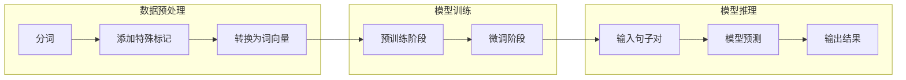

# XLNet在自然语言推理上的应用：逻辑推理的新突破

作者：禅与计算机程序设计艺术

## 1. 背景介绍

### 1.1 自然语言推理的挑战

自然语言推理（Natural Language Inference，NLI）是自然语言处理（NLP）领域中一项重要的任务，旨在判断两个句子之间是否存在逻辑关系，例如蕴含、矛盾或中性。例如，给定前提“一只狗在公园里追逐一只球”，假设“狗喜欢玩耍”，则可以推断出假设与前提是相符的。

NLI任务的挑战性在于：

* **自然语言的歧义性:**  同一个词语在不同的语境下可以有不同的含义，这使得机器难以准确理解句子的语义。
* **逻辑关系的复杂性:** 除了简单的蕴含关系外，NLI任务还需要处理更复杂的逻辑关系，例如否定、量词和条件语句等。
* **常识知识的缺乏:**  人类在进行推理时会运用大量的常识知识，而这些知识对于机器来说是难以获取和理解的。

### 1.2 预训练语言模型的兴起

近年来，随着深度学习技术的发展，预训练语言模型（Pre-trained Language Models，PLMs）在NLP领域取得了巨大成功。PLMs通过在大规模文本数据上进行自监督学习，能够学习到丰富的语言知识，并在各种下游任务上取得了显著的性能提升。

### 1.3 XLNet：一种新的预训练语言模型

XLNet是一种新兴的预训练语言模型，它采用了一种名为排列语言建模（Permutation Language Modeling，PLM）的自监督学习方法。与传统的自回归语言模型（如GPT）不同，XLNet能够捕捉到句子中所有词语之间的双向语义关系，从而更好地理解句子的含义。

## 2. 核心概念与联系

### 2.1 排列语言建模

XLNet的核心思想是排列语言建模。传统的自回归语言模型只能从左到右或从右到左地预测词语，而XLNet则通过对输入序列进行随机排列，然后预测序列中每个词语的概率，从而捕捉到词语之间的双向语义关系。

例如，对于句子“The cat sat on the mat”，XLNet会将其随机排列成“mat the cat sat on the”，然后预测“mat”的概率，接着预测“the”的概率，以此类推。

### 2.2 双流自注意力机制

为了实现排列语言建模，XLNet引入了双流自注意力机制（Two-Stream Self-Attention）。具体来说，XLNet使用两个独立的自注意力流来分别编码词语的内容和位置信息。内容流用于捕捉词语之间的语义关系，而位置流则用于捕捉词语在句子中的顺序关系。

### 2.3 XLNet在NLI任务上的优势

相比于传统的预训练语言模型，XLNet在NLI任务上具有以下优势：

* **更好的语义理解能力:** 排列语言建模和双流自注意力机制使得XLNet能够更好地理解句子的语义，从而更准确地判断句子之间的逻辑关系。
* **更强的泛化能力:** XLNet在大规模文本数据上进行预训练，因此具有较强的泛化能力，能够更好地适应不同的NLI数据集。
* **更高的计算效率:** XLNet采用了一种高效的注意力机制，能够在保证性能的同时降低计算复杂度。

## 3. 核心算法原理具体操作步骤

### 3.1 数据预处理

在将XLNet应用于NLI任务之前，需要对数据进行预处理，主要包括以下步骤：

* **分词:** 将句子分割成词语或子词单元。
* **添加特殊标记:** 在每个句子的开头和结尾添加特殊的标记，例如[CLS]和[SEP]。
* **转换为词向量:** 将每个词语或子词单元转换为对应的词向量表示。

### 3.2 模型训练

XLNet的训练过程可以分为两个阶段：

* **预训练阶段:** 在大规模文本数据上进行自监督学习，学习语言模型的参数。
* **微调阶段:** 使用NLI数据集对预训练的XLNet模型进行微调，使其适应NLI任务。

### 3.3 模型推理

在模型推理阶段，将待预测的句子对输入到微调后的XLNet模型中，模型会输出一个概率分布，表示句子对属于蕴含、矛盾或中性关系的概率。

## 4. 数学模型和公式详细讲解举例说明

### 4.1 排列语言建模的数学公式

给定一个长度为 $T$ 的句子 $x = (x_1, x_2, ..., x_T)$，XLNet的目标是最大化其排列后的概率：

$$
\max_{\theta} \sum_{z \in Z_T} p(z|x;\theta) \prod_{t=1}^T p(x_{z_t}|x_{z_1}, ..., x_{z_{t-1}};\theta)
$$

其中，$Z_T$ 表示所有可能的排列方式，$z$ 表示其中一种排列方式，$z_t$ 表示排列后的第 $t$ 个词语的索引，$\theta$ 表示模型参数。

### 4.2 双流自注意力机制的数学公式

XLNet使用两个独立的自注意力流来分别编码词语的内容和位置信息：

**内容流:**

$$
h_t^c = \text{Attention}(Q_t^c, K^c, V^c)
$$

**位置流:**

$$
h_t^p = \text{Attention}(Q_t^p, K^p, V^p)
$$

其中，$h_t^c$ 和 $h_t^p$ 分别表示词语 $x_t$ 的内容和位置向量表示，$Q_t^c$、$K^c$、$V^c$ 和 $Q_t^p$、$K^p$、$V^p$ 分别表示内容流和位置流的查询、键和值矩阵。

### 4.3 举例说明

假设输入句子为“The cat sat on the mat”，其排列后的顺序为“mat the cat sat on the”。

**内容流:**

* 对于词语“mat”，其内容向量表示 $h_1^c$ 由其自身以及之前所有词语（空集）的内容向量计算得到。
* 对于词语“the”，其内容向量表示 $h_2^c$ 由其自身以及之前所有词语（“mat”）的内容向量计算得到。
* 以此类推，直到计算出所有词语的内容向量表示。

**位置流:**

* 对于词语“mat”，其位置向量表示 $h_1^p$ 由其在排列后的句子中的位置（1）计算得到。
* 对于词语“the”，其位置向量表示 $h_2^p$ 由其在排列后的句子中的位置（2）计算得到。
* 以此类推，直到计算出所有词语的位置向量表示。

## 5. 项目实践：代码实例和详细解释说明

### 5.1 使用Hugging Face Transformers库实现XLNet

```python
from transformers import XLNetTokenizer, XLNetForSequenceClassification

# 加载预训练的XLNet模型和词tokenizer
model_name = "xlnet-base-cased"
tokenizer = XLNetTokenizer.from_pretrained(model_name)
model = XLNetForSequenceClassification.from_pretrained(model_name, num_labels=3)

# 定义输入句子对
premise = "A dog is chasing a ball in the park."
hypothesis = "The dog is playing."

# 对句子对进行预处理
inputs = tokenizer(premise, hypothesis, return_tensors="pt")

# 将输入数据输入到模型中
outputs = model(**inputs)

# 获取模型的预测结果
logits = outputs.logits
predicted_class_id = logits.argmax().item()

# 输出预测结果
print(f"Predicted class ID: {predicted_class_id}")
```

### 5.2 代码解释

* 首先，使用`transformers`库加载预训练的XLNet模型和词tokenizer。
* 然后，定义输入句子对，并使用`tokenizer`对句子对进行预处理。
* 接着，将预处理后的输入数据输入到模型中，并获取模型的预测结果。
* 最后，输出模型预测的类别ID。

## 6. 实际应用场景

XLNet在NLI任务上的出色表现使其在许多实际应用场景中具有巨大潜力，例如：

* **问答系统:** 判断问题和答案之间是否存在逻辑关系，从而提高问答系统的准确率。
* **文本摘要:** 判断摘要句和原文之间是否存在逻辑关系，从而生成更准确、简洁的摘要。
* **机器翻译:** 判断翻译结果和原文之间是否存在逻辑关系，从而提高机器翻译的质量。
* **情感分析:** 判断文本的情感倾向，例如正面、负面或中性。

## 7. 总结：未来发展趋势与挑战

### 7.1 未来发展趋势

* **更大规模的预训练数据和模型:** 随着计算能力的提升，未来将会出现更大规模的预训练数据和模型，这将进一步提高XLNet的性能。
* **多模态NLI:**  将XLNet扩展到多模态领域，例如图像和视频，将是未来一个重要的研究方向。
* **可解释NLI:**  提高XLNet的可解释性，使其能够解释推理过程，将有助于提高模型的可信度。

### 7.2 挑战

* **数据偏差:**  NLI数据集通常存在数据偏差问题，这可能会导致模型在某些情况下表现不佳。
* **计算复杂度:** XLNet的计算复杂度较高，这限制了其在资源受限设备上的应用。
* **常识推理:**  XLNet目前还难以进行复杂的常识推理，这需要更强大的模型和算法。

## 8. 附录：常见问题与解答

### 8.1 XLNet和BERT的区别是什么？

XLNet和BERT都是预训练语言模型，但它们在以下方面有所区别：

* **自监督学习方法:** XLNet采用排列语言建模，而BERT采用掩码语言建模。
* **双向语义关系:** XLNet能够捕捉到句子中所有词语之间的双向语义关系，而BERT只能捕捉到部分词语之间的双向语义关系。
* **计算效率:** XLNet采用了一种高效的注意力机制，比BERT更节省计算资源。

### 8.2 如何选择合适的XLNet模型？

Hugging Face Transformers库提供了多种预训练的XLNet模型，可以根据具体的任务需求选择合适的模型。例如，`xlnet-base-cased`模型适用于大多数NLI任务，而`xlnet-large-cased`模型则适用于对性能要求更高的任务。

### 8.3 如何提高XLNet在NLI任务上的性能？

* **使用更大规模的NLI数据集进行微调。**
* **尝试不同的超参数设置，例如学习率、批大小和训练轮数。**
* **使用数据增强技术，例如同义词替换和句子改写。**
* **结合其他NLP技术，例如情感分析和实体识别。**

##  Mermaid流程图


