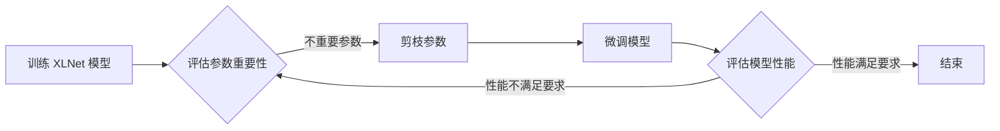

# XLNet的模型剪枝：降低模型复杂度

作者：禅与计算机程序设计艺术

## 1. 背景介绍

### 1.1. 预训练语言模型的崛起

近年来，预训练语言模型（Pre-trained Language Models, PLMs）在自然语言处理领域取得了巨大的成功，尤其以 Transformer 架构为基础的模型，如 BERT、GPT、XLNet 等，在各项任务上都刷新了记录。这些模型通过在大规模语料库上进行预训练，学习到了丰富的语言知识，可以有效地迁移到下游任务中。

### 1.2. 模型压缩的必要性

然而，预训练语言模型通常规模庞大，参数量巨大，例如 BERT-Large 模型拥有 3.4 亿个参数，这给模型的训练和部署带来了巨大的挑战：

* **计算资源消耗大:** 训练和推理过程需要大量的计算资源，尤其是 GPU 内存。
* **推理速度慢:** 模型参数量大导致推理速度慢，难以满足实时性要求高的应用场景。
* **存储空间占用大:** 模型文件体积大，难以部署到资源受限的设备上。

为了解决这些问题，模型压缩技术应运而生。模型压缩旨在在保证模型性能的前提下，降低模型的复杂度，包括模型大小、计算量、内存占用等方面。

### 1.3. 模型剪枝技术简介

模型剪枝（Model Pruning）是一种常用的模型压缩技术，其核心思想是识别并移除模型中不重要的参数或结构，从而降低模型的复杂度。模型剪枝可以应用于神经网络的不同部分，例如：

* **权重剪枝 (Weight Pruning):** 移除不重要的权重参数。
* **神经元剪枝 (Neuron Pruning):** 移除不重要的神经元。
* **层剪枝 (Layer Pruning):** 移除不重要的网络层。

## 2. XLNet 核心概念与联系

### 2.1. XLNet 模型概述

XLNet 是一种广受关注的预训练语言模型，其基于 Transformer-XL 架构，并引入了自回归（Autoregressive, AR）和自编码（Autoencoding, AE）的优点，在多项自然语言处理任务上取得了优异的性能。

#### 2.1.1. Transformer-XL 架构

Transformer-XL 架构是 Transformer 的一种改进版本，其主要特点是引入了**递归机制**和**相对位置编码**，解决了 Transformer 模型在处理长文本时存在的上下文信息丢失问题。

* **递归机制:** Transformer-XL 在处理当前片段时，会将前一片段的隐藏状态作为输入，从而保留更长的上下文信息。
* **相对位置编码:** Transformer-XL 使用相对位置编码来表示词之间的位置关系，而不是像 Transformer 那样使用绝对位置编码。

#### 2.1.2. 自回归与自编码

* **自回归 (AR):** AR 模型根据前面的词预测下一个词，例如 GPT 模型。
* **自编码 (AE):** AE 模型通过重建输入文本学习语言模型，例如 BERT 模型。

XLNet 结合了 AR 和 AE 的优点，其采用了一种称为**排列语言建模**的预训练任务，该任务通过最大化所有可能的因子分解顺序的似然函数来学习语言模型。

### 2.2. 模型剪枝与 XLNet 的联系

模型剪枝技术可以有效地应用于 XLNet 模型，以降低其复杂度。例如，可以对 XLNet 模型中的 Transformer-XL 层进行权重剪枝或神经元剪枝，或者对整个模型进行层剪枝，从而在保证模型性能的前提下，降低模型的计算量、内存占用和存储空间。

## 3. XLNet 模型剪枝算法原理与操作步骤

### 3.1. 基于重要性的剪枝方法

基于重要性的剪枝方法是最常用的模型剪枝方法之一，其核心思想是根据预先定义的指标评估模型参数或结构的重要性，然后移除不重要的部分。常用的重要性指标包括：

* **权重大小:** 移除绝对值较小的权重参数。
* **梯度信息:** 移除梯度绝对值较小的参数，因为这些参数对模型性能的影响较小。
* **Fisher 信息:** 移除 Fisher 信息矩阵中对角线元素较小的参数，因为这些参数对模型输出的影响较小。

### 3.2. XLNet 模型剪枝操作步骤

以权重剪枝为例，XLNet 模型剪枝的操作步骤如下：

1. **训练 XLNet 模型:** 首先需要训练一个完整的 XLNet 模型，作为剪枝的起点。
2. **评估参数重要性:** 根据预先定义的指标，例如权重大小，评估模型参数的重要性。
3. **剪枝参数:** 根据重要性排序，移除不重要的参数。
4. **微调模型:** 对剪枝后的模型进行微调，以恢复模型的性能。
5. **评估模型性能:** 在验证集上评估剪枝后模型的性能，如果性能满足要求，则停止剪枝；否则，返回步骤 2，继续进行剪枝。

### 3.3. Mermaid 流程图



## 4. XLNet 模型剪枝的数学模型和公式讲解

### 4.1. 权重剪枝的数学模型

以权重剪枝为例，假设 XLNet 模型的参数为 $\theta$，剪枝后的参数为 $\hat{\theta}$，则权重剪枝的目标函数可以表示为：

$$
\min_{\hat{\theta}} L(\hat{\theta}) + \lambda ||\hat{\theta}||_0
$$

其中：

* $L(\hat{\theta})$ 表示剪枝后模型的损失函数。
* $||\hat{\theta}||_0$ 表示剪枝后模型中非零参数的个数。
* $\lambda$ 是一个超参数，用于平衡模型性能和模型复杂度。

### 4.2. 公式讲解

* **损失函数:** 损失函数用于衡量模型预测值与真实值之间的差异，常见的损失函数包括交叉熵损失函数、均方误差损失函数等。
* **正则化项:** 正则化项用于限制模型的复杂度，防止模型过拟合。常见的正则化项包括 L1 正则化、L2 正则化等。
* **超参数:** 超参数是模型训练过程中需要人为设定的参数，例如学习率、正则化系数等。

## 5. 项目实践：代码实例和详细解释说明

### 5.1. Python 代码实例

```python
import torch
import torch.nn as nn
from transformers import XLNetForSequenceClassification

# 定义模型
model = XLNetForSequenceClassification.from_pretrained('xlnet-base-cased')

# 定义剪枝比例
prune_ratio = 0.5

# 获取模型的所有参数
all_parameters = []
for name, param in model.named_parameters():
    all_parameters.append((name, param))

# 对参数进行排序
sorted_parameters = sorted(all_parameters, key=lambda x: -torch.abs(x[1]).mean())

# 计算需要剪枝的参数数量
num_pruned_parameters = int(len(sorted_parameters) * prune_ratio)

# 获取需要剪枝的参数索引
pruned_indices = [i for i in range(num_pruned_parameters)]

# 对参数进行剪枝
for i in pruned_indices:
    name, param = sorted_parameters[i]
    param.data = torch.zeros_like(param.data)

# 打印剪枝后的模型参数量
total_parameters = sum(p.numel() for p in model.parameters())
print(f"剪枝后的模型参数量: {total_parameters}")
```

### 5.2. 代码解释

1. **导入必要的库:** 导入 PyTorch、Transformers 库。
2. **定义模型:** 使用 `XLNetForSequenceClassification.from_pretrained()` 方法加载预训练的 XLNet 模型。
3. **定义剪枝比例:** 设置需要剪枝的参数比例。
4. **获取模型的所有参数:** 使用 `model.named_parameters()` 方法获取模型的所有参数。
5. **对参数进行排序:** 根据参数的绝对值大小对参数进行排序。
6. **计算需要剪枝的参数数量:** 根据剪枝比例计算需要剪枝的参数数量。
7. **获取需要剪枝的参数索引:** 获取需要剪枝的参数索引。
8. **对参数进行剪枝:** 将需要剪枝的参数设置为 0。
9. **打印剪枝后的模型参数量:** 打印剪枝后的模型参数量。

## 6. 实际应用场景

XLNet 模型剪枝技术可以应用于各种自然语言处理任务，例如：

* **文本分类:** 对新闻文本、评论文本等进行分类。
* **情感分析:** 分析文本的情感倾向，例如正面、负面、中性。
* **问答系统:** 回答用户提出的问题。
* **机器翻译:** 将一种语言的文本翻译成另一种语言的文本。

## 7. 总结：未来发展趋势与挑战

### 7.1. 未来发展趋势

* **自动化剪枝:** 开发自动化模型剪枝方法，减少人工干预。
* **动态剪枝:** 根据不同的输入数据或任务动态调整剪枝策略。
* **硬件加速:** 开发针对模型剪枝的硬件加速器，提高剪枝效率。

### 7.2. 挑战

* **剪枝比例的选择:** 如何选择合适的剪枝比例，在保证模型性能的前提下最大程度地降低模型复杂度。
* **剪枝方法的泛化能力:** 如何开发泛化能力强的剪枝方法，使其适用于不同的模型和任务。
* **剪枝后的模型可解释性:** 如何解释剪枝后的模型，提高模型的可信度。

## 8. 附录：常见问题与解答

### 8.1.  剪枝后模型的性能会下降吗？

答：模型剪枝会降低模型的复杂度，可能会导致模型性能略有下降。但是，通过合理的剪枝策略和微调，可以将性能下降控制在可接受的范围内。

### 8.2. 如何选择合适的剪枝比例？

答：选择合适的剪枝比例需要根据具体的任务和数据集进行实验。一般来说，可以从一个较小的剪枝比例开始，逐步增加剪枝比例，直到模型性能下降到不可接受的程度为止。

### 8.3.  有哪些常用的模型剪枝工具？

答：常用的模型剪枝工具包括：

* **TensorFlow Model Optimization Toolkit:** TensorFlow 官方提供的模型优化工具包。
* **PyTorch Pruning:** PyTorch 中提供的模型剪枝模块。
* **Distiller:** Intel 开发的模型压缩工具。
