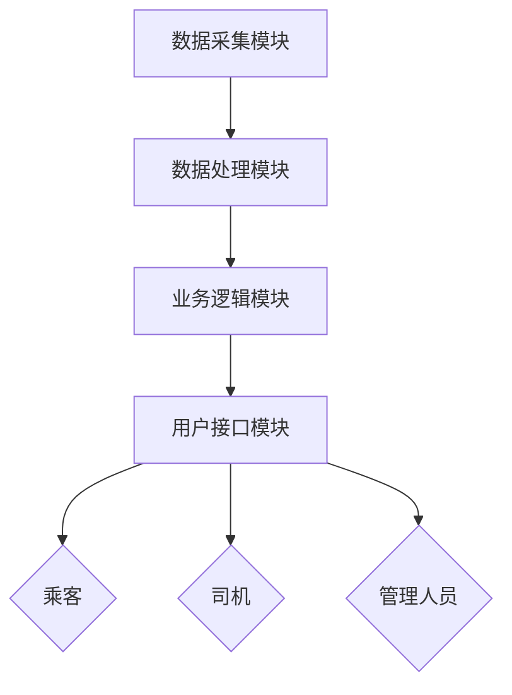
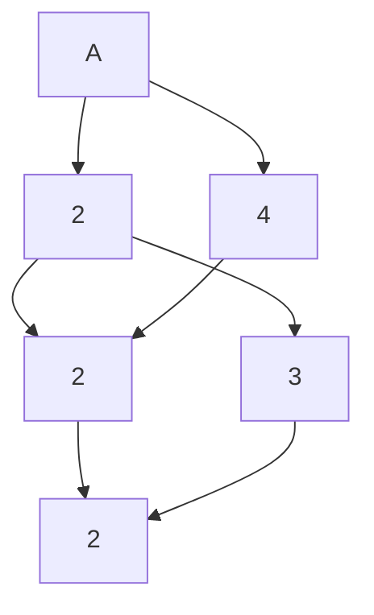

## 1. 背景介绍

### 1.1 出租车行业现状与挑战

随着城市化进程的加速，城市人口不断增长，交通出行需求日益旺盛。出租车作为城市公共交通的重要组成部分，在满足市民出行需求、缓解交通压力方面发挥着重要作用。然而，传统的出租车行业也面临着诸多挑战：

* **服务质量参差不齐:** 出租车司机服务态度、驾驶技术良莠不齐，乘客投诉率较高。
* **运营效率低下:** 传统调度方式效率低下，空驶率高，乘客打车难。
* **安全隐患突出:** 缺乏有效的安全监管手段，乘客安全难以保障。
* **信息化程度低:** 数据采集和分析能力不足，难以支撑行业精细化管理。

### 1.2 信息化建设的必要性

为了应对上述挑战，提升出租车行业服务水平和运营效率，信息化建设势在必行。通过建设出租车服务管理信息系统，可以实现以下目标：

* **提高服务质量:** 通过乘客评价体系、司机信用体系建设，提升服务质量，降低乘客投诉率。
* **优化运营效率:** 通过智能调度系统，降低空驶率，提高车辆周转率，缓解打车难问题。
* **加强安全监管:** 通过GPS定位、行程轨迹记录等手段，加强安全监管，保障乘客安全。
* **提升管理水平:** 通过数据采集和分析，为行业管理提供决策支持，促进出租车行业健康发展。

## 2. 核心概念与联系

### 2.1 系统架构

XX市出租车服务管理信息系统采用分布式架构，主要包括以下模块：

* **数据采集模块:** 负责采集车辆GPS定位信息、乘客订单信息、司机信息等数据。
* **数据处理模块:** 负责对采集到的数据进行清洗、转换、存储等操作。
* **业务逻辑模块:** 负责实现出租车调度、乘客服务、司机管理、安全监管等业务逻辑。
* **用户接口模块:** 为乘客、司机、管理人员提供友好的操作界面。

### 2.2 核心功能

XX市出租车服务管理信息系统主要实现以下核心功能：

* **智能调度:** 基于实时路况、车辆位置、乘客需求等信息，实现出租车智能调度，提高车辆周转率，缓解打车难问题。
* **乘客服务:** 为乘客提供便捷的打车服务，包括在线叫车、预约叫车、实时查看车辆位置等功能。
* **司机管理:** 对司机进行身份验证、信用评价、培训管理等，提升司机服务质量。
* **安全监管:** 通过GPS定位、行程轨迹记录等手段，加强安全监管，保障乘客安全。
* **数据分析:** 对运营数据进行统计分析，为行业管理提供决策支持。

### 2.3 系统关系图



## 3. 核心算法原理具体操作步骤

### 3.1 智能调度算法

XX市出租车服务管理信息系统采用基于时空特征的智能调度算法，具体操作步骤如下：

1. **实时路况信息获取:** 通过地图API获取实时路况信息，包括道路拥堵情况、平均车速等。
2. **车辆位置信息获取:** 通过GPS定位技术获取车辆实时位置信息。
3. **乘客订单信息获取:** 乘客通过手机APP或电话下单，系统记录乘客出发地、目的地、乘车时间等信息。
4. **时空特征提取:** 根据实时路况信息、车辆位置信息、乘客订单信息，提取时空特征，包括乘客出发地与目的地之间的距离、预计行驶时间、车辆当前位置与乘客出发地之间的距离等。
5. **订单匹配:** 根据时空特征，将乘客订单与附近的空闲车辆进行匹配，选择最优的车辆为乘客提供服务。
6. **调度指令下发:** 系统将调度指令发送给司机，司机根据指令前往乘客出发地接乘客。

### 3.2 乘客服务功能实现

XX市出租车服务管理信息系统为乘客提供便捷的打车服务，具体功能实现如下：

* **在线叫车:** 乘客可以通过手机APP输入出发地、目的地信息，系统自动匹配附近的空闲车辆，并显示预计到达时间和费用。
* **预约叫车:** 乘客可以提前预约出租车，系统会在预约时间安排车辆前往乘客出发地接乘客。
* **实时查看车辆位置:** 乘客可以通过手机APP实时查看车辆位置，了解车辆行驶轨迹和预计到达时间。

### 3.3 司机管理功能实现

XX市出租车服务管理信息系统对司机进行身份验证、信用评价、培训管理等，具体功能实现如下：

* **身份验证:** 司机注册时需要提供身份证、驾驶证等信息，系统对信息进行验证，确保司机身份真实有效。
* **信用评价:** 乘客可以对司机服务进行评价，系统根据评价结果建立司机信用体系，对信用良好的司机给予奖励，对信用差的司机进行处罚。
* **培训管理:** 系统定期组织司机参加培训，学习出租车行业相关法律法规、服务规范、安全知识等，提升司机服务质量和安全意识。

## 4. 数学模型和公式详细讲解举例说明

### 4.1 出租车需求预测模型

为了优化出租车调度效率，需要对出租车需求进行预测。XX市出租车服务管理信息系统采用基于时间序列分析的出租车需求预测模型，具体公式如下：

$$
D_t = \alpha D_{t-1} + \beta T_t + \gamma W_t + \epsilon_t
$$

其中：

* $D_t$ 表示 $t$ 时刻的出租车需求量。
* $D_{t-1}$ 表示 $t-1$ 时刻的出租车需求量。
* $T_t$ 表示 $t$ 时刻的温度。
* $W_t$ 表示 $t$ 时刻的天气状况。
* $\alpha$、$\beta$、$\gamma$ 为模型参数。
* $\epsilon_t$ 为随机误差项。

**举例说明：**

假设某市出租车需求量与前一天的需求量、温度、天气状况相关，模型参数分别为 $\alpha=0.8$、$\beta=0.1$、$\gamma=0.05$。如果今天温度为 25 摄氏度，天气晴朗，昨天出租车需求量为 1000 辆，则今天出租车需求量预测值为：

$$
D_t = 0.8 \times 1000 + 0.1 \times 25 + 0.05 \times 1 + \epsilon_t = 802.55 + \epsilon_t
$$

### 4.2 车辆路径规划模型

为了实现出租车智能调度，需要对车辆路径进行规划。XX市出租车服务管理信息系统采用 Dijkstra 算法进行车辆路径规划，具体步骤如下：

1. **构建地图网络:** 将城市道路网络抽象成图结构，节点表示道路交叉口，边表示道路。
2. **设置起点和终点:** 将乘客出发地和目的地分别设置为路径规划的起点和终点。
3. **计算最短路径:** 利用 Dijkstra 算法计算起点到终点的最短路径。

**举例说明：**

假设城市道路网络如下图所示，乘客出发地为 A 点，目的地为 F 点。



利用 Dijkstra 算法计算 A 点到 F 点的最短路径为：A -> B -> D -> F，路径长度为 6。

## 5. 项目实践：代码实例和详细解释说明

### 5.1 智能调度算法实现

```python
import heapq

def dijkstra(graph, start, end):
    """
    Dijkstra 算法实现

    Args:
        graph: 图结构，字典类型，key 为节点，value 为字典，表示与该节点相邻的节点及其距离。
        start: 起点节点。
        end: 终点节点。

    Returns:
        最短路径长度和路径节点列表。
    """

    distances = {node: float('inf') for node in graph}
    distances[start] = 0
    previous = {}
    queue = [(0, start)]

    while queue:
        current_distance, current_node = heapq.heappop(queue)

        if current_node == end:
            path = []
            while current_node:
                path.append(current_node)
                current_node = previous.get(current_node)
            return current_distance, path[::-1]

        if current_distance > distances[