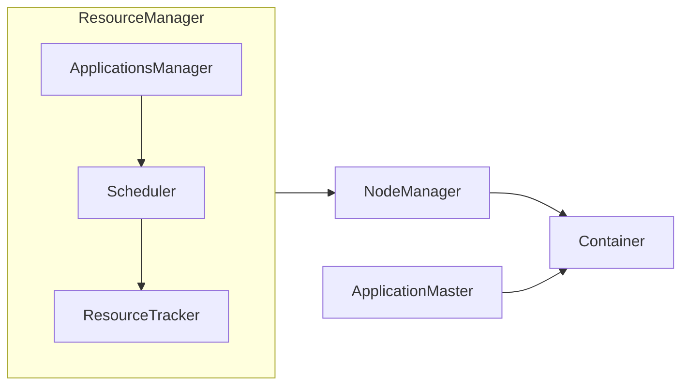

## 1. 背景介绍

### 1.1 大数据时代的资源管理挑战

随着大数据时代的到来，数据规模呈爆炸式增长，对计算资源的需求也越来越高。传统的资源管理方式已经无法满足大规模数据处理的需求，需要一种更加高效、灵活的资源管理框架。

### 1.2 YARN的诞生与发展

为了解决大数据时代资源管理的挑战，Apache Hadoop YARN（Yet Another Resource Negotiator）应运而生。YARN是一个通用的资源管理系统，可以为各种类型的应用程序提供统一的资源管理和调度平台。

### 1.3 YARN的优势

YARN相比于传统的资源管理方式具有以下优势：

* **高可用性：**YARN采用了主备架构，可以保证ResourceManager的高可用性。
* **高扩展性：**YARN可以管理成千上万个节点，可以满足大规模数据处理的需求。
* **多租户：**YARN支持多租户，可以为不同的用户和应用程序提供隔离的资源环境。
* **资源隔离：**YARN可以对不同应用程序的资源进行隔离，避免相互干扰。
* **资源共享：**YARN可以实现资源的动态共享，提高资源利用率。

## 2. 核心概念与联系

### 2.1 ResourceManager

ResourceManager是YARN集群的中央控制节点，负责整个集群的资源管理和调度。

#### 2.1.1 功能

* 监控NodeManager的健康状况
* 处理应用程序的资源请求
* 协调资源分配
* 监控应用程序的运行状态

#### 2.1.2 组件

* **ApplicationsManager:** 负责接收应用程序的提交请求，并与NodeManager协商资源分配。
* **Scheduler:** 负责根据应用程序的资源需求和集群的资源状况进行资源调度。
* **ResourceTracker:** 负责跟踪集群中所有NodeManager的资源使用情况。

### 2.2 NodeManager

NodeManager是YARN集群中的工作节点，负责管理单个节点上的资源和运行应用程序的容器。

#### 2.2.1 功能

* 监控节点的资源使用情况
* 启动和停止应用程序的容器
* 监控容器的运行状态
* 向ResourceManager汇报节点的资源使用情况

#### 2.2.2 组件

* **ContainerManager:** 负责管理节点上的所有容器。
* **ResourceLocalizationService:** 负责将应用程序所需的资源文件下载到本地。

### 2.3 ApplicationMaster

ApplicationMaster是应用程序的管理者，负责向ResourceManager申请资源，并与NodeManager协商启动和停止容器。

#### 2.3.1 功能

* 向ResourceManager申请资源
* 与NodeManager协商启动和停止容器
* 监控应用程序的运行状态
* 向ResourceManager汇报应用程序的运行状态

### 2.4 Container

Container是YARN中资源分配的基本单位，代表一定数量的CPU、内存和磁盘空间。

#### 2.4.1 特点

* **隔离性：**每个容器都有自己独立的资源环境，不会相互干扰。
* **可移植性：**容器可以在集群中的任何节点上运行。

## 3. 核心算法原理具体操作步骤

### 3.1 资源调度算法

YARN支持多种资源调度算法，例如Capacity Scheduler和Fair Scheduler。

#### 3.1.1 Capacity Scheduler

Capacity Scheduler是一种基于队列的资源调度算法，可以将集群的资源划分成多个队列，每个队列可以设置不同的资源容量和优先级。

**操作步骤：**

1. 将集群的资源划分成多个队列。
2. 为每个队列设置资源容量和优先级。
3. 应用程序提交到指定的队列。
4. Scheduler根据队列的资源容量和优先级进行资源分配。

#### 3.1.2 Fair Scheduler

Fair Scheduler是一种基于公平性原则的资源调度算法，可以保证所有应用程序都能获得公平的资源分配。

**操作步骤：**

1. 应用程序提交到集群。
2. Scheduler根据应用程序的资源需求和集群的资源状况进行资源分配。
3. Scheduler会定期调整应用程序的资源分配，保证所有应用程序都能获得公平的资源分配。

### 3.2 资源分配流程

当应用程序提交到YARN集群时，ResourceManager会执行以下步骤进行资源分配：

1. **接收应用程序提交请求：**ResourceManager接收应用程序的提交请求，并获取应用程序的资源需求。
2. **选择合适的NodeManager：**ResourceManager根据应用程序的资源需求和集群的资源状况，选择合适的NodeManager来运行应用程序的容器。
3. **启动ApplicationMaster：**ResourceManager在选择的NodeManager上启动ApplicationMaster。
4. **ApplicationMaster申请资源：**ApplicationMaster向ResourceManager申请资源，并与NodeManager协商启动容器。
5. **NodeManager启动容器：**NodeManager启动容器，并为容器分配资源。
6. **ApplicationMaster监控容器：**ApplicationMaster监控容器的运行状态，并向ResourceManager汇报应用程序的运行状态。

## 4. 数学模型和公式详细讲解举例说明

### 4.1 资源容量模型

YARN使用资源容量模型来描述集群的资源状况。资源容量模型包括以下参数：

* **totalMB:** 集群的总内存容量。
* **totalVCores:** 集群的总虚拟CPU核心数。
* **totalDiskSpace:** 集群的总磁盘空间。

### 4.2 资源需求模型

YARN使用资源需求模型来描述应用程序的资源需求。资源需求模型包括以下参数：

* **memoryMB:** 应用程序所需的内存容量。
* **vCores:** 应用程序所需的虚拟CPU核心数。
* **diskSpace:** 应用程序所需的磁盘空间。

### 4.3 资源分配公式

YARN使用以下公式来计算应用程序的资源分配：

```
allocatedMB = min(memoryMB, availableMB)
allocatedVCores = min(vCores, availableVCores)
allocatedDiskSpace = min(diskSpace, availableDiskSpace)
```

其中：

* **allocatedMB:** 应用程序分配到的内存容量。
* **availableMB:** NodeManager上可用的内存容量。
* **allocatedVCores:** 应用程序分配到的虚拟CPU核心数。
* **availableVCores:** NodeManager上可用的虚拟CPU核心数。
* **allocatedDiskSpace:** 应用程序分配到的磁盘空间。
* **availableDiskSpace:** NodeManager上可用的磁盘空间。

**举例说明：**

假设一个应用程序需要1GB内存和2个虚拟CPU核心，而NodeManager上有2GB内存和4个虚拟CPU核心可用，则应用程序的资源分配如下：

```
allocatedMB = min(1GB, 2GB) = 1GB
allocatedVCores = min(2, 4) = 2
```

## 5. 项目实践：代码实例和详细解释说明

### 5.1 提交应用程序

以下代码示例演示了如何使用YARN API提交应用程序：

```java
// 创建 Configuration 对象
Configuration conf = new Configuration();

// 创建 YarnClient 对象
YarnClient yarnClient = YarnClient.createYarnClient();
yarnClient.init(conf);
yarnClient.start();

// 创建应用程序提交上下文
YarnClientApplication app = yarnClient.createApplication();

// 设置应用程序名称
ApplicationSubmissionContext appContext = app.getApplicationSubmissionContext();
appContext.setApplicationName("MyApplication");

// 设置应用程序所需的资源
Resource capability = Resource.newInstance(1024, 1);
appContext.setResource(capability);

// 设置应用程序的主类
appContext.setAMContainerSpec(
    ContainerLaunchContext.newInstance(
        null, null, new String[] { "com.example.MyApplication" }, null, null, null));

// 提交应用程序
ApplicationId appId = appContext.getApplicationId();
yarnClient.submitApplication(appContext);

// 监控应用程序运行状态
ApplicationReport appReport = yarnClient.getApplicationReport(appId);
while (appReport.getYarnApplicationState() != YarnApplicationState.FINISHED) {
  Thread.sleep(1000);
  appReport = yarnClient.getApplicationReport(appId);
}

// 获取应用程序运行结果
System.out.println("Application finished with state: " + appReport.getFinalApplicationStatus());
```

**代码解释：**

1. 首先，创建一个Configuration对象，用于配置YARN集群的连接信息。
2. 然后，创建一个YarnClient对象，用于与YARN集群进行交互。
3. 接着，创建一个应用程序提交上下文ApplicationSubmissionContext，并设置应用程序的名称、所需的资源、主类等信息。
4. 最后，使用YarnClient的submitApplication()方法提交应用程序，并使用getApplicationReport()方法监控应用程序的运行状态。

### 5.2 编写ApplicationMaster

以下代码示例演示了如何编写一个简单的ApplicationMaster：

```java
public class MyApplicationMaster extends Container implements AMRMClientAsync.CallbackHandler {

  private AMRMClientAsync<AMRMClient.ContainerRequest> amRMClient;

  public static void main(String[] args) {
    // 初始化 ApplicationMaster
    MyApplicationMaster appMaster = new MyApplicationMaster();
    appMaster.init();

    // 启动 ApplicationMaster
    appMaster.run();
  }

  private void init() {
    // 创建 AMRMClientAsync 对象
    amRMClient = AMRMClientAsync.createAMRMClientAsync(1000, this);
    amRMClient.init(getConfig());
    amRMClient.start();

    // 注册 ApplicationMaster
    amRMClient.registerApplicationMaster("", 0, "");
  }

  private void run() {
    // 申请容器
    AMRMClient.ContainerRequest containerRequest =
        new AMRMClient.ContainerRequest(
            Resource.newInstance(1024, 1), null, null, Priority.newInstance(0));
    amRMClient.addContainerRequest(containerRequest);

    // 等待容器分配
    while (true) {
      try {
        Thread.sleep(1000);
      } catch (InterruptedException e) {
        e.printStackTrace();
      }
    }
  }

  @Override
  public void onContainersAllocated(List<Container> containers) {
    // 启动容器
    for (Container container : containers) {
      // ...
    }
  }

  @Override
  public void onContainersCompleted(List<ContainerStatus> statuses) {
    // 处理容器完成事件
    for (ContainerStatus status : statuses) {
      // ...
    }
  }

  // ...
}
```

**代码解释：**

1. 首先，创建一个MyApplicationMaster类，并实现AMRMClientAsync.CallbackHandler接口，用于处理容器分配和完成事件。
2. 然后，在init()方法中，创建一个AMRMClientAsync对象，并注册ApplicationMaster。
3. 在run()方法中，使用addContainerRequest()方法申请容器，并等待容器分配。
4. 当容器分配成功时，onContainersAllocated()方法会被调用，用于启动容器。
5. 当容器完成时，onContainersCompleted()方法会被调用，用于处理容器完成事件。

## 6. 实际应用场景

### 6.1 数据处理

YARN可以用于各种类型的数据处理应用程序，例如：

* **批处理：**Hadoop MapReduce、Apache Spark
* **流处理：**Apache Flink、Apache Storm
* **机器学习：**Apache Spark MLlib、TensorFlow

### 6.2 资源共享

YARN可以实现资源的动态共享，可以将空闲的资源分配给其他应用程序，提高资源利用率。

### 6.3 多租户

YARN支持多租户，可以为不同的用户和应用程序提供隔离的资源环境。

## 7. 工具和资源推荐

### 7.1 Apache Hadoop

Apache Hadoop是一个开源的分布式计算框架，YARN是Hadoop的核心组件之一。

### 7.2 Apache Ambari

Apache Ambari是一个用于管理和监控Hadoop集群的工具，可以简化YARN的部署和管理。

### 7.3 Cloudera Manager

Cloudera Manager是一个用于管理和监控CDH（Cloudera Distribution Including Hadoop）集群的工具，也支持YARN的管理。

## 8. 总结：未来发展趋势与挑战

### 8.1 未来发展趋势

* **云原生支持：**YARN将更好地支持云原生环境，例如Kubernetes。
* **机器学习支持：**YARN将提供更好的机器学习支持，例如GPU调度和资源隔离。
* **边缘计算支持：**YARN将扩展到边缘计算场景，例如物联网设备。

### 8.2 挑战

* **资源调度效率：**随着数据规模的增长，YARN需要提高资源调度效率，以满足大规模数据处理的需求。
* **安全性：**YARN需要提供更强大的安全机制，以保护集群的安全性。
* **易用性：**YARN需要简化部署和管理，提高用户体验。

## 9. 附录：常见问题与解答

### 9.1 如何查看YARN的运行状态？

可以使用YARN Web UI查看YARN的运行状态，例如：

* **ResourceManager Web UI:** http://<resourcemanager-hostname>:8088
* **NodeManager Web UI:** http://<nodemanager-hostname>:8042

### 9.2 如何配置YARN的资源容量？

可以使用YARN的配置文件yarn-site.xml配置YARN的资源容量，例如：

```xml
<property>
  <name>yarn.scheduler.minimum-allocation-mb</name>
  <value>1024</value>
</property>

<property>
  <name>yarn.scheduler.maximum-allocation-mb</name>
  <value>8192</value>
</property>
```

### 9.3 如何解决YARN的常见错误？

可以参考YARN的官方文档和社区论坛解决YARN的常见错误。

## 10. YARN Resource Manager 架构图



**图例：**

* **ResourceManager:** YARN集群的中央控制节点。
* **ApplicationsManager:** 负责接收应用程序的提交请求。
* **Scheduler:** 负责资源调度。
* **ResourceTracker:** 负责跟踪资源使用情况。
* **NodeManager:** YARN集群的工作节点。
* **Container:** YARN中资源分配的基本单位。
* **ApplicationMaster:** 应用程序的管理者。

**流程：**

1. 应用程序提交到ResourceManager。
2. ApplicationsManager接收应用程序的提交请求。
3. Scheduler根据应用程序的资源需求和集群的资源状况进行资源调度。
4. ResourceTracker跟踪集群中所有NodeManager的资源使用情况。
5. ResourceManager选择合适的NodeManager来运行应用程序的容器。
6. NodeManager启动容器，并为容器分配资源。
7. ApplicationMaster监控容器的运行状态，并向ResourceManager汇报应用程序的运行状态。
