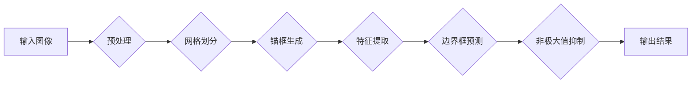

## 1. 背景介绍

### 1.1 目标检测的意义

目标检测是计算机视觉领域的一项重要任务，其目标是在图像或视频中定位和识别特定类型的物体。这项技术在许多领域都有广泛的应用，例如自动驾驶、机器人、安防监控等等。

### 1.2 目标检测的发展历程

目标检测技术的发展经历了漫长的过程，从早期的基于特征的传统方法，到基于深度学习的现代方法，目标检测的精度和速度都得到了显著的提升。

#### 1.2.1 传统目标检测方法

传统的目标检测方法通常基于手工设计的特征和分类器，例如 Viola-Jones 检测器、HOG+SVM 检测器等等。这些方法通常速度较慢，精度也相对较低。

#### 1.2.2 基于深度学习的目标检测方法

近年来，深度学习技术的快速发展为目标检测带来了革命性的变化。基于深度学习的目标检测方法利用卷积神经网络 (CNN) 自动学习图像特征，并取得了比传统方法更高的精度和速度。

### 1.3 YOLOv2的诞生

YOLOv2 (You Only Look Once, version 2) 是一种基于深度学习的实时目标检测系统，由 Joseph Redmon 等人于 2016 年提出。YOLOv2 相比于 YOLOv1，在速度和精度上都有了显著的提升，成为当时最先进的目标检测系统之一。

## 2. 核心概念与联系

### 2.1 YOLOv2的特点

* **速度快:** YOLOv2 能够以每秒 40-90 帧的速度实时检测目标，这使得它非常适合实时应用场景。
* **精度高:** YOLOv2 在多个目标检测数据集上都取得了非常高的精度，例如 PASCAL VOC 和 COCO。
* **简单易用:** YOLOv2 的架构简单，易于理解和实现。

### 2.2 YOLOv2的核心概念

* **网格划分:** YOLOv2 将输入图像划分为 $S \times S$ 的网格，每个网格负责预测目标的边界框和类别。
* **锚框:** 为了更好地预测不同形状和大小的目标，YOLOv2 引入了锚框的概念。锚框是一组预定义的边界框，用于辅助网络预测目标的边界框。
* **置信度:** 每个边界框都对应一个置信度，表示该边界框包含目标的可能性。
* **类别概率:** 每个边界框都对应一个类别概率，表示该边界框包含特定类别目标的可能性。

### 2.3 YOLOv2的网络结构

YOLOv2 的网络结构基于 Darknet-19，它是一个 19 层的卷积神经网络，能够有效地提取图像特征。YOLOv2 在 Darknet-19 的基础上进行了一些改进，例如:

* **批量归一化:** 在每个卷积层之后添加批量归一化层，以加速网络训练和提高模型泛化能力。
* **高分辨率分类器:** YOLOv2 首先在 ImageNet 上以 $224 \times 224$ 的分辨率训练分类器，然后在 $448 \times 448$ 的分辨率上微调分类器，以提高对小物体的检测能力。
* **多尺度训练:** YOLOv2 在训练过程中随机改变输入图像的分辨率，以提高模型对不同尺度目标的鲁棒性。

## 3. 核心算法原理具体操作步骤

### 3.1 输入图像预处理

YOLOv2 首先对输入图像进行预处理，包括:

* **缩放:** 将输入图像缩放至 $416 \times 416$ 的分辨率。
* **归一化:** 将像素值归一化至 [0, 1] 之间。

### 3.2 网格划分与锚框生成

YOLOv2 将预处理后的图像划分为 $13 \times 13$ 的网格，每个网格负责预测 5 个锚框。锚框的尺寸和比例是通过 K-means 聚类算法在训练集上学习得到的。

### 3.3 特征提取

YOLOv2 使用 Darknet-19 网络提取图像特征。Darknet-19 网络包含 19 个卷积层和 5 个最大池化层，能够有效地提取图像的语义信息。

### 3.4 边界框预测

每个网格的 5 个锚框都对应一个预测向量，包含以下信息:

* **边界框中心点坐标:** $(x, y)$
* **边界框宽度和高度:** $(w, h)$
* **置信度:** $c$
* **类别概率:** $(p_1, p_2, ..., p_C)$，其中 $C$ 表示目标类别的数量。

YOLOv2 使用 sigmoid 函数将边界框中心点坐标、宽度和高度限制在 [0, 1] 之间，并使用 softmax 函数将类别概率归一化。

### 3.5 非极大值抑制

由于每个网格都预测多个边界框，因此 YOLOv2 使用非极大值抑制 (NMS) 算法去除重叠的边界框。NMS 算法的步骤如下:

1. 按照置信度对边界框进行排序。
2. 选择置信度最高的边界框作为预测结果。
3. 计算该边界框与其他边界框的重叠率 (IOU)。
4. 如果 IOU 大于某个阈值，则移除该边界框。
5. 重复步骤 2-4，直到所有边界框都被处理完毕。

## 4. 数学模型和公式详细讲解举例说明

### 4.1 边界框预测公式

YOLOv2 使用以下公式预测边界框的中心点坐标、宽度和高度:

$$
\begin{aligned}
b_x &= \sigma(t_x) + c_x \\
b_y &= \sigma(t_y) + c_y \\
b_w &= p_w e^{t_w} \\
b_h &= p_h e^{t_h}
\end{aligned}
$$

其中:

* $b_x$, $b_y$, $b_w$, $b_h$ 分别表示预测边界框的中心点坐标、宽度和高度。
* $t_x$, $t_y$, $t_w$, $t_h$ 分别表示网络输出的边界框中心点坐标、宽度和高度的偏移量。
* $c_x$, $c_y$ 分别表示当前网格的左上角坐标。
* $p_w$, $p_h$ 分别表示当前锚框的宽度和高度。
* $\sigma()$ 表示 sigmoid 函数。

### 4.2 置信度预测公式

YOLOv2 使用以下公式预测边界框的置信度:

$$
c = \sigma(t_o)
$$

其中:

* $c$ 表示预测边界框的置信度。
* $t_o$ 表示网络输出的置信度。
* $\sigma()$ 表示 sigmoid 函数。

### 4.3 类别概率预测公式

YOLOv2 使用以下公式预测边界框的类别概率:

$$
p_i = \frac{e^{t_i}}{\sum_{j=1}^C e^{t_j}}
$$

其中:

* $p_i$ 表示预测边界框包含类别 $i$ 目标的概率。
* $t_i$ 表示网络输出的类别 $i$ 的得分。
* $C$ 表示目标类别的数量。

## 5. 项目实践：代码实例和详细解释说明

### 5.1 代码实例

```python
import torch
import torch.nn as nn
import torch.nn.functional as F

class YOLOv2(nn.Module):
    def __init__(self, num_classes):
        super(YOLOv2, self).__init__()
        # Darknet-19 特征提取器
        self.darknet = Darknet19()
        # 检测器
        self.detector = nn.Sequential(
            nn.Conv2d(1024, 1024, kernel_size=3, padding=1),
            nn.BatchNorm2d(1024),
            nn.LeakyReLU(0.1),
            nn.Conv2d(1024, 125, kernel_size=1),
        )
        self.num_classes = num_classes

    def forward(self, x):
        # 特征提取
        features = self.darknet(x)
        # 检测
        output = self.detector(features)
        # 调整输出格式
        output = output.view(-1, 13, 13, 5, 5 + self.num_classes)
        return output
```

### 5.2 代码解释

* **Darknet19:** Darknet19 类实现了 Darknet-19 特征提取器。
* **detector:** detector 模块包含两个卷积层、一个批量归一化层和一个 LeakyReLU 激活函数，用于预测边界框和类别概率。
* **forward:** forward 方法实现了 YOLOv2 的前向传播过程，包括特征提取、检测和输出格式调整。

## 6. 实际应用场景

### 6.1 自动驾驶

YOLOv2 可以用于自动驾驶系统中，实时检测道路上的车辆、行人、交通信号灯等目标，为车辆提供安全驾驶的保障。

### 6.2 机器人

YOLOv2 可以用于机器人系统中，帮助机器人识别和定位周围环境中的物体，实现自主导航和操作。

### 6.3 安防监控

YOLOv2 可以用于安防监控系统中，实时检测监控区域内的异常情况，例如入侵者、火灾等等，提高安防系统的效率和可靠性。

## 7. 工具和资源推荐

### 7.1 Darknet 框架

Darknet 是 YOLOv2 的官方实现框架，它是一个轻量级的 C 语言深度学习框架，易于学习和使用。

### 7.2 OpenCV 库

OpenCV 是一个开源的计算机视觉库，提供了丰富的图像处理和计算机视觉算法，可以用于 YOLOv2 的图像预处理和结果可视化。

### 7.3 COCO 数据集

COCO (Common Objects in Context) 是一个大型的目标检测数据集，包含 80 个类别、超过 330,000 张图像，可以用于 YOLOv2 的训练和评估。

## 8. 总结：未来发展趋势与挑战

### 8.1 未来发展趋势

* **更高精度和速度:** 目标检测技术仍在不断发展，未来将会出现精度更高、速度更快的目标检测算法。
* **更强大的泛化能力:** 目标检测算法需要具备更强大的泛化能力，能够适应不同的应用场景和环境。
* **更智能的目标理解:** 目标检测算法需要能够理解目标的语义信息，例如目标的行为、属性等等。

### 8.2 挑战

* **小目标检测:** 小目标检测仍然是一个挑战，需要开发更有效的算法来提高对小目标的检测精度。
* **遮挡目标检测:** 遮挡目标检测也是一个挑战，需要开发更鲁棒的算法来处理目标遮挡的情况。
* **实时性要求:** 许多应用场景对目标检测的实时性要求很高，需要开发更快的算法来满足实时性需求。

## 9. 附录：常见问题与解答

### 9.1 YOLOv2 和 YOLOv1 的区别是什么？

YOLOv2 相比于 YOLOv1，在以下方面进行了改进:

* **批量归一化:** 在每个卷积层之后添加批量归一化层，以加速网络训练和提高模型泛化能力。
* **高分辨率分类器:** YOLOv2 首先在 ImageNet 上以 $224 \times 224$ 的分辨率训练分类器，然后在 $448 \times 448$ 的分辨率上微调分类器，以提高对小物体的检测能力。
* **多尺度训练:** YOLOv2 在训练过程中随机改变输入图像的分辨率，以提高模型对不同尺度目标的鲁棒性。
* **锚框:** YOLOv2 引入了锚框的概念，以更好地预测不同形状和大小的目标。

### 9.2 如何提高 YOLOv2 的检测精度？

提高 YOLOv2 检测精度的常用方法包括:

* **增加训练数据:** 使用更多高质量的训练数据可以提高模型的泛化能力。
* **数据增强:** 对训练数据进行增强，例如旋转、缩放、裁剪等等，可以增加数据的多样性，提高模型的鲁棒性。
* **调整网络结构:** 尝试不同的网络结构，例如 ResNet、DenseNet 等等，可以提高模型的特征提取能力。
* **微调超参数:** 调整学习率、批量大小、优化器等等超参数，可以优化模型的训练过程。

### 9.3 YOLOv2 的应用场景有哪些？

YOLOv2 的应用场景非常广泛，包括:

* **自动驾驶:** 实时检测道路上的车辆、行人、交通信号灯等目标，为车辆提供安全驾驶的保障。
* **机器人:** 帮助机器人识别和定位周围环境中的物体，实现自主导航和操作。
* **安防监控:** 实时检测监控区域内的异常情况，例如入侵者、火灾等等，提高安防系统的效率和可靠性。
* **医疗影像分析:** 检测医学影像中的病灶，辅助医生进行诊断。
* **零售分析:** 检测商店中的商品，分析顾客的行为，优化商品摆放和促销策略。

### 9.4 YOLOv2 的未来发展方向是什么？

YOLOv2 的未来发展方向包括:

* **更高精度和速度:** 目标检测技术仍在不断发展，未来将会出现精度更高、速度更快的目标检测算法。
* **更强大的泛化能力:** 目标检测算法需要具备更强大的泛化能力，能够适应不同的应用场景和环境。
* **更智能的目标理解:** 目标检测算法需要能够理解目标的语义信息，例如目标的行为、属性等等。


### 9.5 YOLOv2 的核心概念的 Mermaid 流程图

