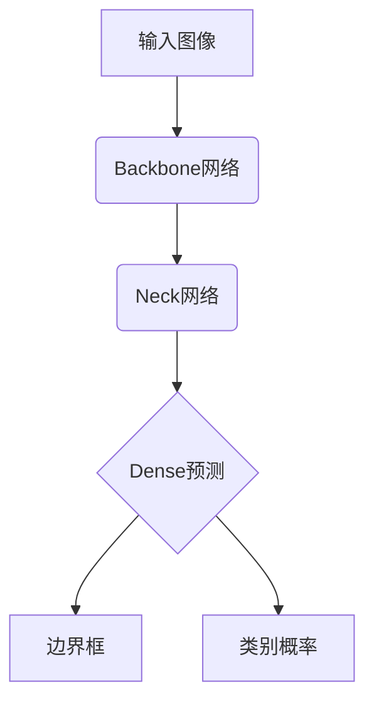

# YOLOv4原理与代码实例讲解

## 1. 背景介绍

### 1.1 目标检测的重要性

在计算机视觉领域,目标检测是一项极其重要的基础任务。目标检测旨在从图像或视频中定位并识别感兴趣的目标,包括人、动物、车辆等。它广泛应用于安防监控、自动驾驶、机器人视觉等领域。随着深度学习技术的快速发展,基于深度神经网络的目标检测算法取得了巨大进展,检测精度和速度都得到了极大提升。

### 1.2 YOLO系列算法的重要地位

在众多目标检测算法中,YOLO(You Only Look Once)系列算法因其独特的设计思路而备受关注。YOLO将目标检测任务建模为端到端的回归问题,通过单个神经网络直接预测目标边界框和类别概率,避免了传统方法中的候选区域生成和分类两个独立步骤。这种设计大大提高了检测速度,使YOLO系列算法成为实时目标检测的主流方案。

### 1.3 YOLOv4的重要意义

作为YOLO系列算法的最新版本,YOLOv4在检测精度和速度上都有了显著提升。它采用了诸多创新技术,包括先进的backbone网络、更强大的neck结构、改进的锚框分配策略等。这些改进使YOLOv4在多个主流目标检测数据集上取得了state-of-the-art的表现。本文将深入探讨YOLOv4的核心原理和实现细节,以帮助读者全面掌握这一先进目标检测算法。

## 2. 核心概念与联系

### 2.1 YOLOv4的总体架构

YOLOv4的整体架构如下图所示:



可以看出,YOLOv4主要由三个部分组成:

1. **Backbone网络**: 用于从输入图像中提取特征,常用的有CSPDarknet53、EfficientNet等。
2. **Neck网络**: 对Backbone提取的特征进行融合和处理,以获得更加强大的特征表示,主要采用了SPP(Spatial Pyramid Pooling)和PAN(Path Aggregation Network)结构。
3. **Dense预测**: 基于Neck网络输出的特征,通过一个全卷积网络直接预测目标的边界框和类别概率。

在实际应用中,可以根据具体需求对上述各个模块进行定制和调整,以在速度和精度之间寻求平衡。

### 2.2 锚框 (Anchor Boxes)

与之前的YOLO版本类似,YOLOv4也采用了锚框(Anchor Boxes)的概念。锚框是一组预先设定的框,用于对图像中可能存在的目标进行初步编码。在训练过程中,网络会学习如何调整锚框,使其能够尽可能精确地包围目标。

YOLOv4采用了一种新的锚框分配策略,即基于每个ground truth边界框选择两个最佳匹配的锚框。这种策略可以提高锚框的回归精度,从而提升整体检测性能。

### 2.3 损失函数

YOLOv4的损失函数由三部分组成:

1. **边界框回归损失**:计算预测的边界框与ground truth边界框之间的差异,通常采用GIOU(Generalized Intersection over Union)损失。
2. **目标分类损失**: 计算预测的类别概率与真实类别之间的交叉熵损失。
3. **目标置信度损失**: 计算预测的目标置信度与真实置信度之间的二值交叉熵损失。

通过联合优化这三个损失项,网络可以同时学习精确的边界框回归和目标分类。

## 3. 核心算法原理具体操作步骤

### 3.1 Backbone网络: CSPDarknet53

CSPDarknet53作为YOLOv4的主干特征提取网络,是在之前版本DarkNet53的基础上进行改进而来。它采用了CSPNet(Cross Stage Partial Network)结构,将基础特征分成两个部分,分别通过不同的卷积层进行处理,最后将两个部分的特征进行连接。这种设计可以提高模型的计算效率,同时保持较高的精度。

CSPDarknet53的具体操作步骤如下:

1. 输入图像经过一个标准卷积层,得到初始特征图。
2. 将初始特征图分成两个部分,其中一部分继续通过一系列残差块进行处理,另一部分则直接通过一个短路径传递。
3. 在每个阶段的最后,将两部分特征进行连接,作为下一阶段的输入。
4. 重复步骤2和3,直到获得所需的特征层级。

通过这种设计,CSPDarknet53可以在保持较高精度的同时,显著降低计算量和内存占用。

### 3.2 Neck网络: SPP和PAN

YOLOv4的Neck网络由两个关键组件组成:SPP(Spatial Pyramid Pooling)和PAN(Path Aggregation Network)。

**SPP(Spatial Pyramid Pooling)**

SPP是一种特征金字塔结构,能够同时捕获不同尺度的上下文信息。它的工作原理是:

1. 对输入特征图进行不同尺度的池化操作,获得多个不同分辨率的特征图。
2. 将这些特征图进行拼接,形成一个新的特征表示。

通过SPP,网络可以更好地检测不同大小的目标,提高了鲁棒性。

**PAN(Path Aggregation Network)**

PAN是YOLOv4中另一个关键的Neck结构,它融合了不同层级的特征信息。PAN的操作步骤如下:

1. 从Backbone网络获取不同层级的特征图。
2. 对较浅层的特征图进行上采样,与较深层的特征图进行元素级相加,得到融合特征图。
3. 对融合特征图进行卷积处理,得到增强特征。
4. 重复步骤2和3,直到融合所有层级的特征。

通过PAN,网络可以利用不同层级的语义和位置信息,提高特征的表达能力。

### 3.3 Dense预测

在YOLOv4中,Dense预测部分由一系列全卷积层组成。它的输入是Neck网络输出的特征图,输出则是一组边界框和类别概率。

具体操作步骤如下:

1. 将Neck网络输出的特征图通过一个卷积层进行处理,得到特征向量。
2. 在特征向量上应用一个1x1卷积,预测每个锚框的边界框坐标和目标置信度。
3. 在特征向量上应用另一个1x1卷积,预测每个锚框的类别概率。
4. 对预测结果进行后处理,包括非极大值抑制等,得到最终的检测结果。

Dense预测部分的设计使得YOLOv4可以直接从特征图预测目标,避免了传统方法中复杂的候选区域生成和分类步骤,从而大大提高了检测速度。

## 4. 数学模型和公式详细讲解举例说明

在YOLOv4中,数学模型和公式主要体现在损失函数的计算上。我们将详细讲解边界框回归损失和目标分类损失的计算方式。

### 4.1 边界框回归损失

边界框回归损失用于衡量预测的边界框与ground truth边界框之间的差异。YOLOv4采用了GIOU(Generalized Intersection over Union)损失,它是IoU(Intersection over Union)损失的改进版本。

IoU损失定义如下:

$$
\text{IoU} = \frac{\text{Area of Intersection}}{\text{Area of Union}}
$$

其中,Intersection表示预测边界框与ground truth边界框的交集区域,Union表示它们的并集区域。

然而,IoU损失存在一些缺陷,例如当两个边界框完全分离时,IoU损失的导数为0,这会导致梯度消失问题。为了解决这个问题,GIOU损失在IoU的基础上增加了一项惩罚项,用于惩罚两个边界框之间的距离。

GIOU损失的公式如下:

$$
\text{GIOU} = \text{IoU} - \frac{|C-\bigcup_{i=1}^{2}A_i|}{|C|}
$$

其中,$C$是两个边界框的最小封闭凸集,$A_1$和$A_2$分别是预测边界框和ground truth边界框。第二项是惩罚项,它衡量了两个边界框之间的距离。

在YOLOv4中,边界框回归损失是所有锚框的GIOU损失的平均值。通过最小化这个损失,网络可以学习预测更加精确的边界框。

### 4.2 目标分类损失

目标分类损失用于衡量预测的类别概率与真实类别之间的差异。YOLOv4采用了Binary Cross-Entropy损失,它对每个锚框的每个类别进行独立计算。

Binary Cross-Entropy损失的公式如下:

$$
\text{BCE} = -\sum_{i=1}^{C}y_i\log(p_i) + (1-y_i)\log(1-p_i)
$$

其中,$C$是类别数量,$y_i$是ground truth类别(0或1),$p_i$是预测的概率。

在YOLOv4中,目标分类损失是所有锚框的BCE损失的平均值。通过最小化这个损失,网络可以学习预测更加准确的类别概率。

## 5. 项目实践:代码实例和详细解释说明

在本节中,我们将提供一个基于PyTorch的YOLOv4实现示例,并详细解释关键代码部分。

### 5.1 导入必要的库

```python
import torch
import torch.nn as nn
import torchvision
```

### 5.2 定义YOLOv4模型

```python
class YOLOv4(nn.Module):
    def __init__(self, num_classes=80):
        super(YOLOv4, self).__init__()
        
        # 定义Backbone网络
        self.backbone = CSPDarknet53()
        
        # 定义Neck网络
        self.neck = Neck(spp=True, pan=True)
        
        # 定义Dense预测网络
        self.dense_pred = DensePrediction(num_classes)
        
    def forward(self, x):
        # 通过Backbone网络提取特征
        backbone_feats = self.backbone(x)
        
        # 通过Neck网络融合特征
        neck_feats = self.neck(backbone_feats)
        
        # 进行Dense预测
        preds = self.dense_pred(neck_feats)
        
        return preds
```

在上面的代码中,我们定义了YOLOv4模型的主要组件:

- `CSPDarknet53`是Backbone网络的实现。
- `Neck`是Neck网络的实现,包含SPP和PAN结构。
- `DensePrediction`是Dense预测网络的实现。

在`forward`函数中,我们按顺序通过Backbone、Neck和Dense预测网络,得到最终的预测结果。

### 5.3 损失函数计算

```python
def compute_loss(preds, targets):
    # 计算边界框回归损失
    bbox_loss = compute_giou_loss(preds[..., :4], targets[..., :4])
    
    # 计算目标分类损失
    class_loss = compute_bce_loss(preds[..., 5:], targets[..., 5:])
    
    # 计算目标置信度损失
    conf_loss = compute_bce_loss(preds[..., 4], targets[..., 4])
    
    # 计算总损失
    total_loss = bbox_loss + class_loss + conf_loss
    
    return total_loss
```

在上面的代码中,我们定义了损失函数的计算过程:

- `compute_giou_loss`计算边界框回归损失,使用GIOU损失。
- `compute_bce_loss`计算目标分类损失和目标置信度损失,使用Binary Cross-Entropy损失。
- 总损失是三个损失项的加权和。

### 5.4 训练和测试

```python
# 准备数据集
train_dataset = ...
val_dataset = ...

# 定义模型、优化器和损失函数
model = YOLOv4(num_classes=20)
optimizer = torch.optim.SGD(model.parameters(), lr=0.001)
criterion = compute_loss

# 训练循环
for epoch in range(num_epochs):
    for imgs, targets in train_dataset:
        preds = model(imgs)
        loss = criterion(preds, targets)
        
        optimizer.zero_grad()
        loss.backward()
        optimizer.step()
    
    # 在验证