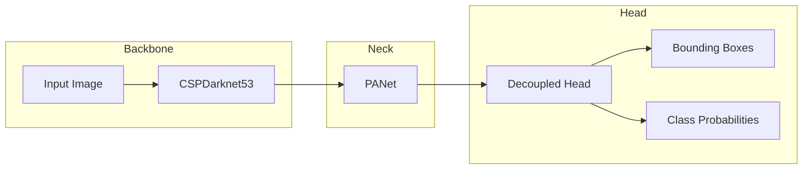

##  YOLOv6原理与代码实例讲解

作者：禅与计算机程序设计艺术

## 1. 背景介绍

### 1.1 目标检测技术的发展历程
目标检测作为计算机视觉领域的核心任务之一，近年来取得了显著的进展。从传统的特征工程方法到基于深度学习的目标检测算法，技术的进步极大地推动了目标检测在自动驾驶、机器人视觉、安防监控等领域的应用。

早期的目标检测算法主要依赖于手工设计的特征和分类器，例如 Viola-Jones 检测器、HOG+SVM 等。这些方法通常计算量大、泛化能力有限，难以应对复杂场景下的目标检测任务。

随着深度学习的兴起，基于卷积神经网络的目标检测算法逐渐占据主导地位。R-CNN、Fast R-CNN、Faster R-CNN 等两阶段目标检测算法通过引入候选区域提取网络，显著提升了目标检测的精度。然而，两阶段算法通常速度较慢，难以满足实时性要求。

为了解决速度瓶颈，YOLO (You Only Look Once) 系列算法应运而生。YOLO 算法将目标检测视为一个回归问题，直接从输入图像中预测目标的类别和边界框，实现了端到端的训练和推理，极大地提升了目标检测的速度。

### 1.2 YOLOv6的提出背景及优势
YOLOv6 是美团视觉智能部研发的一款目标检测框架，它在继承 YOLO 系列算法优点的同时，引入了许多创新性的改进，进一步提升了目标检测的精度和速度。

YOLOv6 的主要优势包括：

* **高精度**: YOLOv6 在多个目标检测数据集上都取得了 SOTA 的结果，例如 COCO、VOC 等。
* **高速度**: YOLOv6 能够在保持高精度的同时，实现实时目标检测。
* **易用性**: YOLOv6 提供了简单易用的 API 接口，方便用户进行模型训练和部署。
* **可扩展性**: YOLOv6 采用了模块化的设计，用户可以方便地对模型结构进行修改和扩展。

## 2. 核心概念与联系

### 2.1 YOLOv6的网络架构

YOLOv6 采用了类似 YOLOv5 的网络架构，主要包含以下几个部分：

* **Backbone**: 用于提取图像特征，通常使用 CSPDarknet53、EfficientNet 等网络结构。
* **Neck**: 用于融合不同尺度的特征信息，通常使用 PANet、BiFPN 等网络结构。
* **Head**: 用于预测目标的类别和边界框，通常使用解耦头、Anchor-Free 等设计。



### 2.2 YOLOv6的关键技术

* **RepVGG Backbone**: YOLOv6 使用 RepVGG 作为 Backbone 网络，RepVGG 是一种高效的卷积神经网络结构，它在训练阶段使用多分支结构，在推理阶段等效转换为单路结构，能够在保持高精度的同时，显著提升模型的推理速度。
* **CSPStack PANet**: YOLOv6 使用 CSPStack PANet 作为 Neck 网络，CSPStack PANet 在 PANet 的基础上引入了 Cross Stage Partial connections (CSP) 结构，能够增强网络的学习能力，提升目标检测的精度。
* **Anchor-Free Head**: YOLOv6 使用 Anchor-Free Head 进行目标检测，Anchor-Free 方法不需要预先定义 Anchor 框，能够自适应地预测目标的边界框，简化了模型的训练过程，提升了目标检测的精度。
* **SimOTA**: YOLOv6 使用 SimOTA 进行标签分配，SimOTA 是一种简单高效的标签分配策略，它能够自动地为每个 ground truth 对象选择最佳的 Anchor 框，提升目标检测的精度。
* **SIoU Loss**: YOLOv6 使用 SIoU Loss 函数计算边界框回归损失，SIoU Loss 是一种更加鲁棒的边界框回归损失函数，它考虑了预测框和真实框之间的重叠面积、中心点距离和纵横比等因素，能够提升目标检测的精度。

## 3. 核心算法原理具体操作步骤

### 3.1 模型训练

YOLOv6 的模型训练过程主要包括以下步骤：

1. **数据预处理**: 对训练数据进行预处理，例如图像缩放、数据增强等操作。
2. **模型初始化**: 初始化模型参数，通常使用 Xavier 初始化或 He 初始化。
3. **前向传播**: 将训练数据输入模型，计算模型的输出。
4. **损失函数计算**: 计算模型输出与真实标签之间的损失，通常使用交叉熵损失函数计算分类损失，使用 SIoU Loss 函数计算边界框回归损失。
5. **反向传播**: 根据损失函数计算梯度，并使用梯度下降算法更新模型参数。
6. **模型评估**: 使用验证集评估模型的性能，例如计算 mAP、FPS 等指标。

### 3.2 模型推理

YOLOv6 的模型推理过程主要包括以下步骤：

1. **图像预处理**: 对输入图像进行预处理，例如图像缩放、归一化等操作。
2. **模型推理**: 将预处理后的图像输入模型，计算模型的输出。
3. **后处理**: 对模型输出进行后处理，例如非极大值抑制 (NMS) 操作，去除冗余的边界框。
4. **结果可视化**: 将检测结果可视化，例如在图像上绘制边界框和类别标签。

## 4. 数学模型和公式详细讲解举例说明

### 4.1 SIoU Loss 函数

SIoU Loss 函数的计算公式如下：

$$
Loss_{SIoU} = 1 - IoU + \frac{\rho^2(b, b^{gt})}{c^2} + \alpha v
$$

其中：

* $IoU$ 表示预测框和真实框之间的交并比。
* $\rho(b, b^{gt})$ 表示预测框中心点和真实框中心点之间的欧氏距离。
* $c$ 表示能够包含预测框和真实框的最小封闭框的对角线长度。
* $\alpha$ 是一个权重参数，用于平衡距离损失和纵横比损失。
* $v$ 表示纵横比相似度，计算公式如下：

$$
v = \frac{4}{\pi^2} (arctan\frac{w^{gt}}{h^{gt}} - arctan\frac{w}{h})^2
$$

### 4.2 SimOTA 标签分配策略

SimOTA 标签分配策略的主要思想是为每个 ground truth 对象选择最佳的 Anchor 框。

SimOTA 的具体操作步骤如下：

1. 对于每个 ground truth 对象，计算它与所有 Anchor 框之间的代价矩阵，代价矩阵的计算方式可以根据具体任务进行调整，例如可以使用 CIoU Loss、DIoU Loss 等。
2. 对代价矩阵进行排序，选择代价最小的 k 个 Anchor 框作为候选框。
3. 对候选框进行筛选，去除冗余的候选框，例如可以使用 NMS 操作。
4. 将筛选后的候选框分配给对应的 ground truth 对象。

## 5. 项目实践：代码实例和详细解释说明

### 5.1 环境搭建

在运行 YOLOv6 代码之前，需要先搭建好运行环境。

```
git clone https://github.com/meituan/YOLOv6.git
cd YOLOv6
pip install -r requirements.txt
```

### 5.2 数据准备

YOLOv6 支持多种目标检测数据集，例如 COCO、VOC 等。

以 COCO 数据集为例，需要先下载 COCO 数据集，并将其转换为 YOLO 格式。

```
python tools/datasets/coco.py --root /path/to/coco
```

### 5.3 模型训练

YOLOv6 提供了丰富的训练脚本，可以方便地进行模型训练。

以训练 YOLOv6-nano 模型为例，可以使用以下命令：

```
python train.py --batch-size 32 --cfg configs/yolov6n.py --data data/coco.yaml --epochs 300 --device 0
```

### 5.4 模型推理

YOLOv6 提供了 `detect.py` 脚本进行模型推理。

```
python detect.py --weights runs/train/exp/weights/best.pt --source data/images/
```

## 6. 实际应用场景

YOLOv6 作为一款高精度、高速度的目标检测框架，可以广泛应用于以下场景：

* **自动驾驶**: YOLOv6 可以用于车辆、行人、交通标志等目标的检测，为自动驾驶系统提供环境感知能力。
* **机器人视觉**: YOLOv6 可以用于机器人抓取、导航、避障等任务，帮助机器人更好地理解和交互 with 周围环境。
* **安防监控**: YOLOv6 可以用于人脸识别、异常行为检测、目标跟踪等任务，提升安防监控系统的智能化水平。
* **工业检测**: YOLOv6 可以用于产品缺陷检测、零件计数、尺寸测量等任务，提升工业生产的效率和质量。

## 7. 总结：未来发展趋势与挑战

YOLOv6 的提出，标志着目标检测技术取得了新的突破。未来，目标检测技术将朝着以下方向发展：

* **更高精度**: 随着模型结构的不断优化和训练数据的不断丰富，目标检测的精度将会越来越高。
* **更快速度**: 为了满足实时性要求，目标检测算法的速度将会越来越快。
* **更强泛化能力**: 目标检测算法需要具备更强的泛化能力，能够应对不同场景下的目标检测任务。
* **更低功耗**: 为了部署在移动设备和嵌入式设备上，目标检测算法需要具备更低的功耗。

## 8. 附录：常见问题与解答

### 8.1 YOLOv6 与 YOLOv5 的区别？

YOLOv6 在 YOLOv5 的基础上进行了一些改进，主要包括：

* 使用 RepVGG 作为 Backbone 网络，提升了模型的推理速度。
* 使用 CSPStack PANet 作为 Neck 网络，提升了目标检测的精度。
* 使用 Anchor-Free Head 进行目标检测，简化了模型的训练过程，提升了目标检测的精度。
* 使用 SimOTA 进行标签分配，提升了目标检测的精度。
* 使用 SIoU Loss 函数计算边界框回归损失，提升了目标检测的精度。

### 8.2 如何提升 YOLOv6 的目标检测精度？

* **使用更大的训练数据集**: 训练数据越多，模型的泛化能力越强，目标检测的精度越高。
* **使用更深的网络结构**: 更深的网络结构能够提取更丰富的图像特征，提升目标检测的精度。
* **使用更好的数据增强策略**: 数据增强可以扩充训练数据，提升模型的泛化能力，从而提升目标检测的精度。
* **使用更优的超参数**: 超参数的选择对模型的性能有很大影响，可以通过网格搜索、贝叶斯优化等方法寻找最优的超参数。

### 8.3 如何提升 YOLOv6 的目标检测速度？

* **使用更小的网络结构**: 更小的网络结构计算量更小，推理速度更快。
* **使用模型量化**: 模型量化可以压缩模型的大小，提升模型的推理速度。
* **使用模型剪枝**: 模型剪枝可以去除模型中冗余的参数，提升模型的推理速度。
* **使用 GPU 加速**: GPU 可以并行处理数据，提升模型的推理速度。
