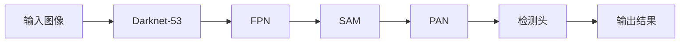

## 1. 背景介绍

### 1.1 目标检测的意义

目标检测是计算机视觉领域中一项重要的基础性任务，旨在识别图像或视频中特定目标的类别和位置信息。这项技术在自动驾驶、安防监控、机器人导航、智能医疗等领域具有广泛的应用前景。

### 1.2 目标检测算法的发展历程

目标检测算法经历了从传统方法到深度学习方法的演变过程。传统方法主要依赖于手工设计的特征提取器，例如Haar特征、HOG特征等，以及滑动窗口、图像金字塔等技术，但其性能有限。近年来，随着深度学习技术的快速发展，基于卷积神经网络的目标检测算法取得了突破性进展，例如R-CNN系列、YOLO系列、SSD等，它们在检测精度和速度方面都取得了显著提升。

### 1.3 YOLOv7的诞生背景

YOLO（You Only Look Once）系列算法以其快速、准确的特点著称，在目标检测领域一直处于领先地位。YOLOv7是该系列的最新版本，它在继承前几代算法优点的基础上，进行了一系列改进和优化，进一步提升了检测精度和速度，并降低了模型的计算复杂度。


## 2. 核心概念与联系

### 2.1 YOLOv7的核心思想

YOLOv7的核心思想是将目标检测任务转化为一个单一的回归问题，即直接从输入图像中预测目标的类别概率和边界框坐标。它将输入图像划分为S×S个网格，每个网格负责预测B个边界框，每个边界框包含5个预测值：目标中心点坐标(x, y)、边界框宽度和高度(w, h)以及目标置信度。

### 2.2 YOLOv7的关键技术

YOLOv7采用了一系列关键技术来实现高精度、高效率的目标检测：

- **Darknet-53主干网络:**  YOLOv7采用了Darknet-53作为其主干网络，用于提取图像特征。Darknet-53是一种深度残差网络，具有强大的特征提取能力。
- **特征金字塔网络(FPN):**  YOLOv7引入了特征金字塔网络(FPN)，将不同层次的特征图进行融合，以提高对不同尺度目标的检测能力。
- **空间注意力机制(SAM):**  YOLOv7采用了空间注意力机制(SAM)，对特征图进行加权，突出重要特征，抑制无关信息。
- **路径聚合网络(PAN):**  YOLOv7使用了路径聚合网络(PAN)，将不同层次的特征图进行自顶向下和自底向上的信息传递，增强特征融合效果。
- **CIOU损失函数:**  YOLOv7采用了CIOU损失函数，用于优化边界框回归，提高定位精度。

### 2.3 YOLOv7的网络结构



**图1：YOLOv7网络结构示意图**

## 3. 核心算法原理具体操作步骤

### 3.1 图像预处理

在将图像输入YOLOv7网络之前，需要进行一系列预处理操作，包括：

- **图像缩放:** 将输入图像缩放至固定尺寸，例如416x416。
- **像素归一化:** 将像素值归一化到[0, 1]之间。
- **数据增强:**  对训练数据进行随机翻转、裁剪、颜色变换等操作，以增加数据的多样性和模型的鲁棒性。

### 3.2 特征提取

YOLOv7使用Darknet-53网络作为主干网络，用于提取图像特征。Darknet-53网络由一系列卷积层、残差块和池化层组成，可以提取图像的多层次语义信息。

### 3.3 特征融合

YOLOv7采用特征金字塔网络(FPN)将不同层次的特征图进行融合。FPN通过自顶向下的路径将高层语义信息传递到低层，同时通过自底向上的路径将低层细节信息传递到高层，从而获得更丰富的特征表示。

### 3.4 目标预测

YOLOv7的检测头包含三个分支，分别用于预测目标的类别概率、边界框坐标和置信度。

- **类别概率预测:**  使用softmax函数将特征图转换为每个网格中每个边界框属于不同类别的概率分布。
- **边界框坐标预测:** 使用sigmoid函数将特征图转换为边界框的中心点坐标(x, y)和宽度、高度(w, h)，并进行解码操作，将其映射到原始图像尺寸。
- **置信度预测:** 使用sigmoid函数将特征图转换为每个边界框包含目标的置信度。

### 3.5 非极大值抑制

由于每个网格会预测多个边界框，因此需要使用非极大值抑制(NMS)算法来去除冗余的边界框。NMS算法的基本思想是，对于每个类别，首先根据置信度对边界框进行排序，然后选择置信度最高的边界框，并抑制与其重叠度超过一定阈值的其它边界框。

## 4. 数学模型和公式详细讲解举例说明

### 4.1 边界框回归

YOLOv7使用如下公式预测边界框的中心点坐标(x, y)和宽度、高度(w, h)：

$$
\begin{aligned}
b_x &= \sigma(t_x) + c_x \\
b_y &= \sigma(t_y) + c_y \\
b_w &= p_w e^{t_w} \\
b_h &= p_h e^{t_h}
\end{aligned}
$$

其中：

- $(b_x, b_y)$表示预测边界框的中心点坐标。
- $(c_x, c_y)$表示网格的左上角坐标。
- $(b_w, b_h)$表示预测边界框的宽度和高度。
- $(p_w, p_h)$表示预设的锚框的宽度和高度。
- $(t_x, t_y, t_w, t_h)$表示网络预测的偏移量。

### 4.2 CIOU损失函数

YOLOv7使用CIOU损失函数来优化边界框回归，其计算公式如下：

$$
\begin{aligned}
Loss_{CIOU} &= 1 - IoU + \frac{\rho^2(b, b^{gt})}{c^2} + \alpha v \\
v &= \frac{4}{\pi^2} (arctan\frac{w^{gt}}{h^{gt}} - arctan\frac{w}{h})^2 \\
\alpha &= \frac{v}{(1-IoU)+v}
\end{aligned}
$$

其中：

- $IoU$表示预测边界框和真实边界框的交并比。
- $\rho(b, b^{gt})$表示预测边界框中心点和真实边界框中心点之间的欧氏距离。
- $c$表示能够同时包含预测边界框和真实边界框的最小闭包区域的对角线长度。
- $v$表示预测边界框和真实边界框的纵横比的一致性。
- $\alpha$是权重系数。

## 5. 项目实践：代码实例和详细解释说明

```python
import torch
import torch.nn as nn

# 定义YOLOv7模型
class YOLOv7(nn.Module):
    def __init__(self, num_classes=80):
        super(YOLOv7, self).__init__()
        # ... 定义网络结构 ...

    def forward(self, x):
        # ... 前向传播过程 ...
        return output

# 加载预训练模型
model = torch.hub.load('WongKinYiu/yolov7', 'yolov7', pretrained=True)

# 加载图像
image = Image.open('image.jpg')

# 进行目标检测
results = model(image)

# 打印检测结果
print(results.pandas().xyxy[0])
```

**代码解释:**

- 首先，我们定义了YOLOv7模型类，并在其中定义了网络结构。
- 然后，我们使用`torch.hub.load()`函数加载了预训练的YOLOv7模型。
- 接着，我们加载了一张图像，并将其输入到模型中进行目标检测。
- 最后，我们打印了检测结果，包括目标的类别、置信度和边界框坐标。

## 6. 实际应用场景

YOLOv7在各个领域都有广泛的应用，例如：

- **自动驾驶:**  用于检测车辆、行人、交通信号灯等目标，为自动驾驶系统提供环境感知信息。
- **安防监控:** 用于实时监控视频流，检测异常行为，例如入侵、打架等。
- **机器人导航:**  用于帮助机器人识别环境中的障碍物，规划路径。
- **智能医疗:** 用于辅助医生诊断疾病，例如识别医学影像中的肿瘤。

## 7. 总结：未来发展趋势与挑战

YOLOv7作为目标检测领域的佼佼者，展现了其强大的性能和广泛的应用前景。未来，目标检测技术将朝着以下方向发展：

- **更高的检测精度和速度:**  随着硬件计算能力的提升和算法的不断优化，目标检测算法的精度和速度将不断提高。
- **更小的模型尺寸和更低的计算复杂度:**  为了适应移动设备和嵌入式系统的需求，目标检测模型的尺寸和计算复杂度将不断降低。
- **更强的泛化能力:**  目标检测算法需要具备更强的泛化能力，以应对不同场景、不同光照条件、不同目标姿态等挑战。

## 8. 附录：常见问题与解答

### 8.1  YOLOv7与之前的版本相比有哪些改进？

YOLOv7在以下方面进行了改进：

- **网络结构优化:**  采用了Darknet-53主干网络、特征金字塔网络(FPN)、空间注意力机制(SAM)和路径聚合网络(PAN)，提高了特征提取和融合能力。
- **损失函数改进:**  采用了CIOU损失函数，提高了边界框回归的精度。
- **训练策略优化:**  采用了Mosaic数据增强、标签平滑等技术，提高了模型的鲁棒性和泛化能力。

### 8.2  如何选择合适的YOLOv7模型？

YOLOv7提供了多种不同尺寸和精度的模型，可以根据具体应用场景选择合适的模型。例如，对于对实时性要求较高的应用，可以选择YOLOv7-tiny模型；对于对精度要求较高的应用，可以选择YOLOv7-W6模型。

### 8.3  如何提高YOLOv7的检测精度？

可以通过以下方式提高YOLOv7的检测精度：

- **使用更高质量的训练数据:**  训练数据的质量对模型的性能至关重要，建议使用标注准确、数量充足的训练数据。
- **调整网络参数:**  可以尝试调整网络的学习率、批次大小、训练轮数等参数，以找到最佳的训练策略。
- **使用更强大的硬件:**  使用更高性能的GPU可以加快模型训练和推理速度，提高检测效率。
