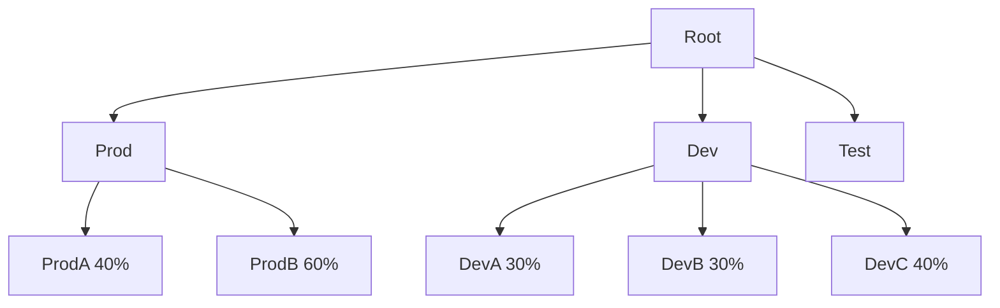
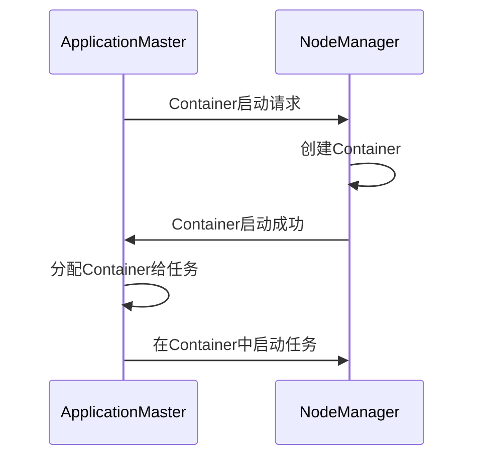
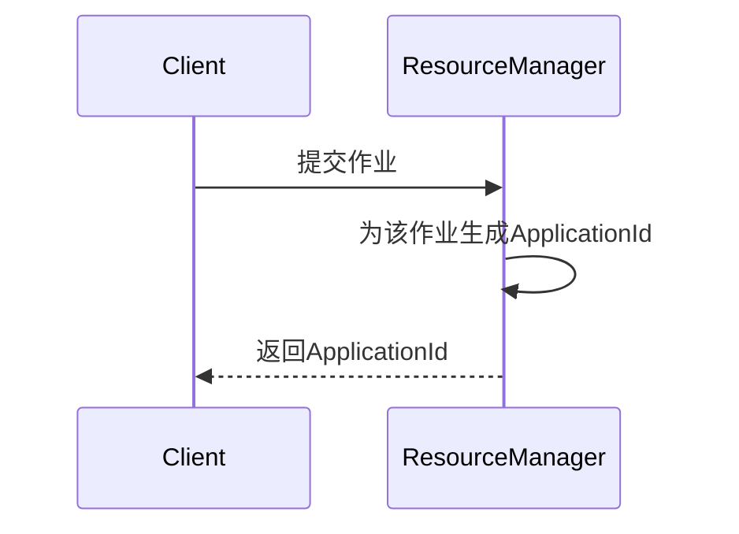
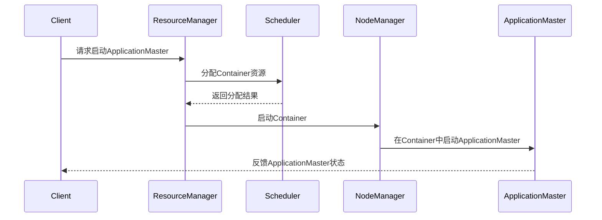
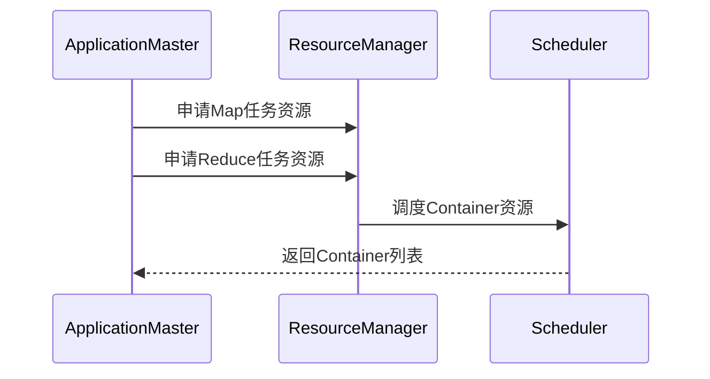

# Yarn资源管理和任务调度原理与代码实例讲解

作者：禅与计算机程序设计艺术

## 1. 背景介绍

### 1.1 大数据处理的挑战
 
在大数据时代,海量数据的高效处理已成为各行各业面临的重大挑战。传统的单机处理模式已无法满足日益增长的数据规模和计算复杂度。分布式计算框架应运而生,其中 Apache Hadoop 生态系统以其强大的扩展性、容错性和易用性脱颖而出,受到广泛关注和应用。

### 1.2 Hadoop 1.0的局限性

在 Hadoop 1.0 时代,MapReduce 同时承担了资源管理和任务调度两大角色,造成了诸多局限:

- 可扩展性受限:计算框架与资源管理紧耦合,难以支持多样化的计算框架
- 资源利用率低:Map和Reduce任务分别占用独立的槽位,无法混合使用
- 可靠性不足:JobTracker 单点故障将导致所有任务失败

### 1.3 YARN的诞生

为了克服上述不足,Hadoop 2.0 推出了全新的资源管理系统—YARN (Yet Another Resource Negotiator)。YARN 将 MapReduce 中的资源管理和任务调度功能剥离出来,成为一个通用的资源管理平台,可为各类计算框架提供资源分配和调度服务。

YARN 的出现标志着 Hadoop 从单一的 MapReduce 计算平台走向多元化计算框架的转变,极大地促进了 Hadoop 生态的繁荣发展。

## 2. 核心概念与架构

### 2.1 ResourceManager

ResourceManager(RM)是YARN的核心组件,负责整个集群的资源管理和分配。它主要包含两大模块:

- Scheduler:根据容量、队列等约束条件将资源分配给各个应用程序。需要注意的是,它只负责决策,而不负责具体资源的使用。
- ApplicationsManager:负责接收job提交、协商第一个container以启动ApplicationMaster、监控ApplicationMaster运行状态等。

### 2.2 NodeManager

NodeManager(NM)是YARN集群中具体执行任务的节点。主要功能如下:

- 定期向RM汇报本节点的资源使用情况
- 接收并处理来自AM的Container启动、停止等请求
- 监控Container的运行状态,并向RM提供反馈

### 2.3 ApplicationMaster

ApplicationMaster(AM)可以看作是各个应用程序向RM申请资源的代理人,它负责与RM协商资源,并与NM通信来启动任务。AM的主要功能包括:

- 向RM注册,申请运行应用程序所需的资源
- 将得到的资源进一步分配给内部任务
- 与NM通信,启动/停止任务,并监控任务状态
- 负责应用程序内部的任务调度与容错

### 2.4 Container

Container 是 YARN 为各个任务分配的资源容器,它封装了某个节点上一定量的资源(如内存、CPU等)。YARN以Container为单位分配资源,ApplicationMaster则会向ResourceManager申请Container来完成任务的调度和运行。

### 2.5 架构图解

## 3. 资源管理与调度原理

### 3.1 资源调度器概述

YARN 提供了多种资源调度器,用户可根据实际需求选择:

- FIFO Scheduler:按照任务提交的先后顺序,先来先服务
- Capacity Scheduler:基于多队列的资源分配,每个队列可配置一定的资源量,队列内部采用FIFO
- Fair Scheduler:公平调度,在多个队列之间平均分配资源

以下以Capacity Scheduler为例,详解资源调度的内部原理。

### 3.2 容量调度器设计理念

Capacity Scheduler的核心理念是将集群资源划分为多个队列,每个队列可配置一定比例的资源量。YARN会根据每个队列的容量和正在运行的应用情况,动态调整资源分配。 

其主要考虑因素包括:

- 按照队列容量分配资源,避免单个用户或应用独占全部资源
- 空闲资源可暂时共享给其他队列,提高集群利用率
- 支持访问控制列表(ACL),限定特定用户使用队列
- 可为队列设置最大资源量,防止某队列过度使用资源

### 3.3 容量调度器队列结构

Capacity Scheduler允许用户通过配置构建出层次化的队列结构,队列内部可进一步划分子队列。通过为每个队列分配一定比例的资源,可方便地管理多个组织和用户的资源使用。

如下图所示的队列层级:

### 3.4 容量调度器资源分配算法

容量调度器的资源分配过程遵循以下几个原则:

1. 先满足队列的最小资源保证
2. 剩余资源在队列间按比例分配
3. 若队列中有空闲资源,则临时共享给资源不足的队列
4. 一个队列的最大资源量受限于其配置的百分比  

具体算法流程如下:

- 计算每个队列应得的资源量
  - 根据集群总资源和队列配置比例,得出每个队列的应得资源数
  - 对于层次队列,父队列的资源在子队列间再分配  
- 校正资源分配结果
  - 若队列的实际资源超过其应得数量,则将多余资源共享给其他队列
  - 但队列资源使用不能超过其配置的最大资源量
- 生成资源分配决策
  - 将资源分配结果通知给ApplicationMaster
  - 由ApplicationMaster进一步将资源分配给具体任务

示意图如下:

## 4. 资源请求与任务调度

### 4.1 ApplicationMaster的资源请求

当一个应用程序被提交到YARN后,它的ApplicationMaster首先向ResourceManager注册,然后开始申请运行任务所需的资源。

具体步骤包括:

- 发送请求至RM的ApplicationMasterService组件
- 在请求中指明所需的资源量(memory,cpu等)
- 指明优先级,本地性等约束信息
- RM根据调度策略决定是否满足请求
- AM收到响应,如有需要则继续发出增量请求 

### 4.2 Container的分配与启动

当AM获得资源容器后,将根据应用的实际需求,将Container进一步分配给各个任务。AM通过与NM通信,在指定节点启动Container。

流程如下:

NodeManager在启动Container时,会为其分配特定的资源限制,如内存上限、CPU shares等,确保Container不会超额使用资源而影响其他任务。

### 4.3 任务的执行与监控

ApplicationMaster除了负责为任务申请资源,还要负责任务的调度和执行过程。具体职责包括:

- 为任务分配资源,如Map或Reduce槽位
- 为任务生成执行计划,如确定数据分片和任务顺序
- 监控任务执行状态,如进度、是否失败等
- 在任务失败时重试或启动备份任务,确保应用执行的完整性

ApplicationMaster通过不断轮询NodeManager获取任务的最新进展,如果发现失败的任务,则会重新为其申请Container并启动。整个过程无需ResourceManager的介入,实现了高效的应用内调度。

## 5. 基于YARN的MapReduce任务调度

下面我们结合一个实际的MapReduce任务,来看看在YARN环境下,具体的任务调度原理。

### 5.1 作业提交

用户提交MapReduce作业后,ResourceManager首先为其分配一个全局唯一的ApplicationId,用于标识和跟踪该作业。

### 5.2 ApplicationMaster的启动

Client首先要为该作业启动一个ApplicationMaster。它向RM请求一个Container用于启动AM,RM根据调度策略选择一个NodeManager,并要求它启动Container。 

AM启动后,立即向Client反馈,表示其已成功启动并开始工作。

### 5.3 任务资源的申请

MapReduce的ApplicationMaster接下来会向ResourceManager申请运行Map和Reduce任务所需的Container资源。

AM采用轮询的方式,不断向RM申请资源,直到获得足够的Container。RM在收到请求后,会根据配置的调度策略,选择若干个NodeManager,分配Container给AM。

### 5.4 任务调度与监控

当AM获取到任务执行所需的Container后,就开始在对应的NodeManager上启动任务。 

AM会持续跟踪任务的执行状态。对于Map任务,AM需要获取其输出数据的位置,以便在启动Reduce任务时可以获取到Map的输出。

同时,AM也会监控每个任务的执行进度和健康状况。如果任务失败,AM会重新为其申请Container资源,并重新启动任务,从而实现应用层面的容错。   

当所有任务成功完成后,AM会向ResourceManager取消注册,并告知Client应用已执行完毕,随后AM和用于运行任务的Container都会被销毁,资源被回收。

## 6. 资源隔离与多租户

YARN采用了基于容器的资源隔离机制,可实现多用户、多应用的资源共享与隔离,提高集群利用率的同时确保公平性与QoS。

### 6.1 多队列
通过将集群划分为多个队列,并为每个队列分配一定的资源比例,可实现不同用户、部门之间的资源隔离。每个队列内部再以一定的调度策略(如FIFO、Fair等)为各个应用分配资源。

### 6.2 访问控制列表(ACL)
通过为队列配置ACL,限定只有特定的用户或用户组才能向该队列提交应用,避免随意使用其他队列的资源。

### 6.3 弹性资源共享
如果一个队列中暂时空闲,没有足够的应用消耗队列资源,YARN会弹性地将这些剩余资源共享给其他繁忙的队列,避免资源浪费。当该队列负载加重时,YARN又会回收之前共享出去的资源,确保每个队列的资源使用不会超出其配额范围。

### 6.4 资源抢占
当一个任务长时间占用大量资源不释放,导致其他任务难以获得资源时,YARN支持对该任务实施资源抢占。被抢占的Container将得到通知,可自行选择保存状态并主动退出,也可等待被强制销毁。被抢占的任务可在其他节点重启。 

### 6.5 基于cgroup的资源控制
YARN NodeManager支持