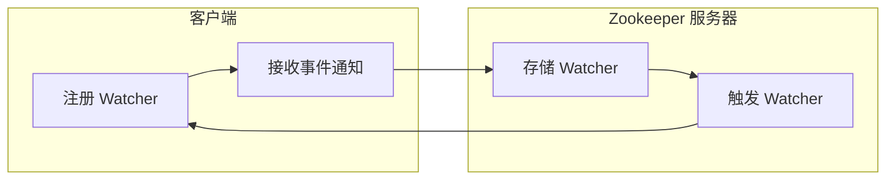

##  Zookeeper Watcher机制原理与代码实例讲解

## 1. 背景介绍

### 1.1 分布式系统中的挑战

随着互联网的快速发展，分布式系统已经成为构建高可用、高性能应用的必然选择。然而，分布式系统也带来了许多挑战，其中一个关键挑战是如何保证数据的一致性和可靠性。在分布式环境中，数据通常分布在多个节点上，如何保证这些节点上的数据保持同步，以及如何在节点故障时进行数据恢复，是分布式系统设计中需要解决的核心问题。

### 1.2 Zookeeper的角色

Zookeeper是一个开源的分布式协调服务，它为分布式应用提供了一致性、可靠性和有序性保障。Zookeeper的核心是一个层次化的命名空间，类似于文件系统，每个节点被称为znode。Zookeeper维护着这些znode的状态信息，并提供了一组API供客户端访问和操作这些信息。

### 1.3 Watcher机制的重要性

Zookeeper的Watcher机制是其保证数据一致性和可靠性的核心机制之一。Watcher机制允许客户端注册对特定znode的监听，当znode的状态发生变化时，Zookeeper会通知所有注册了该znode的客户端，从而实现分布式环境下的事件通知和数据同步。

## 2. 核心概念与联系

### 2.1 Znode

Znode是Zookeeper中数据的基本单元，它可以存储数据、维护子节点列表，以及存储节点的访问控制信息。Znode可以分为四种类型：

* **持久节点 (PERSISTENT)**：一旦创建，除非显式删除，否则将一直存在。
* **临时节点 (EPHEMERAL)**：与创建它的客户端会话绑定，当会话结束时，节点自动删除。
* **顺序节点 (SEQUENTIAL)**：创建节点时，Zookeeper会为其分配一个单调递增的序列号。
* **持久顺序节点 (PERSISTENT_SEQUENTIAL)**：结合了持久节点和顺序节点的特点。

### 2.2 Watcher

Watcher是一个接口，它定义了当znode状态发生变化时Zookeeper服务器回调客户端的方法。客户端可以通过getData、getChildren、exists等API方法注册Watcher，当znode的数据、子节点列表或节点本身发生变化时，Zookeeper会触发相应的Watcher事件。

### 2.3 Watcher事件类型

Zookeeper定义了以下几种Watcher事件类型：

* **NodeCreated**: 节点创建事件。
* **NodeDataChanged**: 节点数据变更事件。
* **NodeChildrenChanged**: 子节点列表变更事件。
* **NodeDeleted**: 节点删除事件。

### 2.4 Watcher特性

* **一次性触发**: Watcher是一次性触发的，当Watcher被触发后，Zookeeper会将其从znode上移除。如果需要继续监听该znode的变化，需要重新注册Watcher。
* **异步触发**: Watcher的触发是异步的，Zookeeper会在后台线程中处理Watcher事件，不会阻塞客户端的业务逻辑。
* **轻量级**: Watcher机制非常轻量级，对Zookeeper服务器的性能影响很小。

### 2.5 核心概念联系

Znode、Watcher和Watcher事件类型是Zookeeper Watcher机制的核心概念，它们之间有着密切的联系。客户端通过注册Watcher来监听znode的变化，当znode的状态发生变化时，Zookeeper会触发相应的Watcher事件通知客户端。

## 3. 核心算法原理具体操作步骤

### 3.1 Watcher注册流程

1. 客户端调用Zookeeper API方法（如getData、getChildren、exists等），并在方法参数中指定Watcher对象。
2. Zookeeper服务器接收到客户端请求后，会将Watcher对象存储在对应的znode的Watcher列表中。
3. 如果znode的状态发生变化，Zookeeper会触发相应的Watcher事件，并将事件通知给所有注册了该znode的Watcher。

### 3.2 Watcher触发流程

1. 当znode的状态发生变化时，Zookeeper会根据znode的Watcher列表，获取所有注册了该znode的Watcher对象。
2. Zookeeper会在后台线程中依次调用Watcher对象的process方法，并将事件类型和相关数据作为参数传递给process方法。
3. 客户端在process方法中处理Watcher事件，例如更新本地缓存、执行业务逻辑等。

### 3.3 Watcher机制流程图



## 4. 数学模型和公式详细讲解举例说明

Zookeeper Watcher机制没有复杂的数学模型和公式，其核心原理是基于事件通知机制。

## 5. 项目实践：代码实例和详细解释说明

### 5.1 创建Maven项目

```
mvn archetype:generate -DgroupId=com.example -DartifactId=zookeeper-watcher-example -DarchetypeArtifactId=maven-archetype-quickstart -DinteractiveMode=false
```

### 5.2 添加Zookeeper依赖

```xml
<dependency>
    <groupId>org.apache.zookeeper</groupId>
    <artifactId>zookeeper</artifactId>
    <version>3.7.0</version>
</dependency>
```

### 5.3 创建Zookeeper客户端

```java
public class ZookeeperClient {

    private static final String CONNECT_STRING = "localhost:2181";
    private static final int SESSION_TIMEOUT = 5000;

    private ZooKeeper zooKeeper;

    public ZookeeperClient() throws IOException {
        zooKeeper = new ZooKeeper(CONNECT_STRING, SESSION_TIMEOUT, new Watcher() {
            @Override
            public void process(WatchedEvent event) {
                System.out.println("Received event: " + event);
            }
        });
    }

    public ZooKeeper getZooKeeper() {
        return zooKeeper;
    }
}
```

### 5.4 创建节点并注册Watcher

```java
public class CreateNodeExample {

    public static void main(String[] args) throws Exception {
        ZookeeperClient client = new ZookeeperClient();
        ZooKeeper zooKeeper = client.getZooKeeper();

        // 创建节点并注册Watcher
        String path = zooKeeper.create("/test", "data".getBytes(), ZooDefs.Ids.OPEN_ACL_UNSAFE, CreateMode.PERSISTENT);
        System.out.println("Created node: " + path);

        // 获取节点数据并注册Watcher
        byte[] data = zooKeeper.getData("/test", new Watcher() {
            @Override
            public void process(WatchedEvent event) {
                System.out.println("Data changed: " + event);
            }
        }, null);
        System.out.println("Data: " + new String(data));

        // 更新节点数据
        zooKeeper.setData("/test", "new data".getBytes(), -1);

        Thread.sleep(10000);

        client.getZooKeeper().close();
    }
}
```

### 5.5 代码解释

* `ZookeeperClient`类封装了Zookeeper客户端的创建和连接逻辑。
* `CreateNodeExample`类演示了如何创建节点、注册Watcher以及处理Watcher事件。
* 在`main`方法中，首先创建了一个`ZookeeperClient`对象，然后使用`create`方法创建了一个持久节点`/test`，并注册了一个默认的Watcher。
* 接着，使用`getData`方法获取节点数据，并注册了一个新的Watcher，用于监听节点数据的变化。
* 最后，使用`setData`方法更新节点数据，触发Watcher事件。
* 程序会在控制台输出以下信息：

```
Created node: /test
Data: data
Received event: WatchedEvent state:SyncConnected type:NodeDataChanged path:/test
Data changed: WatchedEvent state:SyncConnected type:NodeDataChanged path:/test
```

## 6. 实际应用场景

### 6.1 配置中心

Zookeeper可以用作分布式系统的配置中心，将配置信息存储在znode中，客户端通过Watcher机制监听配置的变化，动态更新本地配置。

### 6.2 服务发现

Zookeeper可以作为服务注册中心，服务提供者将服务信息注册到Zookeeper，服务消费者通过Watcher机制发现可用的服务实例。

### 6.3 分布式锁

Zookeeper可以实现分布式锁，利用临时节点和Watcher机制，保证同一时刻只有一个客户端获取到锁。

### 6.4 Master选举

Zookeeper可以用于Master选举，利用临时顺序节点和Watcher机制，选举出集群中的Master节点。

## 7. 工具和资源推荐

### 7.1 Zookeeper官网

https://zookeeper.apache.org/

### 7.2 Curator

Curator是Netflix开源的一个Zookeeper客户端框架，提供了更高级的API和功能，简化了Zookeeper的使用。

https://curator.apache.org/

## 8. 总结：未来发展趋势与挑战

### 8.1 未来发展趋势

* **云原生支持**: 随着云计算的普及，Zookeeper需要更好地支持云原生环境，例如提供容器化部署、自动伸缩等功能。
* **性能优化**: 随着数据规模的增长，Zookeeper需要不断优化性能，提高吞吐量和降低延迟。
* **安全性增强**: Zookeeper需要加强安全性，例如支持更安全的认证和授权机制。

### 8.2 面临的挑战

* **数据一致性**: 在分布式环境中，保证数据一致性是一个挑战，Zookeeper需要不断优化算法，提高数据一致性的保证。
* **运维复杂度**: Zookeeper的部署和运维比较复杂，需要专业的技术人员进行维护。
* **社区活跃度**: Zookeeper的社区活跃度相对较低，需要吸引更多开发者参与贡献。

## 9. 附录：常见问题与解答

### 9.1 Watcher是一次性触发的吗？

是的，Watcher是一次性触发的。当Watcher被触发后，Zookeeper会将其从znode上移除。如果需要继续监听该znode的变化，需要重新注册Watcher。

### 9.2 Watcher的触发是同步的还是异步的？

Watcher的触发是异步的。Zookeeper会在后台线程中处理Watcher事件，不会阻塞客户端的业务逻辑。

### 9.3 Zookeeper Watcher机制有哪些应用场景？

Zookeeper Watcher机制可以应用于配置中心、服务发现、分布式锁、Master选举等场景。