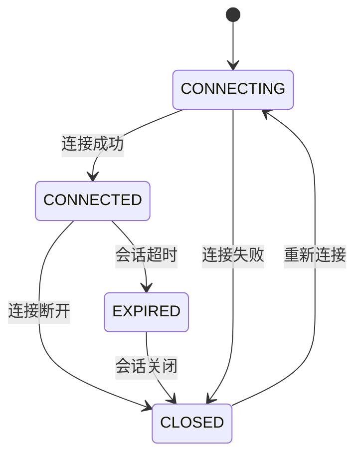

# Zookeeper会话管理:会话建立、过期与恢复

作者：禅与计算机程序设计艺术

## 1. 背景介绍

### 1.1 分布式系统中的挑战

随着互联网的快速发展，传统的集中式系统已经无法满足日益增长的业务需求。分布式系统应运而生，它将复杂的业务逻辑拆分成多个独立的服务，并部署在不同的机器上，通过网络进行协同工作。然而，分布式系统也带来了新的挑战，例如：

* **数据一致性问题**: 如何保证分布式系统中各个节点的数据一致性？
* **服务发现问题**:  服务之间如何相互发现？
* **分布式协调问题**: 如何协调分布式系统中各个节点的行为？

### 1.2 Zookeeper：分布式协调利器

Zookeeper 是一个开源的分布式协调服务，它为分布式应用提供了一致性、可用性和分区容错性保障。Zookeeper 的设计目标是将那些复杂且容易出错的分布式一致性服务封装起来，构成一个高效可靠的原语集，并以简单易用的接口提供给用户使用。

### 1.3 会话管理：Zookeeper 的核心功能之一

会话管理是 Zookeeper 的核心功能之一，它维护了客户端与 Zookeeper 服务端之间的连接状态。Zookeeper 客户端可以通过创建会话与服务端建立连接，并在会话生命周期内进行各种操作，例如创建节点、获取数据、监听节点变化等。

## 2. 核心概念与联系

### 2.1 会话（Session）

会话是指客户端与 Zookeeper 服务器之间的一次连接，它代表了客户端与 Zookeeper 集群交互的上下文信息。每个会话都拥有一个唯一的会话 ID（Session ID），用于标识不同的会话。

### 2.2 会话状态（Session State）

Zookeeper 中的会话有三种状态：

* **CONNECTING**: 客户端正在尝试连接到 Zookeeper 服务器。
* **CONNECTED**: 客户端已经成功连接到 Zookeeper 服务器，可以进行各种操作。
* **CLOSED**: 客户端与 Zookeeper 服务器的连接已经断开，会话失效。

### 2.3 会话超时时间（Session Timeout）

会话超时时间是指客户端在指定时间内没有向 Zookeeper 服务器发送任何请求，则 Zookeeper 服务器会认为该会话已经过期。会话超时时间由客户端在创建会话时指定，Zookeeper 服务器会根据该时间周期来判断会话是否过期。

### 2.4 会话过期（Session Expiration）

当 Zookeeper 服务器检测到某个会话超时时，就会将该会话标记为过期状态。会话过期后，该会话所创建的所有临时节点都会被删除，并且该会话相关的监听器也会被移除。

### 2.5 会话恢复（Session Reestablishment）

当客户端与 Zookeeper 服务器之间的连接断开后，客户端可以尝试重新连接到 Zookeeper 服务器。如果在会话超时时间内重新连接成功，则 Zookeeper 服务器会将该会话恢复到之前的状态，包括会话 ID、会话数据等。

## 3. 核心算法原理具体操作步骤

### 3.1 会话建立

1. 客户端向 Zookeeper 服务器发送连接请求，请求中包含会话超时时间等信息。
2. Zookeeper 服务器收到连接请求后，会为该客户端创建一个新的会话，并生成一个唯一的会话 ID。
3. Zookeeper 服务器将会话 ID 返回给客户端，表示会话建立成功。

### 3.2 会话维持

1. 客户端在会话生命周期内，需要定期向 Zookeeper 服务器发送心跳包，以维持会话的有效性。
2. Zookeeper 服务器收到心跳包后，会更新会话的最后活跃时间。

### 3.3 会话过期

1. Zookeeper 服务器会启动一个定时任务，定期检查所有会话的最后活跃时间。
2. 如果某个会话的最后活跃时间距离当前时间超过了会话超时时间，则 Zookeeper 服务器会将该会话标记为过期状态。
3. Zookeeper 服务器会删除该会话所创建的所有临时节点，并移除该会话相关的监听器。

### 3.4 会话恢复

1. 客户端与 Zookeeper 服务器之间的连接断开后，客户端会尝试重新连接到 Zookeeper 服务器。
2. 客户端在重新连接请求中携带之前的会话 ID。
3. Zookeeper 服务器收到重新连接请求后，会检查该会话 ID 是否存在，并且是否在有效期内。
4. 如果该会话 ID 存在并且在有效期内，则 Zookeeper 服务器会将该会话恢复到之前的状态，并将新的 Zookeeper 服务器地址返回给客户端。
5. 客户端收到新的 Zookeeper 服务器地址后，会重新连接到新的 Zookeeper 服务器，并继续使用之前的会话 ID 进行操作。

## 4. 数学模型和公式详细讲解举例说明

Zookeeper 的会话管理机制可以简单地用一个状态机来表示：



其中：

* **CONNECTING**: 表示客户端正在尝试连接到 Zookeeper 服务器。
* **CONNECTED**: 表示客户端已经成功连接到 Zookeeper 服务器。
* **CLOSED**: 表示客户端与 Zookeeper 服务器的连接已经断开。
* **EXPIRED**: 表示会话超时。

## 5. 项目实践：代码实例和详细解释说明

### 5.1 Java 代码示例

```java
import org.apache.zookeeper.*;

import java.io.IOException;
import java.util.concurrent.CountDownLatch;

public class ZookeeperSessionDemo {

    private static final String CONNECT_STRING = "localhost:2181";
    private static final int SESSION_TIMEOUT = 5000;

    public static void main(String[] args) throws IOException, InterruptedException, KeeperException {
        // 创建 ZooKeeper 连接
        final CountDownLatch connectedSignal = new CountDownLatch(1);
        ZooKeeper zk = new ZooKeeper(CONNECT_STRING, SESSION_TIMEOUT, new Watcher() {
            @Override
            public void process(WatchedEvent event) {
                if (event.getState() == Event.KeeperState.SyncConnected) {
                    connectedSignal.countDown();
                }
            }
        });
        connectedSignal.await();

        // 获取会话 ID
        long sessionId = zk.getSessionId();
        System.out.println("Session ID: " + sessionId);

        // 创建临时节点
        String nodePath = zk.create("/my_node", "my_data".getBytes(), ZooDefs.Ids.OPEN_ACL_UNSAFE, CreateMode.EPHEMERAL);
        System.out.println("Created node: " + nodePath);

        // 关闭连接
        zk.close();
    }
}
```

### 5.2 代码解释

1. **创建 ZooKeeper 连接**: 使用 `ZooKeeper` 构造函数创建 ZooKeeper 连接，并指定连接字符串、会话超时时间和监听器。
2. **获取会话 ID**: 使用 `zk.getSessionId()` 方法获取当前会话的 ID。
3. **创建临时节点**: 使用 `zk.create()` 方法创建一个临时节点，该节点会在会话过期后自动删除。
4. **关闭连接**: 使用 `zk.close()` 方法关闭 ZooKeeper 连接。

## 6. 实际应用场景

Zookeeper 的会话管理机制在很多分布式应用中都有着广泛的应用，例如：

* **分布式锁**: 利用 Zookeeper 的临时节点和监听器机制，可以实现分布式锁，保证多个客户端对共享资源的互斥访问。
* **领导选举**: 利用 Zookeeper 的临时节点和监听器机制，可以实现领导选举，保证在分布式环境下只有一个主节点对外提供服务。
* **配置中心**: 利用 Zookeeper 的节点数据存储功能，可以实现配置中心，将应用程序的配置信息存储在 Zookeeper 上，方便应用程序动态获取和更新配置信息。

## 7. 总结：未来发展趋势与挑战

### 7.1 未来发展趋势

* **云原生支持**: 随着云计算的普及，Zookeeper 也在积极拥抱云原生技术，例如提供 Kubernetes Operator、容器化部署等功能。
* **性能优化**: 随着数据规模的不断增长，Zookeeper 的性能也面临着更大的挑战，未来将会持续进行性能优化，例如采用更高效的网络通信协议、优化数据存储结构等。
* **安全性增强**:  Zookeeper 的安全性也越来越受到重视，未来将会加强身份认证、权限控制等方面的功能。

### 7.2 面临的挑战

* **数据一致性**: Zookeeper 保证的是最终一致性，而不是强一致性，在某些对数据一致性要求非常高的场景下，需要采用其他的解决方案。
* **性能瓶颈**: Zookeeper 的性能瓶颈主要在于单点写性能，未来需要探索更高效的写操作方案。
* **运维成本**: Zookeeper 的部署和维护相对复杂，需要专业的运维人员进行管理。

## 8. 附录：常见问题与解答

### 8.1  Zookeeper 的会话超时时间如何设置？

会话超时时间的设置需要根据具体的业务场景来确定，一般建议设置在 10 秒到 30 秒之间。如果会话超时时间设置过短，会导致频繁的会话过期，增加系统的负担；如果会话超时时间设置过长，会导致会话失效不及时，影响系统的可用性。

### 8.2  Zookeeper 的会话恢复机制是如何工作的？

当客户端与 Zookeeper 服务器之间的连接断开后，客户端会尝试重新连接到 Zookeeper 服务器。如果在会话超时时间内重新连接成功，则 Zookeeper 服务器会将该会话恢复到之前的状态，包括会话 ID、会话数据等。

### 8.3  Zookeeper 的会话管理机制有哪些应用场景？

Zookeeper 的会话管理机制可以用于实现分布式锁、领导选举、配置中心等功能。
