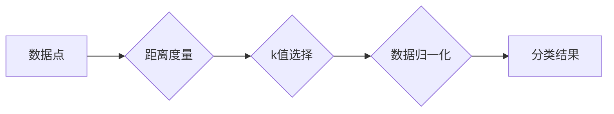
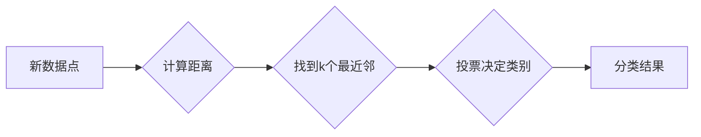

# k-NN算法与大数据：挑战与机遇并存

作者：禅与计算机程序设计艺术

## 1. 背景介绍

### 1.1 k-NN算法：简单而强大的分类器

k-NN 算法，全称 k-Nearest Neighbors algorithm，是一种简单但强大的非参数分类算法。它的核心思想是：对于一个新的数据点，通过寻找距离它最近的 k 个已知类别的数据点，并根据这 k 个邻居的类别进行投票，来决定新数据点的类别。

### 1.2 大数据时代：数据规模与复杂性的挑战

随着互联网和物联网的快速发展，我们正处于一个前所未有的数据爆炸时代。海量的数据蕴藏着巨大的价值，但也给传统数据处理方法带来了巨大的挑战。k-NN 算法作为一种经典的分类算法，在大数据环境下也面临着新的挑战：

* **计算复杂度高:**  k-NN 算法需要计算新数据点与所有已有数据点的距离，在大规模数据集上，计算量巨大。
* **存储空间需求大:**  k-NN 算法需要存储所有训练数据，在大规模数据集上，存储空间需求巨大。
* **高维数据处理困难:**  k-NN 算法在高维数据上性能下降，因为高维空间中数据点之间的距离趋于相似。

### 1.3 机遇：k-NN算法在大数据中的应用潜力

尽管面临挑战，k-NN 算法在大数据时代依然具有巨大的应用潜力：

* **易于理解和实现:** k-NN 算法简单直观，易于理解和实现，不需要复杂的模型训练过程。
* **适用于各种数据类型:**  k-NN 算法可以处理各种数据类型，包括数值型、类别型和文本型数据。
* **可解释性强:** k-NN 算法的分类结果易于解释，可以直观地理解分类依据。

## 2. 核心概念与联系

### 2.1 距离度量

k-NN 算法的核心是计算数据点之间的距离。常用的距离度量方法包括：

* **欧氏距离:**  $$ d(x,y) = \sqrt{\sum_{i=1}^{n}(x_i - y_i)^2} $$

* **曼哈顿距离:**  $$ d(x,y) = \sum_{i=1}^{n}|x_i - y_i| $$

* **闵可夫斯基距离:**  $$ d(x,y) = (\sum_{i=1}^{n}|x_i - y_i|^p)^{1/p} $$

### 2.2 k 值的选择

k 值的选择对 k-NN 算法的性能至关重要。较小的 k 值会增加模型的复杂度和过拟合的风险，而较大的 k 值会降低模型的灵活性。通常，k 值可以通过交叉验证来确定。

### 2.3 数据归一化

在计算距离之前，通常需要对数据进行归一化处理，以消除不同特征之间量纲的差异。常用的归一化方法包括：

* **最小-最大规范化:**  $$ x' = \frac{x - min(x)}{max(x) - min(x)} $$

* **z-score 规范化:**  $$ x' = \frac{x - \mu}{\sigma} $$

### 2.4 核心概念联系图



## 3. 核心算法原理具体操作步骤

### 3.1 训练阶段

k-NN 算法的训练阶段非常简单，只需存储所有训练数据即可。

### 3.2 预测阶段

1. **计算距离:** 计算新数据点与所有训练数据点之间的距离。
2. **找到 k 个最近邻:**  根据距离排序，找到距离新数据点最近的 k 个训练数据点。
3. **投票决定类别:**  根据 k 个最近邻的类别进行投票，决定新数据点的类别。

### 3.3 算法步骤图



## 4. 数学模型和公式详细讲解举例说明

### 4.1 欧氏距离

欧氏距离是最常用的距离度量方法之一，它计算两个点在欧几里得空间中的直线距离。

**公式:**

$$ d(x,y) = \sqrt{\sum_{i=1}^{n}(x_i - y_i)^2} $$

**例子:**

假设有两个数据点：

* x = (1, 2)
* y = (4, 6)

则 x 和 y 之间的欧氏距离为：

$$ d(x,y) = \sqrt{(1-4)^2 + (2-6)^2} = \sqrt{9 + 16} = 5 $$

### 4.2 k 值选择

k 值的选择对 k-NN 算法的性能至关重要。

* **较小的 k 值:**  会增加模型的复杂度和过拟合的风险。
* **较大的 k 值:**  会降低模型的灵活性。

**例子:**

假设 k = 1，则新数据点的类别完全由最近的邻居决定，这容易受到噪声数据的影响。如果 k = 10，则新数据点的类别由 10 个最近邻投票决定，这可以减少噪声数据的影响，但也会降低模型的灵活性。

### 4.3 数据归一化

数据归一化可以消除不同特征之间量纲的差异，提高 k-NN 算法的性能。

**例子:**

假设有两个特征：

* 年龄：范围在 0 到 100 之间
* 收入：范围在 0 到 1,000,000 之间

如果不进行归一化处理，收入特征会主导距离计算，因为它的取值范围更大。通过归一化处理，可以将所有特征的取值范围缩放到相同的区间，例如 [0, 1]，从而消除量纲的影响。

## 5. 项目实践：代码实例和详细解释说明

### 5.1 Python 代码示例

```python
from sklearn.neighbors import KNeighborsClassifier
from sklearn.preprocessing import StandardScaler
from sklearn.model_selection import train_test_split
from sklearn.metrics import accuracy_score

# 导入数据集
data = ...

# 划分训练集和测试集
X_train, X_test, y_train, y_test = train_test_split(
    data.drop('target', axis=1), data['target'], test_size=0.2)

# 数据归一化
scaler = StandardScaler()
X_train = scaler.fit_transform(X_train)
X_test = scaler.transform(X_test)

# 创建 k-NN 分类器
knn = KNeighborsClassifier(n_neighbors=5)

# 训练模型
knn.fit(X_train, y_train)

# 预测测试集
y_pred = knn.predict(X_test)

# 评估模型
accuracy = accuracy_score(y_test, y_pred)
print(f"Accuracy: {accuracy}")
```

### 5.2 代码解释

* 导入必要的库：`sklearn.neighbors`、`sklearn.preprocessing`、`sklearn.model_selection`、`sklearn.metrics`。
* 导入数据集：使用 `...` 替换为实际的数据集。
* 划分训练集和测试集：使用 `train_test_split` 函数将数据集划分为训练集和测试集。
* 数据归一化：使用 `StandardScaler` 对数据进行 z-score 规范化。
* 创建 k-NN 分类器：使用 `KNeighborsClassifier` 创建 k-NN 分类器，并设置 `n_neighbors=5`。
* 训练模型：使用 `fit` 方法训练 k-NN 模型。
* 预测测试集：使用 `predict` 方法预测测试集的类别。
* 评估模型：使用 `accuracy_score` 函数计算模型的准确率。

## 6. 实际应用场景

### 6.1 推荐系统

k-NN 算法可以用于构建推荐系统，例如：

* **电影推荐:**  根据用户的历史评分数据，找到与目标用户最相似的 k 个用户，并推荐这些用户评分高的电影。
* **商品推荐:**  根据用户的购买历史数据，找到与目标用户最相似的 k 个用户，并推荐这些用户购买的商品。

### 6.2 模式识别

k-NN 算法可以用于模式识别，例如：

* **图像分类:**  将图像表示为特征向量，使用 k-NN 算法对图像进行分类。
* **语音识别:**  将语音信号表示为特征向量，使用 k-NN 算法对语音进行识别。

### 6.3 异常检测

k-NN 算法可以用于异常检测，例如：

* **信用卡欺诈检测:**  根据用户的交易历史数据，找到与目标用户最不相似的 k 个用户，并标记这些用户为潜在的欺诈者。
* **网络入侵检测:**  根据网络流量数据，找到与正常流量模式最不相似的 k 个数据点，并标记这些数据点为潜在的入侵行为。

## 7. 总结：未来发展趋势与挑战

### 7.1 趋势

* **算法优化:**  研究人员正在探索优化 k-NN 算法的方法，例如使用 kd-tree、ball tree 等数据结构来加速距离计算。
* **分布式计算:**  为了处理大规模数据集，研究人员正在探索使用分布式计算框架来实现 k-NN 算法。
* **与其他算法结合:**  研究人员正在探索将 k-NN 算法与其他算法结合，例如深度学习，以提高模型的性能。

### 7.2 挑战

* **高维数据:**  k-NN 算法在高维数据上的性能下降，因为高维空间中数据点之间的距离趋于相似。
* **数据噪声:**  k-NN 算法对数据噪声敏感，因为噪声数据会影响距离计算和最近邻的选择。
* **可解释性:**  k-NN 算法的可解释性有限，因为很难解释为什么某些数据点被选为最近邻。

## 8. 附录：常见问题与解答

### 8.1 k-NN 算法的优缺点是什么？

**优点:**

* 简单易懂，易于实现。
* 适用于各种数据类型。
* 可解释性强。

**缺点:**

* 计算复杂度高。
* 存储空间需求大。
* 高维数据处理困难。
* 对数据噪声敏感。

### 8.2 如何选择 k 值？

k 值的选择可以通过交叉验证来确定。

### 8.3 如何处理高维数据？

可以使用降维技术，例如主成分分析（PCA）或线性判别分析（LDA），来降低数据的维度。

### 8.4 如何提高 k-NN 算法的效率？

可以使用 kd-tree、ball tree 等数据结构来加速距离计算。