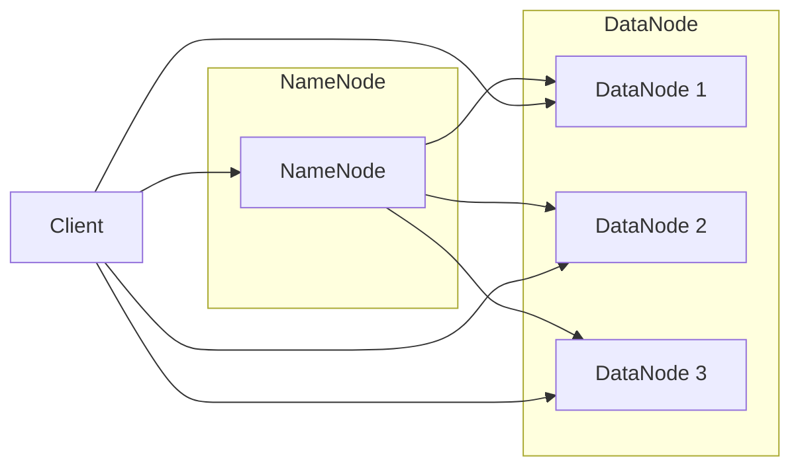

# 【AI大数据计算原理与代码实例讲解】HDFS

作者：禅与计算机程序设计艺术

## 1. 背景介绍

### 1.1 大数据时代的数据存储挑战

随着互联网、物联网、移动互联网等技术的快速发展，全球数据量正以爆炸式的速度增长，人类社会已经步入大数据时代。海量数据的存储、处理和分析对传统的 IT 架构和技术提出了严峻挑战，传统的集中式存储系统难以满足大数据的存储需求，主要体现在以下几个方面：

* **存储容量有限:** 传统存储系统通常采用集中式存储架构，存储容量受限于单个存储设备的容量，难以满足海量数据的存储需求。
* **扩展性差:** 当数据量不断增长时，传统存储系统需要进行硬件升级或更换，扩展成本高昂且效率低下。
* **可靠性不足:** 集中式存储系统存在单点故障风险，一旦存储设备出现故障，将导致数据丢失或无法访问，可靠性难以保障。

### 1.2 分布式文件系统应运而生

为了应对大数据时代的存储挑战，分布式文件系统应运而生。分布式文件系统将数据分散存储在多个存储节点上，通过网络连接形成一个逻辑上的统一存储空间，具有以下优势：

* **高容量:** 分布式文件系统可以整合多个存储节点的存储资源，提供海量的存储容量。
* **高可扩展性:** 通过增加存储节点，可以方便地扩展存储容量，满足数据不断增长的需求。
* **高可靠性:** 分布式文件系统采用数据冗余存储机制，即使部分存储节点出现故障，数据也不会丢失，保证了数据的高可靠性。

### 1.3 HDFS：Hadoop 分布式文件系统

HDFS (Hadoop Distributed File System) 是 Apache Hadoop 生态系统中的一个核心组件，是一种设计用于在商用硬件上运行的分布式文件系统。HDFS 具有高容错性、高吞吐量、高可扩展性等特点，非常适合存储大规模数据集。

## 2. 核心概念与联系

### 2.1 HDFS 架构

HDFS 采用 Master/Slave 架构，主要由 NameNode、DataNode 和 Client 三种角色组成，如下图所示：



* **NameNode:**  是 HDFS 集群的主节点，负责管理文件系统的命名空间、数据块的映射关系以及数据块副本的存放位置等元数据信息。NameNode 以文件形式将这些元数据持久化存储在本地磁盘上，为了保证元数据的可靠性，通常会配置一个 Secondary NameNode 来辅助 NameNode 进行元数据的备份。
* **DataNode:** 是 HDFS 集群的从节点，负责存储实际的数据块。每个数据块默认大小为 128MB，DataNode 会定期向 NameNode 发送心跳信息，报告自身状态和存储的数据块信息。
* **Client:** 是 HDFS 的客户端，用户通过 Client 与 HDFS 集群进行交互，例如上传文件、下载文件、查看文件目录等操作。

### 2.2 数据组织形式

HDFS 将文件存储为数据块的集合，每个数据块默认大小为 128MB。为了保证数据的高可靠性，HDFS 会将每个数据块复制多份（默认 3 份）存储在不同的 DataNode 上。

### 2.3 数据读写流程

* **数据写入流程:**
    1. Client 将文件上传到 HDFS 时，首先向 NameNode 请求上传数据块。
    2. NameNode 根据数据块副本存放策略选择合适的 DataNode 节点，并将这些 DataNode 节点信息返回给 Client。
    3. Client 将数据块写入到第一个 DataNode 节点，第一个 DataNode 节点接收数据后，将数据块复制到第二个 DataNode 节点，以此类推，直到所有副本写入完成。
    4. 所有 DataNode 节点写入完成后，向 NameNode 发送数据块写入成功的确认信息。
* **数据读取流程:**
    1. Client 向 NameNode 请求下载文件。
    2. NameNode 根据文件与数据块的映射关系，找到存储该文件数据块的 DataNode 节点信息，并将这些 DataNode 节点信息返回给 Client。
    3. Client 从距离最近的 DataNode 节点读取数据块，如果某个 DataNode 节点出现故障，Client 会自动切换到其他 DataNode 节点读取数据块。

## 3. 核心算法原理具体操作步骤

### 3.1 数据块存放策略

HDFS 采用机架感知的数据块存放策略，将数据块尽可能均匀地分布在不同的机架上，以提高数据访问效率和可靠性。具体步骤如下：

1. 将 HDFS 集群中的所有 DataNode 节点按照网络拓扑结构划分为不同的机架。
2. 第一个数据块副本存放在 Client 所在的机架上的 DataNode 节点上。
3. 第二个数据块副本存放在与第一个数据块副本不同的机架上的 DataNode 节点上。
4. 第三个数据块副本存放在与第二个数据块副本相同机架上的不同 DataNode 节点上。

### 3.2 数据块副本管理

HDFS 通过心跳机制和数据块校验机制来保证数据块副本的一致性和完整性。

* **心跳机制:** DataNode 节点会定期向 NameNode 发送心跳信息，报告自身状态和存储的数据块信息。如果 NameNode 在一段时间内没有收到某个 DataNode 节点的心跳信息，则认为该 DataNode 节点已经失效，NameNode 会将该 DataNode 节点从集群中移除，并启动数据块副本的重建机制，将失效 DataNode 节点上的数据块复制到其他 DataNode 节点上。
* **数据块校验机制:**  DataNode 节点会定期对存储的数据块进行校验，如果发现数据块损坏，会向 NameNode 报告，NameNode 会启动数据块副本的修复机制，从其他 DataNode 节点复制一份完整的数据块到该 DataNode 节点上。

## 4. 数学模型和公式详细讲解举例说明

### 4.1 数据块副本数量计算公式

假设 HDFS 集群中有 N 个 DataNode 节点，数据块副本数量为 R，则 HDFS 集群最多可以容忍 (R-1) 个 DataNode 节点失效。

例如，如果 HDFS 集群中有 3 个 DataNode 节点，数据块副本数量为 3，则 HDFS 集群最多可以容忍 2 个 DataNode 节点失效。

### 4.2 数据块存放策略计算公式

假设 HDFS 集群中有 M 个机架，每个机架上有 N 个 DataNode 节点，数据块副本数量为 R，则 HDFS 集群中数据块的存放策略如下：

* 第一个数据块副本存放在 Client 所在的机架上的 DataNode 节点上。
* 第二个数据块副本存放在与第一个数据块副本不同的机架上的 DataNode 节点上。
* 第三个数据块副本存放在与第二个数据块副本相同机架上的不同 DataNode 节点上。

例如，如果 HDFS 集群中有 3 个机架，每个机架上有 2 个 DataNode 节点，数据块副本数量为 3，则 HDFS 集群中数据块的存放策略如下：

* 第一个数据块副本存放在 Client 所在的机架上的 DataNode 节点上。
* 第二个数据块副本存放在与第一个数据块副本不同的机架上的 DataNode 节点上。
* 第三个数据块副本存放在与第二个数据块副本相同机架上的不同 DataNode 节点上。

## 5. 项目实践：代码实例和详细解释说明

### 5.1 Java API 操作 HDFS

```java
import org.apache.hadoop.conf.Configuration;
import org.apache.hadoop.fs.FileSystem;
import org.apache.hadoop.fs.Path;
import java.io.IOException;

public class HdfsDemo {

    public static void main(String[] args) throws IOException {
        // 创建 Configuration 对象，用于配置 HDFS 客户端
        Configuration conf = new Configuration();
        conf.set("fs.defaultFS", "hdfs://namenode:9000");

        // 创建 FileSystem 对象，用于操作 HDFS 文件系统
        FileSystem fs = FileSystem.get(conf);

        // 上传文件到 HDFS
        Path srcPath = new Path("/local/path/to/file");
        Path dstPath = new Path("/hdfs/path/to/file");
        fs.copyFromLocalFile(srcPath, dstPath);

        // 下载文件从 HDFS
        fs.copyToLocalFile(dstPath, srcPath);

        // 删除 HDFS 文件
        fs.delete(dstPath, true);

        // 关闭 FileSystem 对象
        fs.close();
    }
}
```

### 5.2 Python API 操作 HDFS

```python
from  pyhdfs  import  HdfsClient

# 创建 HdfsClient 对象，用于操作 HDFS 文件系统
client  =  HdfsClient(hosts='namenode:9000')

# 上传文件到 HDFS
client.copy_from_local('/local/path/to/file', '/hdfs/path/to/file')

# 下载文件从 HDFS
client.copy_to_local('/hdfs/path/to/file', '/local/path/to/file')

# 删除 HDFS 文件
client.delete('/hdfs/path/to/file')
```

## 6. 实际应用场景

HDFS 作为一种高可靠、高可扩展的分布式文件系统，在众多领域得到广泛应用，例如：

* **大数据存储:**  HDFS 可以存储海量的结构化、半结构化和非结构化数据，例如日志文件、传感器数据、社交媒体数据等。
* **数据仓库:**  HDFS 可以作为数据仓库的底层存储系统，用于存储企业级数据，并支持高并发的数据分析和查询。
* **机器学习:** HDFS 可以存储机器学习的训练数据集和模型文件，并支持分布式机器学习算法的训练和部署。

## 7. 总结：未来发展趋势与挑战

随着大数据应用的不断深入，HDFS 作为一种重要的基础设施软件，未来将面临以下发展趋势和挑战：

* **更高的性能和可扩展性:**  随着数据量的不断增长，HDFS 需要不断提升性能和可扩展性，以满足日益增长的数据存储和处理需求。
* **更丰富的数据管理功能:**  HDFS 需要提供更丰富的数据管理功能，例如数据生命周期管理、数据安全和隐私保护等。
* **与云计算平台的深度融合:** 随着云计算的快速发展，HDFS 需要与云计算平台进行深度融合，提供更加灵活和弹性的存储服务。

## 8. 附录：常见问题与解答

### 8.1 HDFS 如何保证数据的高可靠性？

HDFS 通过数据块副本机制、心跳机制和数据块校验机制来保证数据的高可靠性。

### 8.2 HDFS 如何实现数据的高可扩展性？

HDFS 通过 Master/Slave 架构和数据块存放策略来实现数据的高可扩展性。

### 8.3 HDFS 与传统文件系统有什么区别？

HDFS 是分布式文件系统，而传统文件系统是集中式文件系统。HDFS 具有高容错性、高吞吐量、高可扩展性等特点，而传统文件系统不具备这些特点。
