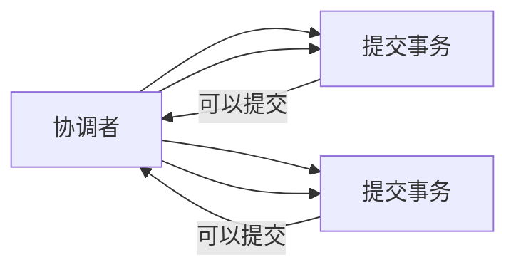
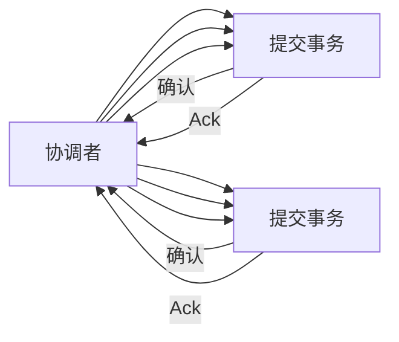

# 【AI 大数据计算原理与代码实例讲解】事务

## 1. 背景介绍

### 1.1 大数据时代的数据一致性挑战

随着互联网、物联网等技术的快速发展，全球数据量呈爆炸式增长，大数据时代已经到来。在海量数据的存储、处理和分析过程中，如何保证数据的**一致性**成为了一个巨大的挑战。尤其是在分布式数据库和分布式计算领域，由于数据的分片存储和并发操作，数据一致性问题更加突出。

### 1.2 事务的概念和作用

**事务（Transaction）**是数据库系统中非常重要的概念，它指的是一组逻辑操作单元，这些操作要么全部成功执行，要么全部失败回滚，从而保证数据的一致性。

简单来说，事务就像我们现实生活中的“原子操作”，例如银行转账，必须保证转账操作的原子性，即要么转账成功，要么转账失败，不会出现部分转账成功的情况。

### 1.3 事务的特性 ACID

事务具有四个重要的特性，即 ACID：

*   **原子性（Atomicity）**：事务是一个不可分割的工作单元，事务中的所有操作要么全部成功，要么全部失败回滚。
*   **一致性（Consistency）**：事务执行前后，数据都必须处于一种合法的、一致的状态。
*   **隔离性（Isolation）**：多个事务并发执行时，各个事务之间互不干扰，一个事务的执行不会受到其他事务的影响。
*   **持久性（Durability）**：一旦事务提交，其对数据的修改就会永久保存到数据库中，即使系统发生故障，修改后的数据也不会丢失。

## 2. 核心概念与联系

### 2.1 事务管理器（Transaction Manager）

事务管理器是管理事务的核心组件，它负责协调和管理事务的执行过程，包括：

*   开始事务
*   提交事务
*   回滚事务
*   监控事务的执行状态

### 2.2 资源管理器（Resource Manager）

资源管理器负责管理具体的资源，例如数据库连接、消息队列等。事务管理器需要与资源管理器进行交互，以实现对资源的访问和操作。

### 2.3 事务日志（Transaction Log）

事务日志记录了事务执行过程中的所有操作，包括操作类型、操作数据、操作时间等信息。事务日志是保证事务持久性的重要机制，当系统发生故障时，可以通过事务日志进行数据恢复。

### 2.4 并发控制（Concurrency Control）

并发控制是指多个事务同时访问共享资源时，如何保证数据的一致性。常见的并发控制机制包括：

*   **乐观锁（Optimistic Locking）**
*   **悲观锁（Pessimistic Locking）**
*   **时间戳排序（Timestamp Ordering）**

## 3. 核心算法原理具体操作步骤

### 3.1 两阶段提交协议（Two-Phase Commit Protocol，2PC）

两阶段提交协议是一种常用的分布式事务解决方案，它将事务的提交过程分为两个阶段：

*   **准备阶段（Prepare Phase）**：协调者向所有参与者发送准备请求，询问是否可以提交事务。参与者接收到请求后，执行事务操作，并将执行结果写入本地事务日志，但并不提交事务。
*   **提交阶段（Commit Phase）**：如果所有参与者都回复“可以提交”，则协调者向所有参与者发送提交请求，参与者提交本地事务；否则，协调者向所有参与者发送回滚请求，参与者回滚本地事务。

**2PC 协议流程图：**



### 3.2 三阶段提交协议（Three-Phase Commit Protocol，3PC）

三阶段提交协议是对两阶段提交协议的改进，它增加了超时机制，以解决两阶段提交协议中可能出现的阻塞问题。

**3PC 协议流程图：**



## 4. 数学模型和公式详细讲解举例说明

### 4.1 并发控制中的锁机制

**锁（Lock）**是一种用于控制并发访问共享资源的机制。根据锁的粒度，可以分为：

*   **表锁（Table Lock）**：对整张表进行加锁。
*   **行锁（Row Lock）**：对表中的某一行或多行进行加锁。

**锁的类型：**

*   **共享锁（Shared Lock，S Lock）**：允许多个事务同时读取共享资源，但不允许任何事务修改共享资源。
*   **排他锁（Exclusive Lock，X Lock）**：只允许一个事务访问共享资源，其他事务必须等待该事务释放锁后才能访问。

### 4.2 事务隔离级别

**事务隔离级别（Transaction Isolation Level）**定义了事务之间的隔离程度，常见的隔离级别包括：

*   **读未提交（Read Uncommitted）**：允许事务读取未提交的数据，可能导致脏读、幻读和不可重复读问题。
*   **读已提交（Read Committed）**：只允许事务读取已提交的数据，可以解决脏读问题，但仍然可能出现幻读和不可重复读问题。
*   **可重复读（Repeatable Read）**：保证一个事务在多次读取同一数据时，得到的结果是一致的，可以解决脏读和不可重复读问题，但仍然可能出现幻读问题。
*   **串行化（Serializable）**：最高的隔离级别，所有事务串行执行，可以解决所有并发问题，但性能较低。

## 5. 项目实践：代码实例和详细解释说明

### 5.1 使用 Spring Boot 实现事务管理

```java
@Configuration
@EnableTransactionManagement
public class TransactionConfig {

    @Bean
    public PlatformTransactionManager txManager(DataSource dataSource) {
        return new DataSourceTransactionManager(dataSource);
    }
}

@Service
public class UserServiceImpl implements UserService {

    @Autowired
    private UserMapper userMapper;

    @Transactional
    @Override
    public void transferMoney(Long fromUserId, Long toUserId, BigDecimal amount) {
        // 检查账户余额
        User fromUser = userMapper.selectById(fromUserId);
        if (fromUser.getBalance().compareTo(amount) < 0) {
            throw new RuntimeException("账户余额不足");
        }
        User toUser = userMapper.selectById(toUserId);

        // 更新账户余额
        fromUser.setBalance(fromUser.getBalance().subtract(amount));
        userMapper.updateById(fromUser);
        toUser.setBalance(toUser.getBalance().add(amount));
        userMapper.updateById(toUser);
    }
}
```

**代码解释：**

*   `@EnableTransactionManagement` 注解开启 Spring Boot 的事务管理功能。
*   `PlatformTransactionManager` 接口定义了事务管理器的抽象，`DataSourceTransactionManager` 是 Spring 提供的基于 JDBC 的事务管理器实现。
*   `@Transactional` 注解用于标记需要进行事务管理的方法，Spring 会自动为该方法添加事务控制逻辑。
*   在 `transferMoney()` 方法中，我们首先检查账户余额，如果余额不足则抛出异常，事务回滚；否则，更新账户余额，并提交事务。

### 5.2 使用 Redis 实现分布式锁

```java
public class RedisLock {

    private Jedis jedis;

    public RedisLock(Jedis jedis) {
        this.jedis = jedis;
    }

    public boolean tryLock(String key, String value, int expireTime) {
        String result = jedis.set(key, value, "NX", "EX", expireTime);
        return "OK".equals(result);
    }

    public void unlock(String key, String value) {
        String script = "if redis.call('get', KEYS[1]) == ARGV[1] then return redis.call('del', KEYS[1]) else return 0 end";
        jedis.eval(script, Collections.singletonList(key), Collections.singletonList(value));
    }
}
```

**代码解释：**

*   `tryLock()` 方法使用 Redis 的 `set()` 命令实现分布式锁的获取，`NX` 参数表示只有当 key 不存在时才设置值，`EX` 参数设置 key 的过期时间。
*   `unlock()` 方法使用 Lua 脚本实现分布式锁的释放，只有当 key 对应的 value 与传入的 value 相同时才删除 key。

## 6. 实际应用场景

### 6.1 电商平台订单系统

在电商平台中，订单系统需要保证订单创建、支付、发货等操作的数据一致性，可以使用事务机制来保证订单数据的原子性和一致性。

### 6.2 金融系统转账业务

在金融系统中，转账业务需要保证转账操作的原子性和一致性，可以使用两阶段提交协议或三阶段提交协议来实现分布式事务。

### 6.3 分布式缓存一致性

在分布式缓存系统中，可以使用分布式锁来保证缓存数据的一致性，例如使用 Redis 实现分布式锁。

## 7. 总结：未来发展趋势与挑战

### 7.1 分布式事务的新挑战

随着微服务架构的流行，分布式事务面临着新的挑战，例如：

*   **服务之间的调用关系更加复杂**
*   **数据一致性更加难以保证**
*   **性能问题更加突出**

### 7.2 新技术的发展方向

为了应对这些挑战，分布式事务技术也在不断发展，例如：

*   **基于消息队列的最终一致性方案**
*   **基于分布式一致性算法的解决方案**
*   **无锁编程模型**

## 8. 附录：常见问题与解答

### 8.1 什么是脏读？

脏读是指一个事务读取了另一个事务未提交的数据。

**例如：**

*   事务 A 读取了数据 X 的值为 100。
*   事务 B 将数据 X 的值修改为 200，但尚未提交事务。
*   事务 A 再次读取数据 X 的值，发现值变成了 200，但实际上这个值是事务 B 未提交的脏数据。

### 8.2 什么是不可重复读？

不可重复读是指一个事务在多次读取同一数据时，得到的结果不一致。

**例如：**

*   事务 A 读取了数据 X 的值为 100。
*   事务 B 将数据 X 的值修改为 200，并提交了事务。
*   事务 A 再次读取数据 X 的值，发现值变成了 200，与第一次读取的结果不一致。

### 8.3 什么是幻读？

幻读是指一个事务在读取数据时，两次读取的结果集不同，例如第一次读取时没有数据，第二次读取时出现了数据。

**例如：**

*   事务 A 读取了所有年龄大于 18 岁的用户信息。
*   事务 B 插入了一条年龄为 19 岁的用户信息，并提交了事务。
*   事务 A 再次读取所有年龄大于 18 岁的用户信息，发现结果集中多了一条数据，这就是幻读。