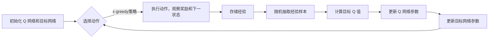

# 一切皆是映射：DQN在工业自动化中的应用：挑战与机遇

作者：禅与计算机程序设计艺术

## 1. 背景介绍

### 1.1 工业自动化的演进与挑战

工业自动化经历了从机械化、电气化到信息化的三个阶段，正在迈向以智能化为核心的工业4.0时代。在这个过程中，控制系统需要处理越来越复杂的任务，例如：

* **环境感知与建模**：准确感知和建模复杂的工业环境，包括各种传感器数据、设备状态以及外部因素的影响。
* **实时决策与优化**：根据实时环境信息和生产目标，做出快速、准确的决策，并对生产过程进行优化。
* **自主学习与适应**：面对不断变化的生产环境和需求，控制系统需要具备自主学习和适应能力，以提高生产效率和产品质量。

传统的基于规则和模型的控制方法难以满足这些需求，而人工智能，特别是强化学习，为解决这些挑战提供了新的思路。

### 1.2 强化学习与DQN

强化学习是一种机器学习方法，它使智能体能够通过与环境交互来学习最佳行为策略。智能体通过尝试不同的动作并观察环境的反馈（奖励或惩罚），逐步调整其策略以最大化长期累积奖励。

深度Q网络（DQN）是一种结合了深度学习和Q学习的强化学习算法。它使用深度神经网络来近似Q函数，Q函数用于评估在特定状态下采取特定行动的长期价值。DQN通过最小化预测Q值和目标Q值之间的差异来训练神经网络，从而学习到最优策略。

### 1.3 DQN在工业自动化中的优势

DQN作为一种model-free的强化学习算法，特别适合应用于工业自动化领域，因为它具有以下优势：

* **无需精确的系统模型**：DQN可以从与环境的交互中学习，而不需要预先知道系统的精确数学模型。这对于建模复杂、非线性的工业过程非常重要。
* **端到端学习**：DQN可以学习从原始传感器数据到控制命令的端到端映射，无需人工设计特征或规则。
* **自适应性强**：DQN可以根据环境变化动态调整策略，适应新的工况和任务。

## 2. 核心概念与联系

### 2.1 强化学习的基本要素

* **智能体（Agent）**：与环境交互并做出决策的学习主体。
* **环境（Environment）**：智能体所处的外部世界，智能体的行为会影响环境状态。
* **状态（State）**：描述环境在特定时刻的信息。
* **动作（Action）**：智能体可以采取的操作。
* **奖励（Reward）**：环境对智能体动作的反馈，用于指导智能体学习。
* **策略（Policy）**：智能体根据当前状态选择动作的规则。
* **价值函数（Value Function）**：用于评估状态或状态-动作对的长期价值。

### 2.2 DQN的关键组成部分

* **经验回放（Experience Replay）**：存储智能体与环境交互的经验（状态、动作、奖励、下一状态），用于训练神经网络。
* **目标网络（Target Network）**：用于计算目标Q值，提高训练稳定性。
* **ε-greedy策略**：在探索和利用之间取得平衡，以避免陷入局部最优。

## 3. DQN算法原理与操作步骤

### 3.1 算法流程图



### 3.2 具体操作步骤

1. **初始化Q网络和目标网络**：使用随机权重初始化两个相同结构的神经网络，分别作为Q网络和目标网络。
2. **选择动作**：根据当前状态和ε-greedy策略选择要执行的动作。
3. **执行动作，观察奖励和下一状态**：将选择的动作应用于环境，并观察环境返回的奖励和下一状态。
4. **存储经验**：将当前状态、动作、奖励和下一状态存储到经验回放缓冲区中。
5. **随机抽取经验样本**：从经验回放缓冲区中随机抽取一批经验样本。
6. **计算目标Q值**：使用目标网络计算目标Q值，目标Q值表示在下一状态采取最优动作所能获得的长期价值。
7. **更新Q网络参数**：使用梯度下降算法更新Q网络的参数，使预测Q值更接近目标Q值。
8. **更新目标网络参数**：定期将Q网络的参数复制到目标网络，以保持目标Q值的稳定性。

## 4. 数学模型和公式详细讲解举例说明

### 4.1 Q函数

Q函数用于评估在特定状态下采取特定行动的长期价值。它可以表示为：

$$Q(s, a) = \mathbb{E}[R_t + \gamma R_{t+1} + \gamma^2 R_{t+2} + ... | S_t = s, A_t = a]$$

其中：

* $s$ 表示当前状态
* $a$ 表示当前动作
* $R_t$ 表示在时间步 $t$ 获得的奖励
* $\gamma$ 表示折扣因子，用于平衡当前奖励和未来奖励的重要性

### 4.2  Bellman 方程

Bellman 方程描述了 Q 函数之间的递归关系：

$$Q(s, a) = \mathbb{E}[R + \gamma \max_{a'} Q(s', a') | S = s, A = a]$$

其中：

* $s'$ 表示下一状态
* $a'$ 表示在下一状态下可以采取的动作

### 4.3 DQN损失函数

DQN 使用以下损失函数来训练神经网络：

$$L(\theta) = \mathbb{E}[(R + \gamma \max_{a'} Q(s', a'; \theta^-) - Q(s, a; \theta))^2]$$

其中：

* $\theta$ 表示 Q 网络的参数
* $\theta^-$ 表示目标网络的参数

### 4.4 举例说明

假设有一个机器人需要学习如何抓取物体。环境的状态可以表示为机器人手臂的位置和物体的位姿，动作可以表示为机器人手臂的移动方向和抓取力度。奖励函数可以设计为：成功抓取物体时给予正奖励，抓取失败或碰撞到障碍物时给予负奖励。

DQN 可以通过与环境交互来学习抓取物体的策略。在训练过程中，DQN 会尝试不同的动作，并观察环境的反馈。根据奖励信号，DQN 会更新其 Q 函数，以学习到在不同状态下采取哪些动作可以获得最大的长期奖励。

## 5. 项目实践：代码实例和详细解释说明

```python
import gym
import random
import numpy as np
from collections import deque
from keras.models import Sequential
from keras.layers import Dense
from keras.optimizers import Adam

# 定义超参数
EPISODES = 1000
BATCH_SIZE = 32
GAMMA = 0.95
LEARNING_RATE = 0.001
EPSILON = 1
EPSILON_DECAY = 0.995
EPSILON_MIN = 0.01

# 创建环境
env = gym.make('CartPole-v0')

# 定义 DQN 模型
class DQNAgent:
    def __init__(self, state_size, action_size):
        self.state_size = state_size
        self.action_size = action_size
        self.memory = deque(maxlen=2000)
        self.gamma = GAMMA
        self.epsilon = EPSILON
        self.epsilon_decay = EPSILON_DECAY
        self.epsilon_min = EPSILON_MIN
        self.learning_rate = LEARNING_RATE
        self.model = self._build_model()
        self.target_model = self._build_model()
        self.update_target_model()

    def _build_model(self):
        model = Sequential()
        model.add(Dense(24, input_dim=self.state_size, activation='relu'))
        model.add(Dense(24,