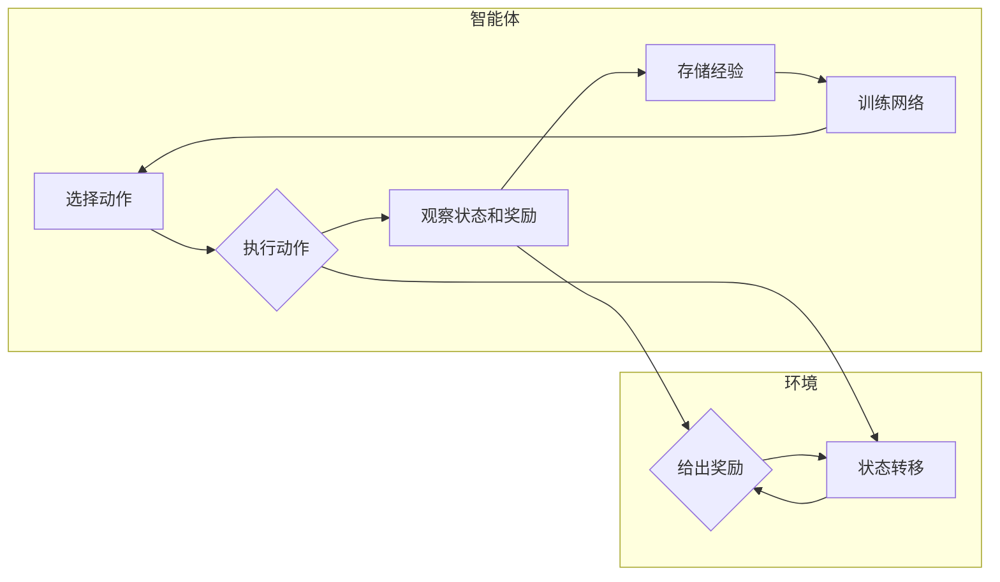

# 一切皆是映射：深入理解DQN的价值函数近似方法

作者：禅与计算机程序设计艺术

## 1. 背景介绍

### 1.1 强化学习的崛起

近年来，强化学习（Reinforcement Learning, RL）作为机器学习的一个重要分支，在人工智能领域取得了令人瞩目的成就。从 AlphaGo 击败围棋世界冠军，到 OpenAI Five 在 Dota 2 中战胜人类职业战队，强化学习展现出了巨大的潜力。其核心思想是让智能体（Agent）通过与环境进行交互，不断试错学习，最终找到最优策略，从而在复杂环境中完成特定任务。

### 1.2 值函数近似的必要性

在强化学习中，值函数（Value Function）扮演着至关重要的角色。它可以用来评估智能体在特定状态下采取某种行动的长期价值。传统的强化学习算法，如 Q-learning 和 SARSA，通常采用表格形式存储值函数，即为每个状态-动作对维护一个值。然而，这种方法在面对状态空间和动作空间巨大，甚至连续的复杂问题时，会遇到维度灾难问题。

为了解决这个问题，人们开始探索使用函数近似来表示值函数。函数近似是指使用一个参数化的函数来拟合值函数，从而将高维的状态-动作空间映射到一个低维的参数空间。这种方法不仅能够有效地解决维度灾难问题，还可以提高强化学习算法的泛化能力。

### 1.3 DQN 的诞生与发展

深度 Q 网络（Deep Q-Network, DQN）是第一个成功将深度学习与强化学习相结合的算法，它利用深度神经网络来近似值函数，并在 Atari 游戏等领域取得了突破性进展。DQN 的出现，标志着深度强化学习（Deep Reinforcement Learning, DRL）时代的到来。

## 2. 核心概念与联系

### 2.1 强化学习的基本要素

在深入探讨 DQN 的价值函数近似方法之前，我们先来回顾一下强化学习的基本要素：

* **智能体（Agent）**:  与环境交互并做出决策的主体。
* **环境（Environment）**:  智能体所处的外部世界，包括状态、动作和奖励等。
* **状态（State）**:  描述环境在某一时刻的特征信息。
* **动作（Action）**:  智能体在特定状态下可以采取的操作。
* **奖励（Reward）**:  环境对智能体动作的反馈，用于指导智能体学习。
* **策略（Policy）**:  智能体根据当前状态选择动作的规则。
* **值函数（Value Function）**:  用于评估智能体在特定状态下采取某种行动的长期价值。

### 2.2 值函数与贝尔曼方程

值函数是强化学习的核心概念之一，它可以分为两种类型：

* **状态值函数（State Value Function）**:  表示智能体从某个状态 $s$ 出发，遵循策略 $\pi$，所能获得的期望累积奖励：

    $$V^{\pi}(s) = \mathbb{E}_{\pi}[G_t | S_t = s]$$

    其中，$G_t$ 表示从时刻 $t$ 开始的累积奖励，$\mathbb{E}_{\pi}$ 表示在策略 $\pi$ 下求期望。

* **状态-动作值函数（State-Action Value Function，Q 函数）**:  表示智能体在状态 $s$ 时采取动作 $a$，之后遵循策略 $\pi$，所能获得的期望累积奖励：

    $$Q^{\pi}(s, a) = \mathbb{E}_{\pi}[G_t | S_t = s, A_t = a]$$

值函数之间存在着递归关系，称为贝尔曼方程（Bellman Equation）：

$$V^{\pi}(s) = \sum_{a \in A} \pi(a|s) \sum_{s' \in S} p(s'|s, a) [r(s, a, s') + \gamma V^{\pi}(s')]$$

$$Q^{\pi}(s, a) = \sum_{s' \in S} p(s'|s, a) [r(s, a, s') + \gamma \sum_{a' \in A} \pi(a'|s') Q^{\pi}(s', a')]$$

其中，$p(s'|s, a)$ 表示在状态 $s$ 采取动作 $a$ 后，转移到状态 $s'$ 的概率，$r(s, a, s')$ 表示在状态 $s$ 采取动作 $a$ 后，转移到状态 $s'$ 所获得的奖励，$\gamma$ 是折扣因子，用于平衡当前奖励和未来奖励的重要性。

### 2.3 函数近似与深度神经网络

函数近似是指使用一个参数化的函数来拟合目标函数。在强化学习中，我们可以使用函数近似来表示值函数。假设我们使用一个参数为 $\theta$ 的函数 $Q(s, a; \theta)$ 来近似状态-动作值函数 $Q^{\pi}(s, a)$，则我们的目标是找到一组参数 $\theta$，使得 $Q(s, a; \theta)$ 尽可能接近 $Q^{\pi}(s, a)$。

深度神经网络（Deep Neural Network, DNN）是一种强大的函数近似器，它可以用来拟合各种复杂的函数。DQN 使用深度神经网络来近似状态-动作值函数，其输入是状态 $s$，输出是每个动作 $a$ 对应的 Q 值。

## 3. DQN 的核心算法原理与操作步骤

### 3.1 算法流程图



### 3.2 算法步骤

1. **初始化**: 初始化经验回放池（Experience Replay Buffer）和 Q 网络 $Q(s, a; \theta)$。

2. **循环**: 针对每一轮游戏：

    * **初始化游戏状态**: 获取初始状态 $s_1$。
    * **循环**: 针对游戏中的每一步骤：
        * **选择动作**:  根据 Q 网络 $Q(s, a; \theta)$，使用 ε-greedy 策略选择动作 $a_t$。
        * **执行动作**:  在环境中执行动作 $a_t$，得到新的状态 $s_{t+1}$ 和奖励 $r_t$。
        * **存储经验**:  将经验元组 $(s_t, a_t, r_t, s_{t+1})$ 存储到经验回放池中。
        * **训练网络**:  从经验回放池中随机抽取一批经验数据，使用梯度下降算法更新 Q 网络 $Q(s, a; \theta)$ 的参数 $\theta$。

3. **结束**: 当满足终止条件时，结束游戏。

### 3.3 关键技术解读

* **经验回放（Experience Replay）**:  将智能体与环境交互的经验存储起来，并在训练过程中随机抽取一部分经验数据进行学习。这样做可以打破数据之间的相关性，提高学习效率和稳定性。

* **目标网络（Target Network）**:  使用一个独立的网络（目标网络）来生成目标 Q 值，用于计算损失函数。目标网络的参数每隔一段时间从 Q 网络复制一次。这样做可以减少 Q 值的波动，提高算法的稳定性。

* **ε-greedy 策略**:  以一定的概率 ε 选择 Q 值最大的动作，以 1-ε 的概率随机选择动作。这样做可以在探索和利用之间取得平衡，避免智能体陷入局部最优解。

## 4. 数学模型和公式详细讲解举例说明

### 4.1 损失函数

DQN 使用均方误差（Mean Squared Error, MSE）作为损失函数，用于衡量 Q 网络预测的 Q 值与目标 Q 值之间的差距：

$$L(\theta) = \frac{1}{N} \sum_{i=1}^{N} (y_i - Q(s_i, a_i; \theta))^2$$

其中，$N$ 是批大小，$y_i$ 是目标 Q 值，$Q(s_i, a_i; \theta)$ 是 Q 网络预测的 Q 值。

目标 Q 值的计算方式如下：

$$y_i = 
\begin{cases}
r_i, & \text{如果 } s_{i+1} \text{ 是终止状态} \\
r_i + \gamma \max_{a'} Q(s_{i+1}, a'; \theta^-), & \text{否则}
\end{cases}$$

其中，$\theta^-$ 是目标网络的参数。

### 4.2 梯度下降

DQN 使用梯度下降算法来更新 Q 网络的参数 $\theta$：

$$\theta \leftarrow \theta - \alpha \nabla_{\theta} L(\theta)$$

其中，$\alpha$ 是学习率，$\nabla_{\theta} L(\theta)$ 是损失函数 $L(\theta)$ 关于参数 $\theta$ 的梯度。

### 4.3 举例说明

假设我们有一个简单的迷宫游戏，智能体可以向上、下、左、右四个方向移动，目标是找到迷宫的出口。

* **状态空间**:  迷宫中每个格子的坐标。
* **动作空间**:  {上，下，左，右}。
* **奖励函数**:  到达出口时奖励 +1，其他情况奖励 0。

我们可以使用一个 2 层的神经网络来近似状态-动作值函数，输入是状态（格子的坐标），输出是每个动作对应的 Q 值。

假设智能体当前处于状态 (1, 1)，Q 网络预测的 Q 值为：

```
Q( (1, 1), 上 ) = 0.1
Q( (1, 1), 下 ) = 0.2
Q( (1, 1), 左 ) = 0.3
Q( (1, 1), 右 ) = 0.4
```

根据 ε-greedy 策略，假设智能体选择了向右移动，到达状态 (1, 2)，并获得奖励 0。

将经验元组 ((1, 1), 右, 0, (1, 2)) 存储到经验回放池中。

从经验回放池中随机抽取一批经验数据，计算目标 Q 值：

```
y = 0 + 0.9 * max{ Q((1, 2), 上), Q((1, 2), 下), Q((1, 2), 左), Q((1, 2), 右) }
```

假设目标网络预测的 Q 值为：

```
Q((1, 2), 上) = 0.5
Q((1, 2), 下) = 0.6
Q((1, 2), 左) = 0.7
Q((1, 2), 右) = 0.8
```

则目标 Q 值为：

```
y = 0 + 0.9 * 0.8 = 0.72
```

计算损失函数：

```
L = (0.72 - 0.4)^2 = 0.1024
```

使用梯度下降算法更新 Q 网络的参数。

## 5. 项目实践：代码实例和详细解释说明

```python
import gym
import tensorflow as tf
import numpy as np

# 创建迷宫环境
env = gym.make('FrozenLake-v1')

# 定义 Q 网络
class QNetwork(tf.keras.Model):
    def __init__(self, num_actions):
        super(QNetwork, self).__init__()
        self.dense1 = tf.keras.layers.Dense(16, activation='relu')
        self.dense2 = tf.keras.layers.Dense(num_actions)

    def call(self, state):
        x = self.dense1(state)
        return self.dense2(x)

# 定义 DQN 智能体
class DQNAgent:
    def __init__(self, env, gamma=0.99, epsilon=1.0, epsilon_min=0.01, epsilon_decay=0.995, learning_rate=0.001, batch_size=32, memory_size=10000):
        self.env = env
        self.gamma = gamma
        self.epsilon = epsilon
        self.epsilon_min = epsilon_min
        self.epsilon_decay = epsilon_decay
        self.learning_rate = learning_rate
        self.batch_size = batch_size
        self.memory_size = memory_size

        self.num_actions = env.action_space.n
        self.q_network = QNetwork(self.num_actions)
        self.target_network = QNetwork(self.num_actions)
        self.optimizer = tf.keras.optimizers.Adam(learning_rate=self.learning_rate)
        self.memory = []

    def remember(self, state, action, reward, next_state, done):
        self.memory.append((state, action, reward, next_state, done))
        if len(self.memory) > self.memory_size:
            self.memory.pop(0)

    def choose_action(self, state):
        if np.random.rand() <= self.epsilon:
            return self.env.action_space.sample()
        else:
            q_values = self.q_network(np.expand_dims(state, axis=0))
            return np.argmax(q_values[0])

    def learn(self):
        if len(self.memory) < self.batch_size:
            return

        batch = random.sample(self.memory, self.batch_size)
        states, actions, rewards, next_states, dones = zip(*batch)

        states = np.array(states)
        actions = np.array(actions)
        rewards = np.array(rewards)
        next_states = np.array(next_states)
        dones = np.array(dones)

        q_values = self.q_network(next_states)
        target_q_values = self.target_network(next_states)
        max_target_q_values = np.max(target_q_values, axis=1)

        targets = rewards + self.gamma * max_target_q_values * (1 - dones)

        with tf.GradientTape() as tape:
            q_values = self.q_network(states)
            q_values = tf.gather_nd(q_values, tf.stack([tf.range(self.batch_size), actions], axis=1))
            loss = tf.keras.losses.MSE(targets, q_values)

        gradients = tape.gradient(loss, self.q_network.trainable_variables)
        self.optimizer.apply_gradients(zip(gradients, self.q_network.trainable_variables))

        if self.epsilon > self.epsilon_min:
            self.epsilon *= self.epsilon_decay

    def update_target_network(self):
        self.target_network.set_weights(self.q_network.get_weights())

# 创建 DQN 智能体
agent = DQNAgent(env)

# 训练智能体
num_episodes = 1000
for episode in range(num_episodes):
    state = env.reset()
    done = False
    total_reward = 0

    while not done:
        action = agent.choose_action(state)
        next_state, reward, done, _ = env.step(action)
        agent.remember(state, action, reward, next_state, done)
        agent.learn()
        total_reward += reward
        state = next_state

    agent.update_target_network()

    print('Episode: {}, Total Reward: {}'.format(episode, total_reward))
```

**代码解释:**

1. 导入必要的库，包括 gym、TensorFlow 和 NumPy。
2. 创建迷宫环境，使用 OpenAI Gym 提供的 FrozenLake 环境。
3. 定义 Q 网络，使用 TensorFlow 的 Keras API 构建一个简单的两层神经网络。
4. 定义 DQN 智能体，实现经验回放、动作选择、学习和目标网络更新等功能。
5. 创建 DQN 智能体，设置超参数。
6. 训练智能体，在每个 episode 中，智能体与环境交互，收集经验，并使用经验数据训练 Q 网络。
7. 更新目标网络，将 Q 网络的参数复制到目标网络。
8. 打印训练过程中的奖励值。

## 6. 实际应用场景

DQN 及其变种算法在游戏、机器人控制、推荐系统等领域有着广泛的应用。

* **游戏**:  DQN 在 Atari 游戏、围棋、扑克等游戏领域取得了突破性进展，例如 DeepMind 的 AlphaGo 和 OpenAI Five。

* **机器人控制**:  DQN 可以用于机器人导航、抓取、操作等任务，例如 Google 的机器人手臂学习抓取物体。

* **推荐系统**:  DQN 可以用于个性化推荐、广告投放等任务，例如 YouTube 和 Netflix 的推荐系统。

## 7. 总结：未来发展趋势与挑战

DQN 是深度强化学习的里程碑式的工作，它为解决高维状态空间和动作空间的强化学习问题提供了一种有效的方法。未来，DQN 及其变种算法将在以下方向继续发展：

* **提高样本效率**:  DQN 通常需要大量的训练数据才能收敛，如何提高样本效率是未来研究的重点之一。

* **处理复杂环境**:  现实世界中的环境往往比游戏环境更加复杂，如何处理高维状态空间、连续动作空间、稀疏奖励等问题是未来研究的挑战之一。

