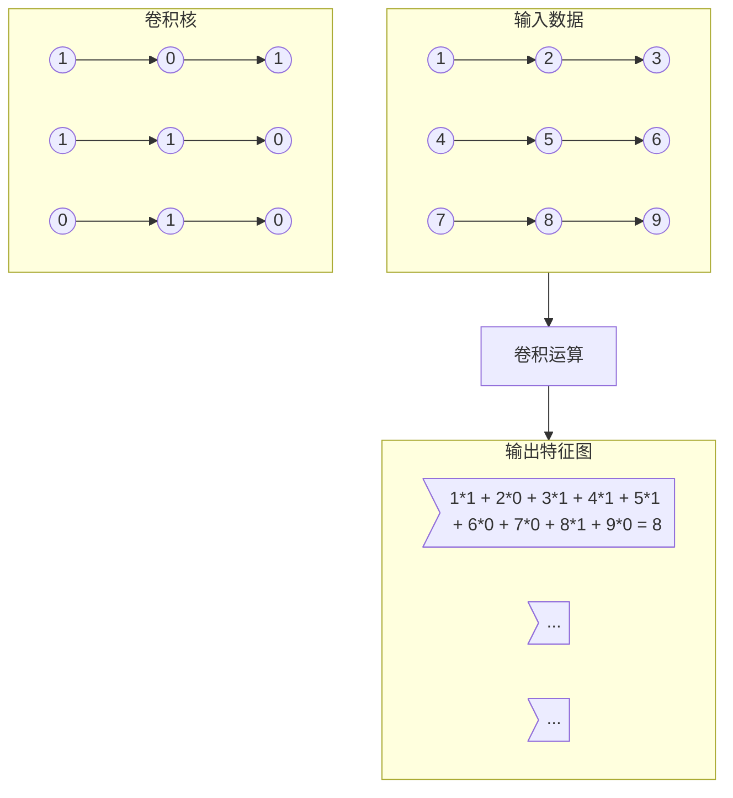
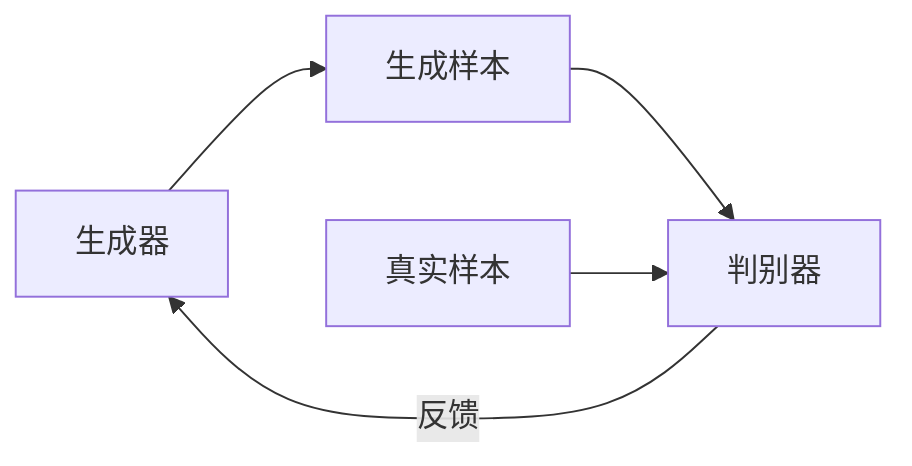

# 一切皆是映射：深度学习在艺术设计中的应用

## 1. 背景介绍

### 1.1 艺术设计与人工智能的融合

在过去的几十年里，人工智能(AI)技术取得了令人瞩目的进步,并逐渐渗透到了各个领域。艺术设计作为一个富有创造力和审美追求的领域,也开始与人工智能结合,尤其是近年来深度学习(Deep Learning)技术的飞速发展,为艺术设计带来了全新的可能性。

### 1.2 深度学习在艺术设计中的作用

深度学习作为机器学习的一个分支,通过构建深层神经网络模型,能够从海量数据中自动学习特征表示,并对复杂问题进行建模和预测。在艺术设计领域,深度学习可以用于:

- 图像处理和生成
- 风格迁移和创作辅助
- 3D模型构建
- 交互式设计系统
- 设计评估和优化

### 1.3 艺术设计AI的未来前景

随着技术的不断发展,艺术设计AI有望成为设计师的"超级助手",提高创作效率,激发创意灵感,甚至可能产生全新的艺术形式。但同时,我们也需要思考AI对艺术设计领域可能带来的伦理和社会影响。

## 2. 核心概念与联系

### 2.1 深度学习基础知识

#### 2.1.1 人工神经网络

人工神经网络(Artificial Neural Network, ANN)是一种受生物神经系统启发而设计的计算模型,由大量互连的神经元组成。每个神经元接收来自其他神经元或外部输入的信号,经过加权求和和非线性激活函数处理后,产生输出信号传递给下一层神经元。

#### 2.1.2 深度神经网络

深度神经网络(Deep Neural Network, DNN)是一种包含多个隐藏层的人工神经网络,能够从数据中自动学习多级特征表示。常见的深度网络结构包括卷积神经网络(CNN)、循环神经网络(RNN)、长短期记忆网络(LSTM)等。

#### 2.1.3 端到端学习

端到端学习(End-to-End Learning)是指将整个系统建模为一个统一的优化框架,使用大量训练数据直接学习映射规律,而不需要人工设计特征提取器和分类器等中间步骤。这种范式简化了系统设计,提高了性能,是深度学习的核心思想之一。

### 2.2 计算机视觉与图像处理

#### 2.2.1 图像表示

在计算机中,图像通常被表示为像素矩阵,每个像素由红绿蓝(RGB)三个颜色通道的值构成。处理图像时,需要将其转换为数值张量的形式输入神经网络。

#### 2.2.2 卷积神经网络

卷积神经网络(Convolutional Neural Network, CNN)是一种专门用于处理网格结构数据(如图像)的深度神经网络。它通过卷积层自动学习局部特征,最大池化层降低空间分辨率,全连接层整合高级语义特征,最终实现图像分类、检测、分割等任务。

#### 2.2.3 生成对抗网络

生成对抗网络(Generative Adversarial Network, GAN)由一个生成器网络和一个判别器网络组成,两者通过对抗训练的方式相互增强。生成器试图生成逼真的数据样本以欺骗判别器,而判别器则努力区分生成样本和真实样本。GAN可以用于图像生成、风格迁移等艺术设计任务。

### 2.3 艺术设计AI的核心概念

#### 2.3.1 创意灵感

艺术设计AI不仅可以作为辅助工具提高效率,更重要的是激发设计师的创意灵感。通过生成大量不同风格的图像或3D模型,设计师可以获得新的视角和想法。

#### 2.3.2 协作智能

艺术设计AI与人工设计师之间应该是协作而非取代的关系。AI提供辅助功能,而创意构思和最终决策仍由人类掌控。这种人机协作模式可以发挥双方的优势,产生超越人工或纯AI的创作水平。

#### 2.3.3 无界艺术

深度学习技术为艺术设计带来了全新的可能性,打破了传统艺术形式的界限。未来,我们可能会看到基于算法的动态艺术、交互式艺术装置、虚拟现实艺术等全新艺术形式的出现。

## 3. 核心算法原理具体操作步骤

### 3.1 卷积神经网络

卷积神经网络(CNN)是计算机视觉和图像处理任务中最常用的深度学习模型。下面我们介绍其核心原理和操作步骤。

#### 3.1.1 卷积层

卷积层(Convolutional Layer)是CNN的核心组成部分,用于从输入数据(如图像)中提取局部特征。具体操作步骤如下:

1. 初始化一组可学习的卷积核(也称滤波器或权重核)
2. 在输入数据上滑动卷积核,对每个局部区域进行元素级乘积和求和,得到一个激活值
3. 对激活值应用非线性激活函数(如ReLU)
4. 将激活值填充到输出特征图的对应位置
5. 通过反向传播算法不断调整卷积核参数

卷积运算可以有效地提取输入数据的空间局部特征,并保持特征在空间上的拓扑关系不变。下面是一个二维卷积的示意图:



#### 3.1.2 池化层

池化层(Pooling Layer)通常与卷积层配合使用,目的是降低特征图的空间分辨率,从而减小计算量并提取局部区域的不变性特征。常见的池化操作包括最大池化(Max Pooling)和平均池化(Average Pooling)。

最大池化的操作步骤:

1. 在输入特征图上滑动一个小窗口(如2x2)
2. 对窗口内的值取最大值作为输出特征图的一个元素

下面是一个2x2最大池化的示意图:

```mermaid
graph TD
    subgraph 输入特征图
        i1((5)) --> i2((3)) --> i3((2)) --> i4((4))
        i5((1)) --> i6((4)) --> i7((1)) --> i8((7))
        i9((6)) --> i10((2)) --> i11((8)) --> i12((3))
        i13((4)) --> i14((6)) --> i15((3)) --> i16((5))
    end
    
    subgraph 输出特征图
        o1>max(5,3,1,4) = 5]
        o2>max(2,4,6,7) = 7]
        o3>max(8,3,3,5) = 8]
        o4>...]
    end
    
    输入特征图 --> 最大池化 --> 输出特征图
```

#### 3.1.3 全连接层

在CNN的最后几层通常使用全连接层(Fully Connected Layer),将前面卷积层和池化层提取的高级特征整合起来,进行分类或回归任务。全连接层的每个神经元与前一层的所有神经元相连,对应的权重参数需要通过反向传播算法进行训练。

全连接层的操作步骤:

1. 将前一层的特征图展平成一维向量
2. 对向量中的每个元素乘以对应的权重,并加上偏置项
3. 将加权和输入到激活函数(如Sigmoid或ReLU)
4. 重复以上步骤,直到得到最终的输出层

### 3.2 生成对抗网络

生成对抗网络(GAN)是一种通过对抗训练的方式学习数据分布的生成模型,广泛应用于图像生成、风格迁移等艺术设计任务。下面我们介绍其核心原理和操作步骤。

#### 3.2.1 基本框架

GAN由两个深度神经网络组成:生成器(Generator)和判别器(Discriminator)。它们相互对抗,生成器试图生成逼真的样本以欺骗判别器,而判别器则努力区分生成样本和真实样本。通过这种对抗训练过程,生成器逐步学习真实数据分布,最终能够生成高质量的样本输出。

下面是GAN的基本框架:



#### 3.2.2 生成器

生成器是GAN的核心部分,通常由一个上采样网络(如反卷积网络)或变分自编码器组成。它的输入是一个随机噪声向量,经过上采样和非线性变换后,输出一个与真实数据相似的样本。

生成器的训练目标是最大化判别器无法分辨生成样本和真实样本的概率,即最小化如下损失函数:

$$\underset{G}{\text{min}}\,V(D,G) = \mathbb{E}_{x\sim p_{\text{data}}(x)}[\text{log}D(x)] + \mathbb{E}_{z\sim p_z(z)}[\text{log}(1-D(G(z)))]$$

其中$G$是生成器网络,$D$是判别器网络,$z$是随机噪声向量,$p_{\text{data}}(x)$是真实数据分布,$p_z(z)$是噪声分布。

#### 3.2.3 判别器

判别器是一个二分类网络(如卷积网络),用于判断输入样本是真实样本还是生成样本。它的输入可以是真实数据样本或生成器生成的样本,输出是一个0到1之间的概率值,表示输入样本为真实样本的可能性。

判别器的训练目标是最大化正确分类真实样本和生成样本的概率,即最小化如下损失函数:

$$\underset{D}{\text{min}}\,V(D,G) = -\mathbb{E}_{x\sim p_{\text{data}}(x)}[\text{log}D(x)] - \mathbb{E}_{z\sim p_z(z)}[\text{log}(1-D(G(z)))]$$

#### 3.2.4 对抗训练

生成器和判别器通过下面的minimax游戏进行对抗训练:

$$\underset{G}{\text{min}}\,\underset{D}{\text{max}}\,V(D,G) = \mathbb{E}_{x\sim p_{\text{data}}(x)}[\text{log}D(x)] + \mathbb{E}_{z\sim p_z(z)}[\text{log}(1-D(G(z)))]$$

具体操作步骤如下:

1. 从真实数据分布$p_{\text{data}}(x)$和噪声分布$p_z(z)$分别采样出一批真实样本和噪声向量
2. 固定生成器$G$,更新判别器$D$使其能够更好地区分真实样本和生成样本
3. 固定判别器$D$,更新生成器$G$使其生成的样本能够更好地欺骗判别器
4. 重复以上步骤,直到模型收敛

通过这种对抗训练过程,生成器和判别器相互增强,生成器逐步学习真实数据分布,最终能够生成高度逼真的样本输出。

### 3.3 变分自编码器

变分自编码器(Variational Autoencoder, VAE)是一种基于深度学习的生成模型,常与GAN结合使用,用于图像生成和表示学习等任务。下面我们介绍其核心原理和操作步骤。

#### 3.3.1 基本框架

变分自编码器由两个主要部分组成:编码器(Encoder)和解码器(Decoder)。编码器将输入数据(如图像)映射