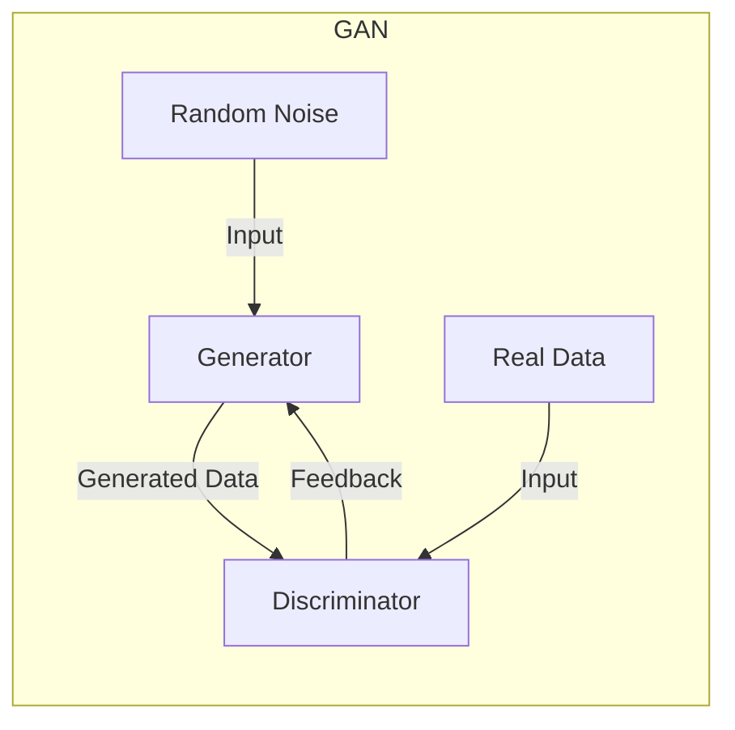

# 一切皆是映射：生成对抗网络(GAN)及其应用探索

## 1.背景介绍

### 1.1 生成式人工智能的兴起

在过去几年中,生成式人工智能(Generative AI)已经成为机器学习领域最令人兴奋和前景广阔的研究方向之一。生成式AI系统旨在从潜在的数据分布中生成新的、逼真的输出,而不是简单地对现有数据进行分类或回归。这种新兴技术的应用前景是广阔的,包括计算机视觉、自然语言处理、音乐创作等多个领域。

生成对抗网络(Generative Adversarial Networks, GANs)作为生成式AI的核心技术之一,自2014年被提出以来就备受关注。GANs的核心思想是训练两个相互对抗的神经网络 - 一个生成器网络(Generator)和一个判别器网络(Discriminator),通过它们的对抗训练过程来学习数据的真实分布,从而生成新的逼真数据样本。

### 1.2 GANs的重要意义

GANs的出现不仅为生成式AI注入了新的活力,更是对传统的discriminative模型提出了全新的挑战。在过去,大多数机器学习算法都是以判别式(discriminative)模型为主,旨在对给定输入进行分类或回归。而GANs则完全颠覆了这种思路,它们是生成式(generative)模型,目标是从底层的数据分布中"创造"新的输出。

GANs在多个领域展现出了巨大的潜力:

- 计算机视觉: 生成逼真的图像和视频
- 自然语言处理: 生成逼真的文本内容  
- 音乐创作: 生成新的音乐作品
- 药物发现: 生成潜在的新药分子结构
- ...

总的来说,GANs为人工智能系统赋予了"创造"的能力,这不仅具有重要的理论意义,更为人工智能的实际应用开辟了全新的可能性。

## 2.核心概念与联系

### 2.1 生成对抗网络的基本框架

生成对抗网络由两个神经网络模型组成:

1. **生成器(Generator)**: 接收随机噪声作为输入,并输出一个样本,旨在生成逼真的数据。
2. **判别器(Discriminator)**: 接收真实数据或生成器生成的数据作为输入,并输出一个概率分数,用于判断输入是真实数据还是生成数据。

生成器和判别器相互对抗的过程,可以形象地比喻为:

- 生成器是一个"骗子",它试图生成逼真的假数据来欺骗判别器。
- 判别器是一个"警察",它试图区分生成器生成的假数据和真实数据。

在训练过程中,生成器逐渐学习生成更加逼真的数据来欺骗判别器,而判别器也在不断提高鉴别能力来识别生成数据。通过这种对抗训练,GANs可以捕获数据的真实分布,并最终实现生成逼真样本的能力。



### 2.2 GANs与其他生成模型的区别

与传统的生成模型(如隐马尔可夫模型、自回归模型等)不同,GANs采用了一种全新的对抗训练方式,具有以下独特优势:

- **无需显式建模数据分布**: 传统生成模型需要对数据分布进行显式建模,而GANs则通过对抗训练隐式地学习数据分布。
- **可生成复杂高维数据**: 对于复杂的高维数据(如图像、音频等),显式建模分布是极其困难的,而GANs可以直接从数据中学习生成。
- **生成质量更优**: 相比其他生成模型,GANs生成的样本质量通常更加逼真、细节更加丰富。

然而,GANs也存在一些挑战,如训练不稳定、模式崩溃、评估困难等,这需要研究人员持续探索和改进算法。

## 3.核心算法原理具体操作步骤

### 3.1 GANs训练目标

在GANs中,生成器G和判别器D相互对抗,形成一个min-max博弈问题。训练的目标是找到一个纳什均衡,使得生成器G生成的数据分布 $p_g$ 与真实数据分布 $p_{data}$ 之间的差距最小,同时判别器D能够很好地区分 $p_g$ 和 $p_{data}$。

具体来说,GANs的训练目标可以表示为:

$$\min_G \max_D V(D,G) = \mathbb{E}_{x\sim p_{data}(x)}[\log D(x)] + \mathbb{E}_{z\sim p_z(z)}[\log(1-D(G(z)))]$$

其中:

- $G(z)$ 是生成器基于随机噪声 $z$ 生成的样本。
- $D(x)$ 是判别器对输入样本 $x$ 为真实数据的概率分数。
- $p_{data}$ 是真实数据的分布,而 $p_z$ 是随机噪声 $z$ 的分布(通常为高斯分布或均匀分布)。

直观地说,判别器D试图最大化能够正确识别真实数据和生成数据的概率,而生成器G则试图最小化判别器识别出生成数据的概率。通过这种对抗训练,GANs可以学习真实数据分布并生成逼真样本。

### 3.2 GANs训练算法

GANs的训练过程可以概括为以下步骤:

1. **初始化生成器G和判别器D**,通常使用神经网络模型并随机初始化参数。

2. **采样训练数据和随机噪声**,分别作为判别器D和生成器G的输入。
   - 真实数据样本 $x \sim p_{data}(x)$  
   - 随机噪声 $z \sim p_z(z)$

3. **训练判别器D**:
    a) 使用真实数据样本 $x$ 计算 $D(x)$,更新D使得 $\log D(x)$ 最大化。
    b) 使用生成器生成的样本 $G(z)$ 计算 $D(G(z))$,更新D使得 $\log(1-D(G(z)))$ 最大化。

4. **训练生成器G**:
    - 固定判别器D,更新生成器G使得 $\log(1-D(G(z)))$ 最小化,即让判别器D更难分辨生成的样本 $G(z)$ 是假的。

5. **重复3和4**,直到达到收敛条件(如最大训练轮数或其他指标)。

这个过程可以用如下伪代码总结:

```python
for num_epochs:
    # 训练判别器D
    for n_batches:
        # 采样真实数据和噪声
        real_samples = sample_real_data()
        noise = sample_noise()
        
        # 更新判别器参数
        d_loss = -log(D(real_samples)) - log(1 - D(G(noise)))
        d_loss.backward()
        optimizerD.step()
        
    # 训练生成器G 
    for n_batches:
        # 采样噪声
        noise = sample_noise()
        
        # 更新生成器参数
        g_loss = -log(D(G(noise)))  
        g_loss.backward()
        optimizerG.step()
```

需要注意的是,实际训练过程中还需要处理一些细节问题,如平衡生成器和判别器的训练、处理训练不稳定等,这需要一些技巧和调整。

## 4.数学模型和公式详细讲解举例说明

### 4.1 原始GAN的形式化描述

我们已经了解了GANs的基本思想和训练目标,现在让我们进一步探讨GANs的数学模型。

最初提出的GAN模型可以形式化地描述为:

给定真实数据 $x$ 的分布 $p_{data}(x)$,以及一个先验噪声分布 $p_z(z)$,生成器 $G$ 将噪声 $z$ 映射到生成数据 $G(z)$,而判别器 $D$ 则是一个二元分类器,它输出一个概率分数,用于判断输入样本是真实数据还是生成数据。

具体来说,判别器 $D$ 和生成器 $G$ 分别通过以下两个函数建模:

$$\begin{align*}
D(x) &= P(Y=1|X=x) \\
G(z) &= P(X=x|Z=z)
\end{align*}$$

其中:
- $D(x)$ 表示判别器判断输入 $x$ 为真实数据的概率。
- $G(z)$ 表示生成器生成样本 $x$ 的条件概率分布。

在训练过程中,GANs的目标是找到一个纳什均衡,即最小化判别器被欺骗的概率,同时最大化生成器欺骗判别器的能力。这可以表达为以下min-max优化问题:

$$\min_G \max_D V(D,G) = \mathbb{E}_{x\sim p_{data}(x)}[\log D(x)] + \mathbb{E}_{z\sim p_z(z)}[\log(1-D(G(z)))]$$

直观地说,判别器 $D$ 试图最大化能够正确识别真实数据和生成数据的概率,而生成器 $G$ 则试图最小化判别器识别出生成数据的概率。通过这种对抗训练,GANs可以学习真实数据分布并生成逼真样本。

### 4.2 改进的GAN目标函数

虽然原始GAN模型提出了一个全新的思路,但在实际训练中却存在一些困难,如训练不稳定、梯度消失等。研究人员随后提出了多种改进的GAN目标函数,以提高训练稳定性和生成质量。

#### 4.2.1 最大均值差异(Maximum Mean Discrepancy)

最大均值差异(Maximum Mean Discrepancy, MMD)是一种用于衡量两个分布差异的统计量。将MMD应用于GANs,可以将原始GAN目标函数改写为:

$$\min_G \max_D \mathbb{E}_{x\sim p_{data}}[D(x)] - \mathbb{E}_{z\sim p_z}[D(G(z))] - \lambda \mathbb{E}_{xx'}\left[\|D(x)-D(x')\|_\mathcal{H}^2\right]$$

其中 $\lambda$ 是一个权重参数, $\mathcal{H}$ 是再生核希尔伯特空间(Reproducing Kernel Hilbert Space, RKHS)。MMD目标函数通过最小化生成数据分布与真实数据分布之间的MMD距离,从而实现更稳定的训练。

#### 4.2.2 Wasserstein GAN

Wasserstein GAN(WGAN)则是基于地球移动(Earth Mover)距离,将GAN目标函数改写为:

$$\min_G \max_{D\in\mathcal{D}} \mathbb{E}_{x\sim p_{data}}[D(x)] - \mathbb{E}_{z\sim p_z}[D(G(z))]$$

其中 $\mathcal{D}$ 是1-Lipschitz连续函数的集合。WGAN通过约束判别器为1-Lipschitz连续函数,从而提供更稳定的梯度,改善了原始GAN的训练困难。

#### 4.2.3 其他改进

除了MMD-GAN和WGAN,研究人员还提出了许多其他改进的GAN变体,如LSGAN、DRAGAN、BEGAN等,它们通过修改目标函数或引入正则化项,旨在提高训练稳定性、缓解模式崩溃等问题。

需要说明的是,不同的GAN变体适用于不同的场景,在实际应用中需要根据具体问题选择合适的GAN模型和损失函数。总的来说,GANs的数学模型和目标函数是一个活跃的研究领域,仍在不断发展和完善中。

### 4.3 条件生成对抗网络

除了无条件生成之外,GANs还可以扩展到条件生成场景,即根据给定的条件信息生成相应的样本。这种条件生成对抗网络(Conditional GAN, CGAN)在很多应用中都有重要作用。

在CGAN中,生成器 $G$ 和判别器 $D$ 都会接收额外的条件信息 $y$ 作为输入。生成器的目标是根据噪声 $z$ 和条件 $y$ 生成样本 $