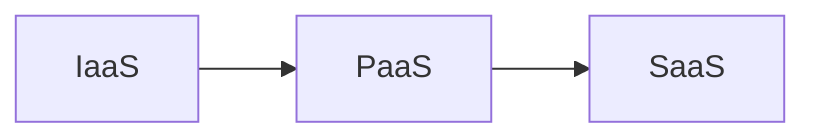

##  1. 背景介绍

### 1.1. 云计算的起源与发展

云计算的概念最早可以追溯到 20 世纪 60 年代，当时 John McCarthy 提出了“计算能力可能有一天会像公用事业一样通过电网销售”的设想。然而，直到 21 世纪初期，随着互联网技术的飞速发展、宽带网络的普及以及虚拟化技术的成熟，云计算才真正开始进入人们的视野，并迅速发展成为信息技术领域的一场革命。

2006 年，亚马逊推出了弹性计算云（Elastic Compute Cloud，EC2），标志着云计算时代的到来。随后，谷歌、微软、IBM 等 IT 巨头也纷纷加入云计算市场，推出了各自的云计算平台，如谷歌云平台（Google Cloud Platform，GCP）、微软 Azure 和 IBM 云。

### 1.2. 云计算的定义与特征

云计算是一种基于互联网的计算模式，它将大量的计算资源（包括服务器、存储、网络、软件和数据库等）整合在一起，形成一个巨大的资源池，用户可以通过网络按需访问和使用这些资源，就像使用水、电、煤气等公用设施一样方便。

云计算具有以下几个显著特征：

* **按需自助服务（On-demand self-service）：**用户可以根据自己的需求，随时随地通过网络自助获取所需的计算资源，无需与服务提供商进行人工交互。
* **广泛的网络接入（Broad network access）：**用户可以通过各种终端设备（如电脑、手机、平板电脑等）访问云服务，不受时间和地点的限制。
* **资源池化（Resource pooling）：**服务提供商将来自不同物理位置的计算资源整合到一起，形成一个巨大的资源池，用户可以按需访问和使用这些资源，而无需关心资源的具体物理位置。
* **快速弹性伸缩（Rapid elasticity）：**云计算平台可以根据用户的需求，快速地增加或减少计算资源，以满足用户业务的动态变化。
* **可计量的服务（Measured service）：**云计算平台可以对用户使用的计算资源进行计量，并根据实际使用量进行计费，使用户可以像使用水、电、煤气等公用设施一样，按量付费。

### 1.3. 云计算的优势与劣势

**优势：**

* **降低成本：**用户无需购买和维护昂贵的硬件设备，只需按需付费，可以有效降低 IT 成本。
* **提高效率：**云计算平台可以快速地提供所需的计算资源，缩短了应用部署和上线的时间，提高了工作效率。
* **增强灵活性：**用户可以根据自己的需求，随时随地访问和使用云服务，不受时间和地点的限制，增强了业务的灵活性。
* **提高安全性：**云计算平台通常拥有专业的安全团队和完善的安全措施，可以提供比传统 IT 环境更高的安全性。

**劣势：**

* **安全风险：**将数据存储在云端，可能会面临数据泄露、数据丢失等安全风险。
* **依赖性：**用户对云服务提供商的依赖性较高，一旦服务提供商出现故障，将会影响用户的业务运营。
* **可控性：**用户对云计算平台的控制权有限，可能会受到服务提供商的限制。
* **技术门槛：**使用云计算需要一定的技术门槛，企业需要具备一定的技术能力才能更好地利用云计算。


## 2. 核心概念与联系

### 2.1. 云计算服务模型

云计算服务模型是指云服务提供商为用户提供的不同层次的云服务，主要包括以下三种：

* **基础设施即服务（Infrastructure as a Service，IaaS）：**提供基础设施资源，如服务器、存储、网络等，用户可以在这些资源之上构建自己的应用程序和服务。
* **平台即服务（Platform as a Service，PaaS）：**提供应用程序开发和部署平台，用户可以在该平台上开发、测试、部署和管理自己的应用程序，而无需关心底层基础设施的管理。
* **软件即服务（Software as a Service，SaaS）：**提供可以直接使用的软件应用程序，用户可以通过网络访问和使用这些应用程序，而无需安装和维护软件。

#### 2.1.1. IaaS、PaaS 和 SaaS 的比较

| 服务模型 | 提供的资源 | 用户职责 | 举例 |
|---|---|---|---|
| IaaS | 服务器、存储、网络等基础设施资源 | 管理操作系统、中间件、应用程序和数据 | AWS EC2、阿里云 ECS、腾讯云 CVM |
| PaaS | 应用程序开发和部署平台 | 开发、测试、部署和管理应用程序 | AWS Beanstalk、阿里云 SAE、腾讯云 Web 应用防火墙 |
| SaaS | 可以直接使用的软件应用程序 | 使用应用程序 | Salesforce、Office 365、Google Workspace |

#### 2.1.2. IaaS、PaaS 和 SaaS 的联系

IaaS、PaaS 和 SaaS 三种服务模型之间存在着递进的关系，如下图所示：



IaaS 提供最底层的计算资源，PaaS 在 IaaS 的基础上提供了应用程序开发和部署平台，SaaS 则是在 PaaS 的基础上提供了可以直接使用的软件应用程序。

### 2.2. 云计算部署模型

云计算部署模型是指云计算平台的部署方式，主要包括以下四种：

* **公有云（Public Cloud）：**由第三方服务提供商运营的云计算平台，面向所有用户提供服务。
* **私有云（Private Cloud）：**由企业或组织内部构建和运营的云计算平台，仅供企业或组织内部使用。
* **混合云（Hybrid Cloud）：**将公有云和私有云结合在一起，用户可以根据自己的需求，选择将不同的应用程序部署在不同的云平台上。
* **社区云（Community Cloud）：**由多个具有共同目标的企业或组织共同构建和运营的云计算平台，仅供这些企业或组织使用。

#### 2.2.1. 公有云、私有云、混合云和社区云的比较

| 部署模型 | 所有者 | 用户 | 优势 | 劣势 |
|---|---|---|---|---|
| 公有云 | 第三方服务提供商 | 所有用户 | 成本低、部署快、弹性高 | 安全性、可控性 |
| 私有云 | 企业或组织内部 | 企业或组织内部 | 安全性高、可控性强 | 成本高、部署慢、弹性低 |
| 混合云 | 公有云和私有云 | 企业或组织内部 | 结合了公有云和私有云的优势 | 管理复杂度高 |
| 社区云 | 多个企业或组织 | 这些企业或组织 | 成本低、安全性高 | 可用性、灵活性 |

#### 2.2.2. 公有云、私有云、混合云和社区云的联系

公有云、私有云、混合云和社区云四种部署模型之间可以相互结合，形成更加灵活的云计算部署方案。

### 2.3. 虚拟化技术

虚拟化技术是云计算的核心技术之一，它可以将一台物理服务器虚拟化成多台虚拟服务器，每台虚拟服务器都可以独立运行不同的操作系统和应用程序，从而提高了硬件资源的利用率。

#### 2.3.1. 虚拟化的类型

* **服务器虚拟化：**将一台物理服务器虚拟化成多台虚拟服务器。
* **存储虚拟化：**将多个存储设备整合在一起，形成一个统一的存储池。
* **网络虚拟化：**将多个网络设备整合在一起，形成一个统一的网络资源池。

#### 2.3.2. 虚拟化的优势

* **提高资源利用率：**虚拟化技术可以将一台物理服务器虚拟化成多台虚拟服务器，从而提高了硬件资源的利用率。
* **降低成本：**虚拟化技术可以减少硬件设备的购买和维护成本。
* **提高灵活性：**虚拟化技术可以快速地创建和删除虚拟服务器，从而提高了 IT 环境的灵活性。
* **提高可用性：**虚拟化技术可以将虚拟服务器迁移到其他物理服务器上，从而提高了 IT 环境的可用性。


## 3. 核心算法原理具体操作步骤

### 3.1. 分布式存储

#### 3.1.1. 概念

分布式存储是指将数据分散存储在多台服务器上，而不是将所有数据存储在一台服务器上。这样做的好处是可以提高数据的可靠性、可用性和性能。

#### 3.1.2. 原理

分布式存储的核心原理是数据分片和数据冗余。

* **数据分片：**将数据分割成多个数据块，并将这些数据块存储在不同的服务器上。
* **数据冗余：**将同一份数据存储在多个服务器上，即使其中一台服务器出现故障，也不会导致数据丢失。

#### 3.1.3. 操作步骤

1. 将数据分割成多个数据块。
2. 将数据块存储在不同的服务器上。
3. 对数据进行冗余备份。
4. 当用户读取数据时，从多个服务器上读取数据块，并将这些数据块合并成完整的数据。

### 3.2. 分布式计算

#### 3.2.1. 概念

分布式计算是指将一个大型的计算任务分解成多个小的计算任务，并将这些小的计算任务分配给多台服务器进行处理，最后将所有服务器的计算结果合并成最终的结果。

#### 3.2.2. 原理

分布式计算的核心原理是任务分解和结果合并。

* **任务分解：**将一个大型的计算任务分解成多个小的计算任务。
* **结果合并：**将所有服务器的计算结果合并成最终的结果。

#### 3.2.3. 操作步骤

1. 将一个大型的计算任务分解成多个小的计算任务。
2. 将这些小的计算任务分配给多台服务器进行处理。
3. 当所有服务器完成计算后，将所有服务器的计算结果合并成最终的结果。

### 3.3. 虚拟化

#### 3.3.1. 概念

虚拟化技术是云计算的核心技术之一，它可以将一台物理服务器虚拟化成多台虚拟服务器，每台虚拟服务器都可以独立运行不同的操作系统和应用程序，从而提高了硬件资源的利用率。

#### 3.3.2. 原理

虚拟化的原理是在物理服务器和操作系统之间增加一个虚拟化层，该虚拟化层负责管理和分配物理服务器的硬件资源，并将这些硬件资源提供给虚拟服务器使用。

#### 3.3.3. 操作步骤

1. 在物理服务器上安装虚拟化软件。
2. 创建虚拟服务器。
3. 为虚拟服务器分配硬件资源。
4. 在虚拟服务器上安装操作系统和应用程序。


## 4. 数学模型和公式详细讲解举例说明

### 4.1. 云计算资源调度

云计算资源调度是指将用户的计算任务分配给合适的计算资源进行处理，以提高资源利用率、降低成本、保证服务质量。

#### 4.1.1. 排队论模型

排队论模型可以用来描述云计算资源调度过程中的任务到达、排队、服务和离开等现象。

##### 4.1.1.1. 模型参数

* $\lambda$：任务到达率，表示单位时间内到达的任务数量。
* $\mu$：服务率，表示单位时间内服务器可以处理的任务数量。
* $c$：服务器数量。
* $k$：系统容量，表示系统最多可以容纳的任务数量。

##### 4.1.1.2. 模型指标

* $L_q$：平均排队长度，表示系统中平均排队的任务数量。
* $W_q$：平均排队时间，表示任务在系统中平均排队的时间。
* $L_s$：平均系统长度，表示系统中平均的任务数量。
* $W_s$：平均逗留时间，表示任务在系统中平均逗留的时间。

##### 4.1.1.3. 模型公式

* $L_q = \frac{\lambda^2}{\mu(\mu c - \lambda)}$
* $W_q = \frac{L_q}{\lambda}$
* $L_s = L_q + \frac{\lambda}{\mu}$
* $W_s = W_q + \frac{1}{\mu}$

##### 4.1.1.4. 举例说明

假设一个云计算平台有 10 台服务器，每台服务器每秒可以处理 10 个任务，任务到达率为每秒 80 个任务。

则：

* $\lambda = 80$
* $\mu = 10$
* $c = 10$

代入公式可得：

* $L_q = \frac{80^2}{10(10 \times 10 - 80)} = 3.2$
* $W_q = \frac{3.2}{80} = 0.04$
* $L_s = 3.2 + \frac{80}{10} = 11.2$
* $W_s = 0.04 + \frac{1}{10} = 0.14$

#### 4.1.2. 博弈论模型

博弈论模型可以用来描述云计算资源调度过程中用户和服务提供商之间的利益博弈。

##### 4.1.2.1. 模型参数

* $N$：用户数量。
* $M$：资源类型数量。
* $R_i$：第 $i$ 种资源的总量。
* $d_{ij}$：用户 $i$ 对资源 $j$ 的需求量。
* $p_j$：资源 $j$ 的价格。

##### 4.1.2.2. 模型目标

* 用户的目标是最大化自己的效用函数，即最大化自己的收益减去自己的成本。
* 服务提供商的目标是最大化自己的收益。

##### 4.1.2.3. 模型求解

博弈论模型的求解方法有很多种，常用的方法包括纳什均衡、Stackelberg 均衡等。

##### 4.1.2.4. 举例说明

假设一个云计算平台上有 2 个用户和 2 种资源，资源 1 的总量为 10，资源 2 的总量为 20，用户的需求量和资源的价格如下表所示：

| 用户 | 资源 1 需求量 | 资源 2 需求量 |
|---|---|---|
| 用户 1 | 5 | 10 |
| 用户 2 | 3 | 15 |

| 资源 | 价格 |
|---|---|
| 资源 1 | 10 |
| 资源 2 | 5 |

则可以使用博弈论模型来求解用户和服务提供商的最优策略。

### 4.2. 云计算安全

云计算安全是指保护云计算环境中数据的机密性、完整性和可用性。

#### 4.2.1. 密码学模型

密码学模型可以用来保护云计算环境中数据的机密性和完整性。

##### 4.2.1.1. 模型参数

* $m$：明文消息。
* $c$：密文消息。
* $k$：密钥。
* $E$：加密算法。
* $D$：解密算法。

##### 4.2.1.2. 模型公式

* $c = E_k(m)$
* $m = D_k(c)$

##### 4.2.1.3. 举例说明

假设用户要将明文消息 "hello world" 发送到云服务器，可以使用 AES 加密算法对消息进行加密。

* 明文消息：$m = $ "hello world"
* 密钥：$k = $ "1234567890abcdef"
* 加密算法：$E = $ AES

则：

* 密文消息：$c = E_k(m) = $ "7b22697048486f1959474d18484d5143"

#### 4.2.2. 访问控制模型

访问控制模型可以用来控制用户对云计算资源的访问权限。

##### 4.2.2.1. 模型参数

* $S$：主体集合，表示所有可以访问云计算资源的用户或程序。
* $O$：对象集合，表示所有云计算资源。
* $A$：操作集合，表示所有可以对云计算资源执行的操作。
* $R$：访问控制规则集合，表示哪些主体可以对哪些对象执行哪些操作。

##### 4.2.2.2. 模型规则

* $r(s, o, a) = true$ 表示主体 $s$ 可以对对象 $o$ 执行操作 $a$。
* $r(s, o, a) = false$ 表示主体 $s$ 不可以对对象 $o$ 执行操作 $a$。

##### 4.2.2.3. 举例说明

假设一个云计算平台上有 2 个用户和 2 个云服务器，用户 1 可以访问云服务器 1，用户 2 可以访问云服务器 2。

则：

* $S = $ {用户 1, 用户 2}
* $O = $ {云服务器 1, 云服务器 2}
* $A = $ {读取, 写入}
* $R = $ {
    * $r($用户 1, 云服务器 1, 读取$) = true$,
    * $r($用户 1, 云服务器 1, 写入$) = true$,
    * $r($用户 2, 云服务器 2, 读取$) = true$,
    * $r($用户 2, 云服务器 2, 写入$) = true$,
    * 其他均为 $false$
}


## 5. 项目实践：代码实例和详细解释说明

### 5.1. 使用 AWS S3 存储数据

#### 5.1.1. 代码实例

```python
import boto3

# 创建 S3 客户端
s3 = boto3.client('s