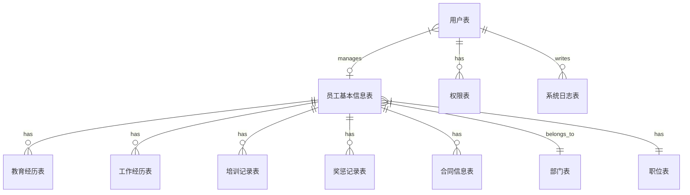

# 人事档案管理系统详细设计与具体代码实现

## 1.背景介绍

人事管理是每个组织机构的核心职能之一。有效的人事管理不仅能够确保组织拥有合适的人力资源来完成其任务,还能促进员工的职业发展,提高工作效率和工作满意度。然而,传统的基于纸质文件的人事档案管理系统存在诸多缺陷,如数据冗余、查找效率低下、存储空间有限等。因此,开发一个现代化的人事档案管理系统以满足当今组织的需求至关重要。

本文将详细介绍如何设计和实现一个功能完备的人事档案管理系统。该系统基于 Web 架构,具有良好的可扩展性和可维护性。它不仅能够有效管理员工的基本信息、工作经历、培训记录等,还能生成各种报表以支持决策制定。此外,该系统还具备角色权限管理、数据备份和恢复等高级功能,确保数据安全性和系统可靠性。

### 1.1 传统人事档案管理的挑战

- **数据冗余和不一致** : 员工信息分散在多个部门,容易出现重复录入和数据不一致的情况。
- **低效的数据检索** : 基于纸质文件的检索过程耗时耗力,难以满足实时查询的需求。
- **存储空间有限** : 纸质档案占用大量物理空间,随着时间推移,存储成本将不断增加。
- **数据安全性风险** : 纸质档案容易受到火灾、水灾等自然灾害的破坏,也难以防范人为sabotage。
- **缺乏数据分析能力** : 传统方式下难以对人力资源数据进行深入分析,制约了决策的科学性。

### 1.2 现代人事档案管理系统的优势

- **集中式数据管理** : 所有员工数据存储在统一的数据库中,消除了数据冗余和不一致的问题。
- **高效数据访问** : 基于数据库的检索,响应速度快,支持复杂查询。
- **存储空间无忧** : 数字化存储大大节省了物理空间,存储成本低廉。
- **提高数据安全性** : 通过访问控制、数据加密、备份等机制确保数据安全。
- **数据分析和决策支持** : 能够生成各种统计报表,为人力资源决策提供依据。
- **提高工作效率** : 自动化流程大幅降低了人工操作成本。
- **无缝集成其他系统** : 能够与其他企业应用系统(如财务系统)无缝集成。

## 2.核心概念与联系

在设计和实现人事档案管理系统之前,我们需要先了解一些核心概念及其之间的关系。

### 2.1 员工信息

员工信息是系统的核心数据,包括以下几个主要部分:

- **基本信息** : 姓名、性别、出生日期、身份证号、联系方式等个人信息。
- **教育经历** : 学历、毕业院校、专业等信息。
- **工作经历** : 历任职位、工作单位、入职时间、离职时间等。
- **培训记录** : 参加的各类培训课程、时间、成绩等。
- **奖惩记录** : 获得的奖项、处分记录等。
- **合同信息** : 合同类型、签订时间、到期时间等。

这些信息需要合理组织和存储,以便于查询和维护。在关系数据库中,我们可以将其拆分为多个表,如`员工基本信息表`、`教育经历表`、`工作经历表`等,通过外键建立它们之间的关联关系。

### 2.2 部门和职位

部门和职位是组织机构的重要组成部分,与员工信息存在密切关联。一个员工属于某个特定的部门,并担任相应的职位。在数据库中,我们需要设计`部门表`和`职位表`,其中包含部门名称、职位名称等信息。员工基本信息表则通过外键与这两个表建立关联。

### 2.3 用户和权限

为了确保系统的安全性,我们需要引入用户和权限管理机制。不同的用户将拥有不同的操作权限,如只读、编辑、删除等。在系统中,我们可以设计`用户表`和`权限表`,并在两者之间建立多对多的关联关系。同时,我们还需要为不同的数据设置适当的访问控制策略。

### 2.4 系统日志

为了追踪系统的操作历史并便于审计,我们需要记录所有对数据的修改操作,包括操作时间、操作人、操作类型(新增、修改、删除)以及操作前后的数据快照。这些日志信息将存储在`系统日志表`中,以备将来查阅。

### 2.5 核心概念之间的关系

上述核心概念之间的关系可以用下图来表示:

## 3.核心算法原理具体操作步骤

在人事档案管理系统中,核心算法主要包括以下几个方面:

### 3.1 数据存储与检索

#### 3.1.1 数据存储算法

我们将员工信息等核心数据存储在关系数据库中。在存储过程中,需要遵循以下原则:

1. **原子性(Atomicity)**: 对数据的修改要么全部成功,要么全部失败,不能出现部分成功的情况。
2. **一致性(Consistency)**: 数据的修改必须使数据从一个有效状态转移到另一个有效状态。
3. **隔离性(Isolation)**: 并发执行的多个事务之间不会相互影响,每个事务都感知不到其他事务的中间状态。
4. **持久性(Durability)**: 一旦事务提交,对数据的修改就是永久性的,不会因系统故障而丢失。

为了实现上述ACID原则,我们采用了基于事务的数据存储算法。具体步骤如下:

1. 开启事务
2. 执行SQL语句修改数据
3. 如果所有操作均成功,则提交事务;否则回滚事务,撤销所有修改。

这种基于事务的存储算法确保了数据的完整性和一致性。

#### 3.1.2 数据检索算法

为了提高检索效率,我们在数据库中建立了多个索引。检索算法的核心思想是利用这些索引快速定位到目标数据所在的数据块,从而避免全表扫描。

以查询某个员工的基本信息为例,检索算法的步骤如下:

1. 根据员工姓名在员工基本信息表的姓名索引中查找,获取对应的主键值。
2. 利用主键值从员工基本信息表中快速定位并读取该员工的完整记录。

此外,对于一些复杂查询(如根据多个条件筛选员工),我们还会构建组合索引以进一步提高效率。

### 3.2 数据备份与恢复

为了防止数据意外丢失,我们需要定期对数据进行备份。备份算法的步骤如下:

1. 获取当前所有需要备份的数据表
2. 遍历每个表,导出表结构和数据到备份文件
3. 将备份文件上传到远程存储服务器

数据恢复的过程则是备份的逆操作:

1. 从远程存储服务器下载备份文件
2. 遍历每个表的备份数据
3. truncate表,清空原有数据
4. 导入备份数据,恢复表结构和数据内容

### 3.3 权限验证算法

为了确保系统安全,对于每一个操作请求,我们都需要进行权限验证。验证算法的步骤如下:

1. 获取当前用户的ID
2. 查询用户ID对应的角色
3. 根据角色查询该用户拥有的权限列表
4. 检查请求的操作是否在权限列表中
5. 如果有权限,则允许操作;否则拒绝操作

在实现过程中,我们可以定义一个`权限验证器`类,封装上述算法逻辑。所有对数据的操作都需要先通过该验证器的检查,从而实现统一的访问控制。

### 3.4 报表生成算法

报表是人事管理的重要工具之一。我们的系统支持根据多种条件生成各类报表,算法步骤如下:

1. 根据报表类型,构建对应的SQL查询语句
2. 在数据库中执行查询,获取原始数据
3. 对原始数据进行汇总、统计和计算
4. 将处理后的数据填充到报表模板中
5. 导出报表文件(PDF、Excel等格式)

其中,步骤3的数据处理是关键。我们需要针对不同的报表类型,编写对应的数据处理逻辑。例如,对于员工年龄分布报表,我们需要根据员工出生日期计算年龄,再按年龄段进行分组统计。

## 4.数学模型和公式详细讲解举例说明

在人事档案管理系统中,一些核心功能需要使用数学模型和公式进行支撑。下面我们将详细介绍其中几个重要的模型。

### 4.1 薪酬模型

合理的薪酬制度对于吸引和留住优秀人才至关重要。我们的系统采用以下薪酬模型:

$$
salary = base + \sum_{i=1}^{n}bonus_i + \sum_{j=1}^{m}allowance_j
$$

其中:

- $salary$表示员工的总收入
- $base$表示员工的基本工资
- $bonus_i$表示第$i$项奖金,如绩效奖金、年终奖等
- $allowance_j$表示第$j$项补贴,如交通补贴、通讯补贴等
- $n$表示奖金项数
- $m$表示补贴项数

基本工资通常由员工的职位等级和工作年限共同决定。我们可以使用如下公式进行计算:

$$
base = grade\_base \times (1 + growth\_rate)^{years\_of\_service}
$$

其中:

- $grade\_base$表示该职位等级对应的基准工资
- $growth\_rate$表示年薪增长率,用于体现工作年限的影响
- $years\_of\_service$表示该员工的工作年限(年)

奖金的计算方式因奖金类型而异,但通常都与员工的绩效或部门业绩相关。例如,绩效奖金可以用下式计算:

$$
performance\_bonus = base \times kpi\_score \times ratio
$$

- $kpi\_score$表示员工的绩效考核分数,介于0到1之间
- $ratio$表示当年的绩效奖金比例,由公司政策决定

通过上述模型,我们的系统能够自动计算并生成每位员工的薪酬明细,为薪酬管理提供数据支持。

### 4.2 员工流失预测模型

员工流失不仅会给企业带来直接的经济损失,还可能影响团队士气和工作效率。因此,预测和降低员工流失率是人力资源管理的一项重要任务。

我们采用Logistic回归模型来预测员工流失的概率。该模型的数学表达式如下:

$$
P(leave=1|X) = \frac{1}{1+e^{-(\beta_0 + \beta_1X_1 + \beta_2X_2 + \cdots + \beta_nX_n)}}
$$

其中:

- $P(leave=1|X)$表示在给定特征向量$X$的条件下,员工离职的概率
- $X_i$表示第$i$个特征变量,如年龄、工资、职级、部门等
- $\beta_i$表示第$i$个特征变量对应的系数,需要通过训练数据进行估计

在训练阶段,我们将使用历史员工数据(包括离