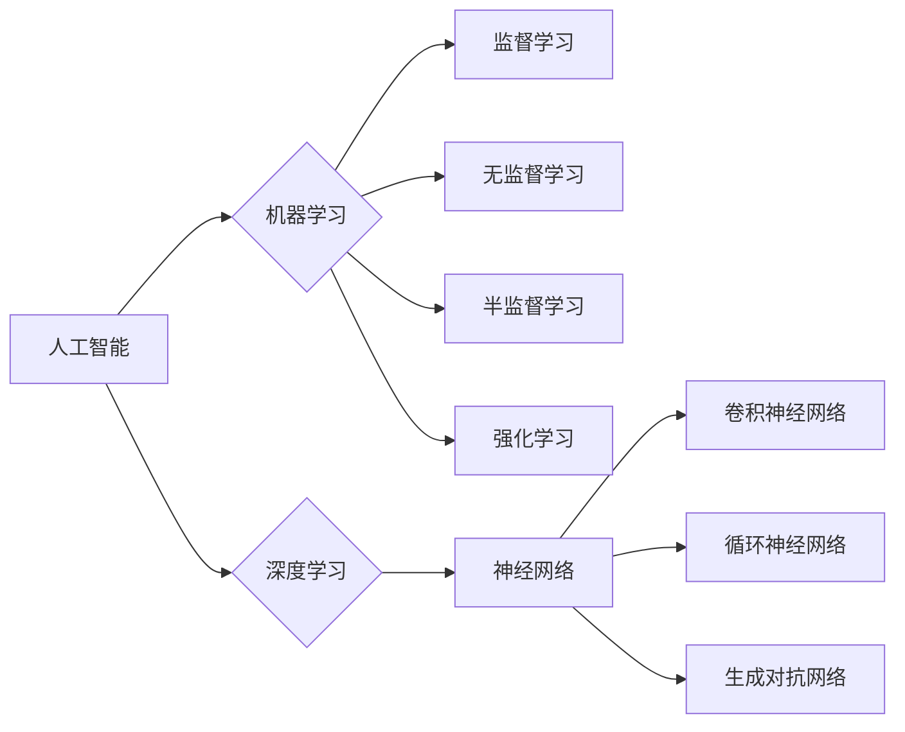

## 1. 背景介绍

### 1.1 人工智能的起源与发展

人工智能（Artificial Intelligence, AI）的概念最早可以追溯到上世纪50年代，图灵在1950年发表的论文《计算机器与智能》中提出了著名的“图灵测试”，为人工智能的诞生奠定了理论基础。此后，人工智能经历了几次高潮和低谷，期间涌现出了符号主义、连接主义、行为主义等不同的学派。近年来，随着计算能力的提升和大数据的爆发式增长，以深度学习为代表的人工智能技术取得了突破性进展，并在图像识别、语音识别、自然语言处理等领域取得了令人瞩目的成果，极大地推动了人工智能的商业化落地。

### 1.2 人工智能的定义与分类

目前，人工智能还没有一个统一的定义，但普遍认为，人工智能是指利用计算机模拟、延伸和扩展人类智能的理论、方法、技术及应用系统。根据人工智能的能力强弱，可以将其分为弱人工智能、强人工智能和超人工智能。

*   **弱人工智能（ANI）：** 也称为狭义人工智能，是指只能在特定领域或任务中表现出智能的系统，例如图像识别、语音助手等。
*   **强人工智能（AGI）：** 也称为通用人工智能，是指能够像人类一样进行思考、学习和解决问题的系统，目前还处于研究阶段。
*   **超人工智能（ASI）：** 指在所有方面都超越人类智能的系统，目前还处于科幻阶段。

### 1.3 人工智能的应用领域

人工智能的应用领域非常广泛，涵盖了各个行业，例如：

*   **计算机视觉：** 图像识别、人脸识别、目标检测、视频分析等。
*   **自然语言处理：** 语音识别、机器翻译、文本摘要、情感分析等。
*   **数据挖掘与机器学习：** 推荐系统、风险控制、精准营销等。
*   **机器人：** 工业机器人、服务机器人、医疗机器人等。

## 2. 核心概念与联系

### 2.1 机器学习

#### 2.1.1 定义

机器学习是人工智能的核心领域之一，其主要目标是让计算机能够像人类一样从数据中学习，并根据学习到的知识进行预测或决策。

#### 2.1.2 分类

根据学习方式的不同，机器学习可以分为以下几类：

*   **监督学习：** 从带有标签的训练数据中学习，例如图像分类、垃圾邮件过滤等。
*   **无监督学习：** 从没有标签的训练数据中学习，例如聚类分析、降维等。
*   **半监督学习：** 介于监督学习和无监督学习之间，利用少量有标签数据和大量无标签数据进行学习。
*   **强化学习：** 通过与环境交互学习，根据环境的反馈调整自身的行为，例如游戏 AI、自动驾驶等。

#### 2.1.3 常用算法

*   线性回归
*   逻辑回归
*   决策树
*   支持向量机
*   朴素贝叶斯
*   K 近邻算法
*   K 均值算法
*   主成分分析

### 2.2 深度学习

#### 2.2.1 定义

深度学习是机器学习的一个分支，其核心思想是利用多层神经网络模拟人脑的学习过程。

#### 2.2.2 神经网络

神经网络是由大量的神经元相互连接而成的网络结构，每个神经元接收来自其他神经元的输入，经过一定的计算后输出结果。

#### 2.2.3 常用模型

*   卷积神经网络（CNN）：主要用于图像识别等领域。
*   循环神经网络（RNN）：主要用于自然语言处理等领域。
*   生成对抗网络（GAN）：主要用于图像生成、风格迁移等领域。

### 2.3 核心概念联系图



## 3. 核心算法原理具体操作步骤

### 3.1 线性回归

#### 3.1.1 原理

线性回归是一种用于预测连续值目标变量的监督学习算法。它假设目标变量与输入特征之间存在线性关系。

#### 3.1.2 操作步骤

1.  准备数据：收集并清洗数据，将数据分为训练集和测试集。
2.  选择模型：选择线性回归模型。
3.  训练模型：使用训练集数据训练模型，找到最佳的模型参数。
4.  评估模型：使用测试集数据评估模型的性能，例如使用均方误差（MSE）或决定系数（R²）等指标。
5.  应用模型：使用训练好的模型对新的数据进行预测。

#### 3.1.3 代码实例

```python
import numpy as np
from sklearn.linear_model import LinearRegression
from sklearn.model_selection import train_test_split
from sklearn.metrics import mean_squared_error, r2_score

# 准备数据
X = np.array([[1, 2], [2, 3], [3, 4], [4, 5], [5, 6]])
y = np.array([3, 4, 5, 6, 7])

# 划分训练集和测试集
X_train, X_test, y_train, y_test = train_test_split(X, y, test_size=0.2, random_state=42)

# 创建线性回归模型
model = LinearRegression()

# 训练模型
model.fit(X_train, y_train)

# 预测
y_pred = model.predict(X_test)

# 评估模型
mse = mean_squared_error(y_test, y_pred)
r2 = r2_score(y_test, y_pred)

# 打印结果
print("均方误差:", mse)
print("决定系数:", r2)
```

## 4. 数学模型和公式详细讲解举例说明

### 4.1 线性回归的数学模型

线性回归的数学模型可以表示为：

$$
y = w_0 + w_1 x_1 + w_2 x_2 + ... + w_n x_n + ε
$$

其中：

*   $y$ 是目标变量。
*   $x_1, x_2, ..., x_n$ 是输入特征。
*   $w_0, w_1, w_2, ..., w_n$ 是模型参数，也称为权重或系数。
*   $ε$ 是误差项，表示模型无法解释的部分。

### 4.2 损失函数

线性回归的目标是找到最佳的模型参数，使得模型的预测值与真实值之间的误差最小。常用的损失函数是均方误差（MSE）：

$$
MSE = \frac{1}{m} \sum_{i=1}^{m} (y_i - \hat{y_i})^2
$$

其中：

*   $m$ 是样本数量。
*   $y_i$ 是第 $i$ 个样本的真实值。
*   $\hat{y_i}$ 是第 $i$ 个样本的预测值。

### 4.3 梯度下降

梯度下降是一种常用的优化算法，用于找到损失函数的最小值。其基本思想是沿着损失函数梯度的反方向不断更新模型参数，直到达到最小值。

### 4.4 举例说明

假设我们有一组数据，表示房屋面积和房价之间的关系：

| 房屋面积（平方米） | 房价（万元） |
| ------------------ | ------------ |
| 50                 | 200          |
| 60                 | 250          |
| 70                 | 300          |
| 80                 | 350          |
| 90                 | 400          |

我们可以使用线性回归模型来预测房价。假设线性回归模型为：

$$
y = w_0 + w_1 x
$$

其中：

*   $y$ 是房价。
*   $x$ 是房屋面积。
*   $w_0$ 和 $w_1$ 是模型参数。

我们可以使用梯度下降算法来找到最佳的模型参数 $w_0$ 和 $w_1$，使得均方误差最小。

## 5. 项目实践：代码实例和详细解释说明

### 5.1 图像分类

#### 5.1.1 任务描述

使用卷积神经网络（CNN）对图像进行分类。

#### 5.1.2 数据集

使用 CIFAR-10 数据集，该数据集包含 10 个类别的 60000 张彩色图像，每个类别有 6000 张图像。

#### 5.1.3 代码实例

```python
import tensorflow as tf
from tensorflow.keras import datasets, layers, models

# 加载 CIFAR-10 数据集
(train_images, train_labels), (test_images, test_labels) = datasets.cifar10.load_data()

# 归一化像素值
train_images, test_images = train_images / 255.0, test_images / 255.0

# 创建 CNN 模型
model = models.Sequential()
model.add(layers.Conv2D(32, (3, 3), activation='relu', input_shape=(32, 32, 3)))
model.add(layers.MaxPooling2D((2, 2)))
model.add(layers.Conv2D(64, (3, 3), activation='relu'))
model.add(layers.MaxPooling2D((2, 2)))
model.add(layers.Conv2D(64, (3, 3), activation='relu'))
model.add(layers.Flatten())
model.add(layers.Dense(64, activation='relu'))
model.add(layers.Dense(10))

# 编译模型
model.compile(optimizer='adam',
              loss=tf.