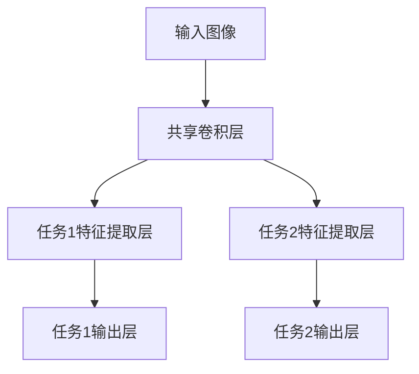

# 人脸识别与表情识别：多任务学习的"火眼金睛"

## 1.背景介绍

### 1.1 人工智能时代的到来

随着计算能力的不断提高和数据量的激增,人工智能技术正在以前所未有的速度发展。在这个过程中,计算机视觉作为人工智能的重要分支,已经在各个领域取得了长足进步,并被广泛应用于安防监控、人机交互、自动驾驶等诸多场景。

### 1.2 计算机视觉的核心任务

人脸识别和表情识别是计算机视觉中的两个核心任务。人脸识别技术可以自动识别和验证人脸身份,而表情识别则可以分析人的情绪状态,这两项技术在安全、交互和分析等领域都有着广泛的应用前景。

### 1.3 多任务学习的优势

传统的机器学习方法通常是针对单一任务进行训练和优化,但这种方式存在一些缺陷,例如模型的泛化能力较差、对数据的需求量较大等。相比之下,多任务学习可以同时学习多个相关任务,不仅可以提高模型的泛化性能,还能减少对训练数据的需求量。

## 2.核心概念与联系

### 2.1 人脸识别

人脸识别是指通过计算机系统自动识别人脸身份的过程。它主要包括以下几个步骤:

1. **人脸检测**: 从图像或视频流中定位并提取人脸区域。
2. **人脸表示**: 将检测到的人脸编码为适合于后续处理的特征向量表示。
3. **人脸识别**: 将提取的人脸特征与已知身份的人脸特征库进行比对,找到最相似的身份。

### 2.2 表情识别

表情识别是指自动分析和识别人类面部表情的计算机系统。它通常包括以下步骤:

1. **人脸检测**: 与人脸识别中的步骤相同。
2. **面部关键点检测**: 检测人脸上的关键点,如眼睛、嘴巴等。
3. **特征提取**: 从关键点和人脸区域提取与表情相关的特征。
4. **表情分类**: 将提取的特征输入分类器,预测对应的表情类别。

### 2.3 多任务学习

多任务学习(Multi-Task Learning, MTL)是一种机器学习范式,它可以同时学习多个相关但不同的任务。在人脸识别和表情识别中,这两个任务之间存在一定的相关性,因为它们都需要对人脸进行处理和理解。因此,将它们合并为一个多任务学习问题,可以提高模型的泛化能力和数据利用效率。

在多任务学习中,不同任务会共享一部分底层特征表示,这些共享的特征对于所有任务都是有用的。同时,每个任务还会学习自己专用的特征表示。通过这种方式,模型可以更好地利用数据,提高性能。

## 3.核心算法原理具体操作步骤

多任务学习的核心思想是在神经网络中引入共享表示,使不同任务可以共享部分参数,从而提高模型的泛化能力和数据利用效率。下面我们将介绍一种常见的多任务学习框架及其在人脸识别和表情识别中的应用。

### 3.1 多任务学习框架

一种常见的多任务学习框架如下所示:



1. **共享卷积层**: 该层由多个卷积层组成,用于从输入图像中提取低级特征,如边缘、纹理等。这些低级特征对于人脸识别和表情识别任务都是有用的,因此可以被两个任务共享。

2. **任务特征提取层**: 每个任务都有自己的特征提取层,用于从共享特征中提取针对该任务的高级语义特征。例如,人脸识别任务的特征提取层可能会关注人脸的整体结构和纹理特征,而表情识别任务的特征提取层则可能会更多关注眼睛、嘴巴等面部关键点的细节特征。

3. **任务输出层**: 每个任务都有自己的输出层,用于根据该任务的特征输出对应的预测结果。对于人脸识别任务,输出层可以是一个分类器,用于预测输入人脸的身份;对于表情识别任务,输出层也可以是一个分类器,用于预测输入人脸的表情类别。

在训练过程中,不同任务的损失函数会被合并,通过反向传播算法同时优化共享层和任务专用层的参数。这样,模型不仅可以学习到每个任务的特定知识,还可以从其他任务中获取有益的信息,提高泛化能力。

### 3.2 人脸识别和表情识别的多任务学习

在人脸识别和表情识别的多任务学习中,我们可以采用上述框架,将两个任务合并为一个模型。具体步骤如下:

1. **输入处理**: 将输入图像或视频帧进行预处理,如裁剪、缩放等,以获得统一的输入尺寸。

2. **共享卷积层提取特征**: 输入图像经过一系列卷积层,提取出低级特征,如边缘、纹理等。这些低级特征对于人脸识别和表情识别任务都是有用的,因此可以被两个任务共享。

3. **任务特征提取**: 共享特征被分别输入到人脸识别任务和表情识别任务的特征提取层中,提取出针对每个任务的高级语义特征。

4. **任务输出**: 人脸识别任务的特征被输入到一个分类器中,预测输入人脸的身份;表情识别任务的特征被输入到另一个分类器中,预测输入人脸的表情类别。

5. **损失函数计算和反向传播**: 计算两个任务的损失函数,并将它们相加作为总损失。使用反向传播算法优化模型参数,同时更新共享层和任务专用层的权重。

通过这种多任务学习框架,模型可以在训练过程中同时学习人脸识别和表情识别两个任务,从而提高泛化能力和数据利用效率。

## 4.数学模型和公式详细讲解举例说明

在多任务学习框架中,我们需要定义合适的损失函数来同时优化多个任务。一种常见的做法是将每个任务的损失函数加权求和,形成总损失函数。

设有 $N$ 个任务,第 $i$ 个任务的损失函数为 $\mathcal{L}_i$,对应的权重为 $\lambda_i$,则总损失函数可以表示为:

$$\mathcal{L} = \sum_{i=1}^{N} \lambda_i \mathcal{L}_i$$

其中,权重 $\lambda_i$ 用于控制每个任务对总损失的贡献程度。一种常见的设置方法是使用任务难度对权重进行调节,即对于更难的任务赋予更大的权重。

在人脸识别和表情识别的多任务学习中,我们可以分别定义两个任务的损失函数,然后将它们加权求和作为总损失函数。

### 4.1 人脸识别损失函数

对于人脸识别任务,我们可以使用交叉熵损失函数(Cross Entropy Loss)。设有 $C$ 个身份类别,第 $i$ 个样本的真实标签为 $y_i$,模型输出的预测概率为 $\hat{y}_i$,则人脸识别任务的损失函数可以表示为:

$$\mathcal{L}_\text{face} = -\frac{1}{N} \sum_{i=1}^{N} \sum_{c=1}^{C} y_{i,c} \log \hat{y}_{i,c}$$

其中 $y_{i,c}$ 是一个one-hot向量,表示第 $i$ 个样本是否属于第 $c$ 类。

### 4.2 表情识别损失函数

对于表情识别任务,我们也可以使用交叉熵损失函数。设有 $K$ 个表情类别,第 $i$ 个样本的真实标签为 $z_i$,模型输出的预测概率为 $\hat{z}_i$,则表情识别任务的损失函数可以表示为:

$$\mathcal{L}_\text{expr} = -\frac{1}{N} \sum_{i=1}^{N} \sum_{k=1}^{K} z_{i,k} \log \hat{z}_{i,k}$$

其中 $z_{i,k}$ 是一个one-hot向量,表示第 $i$ 个样本是否属于第 $k$ 类表情。

### 4.3 总损失函数

将人脸识别和表情识别的损失函数相加,并引入权重项 $\lambda_1$ 和 $\lambda_2$,我们可以得到总损失函数:

$$\mathcal{L} = \lambda_1 \mathcal{L}_\text{face} + \lambda_2 \mathcal{L}_\text{expr}$$

在训练过程中,我们需要同时最小化总损失函数,以优化模型参数。通过调节权重项 $\lambda_1$ 和 $\lambda_2$,我们可以控制每个任务对总损失的贡献程度,从而平衡两个任务的重要性。

以上是多任务学习框架中常见的损失函数定义方式。在实际应用中,我们还可以根据具体情况调整损失函数的形式,以获得更好的性能。

## 4.项目实践:代码实例和详细解释说明

在这一部分,我们将通过一个基于PyTorch的代码示例,展示如何实现人脸识别和表情识别的多任务学习模型。

### 4.1 数据准备

首先,我们需要准备用于训练和测试的数据集。在本例中,我们使用了两个公开数据集:

- **FER2013**:用于表情识别任务,包含7种基本表情类别。
- **VGGFace2**:用于人脸识别任务,包含9131个身份类别。

我们将这两个数据集合并,形成一个新的数据集,用于多任务学习模型的训练。

```python
import torchvision.transforms as transforms

# 定义数据预处理转换
data_transform = transforms.Compose([
    transforms.RandomHorizontalFlip(),
    transforms.ToTensor(),
    transforms.Normalize(mean=[0.5, 0.5, 0.5], std=[0.5, 0.5, 0.5])
])

# 加载数据集
train_dataset = MultiTaskDataset(fer_path, vgg_path, transform=data_transform, mode='train')
test_dataset = MultiTaskDataset(fer_path, vgg_path, transform=data_transform, mode='test')

# 创建数据加载器
train_loader = DataLoader(train_dataset, batch_size=32, shuffle=True)
test_loader = DataLoader(test_dataset, batch_size=32, shuffle=False)
```

### 4.2 模型定义

接下来,我们定义多任务学习模型的结构。我们将使用ResNet作为共享卷积层的基础,并在顶部添加两个任务专用的全连接层,用于人脸识别和表情识别任务。

```python
import torch.nn as nn
import torchvision.models as models

class MultiTaskModel(nn.Module):
    def __init__(self, num_face_classes, num_expr_classes):
        super(MultiTaskModel, self).__init__()
        
        # 加载预训练的ResNet模型
        resnet = models.resnet18(pretrained=True)
        
        # 冻结ResNet的卷积层
        for param in resnet.parameters():
            param.requires_grad = False
        
        # 共享卷积层
        self.shared_layers = nn.Sequential(
            resnet.conv1,
            resnet.bn1,
            resnet.relu,
            resnet.maxpool,
            resnet.layer1,
            resnet.layer2,
            resnet.layer3,
            resnet.layer4
        )
        
        # 人脸识别任务特征提取层
        self.face_layers = nn.Sequential(
            nn.Linear(512, 256),
            nn.ReLU(),
            nn.Dropout(0.5)
        )
        self.face_output = nn.Linear(256, num_face_classes)
        
        # 表情识别任务特征提取层
        self.expr_layers = nn.Sequential(
            nn.Linear(512, 256),
            nn.ReLU(),
            nn.Dropout(0.5)
        )
        self.expr_output = nn.Linear(256, num_expr_classes)
        
    def forward(self, x):
        shared_features = self.shared_