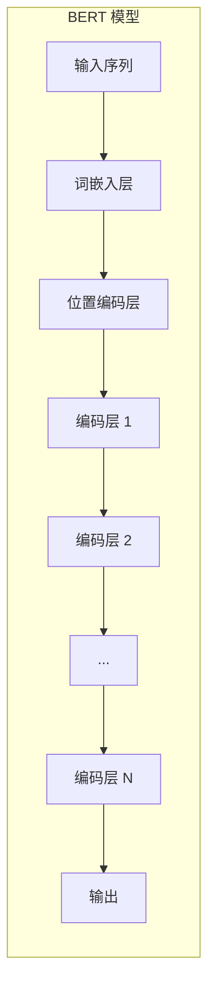
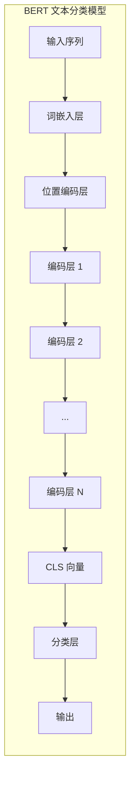

# 从零开始大模型开发与微调：BERT实战文本分类

作者：禅与计算机程序设计艺术

## 1. 背景介绍

### 1.1 文本分类任务概述

文本分类是自然语言处理（NLP）领域的一项基础任务，旨在将文本数据自动分类到预定义的类别中。其应用范围非常广泛，包括：

* **情感分析**: 判断一段文本的情感倾向，例如积极、消极或中性。
* **主题分类**: 将新闻文章、博客文章等文本分类到不同的主题类别，例如体育、娱乐、科技等。
* **垃圾邮件检测**: 识别并过滤垃圾邮件。
* **意图识别**: 在对话系统中，识别用户的意图，例如询问信息、预订酒店等。

### 1.2 传统文本分类方法的局限性

传统的文本分类方法通常依赖于词袋模型（Bag-of-Words）或 TF-IDF 等特征表示方法，这些方法存在以下局限性：

* **忽略词序信息**: 词袋模型将文本视为词语的无序集合，忽略了词语之间的顺序关系，而词序信息对于理解文本语义至关重要。
* **特征稀疏**: 文本数据通常具有高维稀疏的特点，传统的特征表示方法难以有效地捕捉文本的语义信息。
* **泛化能力有限**:  传统的文本分类模型在处理未见过的文本数据时，泛化能力有限。

### 1.3 深度学习在文本分类中的优势

近年来，深度学习技术在 NLP 领域取得了突破性进展，为文本分类任务带来了新的解决方案。相比于传统方法，深度学习方法具有以下优势：

* **能够学习词语的语义表示**: 深度学习模型可以自动地从大量文本数据中学习词语的语义表示，例如 Word2Vec、GloVe 等词向量模型。
* **能够捕捉文本的上下文信息**: 循环神经网络（RNN）、卷积神经网络（CNN）等深度学习模型能够有效地捕捉文本的上下文信息，从而更好地理解文本语义。
* **具有更强的泛化能力**: 深度学习模型在大规模数据集上训练后，通常具有更强的泛化能力，能够更好地处理未见过的文本数据。

### 1.4 BERT 模型简介

BERT（Bidirectional Encoder Representations from Transformers）是由 Google 提出的预训练语言模型，它在 NLP 领域取得了巨大的成功，并在多个 NLP 任务上达到了 state-of-the-art 的效果。BERT 的主要特点包括：

* **双向编码**: BERT 使用 Transformer 网络结构，能够同时从文本的左侧和右侧学习上下文信息，从而更好地理解词语的语义。
* **预训练**: BERT 在大规模文本语料库上进行了预训练，学习到了丰富的语言知识，可以作为其他 NLP 任务的特征提取器。
* **微调**: 针对具体的 NLP 任务，可以对 BERT 模型进行微调，以提高模型的性能。

## 2. 核心概念与联系

### 2.1 Transformer 网络结构

Transformer 是 BERT 模型的核心组件，它是一种基于自注意力机制（Self-Attention）的序列到序列（Sequence-to-Sequence）模型。Transformer 网络结构主要由编码器（Encoder）和解码器（Decoder）两部分组成。

#### 2.1.1 编码器

编码器由多个相同的编码层堆叠而成，每个编码层包含以下两个子层：

* **多头自注意力层（Multi-Head Self-Attention）**: 用于捕捉输入序列中不同位置之间的依赖关系。
* **前馈神经网络层（Feed-Forward Neural Network）**: 对每个位置的特征进行非线性变换。

#### 2.1.2 解码器

解码器也由多个相同的解码层堆叠而成，每个解码层包含以下三个子层：

* **掩码多头自注意力层（Masked Multi-Head Self-Attention）**: 用于捕捉解码过程中已经生成的词语之间的依赖关系。
* **编码器-解码器注意力层（Encoder-Decoder Attention）**: 用于将编码器的输出与解码器的输入进行关联。
* **前馈神经网络层（Feed-Forward Neural Network）**: 对每个位置的特征进行非线性变换。

### 2.2 自注意力机制

自注意力机制是 Transformer 网络结构的核心，它允许模型在处理一个词语时，关注输入序列中其他所有词语，并计算它们之间的相关性。自注意力机制的计算过程如下：

1. 对于输入序列中的每个词语，首先计算三个向量：查询向量（Query Vector）、键向量（Key Vector）和值向量（Value Vector）。
2. 计算查询向量与所有键向量之间的点积，得到注意力分数（Attention Scores）。
3. 对注意力分数进行 softmax 归一化，得到注意力权重（Attention Weights）。
4. 将注意力权重与值向量进行加权求和，得到最终的输出向量。

### 2.3 预训练与微调

BERT 模型采用预训练和微调的两阶段训练策略。

#### 2.3.1 预训练

在预训练阶段，BERT 模型使用大规模文本语料库进行训练，学习通用的语言表示。BERT 的预训练任务包括：

* **掩码语言模型（Masked Language Model, MLM）**: 随机遮蔽输入序列中的一部分词语，然后预测被遮蔽的词语。
* **下一句预测（Next Sentence Prediction, NSP）**: 判断两个句子是否是连续的句子。

#### 2.3.2 微调

在微调阶段，针对具体的 NLP 任务，使用标注数据对预训练的 BERT 模型进行微调。微调的过程通常是在预训练模型的基础上，添加一个新的输出层，并使用任务相关的损失函数进行训练。

## 3. 核心算法原理具体操作步骤

### 3.1 BERT 模型结构

BERT 模型的输入是一个词语序列，输出是每个词语的向量表示。BERT 模型的结构如下图所示：



#### 3.1.1 词嵌入层

词嵌入层将每个词语转换为一个固定长度的向量。BERT 模型使用 WordPiece 词汇表，将每个词语拆分成多个子词，然后将每个子词的向量表示相加，得到词语的向量表示。

#### 3.1.2 位置编码层

位置编码层为每个词语添加位置信息。BERT 模型使用正 синусоидальная и косинусоидальная 函数来计算位置编码。

#### 3.1.3 编码层

编码层是 BERT 模型的核心组件，它由多个相同的编码层堆叠而成，每个编码层包含多头自注意力层和前馈神经网络层。

### 3.2 BERT 文本分类模型

BERT 文本分类模型是在预训练的 BERT 模型的基础上，添加一个新的分类层，并使用分类任务相关的损失函数进行微调。BERT 文本分类模型的结构如下图所示：



#### 3.2.1 CLS 向量

BERT 模型在输入序列的开头添加一个特殊的词语 `[CLS]`，`[CLS]` 词语对应的输出向量称为 `CLS` 向量，`CLS` 向量可以作为整个输入序列的表示。

#### 3.2.2 分类层

分类层通常是一个全连接神经网络，它将 `CLS` 向量作为输入，输出每个类别的概率分布。

### 3.3 BERT 文本分类模型训练流程

BERT 文本分类模型的训练流程如下：

1. 使用预训练的 BERT 模型作为特征提取器，提取文本数据的特征。
2. 将提取到的特征输入到分类层，计算每个类别的概率分布。
3. 使用交叉熵损失函数计算模型的损失值。
4. 使用梯度下降算法更新模型的参数。

## 4. 数学模型和公式详细讲解举例说明

### 4.1 自注意力机制

自注意力机制的计算过程可以用以下公式表示：

$$
\text{Attention}(Q, K, V) = \text{softmax}(\frac{QK^T}{\sqrt{d_k}})V
$$

其中：

* $Q$ 是查询矩阵，维度为 $[n, d_k]$。
* $K$ 是键矩阵，维度为 $[m, d_k]$。
* $V$ 是值矩阵，维度为 $[m, d_v]$。
* $d_k$ 是键向量的维度。
* $n$ 是查询向量的个数。
* $m$ 是键向量和值向量的个数。

#### 4.1.1 查询、键、值向量

查询、键、值向量是自注意力机制的核心概念，它们分别代表了查询信息、匹配信息和最终输出信息。

* **查询向量**: 代表了当前词语想要查询的信息。
* **键向量**: 代表了其他词语能够提供的匹配信息。
* **值向量**: 代表了其他词语能够提供的最终输出信息。

#### 4.1.2 注意力分数

注意力分数表示了查询向量与每个键向量之间的相关性，计算公式如下：

$$
\text{Attention Scores} = QK^T
$$

#### 4.1.3 注意力权重

注意力权重是对注意力分数进行 softmax 归一化得到的，计算公式如下：

$$
\text{Attention Weights} = \text{softmax}(\frac{QK^T}{\sqrt{d_k}})
$$

#### 4.1.4 输出向量

输出向量是将注意力权重与值向量进行加权求和得到的，计算公式如下：

$$
\text{Output} = \text{Attention Weights}V
$$

### 4.2 交叉熵损失函数

交叉熵损失函数用于衡量模型预测的概率分布与真实概率分布之间的差异，计算公式如下：

$$
L = -\frac{1}{N}\sum_{i=1}^{N}\sum_{j=1}^{C}y_{ij}\log(p_{ij})
$$

其中：

* $N$ 是样本数量。
* $C$ 是类别数量。
* $y_{ij}$ 是样本 $i$ 的真实标签，如果样本 $i$ 属于类别 $j$，则 $y_{ij} = 1$，否则 $y_{ij} = 0$。
* $p_{ij}$ 是模型预测样本 $i$ 属于类别 $j$ 的概率。

## 5. 项目实践：代码实例和详细解释说明

```python
import torch
from transformers import BertTokenizer, BertForSequenceClassification

# 加载预训练的 BERT 模型和词tokenizer
model_name = 'bert-base-uncased'
tokenizer = BertTokenizer.from_pretrained(model_name)
model = BertForSequenceClassification.from_pretrained(model_name, num_labels=2)

# 定义文本分类任务的数据集
texts = [
    "This is a positive sentence.",
    "This is a negative sentence.",
]
labels = [1, 0]

# 对文本数据进行预处理
inputs = tokenizer(texts, padding=True, truncation=True, return_tensors="pt")

# 将数据输入到模型中，进行预测
outputs = model(**inputs)

# 获取模型的预测结果
predictions = torch.argmax(outputs.logits, dim=1)

# 打印模型的预测结果
print(predictions)
```

**代码解释:**

1. 首先，我们使用 `transformers` 库加载预训练的 BERT 模型和词tokenizer。
2. 然后，我们定义了文本分类任务的数据集，包括两条文本和对应的标签。
3. 接下来，我们使用 `tokenizer` 对文本数据进行预处理，包括将文本转换为词索引、添加特殊词语、进行 padding 和 truncation 等操作。
4. 然后，我们将预处理后的数据输入到模型中，进行预测。
5. 最后，我们获取模型的预测结果，并打印出来。

## 6. 实际应用场景

### 6.1 情感分析

BERT 模型可以用于情感分析任务，例如：

* **商品评论情感分析**: 分析用户对商品的评论，判断用户的情感倾向，例如好评、差评或中评。
* **社交媒体情感分析**: 分析社交媒体上的用户言论，判断用户的情感倾向，例如开心、悲伤、愤怒等。

### 6.2 主题分类

BERT 模型可以用于主题分类任务，例如：

* **新闻分类**: 将新闻文章分类到不同的主题类别，例如体育、娱乐、科技等。
* **邮件分类**: 将邮件分类到不同的类别，例如工作邮件、个人邮件、垃圾邮件等。

### 6.3 意图识别

BERT 模型可以用于意图识别任务，例如：

* **对话系统**: 识别用户的意图，例如询问信息、预订酒店等。
* **搜索引擎**: 理解用户的搜索意图，返回更准确的搜索结果。

## 7. 总结：未来发展趋势与挑战

### 7.1 未来发展趋势

* **更大规模的预训练模型**: 随着计算能力的提升和数据量的增加，未来将会出现更大规模的预训练语言模型，这些模型将具有更强的语言理解能力。
* **多语言预训练模型**: 多语言预训练模型可以学习多种语言的共同特征，从而提高模型在跨语言任务上的性能。
* **轻量级预训练模型**: 为了解决预训练模型参数量过大的问题，研究人员正在探索轻量级的预训练模型，例如知识蒸馏、模型压缩等技术。

### 7.2 挑战

* **数据偏差**: 预训练语言模型通常在大规模文本语料库上进行训练，这些语料库可能存在数据偏差，例如性别偏见、种族偏见等。
* **模型可解释性**: 深度学习模型通常是一个黑盒模型，难以解释模型的预测结果。
* **计算资源消耗**: 预训练语言模型的训练和推理过程需要消耗大量的计算资源。

## 8. 附录：常见问题与解答

### 8.1 BERT 模型的输入是什么？

BERT 模型的输入是一个词语序列，每个词语使用 WordPiece 词汇表进行编码。

### 8.2 BERT 模型的输出是什么？

BERT 模型的输出是每个词语的向量表示。

### 8.3 BERT 模型如何进行文本分类？

BERT 文本分类模型是在预训练的 BERT 模型的基础上，添加一个新的分类层，并使用分类任务相关的损失函数进行微调。

### 8.4 如何选择合适的 BERT 模型？

选择合适的 BERT 模型需要考虑以下因素：

* **任务类型**: 不同的 NLP 任务需要使用不同的 BERT 模型。
* **数据集大小**: 对于小数据集，可以选择参数量较小的 BERT 模型。
* **计算资源**: 训练和推理 BERT 模型需要消耗大量的计算资源。

### 8.5 如何提高 BERT 模型的性能？

提高 BERT 模型的性能可以尝试以下方法：

* **使用更大规模的训练数据**: 训练数据越多，模型的泛化能力越强。
* **调整模型的超参数**: 例如学习率、batch size、训练轮数等。
* **使用不同的优化器**: 例如 Adam、SGD 等。
* **使用正则化技术**: 例如 dropout、weight decay 等。
