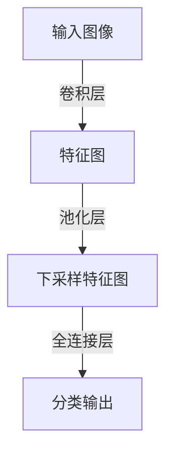

# 从零开始大模型开发与微调：CIFAR-10数据集简介

## 1.背景介绍

### 1.1 机器学习与深度学习的兴起

近年来,机器学习和深度学习技术取得了长足的进步,在计算机视觉、自然语言处理、推荐系统等诸多领域展现出卓越的性能。传统的机器学习算法依赖于人工设计的特征提取,而深度学习则能够自动从原始数据中学习特征表示,极大地降低了特征工程的工作量。

### 1.2 大模型在计算机视觉中的应用

在计算机视觉领域,大型神经网络模型(例如卷积神经网络)已经广泛应用于图像分类、目标检测、语义分割等任务中。这些模型通过在大规模标注数据集上进行训练,学习到了强大的视觉特征表示能力。然而,训练这些大模型需要消耗大量的计算资源,并且存在过拟合的风险。

### 1.3 CIFAR-10数据集概述

CIFAR-10是一个小型但广为人知的计算机视觉数据集,由60,000张32x32彩色图像组成,涵盖10个类别:飞机、汽车、鸟类、猫、鹿、狗、青蛙、马、船和卡车。它常被用作初学者入门数据集,用于测试和比较各种图像分类算法的性能表现。

## 2.核心概念与联系

### 2.1 监督学习与分类任务

图像分类是一种典型的监督学习任务,其目标是根据输入图像预测其所属类别。监督学习算法需要在带标注的训练数据上进行学习,以捕获输入和输出之间的映射关系。对于CIFAR-10数据集,我们的目标是训练一个分类器,能够正确地将给定的图像归类到10个类别中的某一个。

### 2.2 神经网络与卷积神经网络

神经网络是一种强大的机器学习模型,由多层神经元组成,能够近似任意连续函数。卷积神经网络(CNN)是一种专门用于处理网格结构数据(如图像)的神经网络,通过卷积、池化等操作提取局部特征,并逐层组合形成更高层次的表示。CNN在计算机视觉领域表现出色,是解决CIFAR-10分类任务的常用模型。



### 2.3 模型训练与微调

训练神经网络模型通常需要大量的计算资源和标注数据。预训练模型是一种有效的方法,可以在大型数据集上预先训练一个通用的模型,然后在较小的目标数据集上进行微调(fine-tuning),从而快速获得良好的性能。对于CIFAR-10这样的小数据集,我们可以利用在ImageNet等大型数据集上预训练的模型,通过微调的方式来适应目标任务。

### 2.4 评估指标

分类任务的常用评估指标包括准确率(Accuracy)、精确率(Precision)、召回率(Recall)和F1分数。对于CIFAR-10这种均衡的多分类任务,准确率是一个直观且常用的指标。此外,我们还可以绘制混淆矩阵(Confusion Matrix)来分析模型在各个类别上的表现。

## 3.核心算法原理具体操作步骤

### 3.1 数据预处理

在训练神经网络模型之前,我们需要对CIFAR-10数据集进行一些预处理操作:

1. **数据加载**: 使用Python中的torchvision库加载CIFAR-10数据集。
2. **数据归一化**: 将图像像素值缩放到[0, 1]范围内,以加速模型收敛。
3. **数据增强**: 应用一些数据增强技术(如随机裁剪、翻转、旋转等)来增加训练数据的多样性,提高模型的泛化能力。
4. **构建数据加载器**: 将数据分成训练集、验证集和测试集,并使用PyTorch的DataLoader封装成小批量数据。

### 3.2 模型构建

我们可以使用PyTorch或TensorFlow等深度学习框架构建卷积神经网络模型。下面是一个典型的CNN模型架构:

```python
import torch.nn as nn

class CNN(nn.Module):
    def __init__(self):
        super(CNN, self).__init__()
        self.conv1 = nn.Conv2d(3, 32, kernel_size=3, padding=1)
        self.conv2 = nn.Conv2d(32, 64, kernel_size=3, padding=1)
        self.pool = nn.MaxPool2d(2, 2)
        self.fc1 = nn.Linear(64 * 8 * 8, 256)
        self.fc2 = nn.Linear(256, 10)
        self.relu = nn.ReLU()

    def forward(self, x):
        x = self.relu(self.conv1(x))
        x = self.pool(x)
        x = self.relu(self.conv2(x))
        x = self.pool(x)
        x = x.view(-1, 64 * 8 * 8)
        x = self.relu(self.fc1(x))
        x = self.fc2(x)
        return x
```

该模型包含两个卷积层、两个池化层和两个全连接层。卷积层用于提取局部特征,池化层用于下采样特征图,全连接层则将特征映射到最终的分类输出。

### 3.3 模型训练

训练CNN模型的过程包括以下步骤:

1. **定义损失函数和优化器**: 对于分类任务,常用的损失函数是交叉熵损失函数。优化器通常选择随机梯度下降(SGD)或Adam等优化算法。
2. **训练循环**: 在每个epoch中,将训练数据输入模型,计算损失,并通过反向传播更新模型参数。
3. **验证**: 在每个epoch结束时,在验证集上评估模型性能,监控训练过程。
4. **模型保存**: 保存具有最佳验证性能的模型权重,以便后续使用。

```python
import torch.optim as optim

model = CNN()
criterion = nn.CrossEntropyLoss()
optimizer = optim.SGD(model.parameters(), lr=0.001, momentum=0.9)

for epoch in range(num_epochs):
    running_loss = 0.0
    for inputs, labels in train_loader:
        optimizer.zero_grad()
        outputs = model(inputs)
        loss = criterion(outputs, labels)
        loss.backward()
        optimizer.step()
        running_loss += loss.item()
    epoch_loss = running_loss / len(train_loader)
    print(f'Epoch {epoch+1}, Loss: {epoch_loss:.4f}')
    
    # 在验证集上评估模型
    model.eval()
    correct = 0
    total = 0
    with torch.no_grad():
        for inputs, labels in val_loader:
            outputs = model(inputs)
            _, predicted = torch.max(outputs.data, 1)
            total += labels.size(0)
            correct += (predicted == labels).sum().item()
    val_acc = correct / total
    print(f'Validation Accuracy: {val_acc:.4f}')
    
    # 保存模型权重
    if val_acc > best_acc:
        best_acc = val_acc
        torch.save(model.state_dict(), 'best_model.pth')
```

### 3.4 模型微调

如果我们已经有一个在大型数据集(如ImageNet)上预训练的模型,可以将其用于CIFAR-10数据集的微调。微调的步骤如下:

1. **加载预训练模型权重**: 使用PyTorch的`model.load_state_dict()`函数加载预训练模型权重。
2. **冻结部分层**: 通常我们会冻结预训练模型的部分层(如卷积层),只对最后几层(如全连接层)进行微调。
3. **设置较小的学习率**: 对于微调,我们通常会使用比从头训练时更小的学习率,以防止破坏预训练的特征表示。
4. **训练循环**: 与从头训练类似,但可能需要更少的epoch数量。

```python
# 加载预训练模型
model = models.resnet18(pretrained=True)

# 冻结卷积层
for param in model.parameters():
    param.requires_grad = False

# 替换最后一层
num_ftrs = model.fc.in_features
model.fc = nn.Linear(num_ftrs, 10)

# 设置较小的学习率
optimizer = optim.SGD(model.fc.parameters(), lr=0.001, momentum=0.9)

# 训练循环
# ...
```

通过微调,我们可以在CIFAR-10这样的小数据集上快速获得良好的分类性能,同时利用了预训练模型学习到的强大特征表示。

## 4.数学模型和公式详细讲解举例说明

### 4.1 卷积运算

卷积运算是CNN中的核心操作,它通过在输入特征图上滑动卷积核,计算局部区域与卷积核的内积,从而提取局部特征。对于二维卷积,卷积运算的数学表达式如下:

$$
S(i, j) = (I * K)(i, j) = \sum_{m}\sum_{n}I(i+m, j+n)K(m, n)
$$

其中,$$I$$表示输入特征图,$$K$$表示卷积核,$$S$$为输出特征图。卷积核在输入特征图上滑动,在每个位置计算局部区域与卷积核的内积,从而获得输出特征图的像素值。

卷积运算具有一些重要的性质,如平移等变性和权值共享,这使得CNN能够有效地捕获数据中的空间和时间局部相关性。

### 4.2 池化运算

池化运算是另一种常见的CNN操作,它通过对输入特征图的局部区域进行下采样,来减小特征图的空间维度。最大池化和平均池化是两种常用的池化方法。

对于最大池化,我们在每个池化窗口中选取最大值作为输出:

$$
y_{i,j} = \max_{(m,n) \in R_{i,j}} x_{m,n}
$$

其中,$$R_{i,j}$$表示以(i,j)为中心的池化窗口区域。

平均池化则计算池化窗口内所有值的平均值作为输出:

$$
y_{i,j} = \frac{1}{|R_{i,j}|} \sum_{(m,n) \in R_{i,j}} x_{m,n}
$$

池化运算有助于降低特征图的空间维度,减少计算量和参数数量,同时提高模型对平移和扭曲的鲁棒性。

### 4.3 全连接层

全连接层是神经网络中的一种常见层类型,它将前一层的所有神经元与当前层的每个神经元相连。全连接层的作用是将输入特征映射到输出空间,用于分类或回归任务。

给定输入向量$$\mathbf{x}$$和权重矩阵$$\mathbf{W}$$,全连接层的输出可以表示为:

$$
\mathbf{y} = \mathbf{W}^\top\mathbf{x} + \mathbf{b}
$$

其中,$$\mathbf{b}$$是偏置向量。

在CNN中,全连接层通常位于网络的最后几层,将卷积层提取的高级特征映射到目标空间(如分类标签)。全连接层的参数通过反向传播算法进行训练。

### 4.4 损失函数

损失函数是用于衡量模型预测与真实标签之间的差异。在图像分类任务中,常用的损失函数是交叉熵损失函数。

对于二分类问题,交叉熵损失函数定义为:

$$
\mathcal{L}(y, \hat{y}) = -y \log(\hat{y}) - (1 - y) \log(1 - \hat{y})
$$

其中,$$y$$是真实标签,$$\hat{y}$$是模型预测的概率。

对于多分类问题(如CIFAR-10),我们使用softmax函数将模型输出映射到概率分布,然后计算交叉熵损失:

$$
\mathcal{L}(\mathbf{y}, \hat{\mathbf{y}}) = -\sum_{i=1}^{C} y_i \log(\hat{y}_i)
$$

其中,$$\mathbf{y}$$是one-hot编码的真实标签向量,$$\hat{\mathbf{y}}$$是模型预测的概率分布,$$C$$是类别数。

在训练过程中,我们通过最小化损失函数来更新模型参数,使模型预测能够更好地拟合真实标签。

## 4.项目实践:代码实例和详细解释说明

在本节中,我们将提供一个完整的代码示例,用于在CIFAR-10数据集上训练和评估CNN模型。该示例使用Py