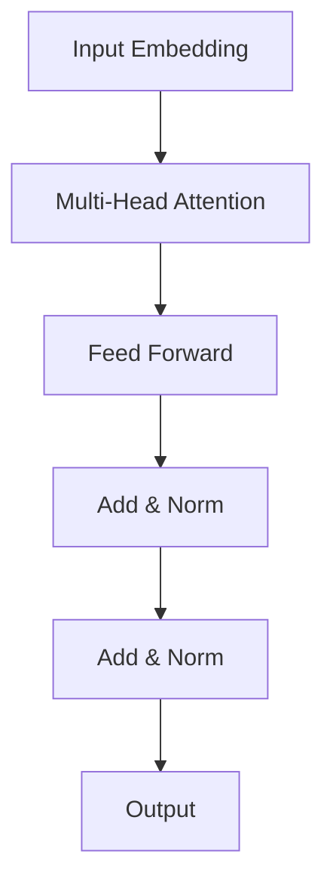

# 从零开始大模型开发与微调：站在巨人肩膀上的预训练模型BERT

## 1. 背景介绍

### 1.1 人工智能的发展历程

人工智能(Artificial Intelligence, AI)作为一门崭新的学科,已经成为当今科技发展的重要驱动力。从20世纪50年代问世,到如今的深度学习(Deep Learning)大行其道,AI经历了多次重大突破,逐渐展现出强大的能力。

### 1.2 自然语言处理(NLP)的重要性

在AI的多个分支中,自然语言处理(Natural Language Processing, NLP)是最具挑战和应用价值的领域之一。NLP旨在使计算机能够理解和生成人类语言,是实现人机自然交互的关键。随着大数据时代的到来,海量的文本数据为NLP提供了源源不断的燃料。

### 1.3 预训练语言模型的兴起

传统的NLP模型需要大量的标注数据作为监督学习的基础,标注过程既费时又费力。2018年,谷歌推出BERT(Bidirectional Encoder Representations from Transformers)预训练语言模型,通过自监督学习方式在大规模未标注语料上进行预训练,再通过微调(fine-tuning)将预训练模型应用到下游NLP任务中,取得了突破性进展。BERT的出现引发了预训练语言模型的热潮,成为NLP领域的里程碑式进展。

## 2. 核心概念与联系

### 2.1 BERT的核心思想

BERT采用了Transformer的编码器结构,通过自注意力机制(Self-Attention)捕捉输入序列中词与词之间的长程依赖关系。与此同时,BERT引入了两种全新的预训练任务:

1. **蒙版语言模型(Masked Language Model, MLM)**: 随机遮蔽部分输入Token,模型需要根据上下文预测被遮蔽的Token。
2. **下一句预测(Next Sentence Prediction, NSP)**: 判断两个句子是否为连续的句子对。

通过这两个预训练任务,BERT能够同时捕捉词级和句级的语义关系,在下游NLP任务中表现出色。

### 2.2 BERT与传统NLP模型的区别

- **无需大量标注数据**: BERT通过自监督学习方式,利用大规模未标注语料进行预训练,减轻了人工标注的负担。
- **上下文双向编码**: BERT的编码器捕捉了上下文的双向信息,而传统语言模型只关注单向上下文。
- **通用性强**: 经过预训练后,BERT可通过简单的微调应用到多种下游NLP任务中,避免了从头训练的低效。

### 2.3 BERT与人类语言能力的关系

BERT展现出了惊人的语言理解能力,在多项NLP基准测试中超越了人类水平。然而,BERT仍然是一种统计模型,缺乏真正的"理解"和"推理"能力。人类语言能力的形成需要丰富的知识库、常识推理和情境理解等多方面的支持,这是BERT及其后续模型仍需努力的方向。

## 3. 核心算法原理具体操作步骤

### 3.1 Transformer编码器结构

BERT的核心结构来自于Transformer编码器,如下图所示:



1. **Input Embedding**: 将输入Token转换为embedding向量表示。
2. **Multi-Head Attention**: 通过自注意力机制捕捉Token之间的关系,生成注意力向量。
3. **Feed Forward**: 对注意力向量进行非线性变换,提取高阶特征。
4. **Add & Norm**: 残差连接和层归一化,保证梯度稳定传播。

上述结构重复堆叠多层,形成深层次的特征提取和编码。

### 3.2 BERT预训练任务

#### 3.2.1 蒙版语言模型(MLM)

在MLM任务中,BERT随机遮蔽输入序列中的15%的Token,并预测这些被遮蔽Token的原始值。具体操作步骤如下:

1. 将输入序列分词为Token序列。
2. 随机选择15%的Token进行遮蔽,其中80%直接替换为特殊的[MASK]Token,10%保持不变,10%替换为随机Token。
3. 将遮蔽后的序列输入BERT模型,模型需要预测被遮蔽Token的原始值。
4. 将预测值与真实值进行交叉熵损失计算,并通过反向传播优化模型参数。

MLM任务迫使BERT从上下文中推断被遮蔽Token的语义信息,有助于捕捉词汇和语义的双向关联。

#### 3.2.2 下一句预测(NSP)

NSP任务旨在让BERT捕捉句子与句子之间的关系。具体操作步骤如下:

1. 从语料库中抽取一对连续的句子作为正例,同时随机抽取另一个不相干的句子作为负例。
2. 将正例和负例句子对作为输入,加入特殊的[CLS]Token表示句子对的分类标签。
3. BERT模型根据[CLS]Token的输出,预测该句子对是否为连续句子。
4. 将预测值与真实标签进行二元交叉熵损失计算,并通过反向传播优化模型参数。

NSP任务帮助BERT建立句子级别的语义关联,提高了模型对上下文的理解能力。

### 3.3 BERT微调

经过预训练后,BERT可以通过微调(fine-tuning)的方式应用到下游NLP任务中。微调的具体步骤如下:

1. 准备下游任务的训练数据,例如文本分类、序列标注等。
2. 将BERT模型作为Encoder层,在其之上添加针对特定任务的输出层。
3. 使用下游任务的训练数据,以端到端的方式对整个模型(包括BERT和输出层)进行微调。
4. 在验证集上评估模型性能,选择最优模型进行部署。

通过微调,BERT可以快速适应新的NLP任务,避免了从头训练的低效问题。同时,BERT在预训练阶段学习到的语义知识也可以很好地迁移到下游任务中。

## 4. 数学模型和公式详细讲解举例说明

### 4.1 自注意力机制(Self-Attention)

自注意力是Transformer的核心机制,它能够捕捉输入序列中任意两个位置之间的关系。给定一个输入序列 $\mathbf{X} = (x_1, x_2, \ldots, x_n)$,自注意力的计算过程如下:

1. 将输入序列线性映射到查询(Query)、键(Key)和值(Value)向量:

$$\begin{aligned}
\mathbf{Q} &= \mathbf{X} \mathbf{W}^Q \\
\mathbf{K} &= \mathbf{X} \mathbf{W}^K \\
\mathbf{V} &= \mathbf{X} \mathbf{W}^V
\end{aligned}$$

其中 $\mathbf{W}^Q$、$\mathbf{W}^K$、$\mathbf{W}^V$ 为可学习的权重矩阵。

2. 计算查询和键之间的点积,获得注意力分数矩阵:

$$\text{Attention}(\mathbf{Q}, \mathbf{K}, \mathbf{V}) = \text{softmax}\left(\frac{\mathbf{Q}\mathbf{K}^\top}{\sqrt{d_k}}\right)\mathbf{V}$$

其中 $d_k$ 为键的维度,用于缩放点积值。

3. 将注意力分数与值向量相乘,得到加权和作为输出:

$$\mathbf{Z} = \text{Attention}(\mathbf{Q}, \mathbf{K}, \mathbf{V}) = \sum_{i=1}^n \alpha_i \mathbf{v}_i$$

其中 $\alpha_i$ 为注意力分数,表示输入序列中第 $i$ 个位置对当前位置的重要程度。

自注意力机制能够自适应地捕捉输入序列中任意两个位置之间的依赖关系,是Transformer的核心创新之一。

### 4.2 多头注意力(Multi-Head Attention)

为了进一步提高模型的表达能力,Transformer引入了多头注意力机制。多头注意力将输入序列映射到多个子空间,每个子空间学习不同的注意力模式,最后将多个子空间的结果拼接起来作为输出。具体计算过程如下:

1. 将输入序列 $\mathbf{X}$ 线性映射到 $h$ 个子空间,每个子空间有独立的查询、键、值向量:

$$\begin{aligned}
\mathbf{Q}_i &= \mathbf{X} \mathbf{W}_i^Q &\quad i = 1, \ldots, h \\
\mathbf{K}_i &= \mathbf{X} \mathbf{W}_i^K &\quad i = 1, \ldots, h \\
\mathbf{V}_i &= \mathbf{X} \mathbf{W}_i^V &\quad i = 1, \ldots, h
\end{aligned}$$

2. 对每个子空间计算自注意力:

$$\text{head}_i = \text{Attention}(\mathbf{Q}_i, \mathbf{K}_i, \mathbf{V}_i)$$

3. 将所有子空间的结果拼接起来:

$$\text{MultiHead}(\mathbf{Q}, \mathbf{K}, \mathbf{V}) = \text{Concat}(\text{head}_1, \ldots, \text{head}_h)\mathbf{W}^O$$

其中 $\mathbf{W}^O$ 为可学习的线性变换矩阵。

多头注意力机制赋予了模型捕捉不同子空间模式的能力,提高了模型的表达能力和泛化性能。

### 4.3 位置编码(Positional Encoding)

由于Transformer没有像RNN那样的递归结构,因此需要一种机制来注入序列的位置信息。BERT采用了基于正弦和余弦函数的位置编码方式,将位置信息直接编码到输入embedding中。对于序列中的第 $i$ 个位置,其位置编码计算公式如下:

$$\begin{aligned}
\text{PE}_{(pos, 2i)} &= \sin\left(pos / 10000^{2i / d_\text{model}}\right) \\
\text{PE}_{(pos, 2i+1)} &= \cos\left(pos / 10000^{2i / d_\text{model}}\right)
\end{aligned}$$

其中 $pos$ 为位置索引, $i$ 为维度索引, $d_\text{model}$ 为embedding维度。

通过这种方式,不同位置的embedding向量会有不同的位置编码,使得Transformer能够区分序列中不同位置的Token,并捕捉位置信息。

## 5. 项目实践:代码实例和详细解释说明

为了更好地理解BERT的实现细节,我们将使用Python和PyTorch框架,构建一个简化版的BERT模型。完整代码可在GitHub上获取: [https://github.com/codingcraftsman/SimpleBERT](https://github.com/codingcraftsman/SimpleBERT)

### 5.1 导入所需库

```python
import torch
import torch.nn as nn
import math
```

### 5.2 实现多头注意力机制

```python
class MultiHeadAttention(nn.Module):
    def __init__(self, d_model, num_heads):
        super(MultiHeadAttention, self).__init__()
        self.num_heads = num_heads
        self.d_model = d_model

        assert d_model % self.num_heads == 0

        self.depth = d_model // self.num_heads

        self.wq = nn.Linear(d_model, d_model)
        self.wk = nn.Linear(d_model, d_model)
        self.wv = nn.Linear(d_model, d_model)

        self.dense = nn.Linear(d_model, d_model)

    def split_heads(self, x, batch_size):
        x = x.view(batch_size, -1, self.num_heads, self.depth)
        return x.permute(0, 2, 1, 3)

    def forward(self, v, k, q, mask):
        batch_size = q.size(0)

        q = self.wq(q)  # (batch_size, seq_len, d_model)
        k = self.wk(k)  # (batch_size, seq_len, d_model)
        v = self.wv(v)  # (batch_size, seq_len, d_model)

        q = self.split_heads(q, batch_size)
        k = self.split_heads(k, batch_size)
        v = self.split_heads(v, batch_size)

        # scaled_attention.shape == (batch_size