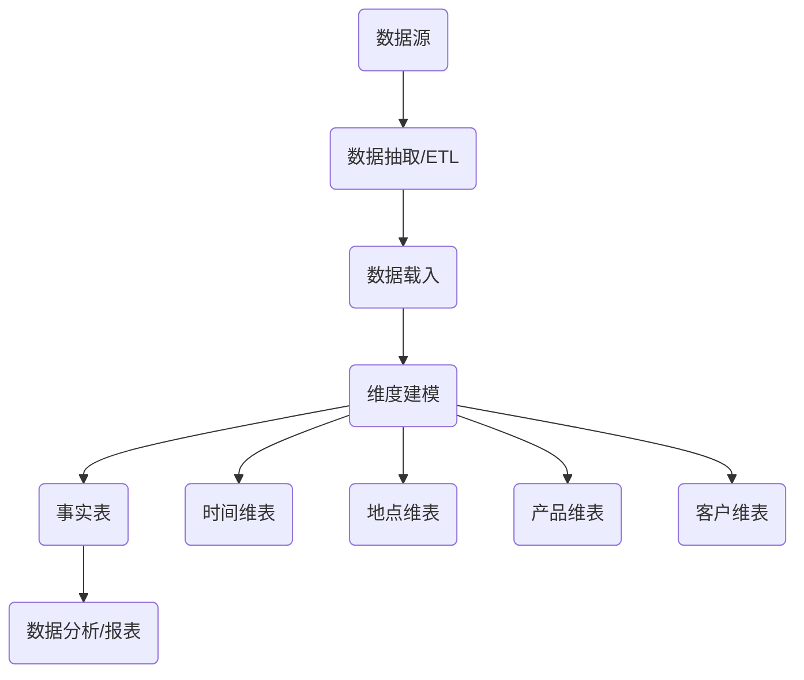

# "企业业务数字化：从原始到现代的转变"

作者：禅与计算机程序设计艺术

## 1. 背景介绍
### 1.1 企业数字化转型的必要性
#### 1.1.1 市场竞争日益激烈
#### 1.1.2 客户需求不断变化
#### 1.1.3 技术创新加速迭代

### 1.2 传统企业面临的挑战  
#### 1.2.1 业务流程效率低下
#### 1.2.2 数据孤岛问题严重
#### 1.2.3 缺乏敏捷创新能力

### 1.3 数字化转型的价值与意义
#### 1.3.1 提升运营效率与灵活性
#### 1.3.2 增强客户体验与满意度
#### 1.3.3 开拓新的商业模式与增长点

## 2. 核心概念与联系
### 2.1 业务流程再造(BPR)
#### 2.1.1 流程简化与优化
#### 2.1.2 流程自动化与智能化
#### 2.1.3 端到端流程整合

### 2.2 企业架构(EA)
#### 2.2.1 业务架构
#### 2.2.2 数据架构 
#### 2.2.3 应用架构
#### 2.2.4 技术架构

### 2.3 数字化平台
#### 2.3.1 业务中台
#### 2.3.2 数据中台
#### 2.3.3 技术中台

### 2.4 数字化能力
#### 2.4.1 智能分析与预测
#### 2.4.2 个性化定制与服务
#### 2.4.3 实时连接与交互

## 3. 核心算法原理与具体操作步骤
### 3.1 BPM平台算法
#### 3.1.1 流程分解与建模
#### 3.1.2 业务规则管理
#### 3.1.3 工作流路由与调度
#### 3.1.4 流程性能监控与优化

### 3.2 企业主数据管理算法  
#### 3.2.1 数据标准化与集成
#### 3.2.2 数据质量管理
#### 3.2.3 主数据共享与分发

### 3.3 业务中台设计模式
#### 3.3.1 领域驱动设计(DDD)
#### 3.3.2 微服务架构
#### 3.3.3 API网关与编排

### 3.4 机器学习与AI算法
#### 3.4.1 客户画像与分群
#### 3.4.2 个性化推荐系统
#### 3.4.3 智能问答与对话

## 4. 数学模型与公式详细讲解举例说明
### 4.1 流程自动化中的数学模型
#### 4.1.1 Petri网模型
Petri网是一种用于建模和分析离散事件动态系统的数学工具。一个Petri网可以表示为一个五元组$N=(P,T,F,W,M_0)$, 其中:
- $P$是库所的有限集合，通常用圆圈表示;  
- $T$是变迁的有限集合，通常用方块表示，满足$P \cap T = \emptyset$;
- $F \subseteq (P \times T) \cup (T \times P)$是有向弧的集合;   
- $W: F \rightarrow \{1,2,3,\dots\}$是每条弧的权重函数;
- $M_0: P \rightarrow \{0,1,2,\dots\}$是初始标识，表示每个库所里初始时刻的token数量。

#### 4.1.2 马尔可夫决策过程
马尔可夫决策过程(Markov Decision Process, MDP)是一个五元组$(S,A,P,R,\gamma)$:
- $S$是一个有限的状态集;
- $A$是一个有限的动作集; 
- $P$是状态转移概率矩阵，$P_{ss'}^a=P[S_{t+1}=s'|S_t=s,A_t=a]$;
- $R$是期望即时奖励函数，$R_s^a=E[R_{t+1}|S_t=s,A_t=a]$;
- $\gamma \in [0,1]$是折扣因子，表示未来奖励的重要程度。

求解MDP的目标是找到一个最优策略$\pi^*$，使得期望累积奖励最大化:

$$\pi^* = \arg\max_{\pi} E[\sum_{t=0}^{\infty} \gamma^t R_{t+1}|S_0,\pi]$$

### 4.2 企业数据架构的数学基础
#### 4.2.1 图论与网络模型
图$G$定义为二元组$G=(V,E)$，其中:
- $V$是顶点的非空集合;
- $E$是无序二元组$(u,v)$的集合，称为边，满足$u,v \in V$且$u \neq v$。

如果边是有序二元组，则图称为有向图。图可用于建模实体之间的复杂关联。

#### 4.2.2 关系代数与SQL
关系代数是一种抽象的查询语言，用对关系的运算来表达查询。设$R,S$是两个关系，$\theta$是一个谓词，则主要运算包括:

- 选择: $\sigma_{\theta}(R)=\{t \in R | \theta(t)=true\}$
- 投影: $\prod_{A_1,\dots,A_n}(R)=\{t[A_1,\dots,A_n] | t \in R\}$   
- 笛卡尔积: $R \times S = \{tr|t \in R \wedge r \in S\}$
- 集合并: $R \cup S = \{t|t \in R \vee t \in S\}$
- 集合差: $R - S = \{t|t \in R \wedge t \notin S\}$ 

SQL是关系代数的一种实现，用于操作关系型数据库。

### 4.3 推荐系统与机器学习算法
#### 4.3.1 协同过滤算法
协同过滤基于用户或物品之间的相似性进行推荐。记$r_{ui}$为用户$u$对物品$i$的评分，$I_u$为用户$u$评分过的物品集合，$U_i$为对物品$i$有过评分的用户集合，则基于物品的协同过滤推荐公式为:

$$\hat{r}_{ui} = \frac{\sum_{j \in I_u}sim(i,j)r_{uj}}{\sum_{j \in I_u}|sim(i,j)|}$$

其中$sim(i,j)$是物品$i$与$j$的相似度，常用皮尔逊相关系数或余弦相似度计算。

#### 4.3.2 矩阵分解模型
矩阵分解可将评分矩阵$R$分解为两个低秩矩阵$P$和$Q$的乘积，即$R \approx PQ^T$。其中$P$矩阵表示用户对隐含特征的偏好，$Q$矩阵表示物品包含的隐含特征。假设评分矩阵$R$的秩为$r$，则$P$为$m \times r$矩阵，$Q$为$n \times r$矩阵，$m$和$n$分别为用户数和物品数。优化目标为最小化重构误差:

$$\min_{P,Q} \sum_{u,i \in K}(r_{ui}-p_u^Tq_i)^2 + \lambda(||P||^2+||Q||^2)$$  

其中$K$为已知评分的索引集合，$\lambda$为正则化系数。求解算法通常采用随机梯度下降或交替最小二乘法。

## 5.项目实践：代码实例与详细解释说明
### 5.1 业务流程管理平台搭建
本节介绍如何使用开源BPM平台Flowable实现一个简单的请假流程。

#### 5.1.1 流程定义文件leave.bpmn20.xml
```xml
<?xml version="1.0" encoding="UTF-8"?>
<definitions xmlns="http://www.omg.org/spec/BPMN/20100524/MODEL"
             xmlns:xsi="http://www.w3.org/2001/XMLSchema-instance"
             xmlns:flowable="http://flowable.org/bpmn"
             typeLanguage="http://www.w3.org/2001/XMLSchema"
             expressionLanguage="http://www.w3.org/1999/XPath"             
             targetNamespace="http://www.flowable.org/processdef">

    <process id="leaveProcess" name="请假流程">
        <startEvent id="startEvent"/>
        <sequenceFlow sourceRef="startEvent" targetRef="submitTask"/>

        <userTask id="submitTask" name="提交请假申请" flowable:assignee="${employee}">
            <!-- 请假天数》= 3天需要总经理审批，否则需要部门经理审批-->
            
            <extensionElements>
                <flowable:formProperty id="days" name="请假天数" type="long" required="true"/>
                <flowable:formProperty id="reason" name="请假原因" type="string" required="true"/>                    
            </extensionElements>            
        </userTask>        
        <sequenceFlow sourceRef="submitTask" targetRef="exclusiveGw"/>

        <exclusiveGateway id="exclusiveGw" name="判断请假天数决策点"/>        
        <sequenceFlow sourceRef="exclusiveGw" targetRef="directorTask">
            <conditionExpression xsi:type="tFormalExpression">${days &lt; 3}</conditionExpression>
        </sequenceFlow>
        <sequenceFlow sourceRef="exclusiveGw" targetRef="bossTask">
            <conditionExpression xsi:type="tFormalExpression">${days &gt;= 3}</conditionExpression>
        </sequenceFlow>

        <userTask id="directorTask" name="部门经理审批" flowable:assignee="${director}"/>
        <sequenceFlow sourceRef="directorTask" targetRef="joinGw"/>

        <userTask id="bossTask" name="总经理审批" flowable:assignee="${boss}"/>
        <sequenceFlow sourceRef="bossTask" targetRef="joinGw"/>

        <parallelGateway id="joinGw"/>    
        <sequenceFlow sourceRef="joinGw" targetRef="hrTask"/>   

        <userTask id="hrTask" name="人事备案" flowable:assignee="${hr}"/>
        <sequenceFlow sourceRef="hrTask" targetRef="endEvent"/>

        <endEvent id="endEvent"/>
    </process>
</definitions>
```

#### 5.1.2 流程部署与启动
```java
public class LeaveTest {
    @Test
    public void testDeploy() {
       // 创建流程引擎
       ProcessEngine engine = ProcessEngines.getDefaultProcessEngine();
       
       // 得到流程存储服务组件
       RepositoryService repositoryService = engine.getRepositoryService();
       
       // 进行部署
       Deployment deployment = repositoryService.createDeployment()
           .addClasspathResource("leave.bpmn20.xml")  // 添加资源
           .name("请假流程")  // 设置部署名称
           .deploy();  // 执行部署动作
           
        System.out.println("部署ID：" + deployment.getId());
        System.out.println("部署名称：" + deployment.getName());           
    }
    
    @Test
    public void testStartProcess() {
        // 创建流程引擎
        ProcessEngine processEngine = ProcessEngines.getDefaultProcessEngine();
        
        // 启动流程实例
        String processDefinitionKey = "leaveProcess";
        String businessKey = "1001";
        Map<String, Object> variables = new HashMap<>();
        variables.put("employee", "张三");
        variables.put("director", "李经理");
        variables.put("boss", "王总");
        variables.put("hr", "赵小姐");
        ProcessInstance pi = processEngine.getRuntimeService().startProcessInstanceByKey(processDefinitionKey,businessKey,variables);
        
        System.out.println("流程实例ID：" + pi.getId());
        System.out.println("流程定义ID：" + pi.getProcessDefinitionId());        
     }
}    
```

### 5.2 企业级数据仓库搭建
本节介绍使用Kimball方法论构建一个销售数据集市(Data Mart)。

#### 5.2.1 总体架构设计
销售数据集市以销售事实表为核心，通过与各维度表的联接，可以分析销量、营收、成本等指标在不同时间、地点、产品、客户等维度上的分布情况。系统架构如下图所示:



#### 5.2.2 Fact表设计

销售事实表(fact_sales)的设计如下:

| 字段名 | 数据类型 | 是否主键 | 含义 |
| ---- | ---- | ---- | ---- | 
| sales_id | INT | Y | 销售记录ID |
| time_key | INT | N | 时间维度外键 |
| store_key| INT | N | 地点维度外键 | 
| product_key| INT | N | 产品维度外键 |
| customer_key | INT | N | 客户维度外键 | 
| sales_quantity| INT | N | 