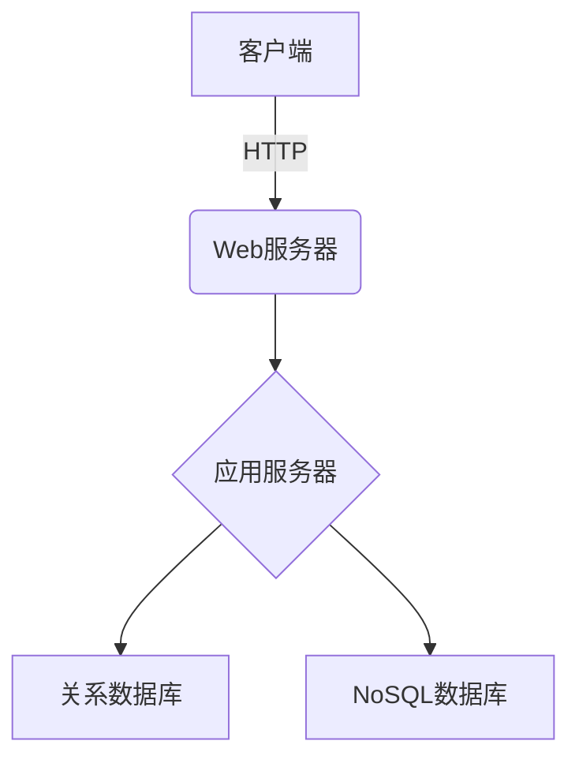
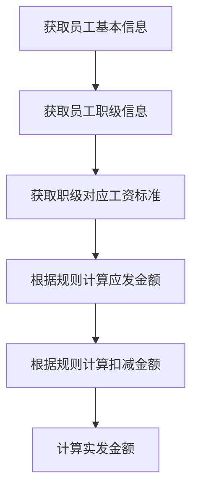
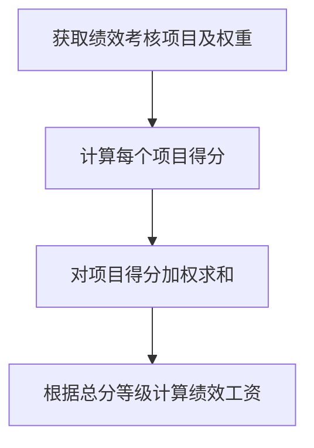
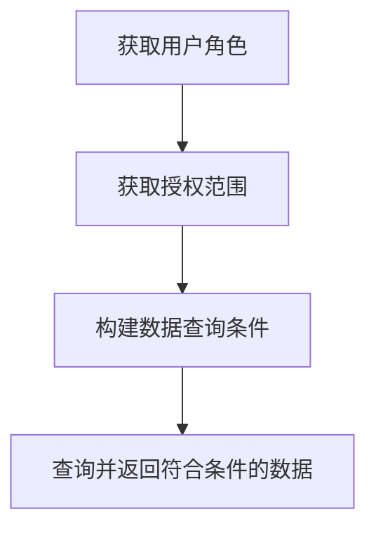

# 企业人事工资管理系统详细设计与具体代码实现

## 1. 背景介绍

### 1.1 人事工资管理系统的重要性

在任何企业中，人力资源管理都是一个关键的业务流程。它涉及员工招聘、入职、培训、绩效考核、薪酬福利、离职等多个环节。有效的人事工资管理系统可以确保这些流程的高效运行,从而提高企业的整体运营效率和员工满意度。

### 1.2 传统人事工资管理的挑战

传统的人事工资管理通常依赖于大量的手工操作和纸质文件,这不仅效率低下,而且容易出现错误和数据不一致的问题。此外,信息的查询和统计分析也相当困难,无法为管理层提供及时准确的决策支持。

### 1.3 信息化的必要性

为了解决上述挑战,企业急需采用现代化的信息系统来管理人力资源。通过构建集中式的数据库和流程化的业务逻辑,可以极大提高管理效率,降低人为错误,并提供强大的报表和分析功能。

## 2. 核心概念与联系

### 2.1 系统架构概览

企业人事工资管理系统通常采用客户端-服务器的架构模式。客户端提供用户界面,用于数据录入、查询和报表展示等;服务器端负责存储和处理业务数据,执行复杂的业务逻辑。



### 2.2 核心数据模型

人事工资管理系统的核心数据模型包括:

- 员工信息(员工基本资料、教育经历、工作经历等)
- 职位信息(职位编码、职级、职责、要求等)
- 部门信息(部门编码、部门层级、上级部门等)
- 薪酬信息(薪酬项目、计算规则、发放记录等)
- 绩效考核信息(考核项目、考核周期、考核结果等)

这些数据模型之间存在复杂的关联关系,需要在数据库设计时予以考虑。

### 2.3 主要业务流程

人事工资管理系统的主要业务流程包括:

- 员工招聘流程
- 员工入职流程 
- 员工培训流程
- 绩效考核流程
- 薪酬发放流程
- 员工离职流程

每个流程都包含数据录入、审批、执行等多个环节,需要针对不同的角色权限进行严格控制。

## 3. 核心算法原理具体操作步骤  

### 3.1 薪酬计算算法

薪酬计算是系统中最核心也最复杂的算法之一。一般来说,员工的实发工资由多个薪酬项目构成,包括基本工资、绩效工资、加班工资、补贴等。每个项目的计算规则不尽相同,还需要考虑税收等多方面因素。

以基本工资为例,计算步骤如下:



### 3.2 绩效计算算法

绩效考核结果直接影响员工的薪酬水平,因此绩效计算算法也非常关键。一般来说,系统会设置多个考核项目,每个项目有不同的权重系数。最终的绩效得分是这些项目得分的加权平均值。



### 3.3 数据权限控制算法

由于人事工资数据的敏感性,对于不同的用户角色需要设置不同的数据访问权限。这通常通过设置数据权限维度和授权范围来实现。

例如,对于员工自助查询,可以设置以下权限维度:

- 仅可查看自身信息
- 可查看本部门员工信息
- 可查看本部门及子部门员工信息

授权范围则由管理员根据实际情况进行设置。



## 4. 数学模型和公式详细讲解举例说明

在人事工资管理系统中,一些计算过程需要使用数学模型和公式。以下是一些常见的例子:

### 4.1 工资分配模型

企业通常会根据员工的绩效表现、工作年限等因素,对员工的工资分配比例进行调整。这个过程可以用数学模型来描述:

假设有 $n$ 个员工,员工 $i$ 的绩效分数为 $s_i$,工作年限为 $y_i$。企业预算的总工资支出为 $T$。我们需要确定每个员工的工资 $w_i$,使得:

$$
\sum_{i=1}^{n}w_i \le T \\
w_i = f(s_i, y_i)
$$

其中, $f$ 是一个函数,用于根据绩效分数和工作年限计算员工的相对工资比例。一种可能的函数形式是:

$$
f(s_i, y_i) = \alpha s_i + \beta y_i
$$

$\alpha$ 和 $\beta$ 是权重系数,可由企业根据实际情况调整。

在满足总工资支出约束的前提下,我们需要求解 $w_i$ 的值,使得工资分配最为合理。这可以通过优化算法(如线性规划)来实现。

### 4.2 绩效考核模型

绩效考核通常包含多个评分项目,每个项目的分数范围不尽相同。为了得到最终的绩效分数,需要对各项目分数进行标准化,然后计算加权平均值。

假设有 $m$ 个考核项目,第 $j$ 个项目的分数范围为 $[l_j, u_j]$,权重为 $w_j$。员工 $i$ 在第 $j$ 个项目的原始分数为 $x_{ij}$。我们需要计算员工 $i$ 的最终绩效分数 $s_i$。

首先,对原始分数进行标准化:

$$
z_{ij} = \frac{x_{ij} - l_j}{u_j - l_j}
$$

其中 $z_{ij}$ 是标准化后的分数,范围在 $[0, 1]$ 之间。

然后,计算加权平均值:

$$
s_i = \sum_{j=1}^{m}w_j z_{ij}
$$

满足约束条件:

$$
\sum_{j=1}^{m}w_j = 1 \\
0 \le w_j \le 1
$$

通过调整权重系数 $w_j$,企业可以体现不同考核项目的重要程度。

## 4. 项目实践: 代码实例和详细解释说明

为了更好地理解系统的实现细节,下面给出一些核心功能模块的代码示例和解释。

### 4.1 员工信息管理模块

该模块负责维护员工的基本信息、教育经历、工作经历等数据。以员工基本信息为例,相关的数据模型和CRUD操作代码如下:

```python
# 数据模型
class Employee(db.Model):
    __tablename__ = 'employees'
    id = db.Column(db.Integer, primary_key=True)
    name = db.Column(db.String(64), nullable=False)
    gender = db.Column(db.String(8), nullable=False)
    birthday = db.Column(db.Date, nullable=False)
    email = db.Column(db.String(120), nullable=False, unique=True)
    phone = db.Column(db.String(20), nullable=False)
    address = db.Column(db.String(128), nullable=False)
    department_id = db.Column(db.Integer, db.ForeignKey('departments.id'), nullable=False)
    position_id = db.Column(db.Integer, db.ForeignKey('positions.id'), nullable=False)
    entry_date = db.Column(db.Date, nullable=False)

    department = db.relationship('Department', backref=db.backref('employees', lazy='dynamic'))
    position = db.relationship('Position', backref=db.backref('employees', lazy='dynamic'))

# 创建员工记录
def create_employee(data):
    employee = Employee(**data)
    db.session.add(employee)
    db.session.commit()
    return employee

# 查询员工记录
def get_employees(filters=None):
    query = Employee.query
    if filters:
        query = query.filter_by(**filters)
    return query.all()

# 更新员工记录  
def update_employee(employee_id, data):
    employee = Employee.query.get(employee_id)
    for key, value in data.items():
        setattr(employee, key, value)
    db.session.commit()
    return employee

# 删除员工记录
def delete_employee(employee_id):
    employee = Employee.query.get(employee_id)
    db.session.delete(employee)
    db.session.commit()
```

上述代码使用 Flask 框架和 SQLAlchemy ORM 库实现了员工信息的增删改查操作。其中,`Employee` 模型定义了员工的各个属性,并与 `Department` 和 `Position` 模型建立了关联关系。

### 4.2 薪酬计算模块

该模块实现了员工工资的计算逻辑,包括各种薪酬项目的计算规则。下面是一个示例代码:

```python
# 薪酬项目及计算规则
SALARY_ITEMS = {
    'base_salary': {
        'calc_func': calc_base_salary,
        'description': '基本工资'
    },
    'bonus': {
        'calc_func': calc_bonus,
        'description': '绩效奖金'
    },
    'overtime_pay': {
        'calc_func': calc_overtime_pay,
        'description': '加班费'
    },
    # 其他项目...
}

# 计算基本工资
def calc_base_salary(employee):
    position = employee.position
    base_salary = position.base_salary_range.get(employee.grade, 0)
    return base_salary

# 计算绩效奖金
def calc_bonus(employee):
    performance_score = employee.performance_score
    if performance_score >= 90:
        bonus_rate = 0.3
    elif performance_score >= 80:
        bonus_rate = 0.2
    else:
        bonus_rate = 0.1
    bonus = employee.base_salary * bonus_rate
    return bonus

# 计算员工工资
def calc_salary(employee):
    salary = 0
    for item, rules in SALARY_ITEMS.items():
        salary_item = rules['calc_func'](employee)
        salary += salary_item
    return salary
```

在这个示例中,我们定义了一个字典 `SALARY_ITEMS`,存储了所有的薪酬项目及其计算规则。每个规则都是一个函数,接收员工对象作为参数,返回该项目的金额。

`calc_salary` 函数负责计算员工的总工资,它遍历所有的薪酬项目,调用相应的计算函数,并将结果相加。

### 4.3 绩效考核模块

该模块管理绩效考核的流程,包括考核项目设置、考核执行和结果计算等功能。下面是一个示例代码:

```python
# 绩效考核项目
APPRAISAL_ITEMS = [
    {
        'name': '工作绩效',
        'weight': 0.4,
        'score_range': (0, 100)
    },
    {
        'name': '团队合作',
        'weight': 0.2,
        'score_range': (0, 50)
    },
    {
        'name': '学习能力',
        'weight': 0.2,
        'score_range': (0, 50)
    },
    {
        'name': '工作态度',
        'weight': 0.2,
        'score_range': (0, 30)
    }
]

# 计算员工绩效分数
def calc_performance_score(employee, item_scores):
    total_score = 0
    for item, score in zip(APPRAISAL_ITEMS, item_scores):
        min_score, max_score = item['score_range']
        normalized_score = (score - min_score) / (max_score - min_score)
        weighted_score = normalized_score * item['weight']
        total_score += weighted_score
    return round(total_score * 100)

# 执行绩效考核
def perform_appraisal(employees):
    for employee in employees:
        item_scores = []
        for item in APPRAISAL_ITEMS:
            score = input(f"请输入员工 {employee.name} 的 {item['name']} 分数: ")
            item_scores.append(int(score))
        performance