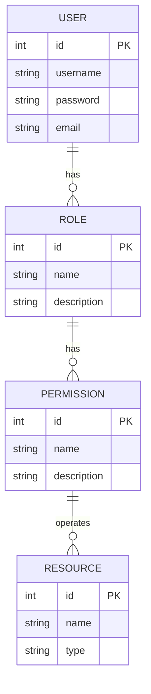
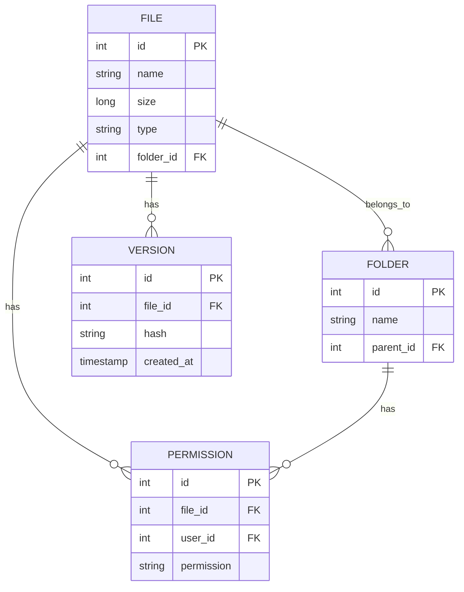
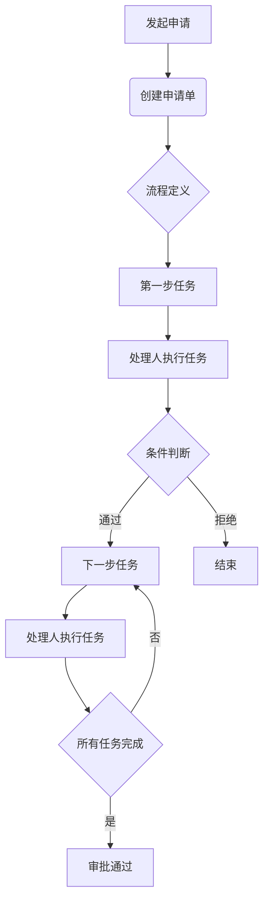

# 企业及其分支机构内部办公管理系统详细设计与具体代码实现

## 1.背景介绍

### 1.1 企业办公管理系统的重要性

在当今快节奏的商业环境中，企业及其分支机构内部的高效协作和资源管理至关重要。传统的手工操作和纸质文件处理方式不仅效率低下,而且容易出现错误和数据丢失。因此,开发一个集中化的企业办公管理系统(Office Automation System,OA)成为了当务之急。

企业OA系统旨在整合企业内部的各项业务流程,实现信息化管理,提高工作效率,降低运营成本。它涵盖了多个模块,如文件管理、审批流程、日程安排、通讯录等,为企业内部的无缝协作提供了强有力的支持。

### 1.2 系统需求分析

在设计企业OA系统之前,我们需要全面分析系统需求。主要需求包括但不限于:

- **用户管理**: 支持不同级别的用户,如普通员工、部门经理和系统管理员,并分配相应的权限。
- **文件管理**: 提供文件上传、下载、预览、版本控制等功能,支持多种文件格式。
- **审批流程**: 实现灵活的工作流审批,如加班申请、采购申请、报销申请等。
- **日程管理**: 个人日程安排、会议室预定等。
- **通讯录**: 企业内部员工信息查询。
- **公告发布**: 发布公司通知、新闻等信息。
- **数据统计**: 提供各类报表,如员工出勤情况、审批流程统计等。

### 1.3 技术选型

基于上述需求,我们选择以下技术栈构建OA系统:

- **前端**: React.js、Ant Design
- **后端**: Spring Boot、MyBatis
- **数据库**: MySQL
- **缓存**: Redis
- **消息队列**: RabbitMQ
- **文件存储**: FastDFS或MinIO
- **搜索引擎**: Elasticsearch (可选)

该技术栈具有良好的生态支持,能够满足系统的高并发、可扩展性和可维护性需求。

## 2.核心概念与联系

### 2.1 用户管理

用户管理是OA系统的基础模块,负责管理系统内的用户账号、角色和权限。我们使用 RBAC (基于角色的访问控制) 模型来设计用户管理系统。

核心概念:

- **用户(User)**: 系统的最终使用者,拥有唯一的用户名和密码。
- **角色(Role)**: 用户所属的角色组,如普通员工、部门经理、系统管理员等。每个角色对应一组特定的权限。
- **权限(Permission)**: 对系统资源的操作许可,如查看文件、发起审批、管理用户等。
- **资源(Resource)**: 系统中可被操作的对象,如文件、审批流程、公告等。

用户与角色、角色与权限、权限与资源之间存在多对多的关联关系,如下图所示:



### 2.2 文件管理

文件管理是OA系统的核心功能之一,用于管理企业内部的各种文件资源。我们采用分布式文件系统(FastDFS或MinIO)来存储文件,并在数据库中维护文件元数据。

核心概念:

- **文件(File)**: 用户上传的文件资源,包括文件名、大小、类型等元数据。
- **文件夹(Folder)**: 用于组织文件的逻辑目录,支持多级嵌套。
- **版本(Version)**: 每次文件更新都会生成一个新的版本,方便追溯文件历史。
- **权限(Permission)**: 控制用户对文件的读写权限。

文件、文件夹、版本和权限之间的关系如下:



### 2.3 审批流程

审批流程是OA系统中非常重要的一个模块,用于自动化处理各种申请流程,如加班申请、采购申请、报销申请等。我们采用工作流引擎来设计和执行审批流程。

核心概念:

- **流程定义(Process Definition)**: 定义审批流程的结构和规则,包括节点、条件、操作等。
- **任务(Task)**: 流程中的每个执行步骤,需要被分配给具体的处理人。
- **申请单(Application)**: 发起审批流程的具体申请,如加班申请单、采购申请单等。
- **处理人(Assignee)**: 负责执行任务的用户或角色。

审批流程的执行过程如下:



### 2.4 其他模块

除了上述三个核心模块,OA系统还包括以下模块:

- **日程管理**: 个人日程安排、会议室预定等。
- **通讯录**: 企业内部员工信息查询。
- **公告发布**: 发布公司通知、新闻等信息。
- **数据统计**: 提供各类报表,如员工出勤情况、审批流程统计等。

这些模块的设计相对简单,不再赘述。我们将重点关注用户管理、文件管理和审批流程三个核心模块。

## 3.核心算法原理具体操作步骤

### 3.1 用户认证与授权

用户认证和授权是系统安全性的基础,我们采用 JWT (JSON Web Token) 和 Spring Security 来实现。

#### 3.1.1 用户认证

用户认证流程如下:

1. 用户提交用户名和密码。
2. 系统验证用户名和密码是否正确。
3. 如果正确,系统生成一个 JWT,其中包含用户ID、角色等claims信息。
4. 将 JWT 返回给客户端,客户端将其存储在本地(通常是localStorage或httpOnly Cookie)。
5. 客户端在后续的请求中携带 JWT。

JWT 的生成代码如下:

```java
@Service
public class JwtService {
    
    @Value("${jwt.secret}")
    private String jwtSecret;
    
    public String generateToken(Authentication authentication) {
        String username = authentication.getName();
        Collection<? extends GrantedAuthority> authorities = authentication.getAuthorities();
        Claims claims = Jwts.claims().setSubject(username);
        claims.put("roles", authorities.stream().map(GrantedAuthority::getAuthority).collect(Collectors.toList()));

        Date currentDate = new Date();
        Date expireDate = new Date(currentDate.getTime() + 604800000); // 7 days

        return Jwts.builder()
                .setClaims(claims)
                .setIssuedAt(currentDate)
                .setExpiration(expireDate)
                .signWith(SignatureAlgorithm.HS512, jwtSecret)
                .compact();
    }
}
```

#### 3.1.2 用户授权

用户授权流程如下:

1. 客户端在请求头中携带 JWT。
2. Spring Security 的 JWT 过滤器从请求头中提取 JWT。
3. 使用密钥验证 JWT 的合法性。
4. 如果合法,从 JWT 中解析出用户ID和角色信息。
5. 加载用户的权限信息。
6. 验证用户是否具有访问请求资源的权限。
7. 如果有权限,执行请求操作;否则返回 403 Forbidden。

Spring Security 配置代码如下:

```java
@Configuration
@EnableWebSecurity
public class SecurityConfig extends WebSecurityConfigurerAdapter {

    @Autowired
    private JwtAuthenticationEntryPoint jwtAuthenticationEntryPoint;

    @Autowired
    private JwtRequestFilter jwtRequestFilter;

    @Autowired
    public void configureGlobal(AuthenticationManagerBuilder auth) throws Exception {
        auth.userDetailsService(jwtUserDetailsService).passwordEncoder(passwordEncoder());
    }

    @Bean
    public PasswordEncoder passwordEncoder() {
        return new BCryptPasswordEncoder();
    }

    @Override
    protected void configure(HttpSecurity httpSecurity) throws Exception {
        httpSecurity.csrf().disable()
                .authorizeRequests()
                .antMatchers("/authenticate").permitAll()
                .anyRequest().authenticated().and()
                .exceptionHandling().authenticationEntryPoint(jwtAuthenticationEntryPoint).and()
                .sessionManagement().sessionCreationPolicy(SessionCreationPolicy.STATELESS);

        httpSecurity.addFilterBefore(jwtRequestFilter, UsernamePasswordAuthenticationFilter.class);
    }
}
```

### 3.2 文件上传与版本控制

文件上传和版本控制是文件管理模块的核心功能,我们使用分布式文件系统 FastDFS 来存储文件数据,并在数据库中维护文件元数据。

#### 3.2.1 文件上传

文件上传流程如下:

1. 客户端选择要上传的文件。
2. 客户端向 FastDFS 发送文件数据,获取文件存储路径。
3. 客户端将文件元数据(名称、大小、类型、存储路径等)发送给服务器。
4. 服务器在数据库中创建文件记录,并为其分配一个唯一的文件ID。
5. 服务器返回文件ID给客户端。

文件上传代码示例:

```java
@RestController
@RequestMapping("/files")
public class FileController {

    @Autowired
    private FileService fileService;

    @PostMapping
    public ResponseEntity<String> uploadFile(@RequestParam("file") MultipartFile file) {
        try {
            String fileId = fileService.uploadFile(file);
            return ResponseEntity.ok(fileId);
        } catch (IOException e) {
            return ResponseEntity.status(HttpStatus.INTERNAL_SERVER_ERROR).build();
        }
    }
}
```

```java
@Service
public class FileService {

    @Autowired
    private FastFileStorageClient fastFileStorageClient;

    @Autowired
    private FileRepository fileRepository;

    public String uploadFile(MultipartFile file) throws IOException {
        String fileExtension = FilenameUtils.getExtension(file.getOriginalFilename());
        String fileId = fastFileStorageClient.uploadFile(file.getBytes(), fileExtension);

        FileMetadata fileMetadata = new FileMetadata();
        fileMetadata.setName(file.getOriginalFilename());
        fileMetadata.setSize(file.getSize());
        fileMetadata.setType(file.getContentType());
        fileMetadata.setPath(fileId);

        FileMetadata savedMetadata = fileRepository.save(fileMetadata);
        return savedMetadata.getId().toString();
    }
}
```

#### 3.2.2 版本控制

每次文件更新都会创建一个新的版本,方便追溯文件历史。版本控制流程如下:

1. 客户端上传新版本的文件数据,获取新的存储路径。
2. 客户端将新版本的文件元数据发送给服务器。
3. 服务器在数据库中创建新的文件版本记录,关联到原始文件。
4. 服务器返回新版本的ID给客户端。

版本控制代码示例:

```java
@RestController
@RequestMapping("/files/{fileId}/versions")
public class FileVersionController {

    @Autowired
    private FileService fileService;

    @PostMapping
    public ResponseEntity<String> uploadNewVersion(@PathVariable String fileId,
                                                   @RequestParam("file") MultipartFile file) {
        try {
            String versionId = fileService.uploadNewVersion(fileId, file);
            return ResponseEntity.ok(versionId);
        } catch (IOException e) {
            return ResponseEntity.status(HttpStatus.INTERNAL_SERVER_ERROR).build();
        }
    }
}
```

```java
@Service
public class FileService {

    // ...

    public String uploadNewVersion(String fileId, MultipartFile file) throws IOException {
        FileMetadata originalFile = fileRepository.findById(UUID.fromString(fileId))
                .orElseThrow(() -> new FileNotFoundException("File not found"));

        String fileExtension = FilenameUtils.getExtension(file.getOriginalFilename());
        String newPath = fastFileStorageClient.uploadFile(file.getBytes(), fileExtension);

        FileVersion newVersion = new FileVersion();
        newVersion.