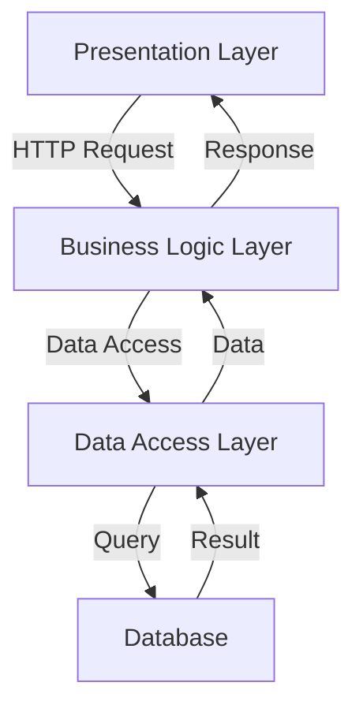
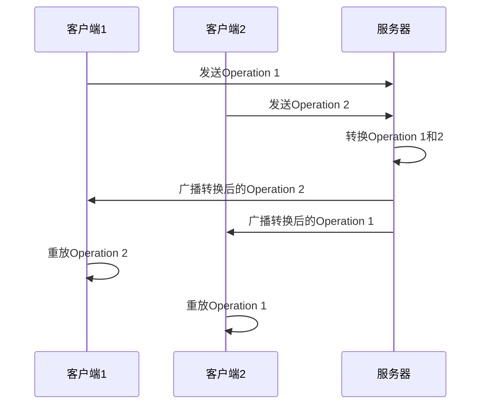
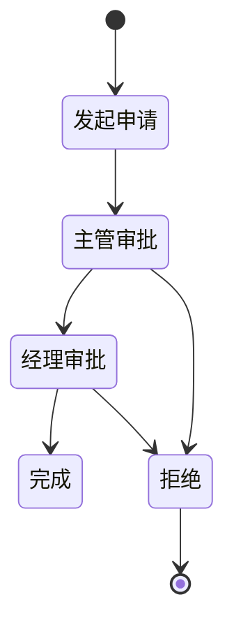

# 企业网上办公自动化系统的设计与实现

## 1.背景介绍

### 1.1 企业网上办公自动化系统的重要性

在当今快节奏的商业环境中,企业需要高效协作和优化工作流程,以保持竞争力。传统的办公方式存在诸多缺陷,如效率低下、沟通不畅、数据管理混乱等。企业网上办公自动化系统(Online Office Automation System,简称OOA)应运而生,旨在提高企业的运营效率、降低运营成本,并增强协作能力。

### 1.2 系统概述

OOA系统是一种基于Web的综合办公平台,集成了多种办公自动化功能模块,如文档协作、流程审批、日程安排、知识管理等。它使员工可以随时随地访问所需的信息和应用程序,有效消除了时间和地理位置的限制,实现了办公流程的自动化和标准化。

## 2.核心概念与联系

### 2.1 系统架构

OOA系统通常采用经典的三层架构(Presentation Layer、Business Logic Layer、Data Access Layer),确保系统的可扩展性、可维护性和安全性。



### 2.2 关键技术

OOA系统涉及多种关键技术,包括但不限于:

- **Web开发技术**:如HTML、CSS、JavaScript等前端技术,以及Java、.NET、Python等后端技术。
- **数据库技术**:如关系型数据库(MySQL、Oracle)和NoSQL数据库(MongoDB、Redis)。
- **中间件技术**:如应用服务器(Tomcat、JBoss)、消息队列(RabbitMQ、Kafka)。
- **安全技术**:如身份认证(OAuth2.0)、数据加密(SSL/TLS)、访问控制(RBAC)。

### 2.3 系统模块

OOA系统通常包含以下核心模块:

- **文档协作模块**:支持多人实时编辑和版本控制。
- **流程审批模块**:自动化处理各类审批流程,提高效率。
- **日程管理模块**:管理个人和团队日程安排。
- **知识管理模块**:构建企业知识库,促进知识共享。
- **通讯协作模块**:支持即时通讯、视频会议等协作方式。

## 3.核心算法原理具体操作步骤

### 3.1 文档协作算法

文档协作模块的核心算法是**运营性变换(Operational Transformation,OT)**,用于解决多人同时编辑同一文档时可能出现的冲突问题。OT算法的基本思路如下:

1. 每个编辑操作被封装为一个运营性变换操作(Operation)。
2. 客户端将本地Operation发送到服务器。
3. 服务器接收到Operation后,根据其他客户端发来的Operation,对本Operation进行转换(Transform),以解决潜在冲突。
4. 服务器将转换后的Operation广播给所有客户端。
5. 客户端接收服务器广播的Operation,并在本地重放(Replay)该Operation。



### 3.2 流程审批算法

流程审批模块的核心是**工作流引擎(Workflow Engine)**,用于定义、执行和监控审批流程。常用的工作流模式有:

- **序列(Sequence)流程**:按顺序逐个执行任务。
- **并行(Parallel)流程**:同时执行多个任务。
- **条件(Conditional)流程**:根据条件决定执行哪个任务。
- **循环(Loop)流程**:重复执行某个或某些任务。

工作流引擎通常基于**有限状态机(Finite State Machine)**实现,将流程定义为一系列状态和转换条件。



### 3.3 日程管理算法

日程管理模块的核心算法是**约会调度(Meeting Scheduling)**,用于协调多人的日程安排。常用的约会调度算法有:

- **贪心算法(Greedy Algorithm)**:从最早的可用时间段开始,尽可能安排更多的与会者。
- **回溯算法(Backtracking Algorithm)**:穷举所有可能的时间段组合,找到最优解。

这些算法需要考虑诸多约束条件,如与会者的优先级、会议室的可用性、时间段的连续性等。

```python
def schedule_meeting(attendees, duration, constraints):
    # 贪心算法伪代码
    sort attendees by priority
    for timeslot in find_available_timeslots(attendees, duration, constraints):
        if can_schedule_all(attendees, timeslot, duration):
            return timeslot
    return None
```

## 4.数学模型和公式详细讲解举例说明

### 4.1 文档协作模型

在文档协作算法中,我们需要对编辑操作进行建模。假设文档是一个字符串,编辑操作可以是插入(Insert)、删除(Delete)或保留(Retain)字符。我们用数学模型来表示:

- 插入操作:$\text{Insert}(p, s)$,在位置$p$插入字符串$s$。
- 删除操作:$\text{Delete}(p, n)$,从位置$p$开始删除$n$个字符。
- 保留操作:$\text{Retain}(p, n)$,保留从位置$p$开始的$n$个字符。

对于两个并发的操作$op_1$和$op_2$,我们需要定义转换函数$\text{Transform}(op_1, op_2)$,将$op_1$转换为$op_1'$,使得$op_1'$和$op_2$可以连续执行而不产生冲突。

例如,对于$\text{Insert}(3, \text{'abc'})$和$\text{Delete}(5, 2)$,经过转换后,我们得到$\text{Insert}(3, \text{'abc'})$和$\text{Delete}(8, 2)$,它们可以连续执行而不冲突。

$$
\begin{aligned}
\text{Transform}(\text{Insert}(p_1, s_1), \text{Delete}(p_2, n_2)) &= \\
\begin{cases}
\text{Insert}(p_1, s_1) &\text{if } p_1 \leq p_2 \\
\text{Insert}(p_1 - n_2, s_1) &\text{if } p_1 > p_2 + n_2 \\
\text{Insert}(p_2, s_1[0:p_1-p_2]) + \text{Insert}(p_2+n_2, s_1[p_1-p_2:]) &\text{otherwise}
\end{cases}
\end{aligned}
$$

### 4.2 工作流模型

在工作流引擎中,我们需要对流程进行建模。一个典型的工作流可以用**有限状态机**来表示,包括以下几个要素:

- $S$:状态的有限集合
- $\Sigma$:事件的有限集合
- $s_0 \in S$:初始状态
- $\delta: S \times \Sigma \rightarrow S$:状态转移函数

例如,一个简单的审批流程可以用如下状态机表示:

$$
\begin{aligned}
S &= \{\text{发起申请}, \text{主管审批}, \text{经理审批}, \text{完成}, \text{拒绝}\} \\
\Sigma &= \{\text{提交}, \text{批准}, \text{驳回}\} \\
s_0 &= \text{发起申请} \\
\delta &= \begin{cases}
\text{主管审批} &\text{if } s = \text{发起申请} \text{ and } e = \text{提交} \\
\text{经理审批} &\text{if } s = \text{主管审批} \text{ and } e = \text{批准} \\
\text{完成} &\text{if } s = \text{经理审批} \text{ and } e = \text{批准} \\
\text{拒绝} &\text{if } s = \text{主管审批} \text{ and } e = \text{驳回} \\
\text{拒绝} &\text{if } s = \text{经理审批} \text{ and } e = \text{驳回}
\end{cases}
\end{aligned}
$$

### 4.3 约会调度模型

在约会调度算法中,我们需要对与会者的日程安排进行建模。假设有$n$个与会者,每个与会者$i$有一个可用时间段集合$T_i$。我们的目标是找到一个时间段$[s, e]$,使得对所有与会者$i$,都有$[s_i, e_i] \in T_i$且$[s_i, e_i] \subseteq [s, e]$。

我们可以将这个问题建模为一个**最大克里克子图(Maximum Clique)问题**。构造一个无向图$G=(V, E)$,其中:

- $V$是所有可用时间段的集合
- 对任意两个时间段$[s_1, e_1]$和$[s_2, e_2]$,如果它们不相交,即$e_1 \leq s_2$或$e_2 \leq s_1$,则在$E$中连一条边

求解$G$的最大克里克子图,即可得到最优的会议时间段。

$$
\begin{aligned}
\text{maximize} \quad &\sum_{v \in V} x_v \\
\text{subject to} \quad &x_u + x_v \leq 1 \quad \forall (u, v) \notin E \\
&x_v \in \{0, 1\} \quad \forall v \in V
\end{aligned}
$$

其中,$x_v$表示节点$v$是否被选中。这是一个经典的NP完全问题,可以使用近似算法求解。

## 4.项目实践:代码实例和详细解释说明

为了更好地理解上述算法和模型,我们以一个简单的文档协作系统为例,展示核心代码实现。

### 4.1 文档协作模块

```python
class Operation:
    def __init__(self, type, position, content):
        self.type = type  # 'insert', 'delete' or 'retain'
        self.position = position
        self.content = content

    def transform(self, other):
        """Transform this operation against another operation"""
        ...

class Document:
    def __init__(self, content):
        self.content = content
        self.operations = []

    def apply_operation(self, operation):
        transformed_ops = [op.transform(operation) for op in self.operations]
        self.operations = transformed_ops + [operation]
        self.content = ''.join(op.apply(self.content) for op in self.operations)

    def receive_operation(self, operation):
        self.apply_operation(operation)
        broadcast(operation)

    def broadcast(self, operation):
        for client in clients:
            client.receive_operation(operation)
```

在上述实现中:

- `Operation`类封装了编辑操作,提供了`transform`方法对操作进行转换。
- `Document`类维护了文档的内容和操作历史记录。
- `apply_operation`方法对操作进行转换并应用到文档中。
- `receive_operation`方法接收操作并广播给其他客户端。

### 4.2 流程审批模块

```python
class WorkflowEngine:
    def __init__(self, definition):
        self.definition = definition
        self.state = definition.initial_state

    def start(self, context):
        self.context = context
        self.run_transition(self.state.on_entry)

    def run_transition(self, transition):
        if transition.condition(self.context):
            self.state = transition.target
            self.run_transition(self.state.on_entry)
        else:
            self.run_transition(self.state.on_else)

class State:
    def __init__(self, on_entry, on_else):
        self.on_entry = on_entry
        self.on_else = on_else

class Transition:
    def __init__(self, condition, target):
        self.condition = condition
        self.target = target
```

在上述实现中:

- `WorkflowEngine`类维护流程的当前状态和上下文数据。
- `start`方法启动流程执行,并触发初始状态的转换。
- `run_transition`方法根据转换条件决定执行哪个状态。
- `State`类封装了状态的行为(on_entry和on_else)。
- `Transition`类封装了状