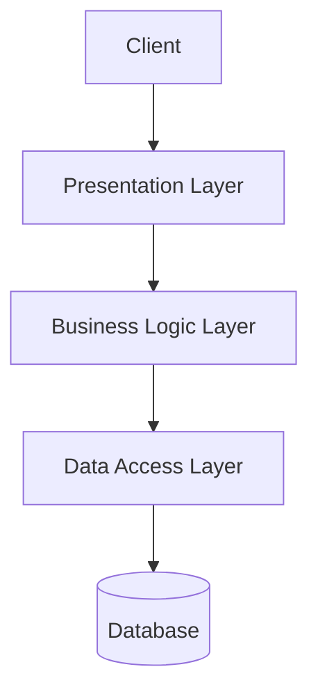
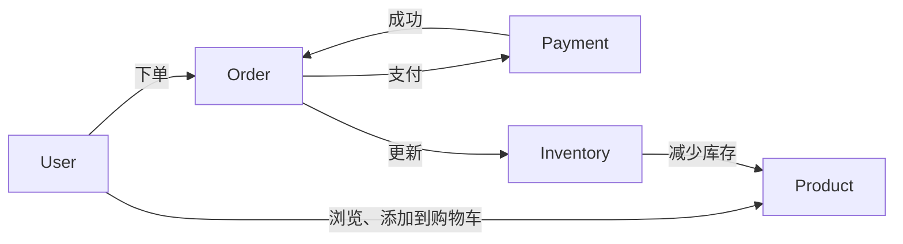

# 企业网上订单系统详细设计与具体代码实现

## 1.背景介绍

在当前数字化时代,企业网上订单系统已经成为现代商业运营的关键组成部分。随着电子商务的不断发展,消费者越来越习惯于通过在线渠道下单购买产品或服务。因此,构建一个高效、安全且用户友好的网上订单系统对于企业来说至关重要。

本文将深入探讨企业网上订单系统的详细设计和具体代码实现,为读者提供一个全面的指南。我们将涵盖以下核心内容:系统架构、数据库设计、前端开发、后端逻辑、安全性考虑、支付集成、订单管理等多个方面。无论您是初学者还是经验丰富的开发人员,本文都将为您提供宝贵的见解和实践经验。

### 1.1 网上订单系统的重要性

网上订单系统在现代企业中扮演着至关重要的角色,它为客户提供了便捷的购物体验,同时也为企业带来了诸多好处:

- 扩大销售渠道,吸引更多潜在客户
- 提高运营效率,降低人工成本
- 收集宝贵的客户数据,改善产品和服务
- 加强品牌形象,提高市场影响力

### 1.2 系统需求概述

在开发网上订单系统之前,我们需要明确系统的基本需求。一个典型的企业网上订单系统应当具备以下核心功能:

- 产品目录展示
- 购物车和结账流程
- 多种支付方式集成
- 订单管理和跟踪
- 用户账户和个人信息管理
- 库存管理
- 报告和分析

## 2.核心概念与联系

在深入探讨系统设计之前,我们需要了解一些核心概念及其相互关系,为后续的系统架构奠定基础。

### 2.1 系统架构概览

企业网上订单系统通常采用三层或多层架构,包括:

- **表现层(Presentation Layer)**: 负责与用户交互的前端界面,通常由HTML、CSS和JavaScript构建。
- **业务逻辑层(Business Logic Layer)**: 处理系统的核心业务逻辑,如订单处理、支付验证、库存管理等,通常由后端编程语言(如Java、Python或Node.js)实现。
- **数据访问层(Data Access Layer)**: 负责与数据库进行交互,执行数据查询、插入、更新和删除操作。
- **其他支持层(Supporting Layers)**: 如缓存层、消息队列层、日志层等,用于提高系统的性能、可靠性和可扩展性。



这种分层架构有助于代码的模块化和可维护性,同时也便于系统的横向扩展和功能拓展。

### 2.2 关键组件及其关系

在网上订单系统中,存在一些关键组件及其相互关系,如下所示:

1. **用户(User)**: 系统的最终使用者,可以浏览产品、添加到购物车、下单和支付等。
2. **产品(Product)**: 系统中销售的商品或服务,具有唯一标识、名称、描述、价格、库存等属性。
3. **购物车(Shopping Cart)**: 用于临时存储用户选择的产品,以便最终结账。
4. **订单(Order)**: 由用户下单后生成的订单记录,包含订单号、下单时间、产品明细、总金额等信息。
5. **支付(Payment)**: 用户通过第三方支付平台(如PayPal、Stripe等)完成订单支付的过程。
6. **库存(Inventory)**: 用于跟踪和管理产品库存水平的系统模块。



这些组件通过相互协作,构成了一个完整的网上订单系统。接下来,我们将详细探讨每个组件的设计和实现。

## 3.核心算法原理具体操作步骤

在构建网上订单系统时,我们需要实现许多核心算法和逻辑,以确保系统的正常运行。本节将重点介绍一些关键算法的原理和具体操作步骤。

### 3.1 购物车算法

购物车算法负责管理用户选择的产品,并计算总金额。它通常包括以下步骤:

1. **添加产品到购物车**:
   - 检查产品是否存在于购物车中
   - 如果存在,增加产品数量
   - 如果不存在,创建新的购物车项目
   - 更新购物车总金额

2. **从购物车中移除产品**:
   - 找到对应的购物车项目
   - 减少产品数量
   - 如果数量为零,则移除该项目
   - 更新购物车总金额

3. **更新购物车项目数量**:
   - 找到对应的购物车项目
   - 更新产品数量
   - 更新购物车总金额

4. **计算购物车总金额**:
   - 遍历所有购物车项目
   - 对每个项目,计算 `项目总价格 = 单价 * 数量`
   - 将所有项目总价格相加,得到购物车总金额

```python
class ShoppingCart:
    def __init__(self):
        self.items = []
        self.total = 0

    def add_item(self, product, quantity):
        # 检查购物车中是否已存在该产品
        item = next((item for item in self.items if item.product == product), None)

        if item:
            # 如果存在,增加数量
            item.quantity += quantity
        else:
            # 如果不存在,创建新项目
            item = CartItem(product, quantity)
            self.items.append(item)

        self.update_total()

    def remove_item(self, product):
        item = next((item for item in self.items if item.product == product), None)
        if item:
            self.items.remove(item)
            self.update_total()

    def update_quantity(self, product, quantity):
        item = next((item for item in self.items if item.product == product), None)
        if item:
            item.quantity = quantity
            self.update_total()

    def update_total(self):
        self.total = sum(item.product.price * item.quantity for item in self.items)
```

这段代码实现了一个简单的购物车类,包含添加、移除、更新数量和计算总金额等功能。在实际应用中,您可能需要添加更多功能,如限制购买数量、处理库存等。

### 3.2 订单处理算法

订单处理算法负责创建新订单、验证订单信息、减少库存等。它通常包括以下步骤:

1. **创建新订单**:
   - 从购物车中获取产品明细和总金额
   - 生成唯一的订单号
   - 保存订单信息(订单号、下单时间、产品明细、总金额等)到数据库

2. **验证订单信息**:
   - 检查产品库存是否足够
   - 验证用户支付信息
   - 如果验证通过,进入下一步骤
   - 如果验证失败,取消订单

3. **减少库存**:
   - 遍历订单中的每个产品
   - 从库存中减去相应的产品数量

4. **处理支付**:
   - 根据订单总金额,调用第三方支付平台进行支付
   - 如果支付成功,更新订单状态为"已付款"
   - 如果支付失败,更新订单状态为"未付款"

5. **发送确认邮件**:
   - 如果订单已付款,向用户发送确认邮件

```python
def process_order(cart, user):
    # 创建新订单
    order = Order()
    order.order_number = generate_order_number()
    order.user = user
    order.order_date = datetime.now()
    order.items = [OrderItem(item.product, item.quantity, item.product.price) for item in cart.items]
    order.total = cart.total

    # 验证订单信息
    if not validate_order(order):
        return None

    # 减少库存
    reduce_inventory(order)

    # 处理支付
    if not process_payment(order):
        order.status = OrderStatus.UNPAID
    else:
        order.status = OrderStatus.PAID
        send_confirmation_email(order)

    # 保存订单到数据库
    save_order(order)

    return order
```

这段代码实现了一个简化版的订单处理流程。在实际应用中,您可能需要添加更多功能,如支持多种支付方式、订单取消和退款等。

### 3.3 库存管理算法

库存管理算法负责跟踪和更新产品库存水平。它通常包括以下步骤:

1. **获取当前库存水平**:
   - 从数据库中查询特定产品的当前库存数量

2. **更新库存水平**:
   - 增加库存:将新进货的产品数量添加到当前库存中
   - 减少库存:从当前库存中减去已售出的产品数量

3. **设置库存上限和下限**:
   - 为每种产品设置库存上限和下限
   - 当库存达到上限时,停止进货
   - 当库存达到下限时,发出补货通知

4. **库存报警**:
   - 当库存低于预设阈值时,发送库存报警通知

```python
def get_inventory_level(product):
    # 从数据库中查询产品库存
    inventory = Inventory.query.filter_by(product_id=product.id).first()
    return inventory.quantity

def update_inventory(product, quantity, operation):
    inventory = Inventory.query.filter_by(product_id=product.id).first()
    if operation == 'add':
        inventory.quantity += quantity
    elif operation == 'subtract':
        inventory.quantity -= quantity
    db.session.commit()

def set_inventory_limits(product, min_level, max_level):
    inventory = Inventory.query.filter_by(product_id=product.id).first()
    inventory.min_level = min_level
    inventory.max_level = max_level
    db.session.commit()

def check_inventory_level(product):
    inventory = Inventory.query.filter_by(product_id=product.id).first()
    if inventory.quantity < inventory.min_level:
        send_low_stock_notification(product)
```

这段代码实现了一个简单的库存管理系统,包含获取库存水平、更新库存、设置库存上下限和库存报警等功能。在实际应用中,您可能需要添加更多功能,如自动补货、库存预测等。

## 4.数学模型和公式详细讲解举例说明

在设计和实现网上订单系统时,我们可能需要使用一些数学模型和公式来优化系统性能、预测需求或进行决策。本节将介绍一些常见的数学模型和公式,并详细解释它们的原理和应用场景。

### 4.1 库存优化模型

库存优化模型旨在确定最佳库存水平,以最小化库存成本并满足客户需求。一种常见的模型是经济订货量(Economic Order Quantity, EOQ)模型。

EOQ模型基于以下假设:

- 需求率已知且恒定
- 缺货成本和库存持有成本已知
- 订货成本和订货交货时间已知且固定

EOQ公式如下:

$$EOQ = \sqrt{\frac{2DC_o}{C_h}}$$

其中:
- $D$ 为年度需求量
- $C_o$ 为每次订货的固定成本
- $C_h$ 为每单位产品的年度库存持有成本

通过计算EOQ,我们可以确定每次订货的最优数量,从而最小化总订货成本和库存持有成本。

例如,假设一种产品的年度需求量为10,000件,每次订货的固定成本为100美元,每件产品的年度库存持有成本为2美元。根据EOQ公式,我们可以计算出最优订货量:

$$EOQ = \sqrt{\frac{2 \times 10,000 \times 100}{2}} = 1,000$$

因此,最优订货量为1,000件。

### 4.2 需求预测模型

需求预测模型用于预测未来一段时间内产品的需求量,从而帮助企业做出更好的库存决策和生产计划。一种常见的需求预测模型是指数平滑法(Exponential Smoothing)。

指数平滑法基于以下公式:

$$F_{t+1} = \alpha Y_t + (1 - \alpha) F_t$$

其中:
- $F_{t+1}$ 为下一期的预测需求量
- $Y_t$ 为当前期的实际需求量
- $F_t$ 为当前期的预测需求量