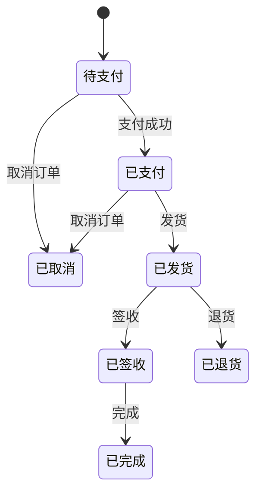

##  企业订单管理系统设计与实现

**作者：禅与计算机程序设计艺术**

## 1. 背景介绍

### 1.1 订单管理系统的重要性

在现代商业社会中，订单是企业运营的核心环节之一。一个高效、可靠的订单管理系统对于企业的运营效率、客户满意度以及最终的盈利能力都至关重要。传统的订单管理方式往往依赖于人工操作，存在着效率低下、易出错、信息不透明等诸多问题。随着企业规模的扩大和业务复杂度的提高，传统的订单管理方式已经难以满足企业发展的需求。

### 1.2 企业订单管理系统概述

企业订单管理系统 (Order Management System, OMS) 是一种自动化、智能化的系统，旨在帮助企业对订单的整个生命周期进行管理，从订单创建、审核、跟踪、执行到最终的交付和售后服务。一个完善的订单管理系统能够帮助企业实现以下目标:

* **提高订单处理效率:** 自动化订单处理流程，减少人工干预，缩短订单处理周期。
* **降低运营成本:** 减少人工成本和错误率，优化库存管理，降低运营成本。
* **提升客户满意度:** 提供实时的订单跟踪信息，提高订单透明度，增强客户信任度。
* **优化库存管理:** 实时监控库存水平，预测库存需求，避免库存积压和缺货。
* **支持业务决策:** 提供全面的订单数据分析，帮助企业进行业务决策。

### 1.3 本文目标

本文旨在探讨企业订单管理系统的设计与实现，从系统架构、核心功能、技术选型、代码实例等方面进行详细阐述，为企业构建高效、可靠的订单管理系统提供参考。

## 2. 核心概念与联系

### 2.1 订单生命周期

订单生命周期是指订单从创建到完成的整个过程，通常包括以下阶段:

1. **订单创建:** 客户提交订单信息，系统生成订单记录。
2. **订单审核:** 相关人员对订单信息进行审核，确认订单的有效性。
3. **订单支付:** 客户完成订单支付，系统更新订单状态。
4. **订单生产/备货:** 企业根据订单信息进行生产或备货。
5. **订单发货:** 订单商品打包发货，系统更新物流信息。
6. **订单签收:** 客户签收订单商品，系统完成订单。
7. **售后服务:** 客户提出售后服务请求，系统进行处理。

### 2.2 订单管理系统核心模块

一个典型的企业订单管理系统通常包括以下核心模块:

* **订单管理模块:**  负责订单的创建、审核、修改、查询、统计等功能。
* **库存管理模块:** 负责商品库存的管理，包括入库、出库、盘点、调拨等功能。
* **物流管理模块:** 负责订单物流信息的管理，包括发货、跟踪、签收等功能。
* **支付管理模块:** 负责订单支付的管理，包括支付方式、支付状态、退款等功能。
* **客户管理模块:** 负责客户信息的管理，包括客户资料、订单历史、售后服务等功能。
* **报表统计模块:** 负责订单数据的统计分析，生成各种报表，为企业决策提供数据支持。

### 2.3 模块间关系

企业订单管理系统各个模块之间相互协作，共同完成订单的整个生命周期管理。例如，订单管理模块负责订单的创建和审核，并将订单信息传递给库存管理模块进行库存扣减；物流管理模块负责订单的发货和跟踪，并将物流信息反馈给订单管理模块；支付管理模块负责订单的支付和退款，并将支付状态更新到订单管理模块。

## 3. 核心算法原理具体操作步骤

### 3.1 订单编号生成算法

订单编号是订单的唯一标识，一个好的订单编号生成算法应该满足以下要求:

* **唯一性:** 每个订单的编号都应该是唯一的，避免重复。
* **可读性:** 订单编号应该具有一定的可读性，方便人工识别和查询。
* **安全性:** 订单编号应该具有一定的安全性，避免被恶意猜测或篡改。

常用的订单编号生成算法有:

* **UUID:**  Universally Unique Identifier，通用唯一识别码，可以保证生成的编号全局唯一，但可读性较差。
* **雪花算法:**  Snowflake，由 Twitter 开发的分布式 ID 生成算法，可以保证生成的编号在分布式环境下唯一，并且具有一定的可读性。
* **自定义规则:**  可以根据业务需求自定义订单编号生成规则，例如，可以使用日期、时间戳、流水号等信息组合生成订单编号。

### 3.2 库存扣减算法

库存扣减是指在订单创建或支付成功后，将订单商品数量从库存中扣除的操作。库存扣减算法的设计需要考虑以下因素:

* **并发控制:** 在高并发场景下，需要保证库存扣减的准确性，避免出现超卖现象。
* **性能优化:**  库存扣减操作会影响订单处理效率，需要进行性能优化。

常用的库存扣减算法有:

* **悲观锁:**  在进行库存扣减操作时，使用数据库的悲观锁机制，保证同一时间只有一个线程可以操作库存数据，避免超卖现象。
* **乐观锁:**  在进行库存扣减操作时，使用数据库的乐观锁机制，通过版本号或时间戳来判断数据是否被修改，如果数据被修改则重试操作，直到成功为止。
* **消息队列:**  将订单信息发送到消息队列中，由专门的库存服务异步处理库存扣减操作，可以提高订单处理效率。

### 3.3 订单状态机

订单状态机用于描述订单在不同状态之间的流转规则。订单状态机可以帮助我们更好地理解订单的生命周期，并确保订单状态的正确性。

一个典型的订单状态机如下所示:



## 4. 数学模型和公式详细讲解举例说明

### 4.1 库存周转率

库存周转率是指一定时间内库存的周转次数，用于衡量企业库存管理的效率。

**公式:**

```
库存周转率 =  销售成本 ÷ 平均库存
```

**其中:**

* 销售成本是指一定时间内销售商品的成本。
* 平均库存是指期初库存与期末库存的平均值。

**举例说明:**

假设某企业2023年的销售成本为1000万元，期初库存为200万元，期末库存为300万元，则该企业的库存周转率为:

```
库存周转率 = 1000 ÷ ((200 + 300) / 2) = 4
```

**结果分析:**

该企业的库存周转率为4，说明该企业的库存周转速度较快，库存管理效率较高。

### 4.2 订单转化率

订单转化率是指下单用户数占访问用户数的比例，用于衡量网站或平台的销售能力。

**公式:**

```
订单转化率 =  下单用户数 ÷ 访问用户数 × 100%
```

**举例说明:**

假设某电商平台一天的访问用户数为10000，下单用户数为1000，则该平台的订单转化率为:

```
订单转化率 = 1000 ÷ 10000 × 100% = 10%
```

**结果分析:**

该电商平台的订单转化率为10%，说明该平台的销售能力较强，能够有效地将访问用户转化为下单用户。

## 5. 项目实践：代码实例和详细解释说明

### 5.1 技术选型

本项目采用 Spring Boot 框架进行开发，使用 MySQL 数据库进行数据存储，使用 Redis 进行缓存，使用 RabbitMQ 进行消息队列。

### 5.2 代码实例

**订单实体类:**

```java
@Entity
@Table(name = "t_order")
public class Order {

    @Id
    @GeneratedValue(strategy = GenerationType.IDENTITY)
    private Long id;

    private String orderNo;

    private Long userId;

    private BigDecimal amount;

    private Integer status;

    // ... other fields and methods
}
```

**订单服务接口:**

```java
public interface OrderService {

    Order createOrder(Order order);

    Order getOrderById(Long id);

    Page<Order> listOrders(Pageable pageable);

    void updateOrderStatus(Long id, Integer status);

    // ... other methods
}
```

**订单服务实现类:**

```java
@Service
public class OrderServiceImpl implements OrderService {

    @Autowired
    private OrderRepository orderRepository;

    @Autowired
    private InventoryService inventoryService;

    @Override
    @Transactional
    public Order createOrder(Order order) {
        // 生成订单编号
        String orderNo = generateOrderNo();
        order.setOrderNo(orderNo);

        // 扣减库存
        inventoryService.reduceInventory(order);

        // 保存订单
        return orderRepository.save(order);
    }

    // ... other methods
}
```

### 5.3 代码解释

* 订单实体类使用 `@Entity` 注解标识为实体类，使用 `@Table` 注解指定数据库表名。
* 订单服务接口定义了订单相关的业务方法。
* 订单服务实现类使用 `@Service` 注解标识为服务类，使用 `@Autowired` 注解注入依赖的 Bean。
* `createOrder()` 方法实现了订单创建的业务逻辑，包括生成订单编号、扣减库存、保存订单等步骤。
* `@Transactional` 注解保证了订单创建操作的事务性。

## 6. 实际应用场景

### 6.1 电商平台

电商平台是订单管理系统的典型应用场景之一。电商平台的订单量巨大，对订单处理效率和准确性要求极高。一个高效的订单管理系统可以帮助电商平台实现以下目标:

* **提高订单处理效率:**  自动化订单处理流程，减少人工干预，缩短订单处理周期。
* **降低运营成本:**  减少人工成本和错误率，优化库存管理，降低运营成本。
* **提升客户满意度:**  提供实时的订单跟踪信息，提高订单透明度，增强客户信任度。

### 6.2 企业ERP系统

企业资源计划 (Enterprise Resource Planning, ERP) 系统是企业内部管理的核心系统之一，订单管理系统通常是 ERP 系统的重要组成部分。订单管理系统可以与 ERP 系统中的其他模块，如财务管理、供应链管理等模块进行集成，实现企业资源的统一管理。

### 6.3 物流行业

物流行业是订单管理系统的另一个重要应用场景。物流企业需要对大量的订单信息进行管理，包括订单接收、运输调度、配送跟踪等。一个完善的订单管理系统可以帮助物流企业实现以下目标:

* **提高物流效率:**  优化运输路线，提高配送效率，降低物流成本。
* **实时跟踪订单状态:**  提供实时的订单跟踪信息，方便客户查询订单状态。
* **优化资源配置:**  合理调配运力资源，提高资源利用率。

## 7. 总结：未来发展趋势与挑战

### 7.1 未来发展趋势

随着技术的不断发展，企业订单管理系统也在不断地发展和完善。未来，企业订单管理系统将呈现以下发展趋势:

* **云化:** 越来越多的企业将选择将订单管理系统部署到云端，以降低成本、提高效率。
* **智能化:** 人工智能、大数据等技术的应用，将使订单管理系统更加智能化，能够自动识别和处理异常订单，提供更加精准的预测和分析。
* **移动化:**  随着移动互联网的普及，企业订单管理系统将更加注重移动端的应用，方便企业随时随地管理订单。
* **一体化:**  订单管理系统将与企业内部的其他系统，如 CRM、ERP 等系统进行更加紧密的集成，实现企业信息化管理的一体化。

### 7.2 面临的挑战

企业在构建和应用订单管理系统的过程中，也面临着一些挑战:

* **数据安全:** 订单管理系统中存储着大量的企业敏感信息，如何保证数据的安全是一个重要的挑战。
* **系统集成:**  订单管理系统需要与企业内部的其他系统进行集成，如何保证系统之间的互联互通是一个挑战。
* **用户体验:**  订单管理系统的用户体验至关重要，如何设计简单易用、功能强大的系统是一个挑战。
* **技术更新:**  随着技术的不断发展，企业需要不断地更新订单管理系统，以适应新的技术和业务需求。

## 8. 附录：常见问题与解答

### 8.1 如何选择合适的订单管理系统?

选择合适的订单管理系统需要考虑以下因素:

* **企业规模和业务需求:** 不同的企业规模和业务需求对订单管理系统的功能要求不同。
* **预算:**  不同的订单管理系统价格差异较大，企业需要根据自身预算选择合适的系统。
* **供应商实力:** 选择有实力的供应商可以保证系统的稳定性和可靠性。
* **用户评价:** 可以参考其他用户的评价，选择口碑较好的系统。

### 8.2 如何保证订单管理系统的数据安全?

保证订单管理系统的数据安全可以采取以下措施:

* **数据加密:** 对敏感数据进行加密存储，防止数据泄露。
* **访问控制:**  设置严格的访问权限，只允许授权用户访问敏感数据。
* **安全审计:**  记录用户的操作日志，方便追溯和审计。
* **定期备份:**  定期备份数据，防止数据丢失。

### 8.3 如何提高订单管理系统的用户体验?

提高订单管理系统的用户体验可以采取以下措施:

* **界面设计简洁明了:**  界面设计要简洁明了，方便用户操作。
* **功能强大易用:**  系统功能要强大，同时要易于使用。
* **提供完善的帮助文档:**  提供完善的帮助文档，帮助用户快速上手。
* **及时响应用户反馈:**  及时响应用户的反馈，解决用户的问题。
