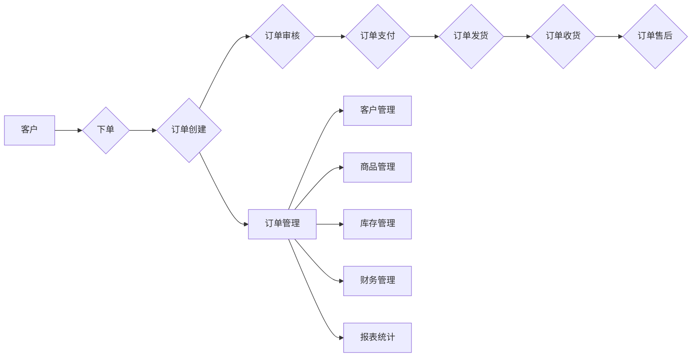
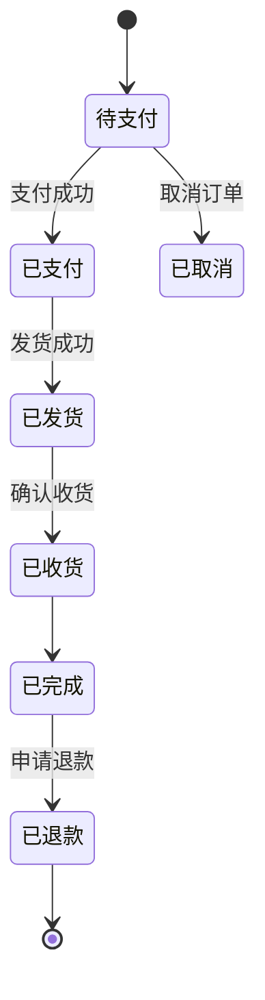

##  企业订单管理系统详细设计与具体代码实现

作者：禅与计算机程序设计艺术

## 1. 背景介绍

### 1.1 订单管理系统的重要性

在现代商业社会中，订单是连接企业与客户的桥梁，是企业运营的核心环节之一。一个高效、可靠的订单管理系统对于企业的运营效率、客户满意度以及最终的盈利能力都至关重要。传统的订单管理方式往往依赖于人工操作，存在着效率低下、易出错、数据难以统计分析等问题。而随着信息技术的快速发展，企业订单管理系统应运而生，并逐渐成为企业信息化建设的重要组成部分。

### 1.2 企业订单管理系统概述

企业订单管理系统（Order Management System，OMS）是指帮助企业对订单进行全生命周期管理的信息化系统，其核心功能包括订单录入、订单处理、订单跟踪、订单报表统计等。通过使用订单管理系统，企业可以实现订单信息的自动化流转、实时监控订单状态、提高订单处理效率、降低运营成本、提升客户满意度。

### 1.3 本文目标

本文旨在介绍企业订单管理系统的详细设计与具体代码实现，帮助读者了解订单管理系统的架构、功能模块、数据库设计以及核心代码实现，并能够根据自身需求进行定制化开发。

## 2. 核心概念与联系

### 2.1 订单生命周期

企业订单的生命周期一般包括以下几个阶段：

1. **订单创建**: 客户下单，生成新的订单信息。
2. **订单审核**: 销售人员对订单进行审核，确认订单信息的准确性和有效性。
3. **订单支付**: 客户完成订单支付。
4. **订单发货**: 仓库根据订单信息进行备货、发货。
5. **订单收货**: 客户确认收货。
6. **订单售后**: 处理客户的退换货、退款等售后服务。

### 2.2 订单管理系统功能模块

企业订单管理系统通常包含以下功能模块：

1. **订单管理**: 包括订单录入、订单查询、订单修改、订单取消、订单打印等功能。
2. **客户管理**: 包括客户信息管理、客户等级管理、客户信用管理等功能。
3. **商品管理**: 包括商品信息管理、商品分类管理、商品库存管理等功能。
4. **库存管理**: 包括库存查询、库存预警、库存盘点等功能。
5. **财务管理**: 包括订单结算、财务报表统计等功能。
6. **报表统计**: 提供各种订单统计报表，例如销售报表、库存报表等，为企业决策提供数据支持。

### 2.3 核心概念关系图



## 3. 核心算法原理具体操作步骤

### 3.1 订单编号生成算法

订单编号是订单的唯一标识，其生成算法需要保证唯一性和可读性。常用的订单编号生成算法有：

1. **UUID**:  生成一个全局唯一的128位标识符，例如：`f81d4fae-7dec-11d0-a765-00a0c91e6bf6`。
2. **雪花算法**:  分布式ID生成算法，生成的ID包含时间戳、机器码、序列号等信息，例如：`1483225805123456789`。
3. **自定义规则**: 根据业务需求自定义订单编号规则，例如：`20240522114349123456`。

### 3.2 订单状态流转算法

订单状态流转是订单管理系统的核心算法之一，它定义了订单在不同阶段的状态以及状态之间的转换规则。例如，一个典型的订单状态流转过程如下：



### 3.3 库存扣减算法

当订单支付成功后，需要根据订单商品信息扣减相应的库存。常用的库存扣减算法有：

1. **悲观锁**: 在扣减库存之前先获取数据库锁，确保同一时间只有一个线程可以操作库存，防止超卖。
2. **乐观锁**: 在扣减库存时使用版本号或时间戳进行校验，如果校验失败则说明库存已被其他线程修改，需要重新尝试扣减。
3. **分布式锁**: 在分布式系统中，可以使用Redis等分布式锁来保证库存扣减的原子性。

## 4. 数学模型和公式详细讲解举例说明

### 4.1 订单金额计算公式

```
订单总金额 = 商品总金额 + 运费 - 优惠金额
```

其中：

* **商品总金额**: 所有商品的单价乘以数量之和。
* **运费**: 根据配送地址和配送方式计算的运费。
* **优惠金额**: 使用优惠券、积分抵扣等优惠活动的优惠金额。

**示例**:

假设一个订单包含以下商品：

| 商品名称 | 单价 | 数量 |
|---|---|---|
| 商品A | 100 | 2 |
| 商品B | 50 | 1 |

运费为10元，优惠金额为20元，则该订单的总金额为：

```
订单总金额 = (100 * 2 + 50 * 1) + 10 - 20 = 240 元
```

### 4.2 库存预警阈值计算公式

```
库存预警阈值 = 平均日销量 * 预警天数
```

其中：

* **平均日销量**: 过去一段时间内商品的平均日销量。
* **预警天数**: 当库存低于该阈值时，系统发出预警提醒。

**示例**:

假设某商品的平均日销量为100件，预警天数设置为3天，则该商品的库存预警阈值为：

```
库存预警阈值 = 100 * 3 = 300 件
```

## 5. 项目实践：代码实例和详细解释说明

### 5.1 技术选型

本项目采用Spring Boot框架进行开发，使用MySQL数据库进行数据存储，前端使用Vue.js框架进行开发。

### 5.2 数据库设计

```sql
-- 订单表
CREATE TABLE `orders` (
  `id` bigint(20) NOT NULL AUTO_INCREMENT COMMENT '订单ID',
  `order_no` varchar(32) NOT NULL COMMENT '订单编号',
  `customer_id` bigint(20) NOT NULL COMMENT '客户ID',
  `order_status` tinyint(4) NOT NULL DEFAULT '0' COMMENT '订单状态：0-待支付，1-已支付，2-已发货，3-已完成，4-已取消',
  `total_amount` decimal(10,2) NOT NULL DEFAULT '0.00' COMMENT '订单总金额',
  `create_time` datetime NOT NULL DEFAULT CURRENT_TIMESTAMP COMMENT '创建时间',
  `update_time` datetime NOT NULL DEFAULT CURRENT_TIMESTAMP ON UPDATE CURRENT_TIMESTAMP COMMENT '更新时间',
  PRIMARY KEY (`id`),
  UNIQUE KEY `uk_order_no` (`order_no`)
) ENGINE=InnoDB AUTO_INCREMENT=1 DEFAULT CHARSET=utf8mb4 COMMENT='订单表';

-- 订单商品表
CREATE TABLE `order_items` (
  `id` bigint(20) NOT NULL AUTO_INCREMENT COMMENT '订单商品ID',
  `order_id` bigint(20) NOT NULL COMMENT '订单ID',
  `product_id` bigint(20) NOT NULL COMMENT '商品ID',
  `product_name` varchar(128) NOT NULL COMMENT '商品名称',
  `product_price` decimal(10,2) NOT NULL DEFAULT '0.00' COMMENT '商品单价',
  `quantity` int(11) NOT NULL DEFAULT '0' COMMENT '商品数量',
  `create_time` datetime NOT NULL DEFAULT CURRENT_TIMESTAMP COMMENT '创建时间',
  `update_time` datetime NOT NULL DEFAULT CURRENT_TIMESTAMP ON UPDATE CURRENT_TIMESTAMP COMMENT '更新时间',
  PRIMARY KEY (`id`),
  KEY `idx_order_id` (`order_id`)
) ENGINE=InnoDB AUTO_INCREMENT=1 DEFAULT CHARSET=utf8mb4 COMMENT='订单商品表';
```

### 5.3 代码实现

#### 5.3.1 订单服务接口

```java
public interface OrderService {

    /**
     * 创建订单
     * @param orderDTO 订单DTO
     * @return 订单ID
     */
    Long createOrder(OrderDTO orderDTO);

    /**
     * 根据订单编号查询订单
     * @param orderNo 订单编号
     * @return 订单DTO
     */
    OrderDTO getOrderByOrderNo(String orderNo);

    /**
     * 支付订单
     * @param orderNo 订单编号
     */
    void payOrder(String orderNo);

    /**
     * 发货订单
     * @param orderNo 订单编号
     */
    void deliverOrder(String orderNo);

    /**
     * 完成订单
     * @param orderNo 订单编号
     */
    void completeOrder(String orderNo);

    /**
     * 取消订单
     * @param orderNo 订单编号
     */
    void cancelOrder(String orderNo);
}
```

#### 5.3.2 订单服务实现类

```java
@Service
public class OrderServiceImpl implements OrderService {

    @Autowired
    private OrderMapper orderMapper;

    @Autowired
    private OrderItemMapper orderItemMapper;

    @Autowired
    private ProductFeignClient productFeignClient;

    @Override
    @Transactional(rollbackFor = Exception.class)
    public Long createOrder(OrderDTO orderDTO) {
        // 校验商品信息
        List<OrderItemDTO> orderItemDTOList = orderDTO.getOrderItemDTOList();
        for (OrderItemDTO orderItemDTO : orderItemDTOList) {
            ProductDTO productDTO = productFeignClient.getProductById(orderItemDTO.getProductId());
            if (productDTO == null) {
                throw new BusinessException("商品不存在");
            }
            if (productDTO.getStock() < orderItemDTO.getQuantity()) {
                throw new BusinessException("商品库存不足");
            }
        }

        // 生成订单编号
        String orderNo = generateOrderNo();

        // 保存订单信息
        Order order = new Order();
        BeanUtils.copyProperties(orderDTO, order);
        order.setOrderNo(orderNo);
        order.setOrderStatus(OrderStatusEnum.UNPAID.getCode());
        orderMapper.insertSelective(order);

        // 保存订单商品信息
        for (OrderItemDTO orderItemDTO : orderItemDTOList) {
            OrderItem orderItem = new OrderItem();
            BeanUtils.copyProperties(orderItemDTO, orderItem);
            orderItem.setOrderId(order.getId());
            orderItemMapper.insertSelective(orderItem);
        }

        // 扣减库存
        for (OrderItemDTO orderItemDTO : orderItemDTOList) {
            productFeignClient.reduceStock(orderItemDTO.getProductId(), orderItemDTO.getQuantity());
        }

        return order.getId();
    }

    @Override
    public OrderDTO getOrderByOrderNo(String orderNo) {
        Order order = orderMapper.selectByOrderNo(orderNo);
        if (order == null) {
            return null;
        }

        OrderDTO orderDTO = new OrderDTO();
        BeanUtils.copyProperties(order, orderDTO);

        List<OrderItem> orderItemList = orderItemMapper.selectByOrderId(order.getId());
        List<OrderItemDTO> orderItemDTOList = orderItemList.stream().map(orderItem -> {
            OrderItemDTO orderItemDTO = new OrderItemDTO();
            BeanUtils.copyProperties(orderItem, orderItemDTO);
            return orderItemDTO;
        }).collect(Collectors.toList());

        orderDTO.setOrderItemDTOList(orderItemDTOList);

        return orderDTO;
    }

    @Override
    @Transactional(rollbackFor = Exception.class)
    public void payOrder(String orderNo) {
        Order order = orderMapper.selectByOrderNo(orderNo);
        if (order == null) {
            throw new BusinessException("订单不存在");
        }

        if (order.getOrderStatus() != OrderStatusEnum.UNPAID.getCode()) {
            throw new BusinessException("订单状态错误");
        }

        order.setOrderStatus(OrderStatusEnum.PAID.getCode());
        orderMapper.updateByPrimaryKeySelective(order);
    }

    @Override
    @Transactional(rollbackFor = Exception.class)
    public void deliverOrder(String orderNo) {
        Order order = orderMapper.selectByOrderNo(orderNo);
        if (order == null) {
            throw new BusinessException("订单不存在");
        }

        if (order.getOrderStatus() != OrderStatusEnum.PAID.getCode()) {
            throw new BusinessException("订单状态错误");
        }

        order.setOrderStatus(OrderStatusEnum.DELIVERED.getCode());
        orderMapper.updateByPrimaryKeySelective(order);
    }

    @Override
    @Transactional(rollbackFor = Exception.class)
    public void completeOrder(String orderNo) {
        Order order = orderMapper.selectByOrderNo(orderNo);
        if (order == null) {
            throw new BusinessException("订单不存在");
        }

        if (order.getOrderStatus() != OrderStatusEnum.DELIVERED.getCode()) {
            throw new BusinessException("订单状态错误");
        }

        order.setOrderStatus(OrderStatusEnum.COMPLETED.getCode());
        orderMapper.updateByPrimaryKeySelective(order);
    }

    @Override
    @Transactional(rollbackFor = Exception.class)
    public void cancelOrder(String orderNo) {
        Order order = orderMapper.selectByOrderNo(orderNo);
        if (order == null) {
            throw new BusinessException("订单不存在");
        }

        if (order.getOrderStatus() != OrderStatusEnum.UNPAID.getCode()) {
            throw new BusinessException("订单状态错误");
        }

        order.setOrderStatus(OrderStatusEnum.CANCELED.getCode());
        orderMapper.updateByPrimaryKeySelective(order);

        // 回退库存
        List<OrderItem> orderItemList = orderItemMapper.selectByOrderId(order.getId());
        for (OrderItem orderItem : orderItemList) {
            productFeignClient.increaseStock(orderItem.getProductId(), orderItem.getQuantity());
        }
    }

    /**
     * 生成订单编号
     * @return 订单编号
     */
    private String generateOrderNo() {
        // 使用雪花算法生成订单编号
        return SnowflakeIdWorker.generateId();
    }
}
```

## 6. 实际应用场景

### 6.1 电商平台

电商平台是订单管理系统最典型的应用场景之一。电商平台每天会产生大量的订单，需要一个高效的订单管理系统来处理订单的创建、支付、发货、售后等环节。

### 6.2 企业内部管理系统

企业内部的采购、销售、库存等业务流程也需要使用订单管理系统来进行管理。例如，企业可以使用订单管理系统来创建采购订单、销售订单，并跟踪订单的执行情况。

### 6.3 物流配送系统

物流配送系统也需要使用订单管理系统来管理配送订单。例如，物流公司可以使用订单管理系统来接收客户的配送订单，并安排配送人员进行配送。

## 7. 工具和资源推荐

### 7.1 开发工具

* IntelliJ IDEA
* Eclipse

### 7.2 数据库

* MySQL
* Oracle

### 7.3 框架

* Spring Boot
* MyBatis

### 7.4 前端框架

* Vue.js
* React

## 8. 总结：未来发展趋势与挑战

### 8.1 未来发展趋势

* **云化**: 越来越多的企业将订单管理系统部署到云平台上，以降低成本、提高效率。
* **智能化**: 随着人工智能技术的不断发展，订单管理系统将更加智能化，例如自动识别订单信息、自动推荐商品、自动处理售后问题等。
* **移动化**: 随着移动互联网的普及，订单管理系统将更加移动化，例如支持手机下单、手机支付、手机查询订单等。

### 8.2 面临的挑战

* **数据安全**: 订单管理系统中存储着大量的客户信息和交易数据，需要采取有效的措施来保障数据安全。
* **系统性能**: 订单管理系统需要处理大量的并发请求，需要保证系统的稳定性和高性能。
* **系统集成**: 订单管理系统需要与企业内部的其他系统进行集成，例如 ERP 系统、CRM 系统等，需要解决系统之间的数据交互和流程协同问题。

## 9. 附录：常见问题与解答

### 9.1 如何保证订单编号的唯一性？

可以使用UUID、雪花算法等算法来生成全局唯一的订单编号。

### 9.2 如何防止超卖？

可以使用悲观锁、乐观锁、分布式锁等机制来防止超卖。

### 9.3 如何提高订单查询效率？

可以对订单表建立索引，使用缓存等技术来提高订单查询效率。
