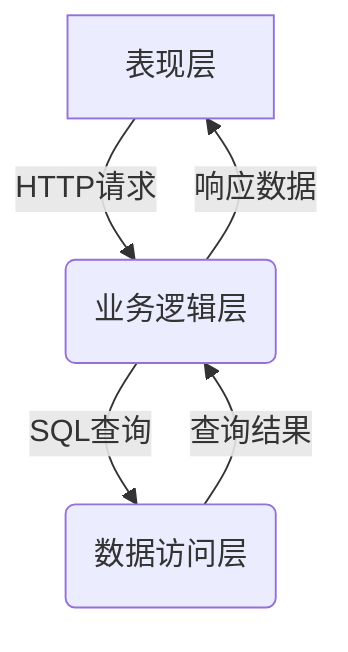
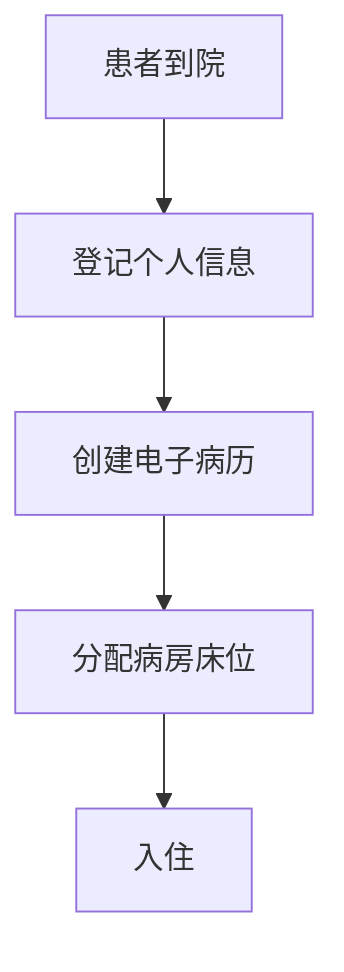
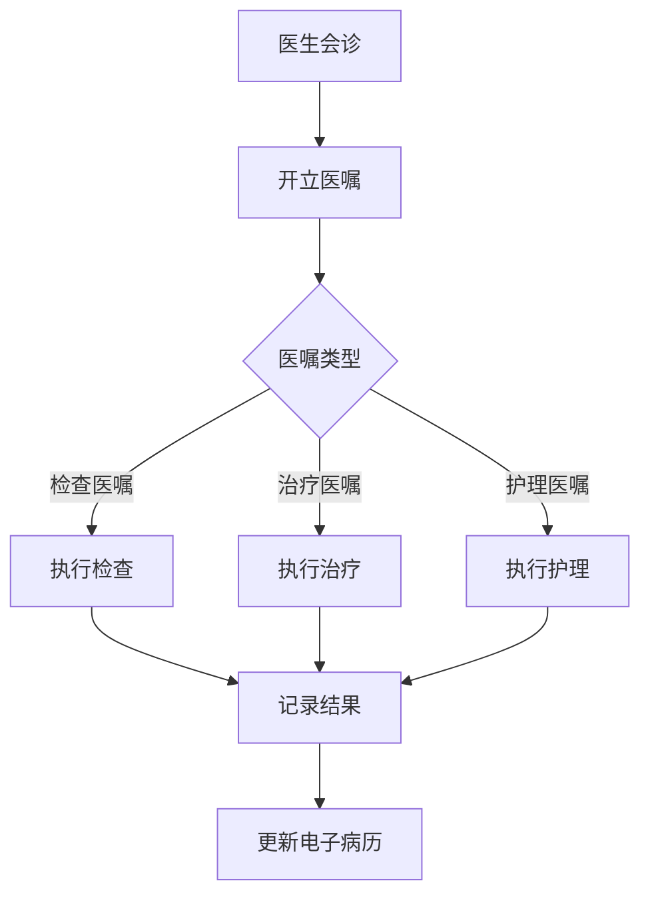
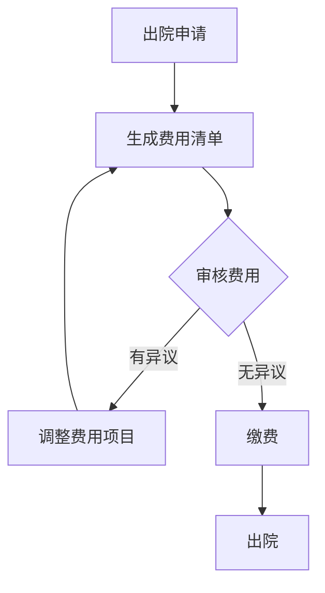

# 住院信息管理系统详细设计与具体代码实现

## 1. 背景介绍

### 1.1 医疗信息化的重要性

在当今医疗卫生事业快速发展的时代，信息化建设已经成为医疗机构提高工作效率、优化资源配置、改善医疗服务质量的关键因素。随着电子病历、远程医疗等新兴技术的不断涌现,医疗信息系统的作用日益凸显。其中,住院信息管理系统作为医院信息化建设的核心组成部分,对于规范住院流程、提高医疗质量、降低运营成本具有重要意义。

### 1.2 住院信息管理系统概述

住院信息管理系统是医院信息系统的重要组成部分,主要负责管理住院患者的入院、诊疗、护理、医嘱执行、费用结算等全过程。它通过对住院环节的信息进行系统化、标准化和流程化管理,实现了数据的电子化采集、存储和共享,为临床诊疗、医疗质量监控、医疗费用控制等提供了有力支撑。

## 2. 核心概念与联系 

### 2.1 核心概念

1. **电子病历(EMR)**:电子病历是以电子数据形式存储和管理患者的诊疗信息,包括病史、体格检查、检查报告、医嘱、护理记录等。
2. **医嘱(Order)**:医嘱是医生为患者开具的各种医疗服务指令,如检查、用药、手术等。
3. **护理记录(Nursing Record)**:护理记录是护士对患者的生命体征、饮食、用药等情况的详细记载。
4. **费用结算(Charge Calculation)**:根据患者的就医过程计算并结算相应的医疗费用。

### 2.2 核心概念之间的联系

住院信息管理系统将上述核心概念紧密联系在一起,构建了完整的住院流程管理体系:

1. 病人入院时,医生根据病史等信息创建电子病历;
2. 在诊疗过程中,医生开具各种医嘱,护士执行医嘱并记录护理情况;
3. 所有诊疗信息均记录在电子病历中,形成动态更新的患者病情记录;
4. 出院时,系统根据电子病历中的诊疗项目进行费用结算。

通过核心概念的有机融合,实现了对住院全过程的信息化管理。

## 3. 核心算法原理具体操作步骤

### 3.1 系统架构设计

住院信息管理系统通常采用三层架构(C/S+B/S混合模式),包括表现层、业务逻辑层和数据访问层,如下图所示:



1. **表现层**:负责与用户交互,接收请求并显示结果,通常采用 Web 技术实现。
2. **业务逻辑层**:处理业务逻辑,对请求进行验证、计算等操作,并与数据库进行交互。
3. **数据访问层**:负责对数据库的增删改查操作。

该架构有利于系统的扩展和维护,实现了展现逻辑、业务逻辑和数据逻辑的分离。

### 3.2 关键业务流程

1. **患者入院流程**



2. **医嘱开立与执行流程**



3. **费用结算流程**



上述流程反映了住院信息管理系统对住院各环节的规范化管理,确保了数据的准确性和完整性。

## 4. 数学模型和公式详细讲解举例说明

在住院信息管理系统中,数学模型和公式主要应用于医疗决策支持、费用计算等领域。以下是一些典型案例:

### 4.1 TISS评分模型

TISS(Therapeutic Intervention Scoring System)是一种评估重症患者所需治疗强度的评分系统,广泛应用于ICU病房。评分公式如下:

$$
\text{TISS评分} = \sum_{i=1}^{n}w_i \cdot x_i
$$

其中:
- $n$ 为评分项目数量
- $w_i$ 为第 $i$ 个项目的权重
- $x_i$ 为第 $i$ 个项目的分值(0或1)

例如,对于"使用呼吸机"这一项目,如果患者使用则 $x_i=1$,权重 $w_i=5$,对总评分的贡献为 $5 \times 1 = 5$。通过汇总各项目的得分,可以评估患者所需的治疗强度。

### 4.2 费用计算模型

住院费用通常包括诊疗费、药费、床位费等多个部分,可用如下公式计算:

$$
\begin{aligned}
\text{总费用} &= \text{诊疗费} + \text{药费} + \text{床位费} + \ldots \\
\text{诊疗费} &= \sum_{\text{诊疗项目}}(\text{项目单价} \times \text{项目数量}) \\
\text{药费} &= \sum_{\text{药品}}(\text{药品单价} \times \text{用量}) \\
\text{床位费} &= \text{床位单价} \times \text{住院天数}
\end{aligned}
$$

例如,某患者住院10天,做了3次X光检查(单价200元),用药阿莫西林2盒(单价50元/盒),床位费600元/天,则:

$$
\begin{aligned}
\text{诊疗费} &= 200 \times 3 = 600\text{元} \\
\text{药费} &= 50 \times 2 = 100\text{元} \\
\text{床位费} &= 600 \times 10 = 6000\text{元} \\
\text{总费用} &= 600 + 100 + 6000 = 6700\text{元}
\end{aligned}
$$

该模型能够自动计算出住院费用的各个组成部分,为医院财务管理提供支持。

上述数学模型和公式为住院信息管理系统提供了科学的决策支持和费用核算能力,提高了医疗质量和运营效率。

## 5. 项目实践: 代码实例和详细解释说明

为了更好地理解住院信息管理系统的实现细节,我们将通过一个基于Spring Boot的示例项目,演示系统的部分核心功能。

### 5.1 系统架构

本示例项目采用了典型的三层架构,主要包括以下模块:

- `hospital-web`: 表现层模块,基于Spring MVC实现Web界面
- `hospital-service`: 业务逻辑层模块,处理业务逻辑
- `hospital-persistence`: 数据访问层模块,封装数据库操作

### 5.2 数据库设计

本系统使用MySQL数据库,主要表结构如下:

- `patient`(患者信息表)
- `admission`(住院信息表)
- `order`(医嘱信息表)
- `charge`(费用信息表)
- ...

以下是`patient`表的部分字段:

```sql
CREATE TABLE `patient` (
  `id` int(11) NOT NULL AUTO_INCREMENT,
  `name` varchar(50) DEFAULT NULL COMMENT '姓名',
  `gender` char(1) DEFAULT NULL COMMENT '性别',
  `age` int(11) DEFAULT NULL COMMENT '年龄',
  `id_card` varchar(20) DEFAULT NULL COMMENT '身份证号',
  PRIMARY KEY (`id`)
) ENGINE=InnoDB DEFAULT CHARSET=utf8mb4 COMMENT='患者信息表';
```

### 5.3 关键功能实现

#### 5.3.1 患者入院

1. 在Web界面上填写患者信息,提交表单
2. `PatientController`接收请求,调用`PatientService`的`addPatient`方法
3. `PatientService`将患者信息保存到`patient`表,并创建相应的`admission`记录
4. 返回新增的患者ID和住院号

```java
// hospital-web/src/main/java/com/hospital/web/controller/PatientController.java
@PostMapping("/patients")
public ResponseEntity<String> addPatient(@RequestBody PatientDTO patientDTO) {
    Long patientId = patientService.addPatient(patientDTO);
    return ResponseEntity.ok("患者ID: " + patientId);
}

// hospital-service/src/main/java/com/hospital/service/impl/PatientServiceImpl.java
@Override
public Long addPatient(PatientDTO patientDTO) {
    Patient patient = new Patient();
    BeanUtils.copyProperties(patientDTO, patient);
    patientMapper.insert(patient);

    Admission admission = new Admission();
    admission.setPatientId(patient.getId());
    admission.setAdmissionDate(new Date());
    admissionMapper.insert(admission);

    return patient.getId();
}
```

#### 5.3.2 医嘱开立与执行

1. 医生在Web界面上为患者开立医嘱
2. `OrderController`接收请求,调用`OrderService`的`addOrder`方法
3. `OrderService`将医嘱信息保存到`order`表
4. 护士查看并执行医嘱,并在Web界面上记录执行结果
5. `OrderController`调用`OrderService`的`updateOrder`方法,更新医嘱状态和结果

```java
// hospital-web/src/main/java/com/hospital/web/controller/OrderController.java
@PostMapping("/orders")
public ResponseEntity<String> addOrder(@RequestBody OrderDTO orderDTO) {
    orderService.addOrder(orderDTO);
    return ResponseEntity.ok("医嘱添加成功");
}

@PutMapping("/orders/{id}")
public ResponseEntity<String> updateOrder(@PathVariable Long id, @RequestBody OrderDTO orderDTO) {
    orderDTO.setId(id);
    orderService.updateOrder(orderDTO);
    return ResponseEntity.ok("医嘱更新成功");
}

// hospital-service/src/main/java/com/hospital/service/impl/OrderServiceImpl.java
@Override
public void addOrder(OrderDTO orderDTO) {
    Order order = new Order();
    BeanUtils.copyProperties(orderDTO, order);
    order.setStatus(OrderStatus.PENDING);
    orderMapper.insert(order);
}

@Override
public void updateOrder(OrderDTO orderDTO) {
    Order order = new Order();
    BeanUtils.copyProperties(orderDTO, order);
    orderMapper.updateByPrimaryKey(order);
}
```

#### 5.3.3 费用结算

1. 患者准备出院时,在Web界面上提交出院申请
2. `ChargeController`接收请求,调用`ChargeService`的`calculateCharges`方法
3. `ChargeService`根据患者的住院记录,计算出诊疗费、药费、床位费等各项费用
4. 将费用信息保存到`charge`表,并返回给Web界面显示
5. 患者确认并支付费用后,系统完成出院流程

```java
// hospital-web/src/main/java/com/hospital/web/controller/ChargeController.java
@GetMapping("/charges/{admissionId}")
public ResponseEntity<ChargeDTO> calculateCharges(@PathVariable Long admissionId) {
    ChargeDTO chargeDTO = chargeService.calculateCharges(admissionId);
    return ResponseEntity.ok(chargeDTO);
}

// hospital-service/src/main/java/com/hospital/service/impl/ChargeServiceImpl.java
@Override
public ChargeDTO calculateCharges(Long admissionId) {
    // 查询该住院记录的所有医嘱
    List<Order> orders = orderMapper.selectByAdmissionId(admissionId);

    // 计算各项费用
    int treatmentCharge = calculateTreatmentCharge(orders);
    int medicineCharge = calculateMedicineCharge(orders);
    int roomCharge = calculateRoomCharge(admissionId);

    // 创建费用记录并保存
    Charge charge = new Charge();
    charge.setAdmissionId(admissionId);
    charge.setTreatmentCharge(treatmentCharge);
    charge.setMedicineCharge(medicineCharge);
    charge.setRoomCharge(roomCharge);
    chargeMapper.insert(charge);

    // 返回费用明细
    ChargeDTO chargeDTO = new ChargeDTO();
    chargeDTO.setTreatmentCharge(treatmentCharge);
    chargeDTO.setMedicineCharge(medicineCharge);
    chargeDTO.setRoomCharge(roomCharge);
    chargeDTO.set