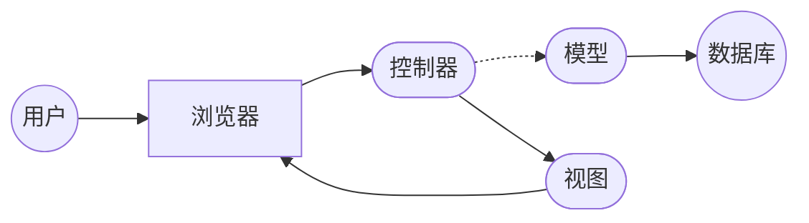

# 供房产信息网站详细设计与具体代码实现

作者：禅与计算机程序设计艺术

## 1. 背景介绍

### 1.1 房产信息网站的兴起与发展

随着互联网的普及和电子商务的快速发展，传统的房地产交易模式正在发生着深刻的变化。房产信息网站作为连接买卖双方、提供房产信息服务的平台，应运而生并迅速发展壮大。从最初简单的信息发布平台，到如今功能完善、服务多元化的综合性网站，房产信息网站已经成为人们进行房产交易的重要渠道。

### 1.2 房产信息网站的功能需求

现代房产信息网站需要满足用户日益增长的需求，提供以下主要功能：

*   **房源信息发布与查询:**  用户可以发布、浏览和搜索各种类型的房产信息，包括新房、二手房、出租房等。
*   **地图找房:**  用户可以通过地图直观地查看房源位置、周边配套设施等信息。
*   **房价走势分析:**  网站可以根据历史数据和市场动态，为用户提供房价走势分析和预测。
*   **在线咨询与预约看房:**  用户可以与房产经纪人进行在线沟通，预约看房时间。
*   **金融服务:**  网站可以与银行、贷款机构合作，为用户提供购房贷款、房屋抵押贷款等金融服务。
*   **用户个人中心:**  用户可以注册账号，管理个人信息、发布房源、收藏感兴趣的房源等。

### 1.3 本文目标

本文旨在提供一个完整的房产信息网站设计方案，涵盖从需求分析、系统设计、数据库设计到代码实现的各个环节。文章将采用简洁易懂的语言，结合实际案例和代码示例，帮助读者深入理解房产信息网站的开发流程和技术要点。

## 2. 核心概念与联系

### 2.1 系统架构

本系统采用经典的MVC (Model-View-Controller) 架构模式，将应用程序划分为三个核心部分：

*   **模型 (Model):** 负责处理数据逻辑，包括数据的存储、检索、更新和删除等操作。
*   **视图 (View):** 负责呈现数据给用户，以及接收用户的输入。
*   **控制器 (Controller):** 负责处理用户请求，调用模型和视图完成相应的操作。

### 2.2 技术选型

*   **后端开发语言:** Python
*   **Web框架:** Django
*   **数据库:** MySQL
*   **前端框架:** Bootstrap、jQuery
*   **地图服务:** 高德地图 API

### 2.3 核心概念关系图



## 3. 核心算法原理具体操作步骤

### 3.1 房源信息发布与查询

#### 3.1.1 发布房源

1.  用户登录网站，进入个人中心。
2.  点击“发布房源”按钮，填写房源信息，包括房屋类型、面积、价格、地址、图片等。
3.  系统对用户输入的信息进行校验，确保信息的完整性和准确性。
4.  校验通过后，系统将房源信息存储到数据库中。

#### 3.1.2 查询房源

1.  用户在首页或搜索页面输入关键词，例如房屋类型、区域、价格区间等。
2.  系统根据用户输入的关键词，从数据库中检索匹配的房源信息。
3.  系统将检索到的房源信息按照一定的排序规则展示给用户，例如距离、价格、发布时间等。

### 3.2 地图找房

#### 3.2.1 地图展示

1.  系统调用高德地图 API，获取地图数据。
2.  系统将房源信息转换为地图上的标记点，并在地图上展示。

#### 3.2.2 地图搜索

1.  用户在地图上选择区域或输入地址进行搜索。
2.  系统根据用户选择的区域或输入的地址，检索该区域内的房源信息。
3.  系统将检索到的房源信息在地图上以标记点的形式展示出来。

### 3.3 房价走势分析

#### 3.3.1 数据收集

1.  系统定期从各大房产网站、中介公司等渠道抓取房源信息。
2.  系统对抓取到的数据进行清洗、去重、格式化等处理。
3.  系统将处理后的数据存储到数据库中。

#### 3.3.2 数据分析

1.  系统根据用户选择的区域、时间段等条件，从数据库中查询相应的房价数据。
2.  系统使用统计学方法对房价数据进行分析，例如计算平均房价、涨跌幅等指标。
3.  系统将分析结果以图表的形式展示给用户。

## 4. 数学模型和公式详细讲解举例说明

### 4.1 房价预测模型

本系统采用线性回归模型来预测房价。线性回归模型假设房价与多个特征之间存在线性关系，例如面积、楼层、朝向等。

#### 4.1.1 模型公式

$$
\text{房价} = w_0 + w_1 * \text{面积} + w_2 * \text{楼层} + ... + w_n * \text{特征n}
$$

其中，$w_0$ 为截距项，$w_1$, $w_2$, ..., $w_n$ 为各个特征的权重系数。

#### 4.1.2 模型训练

1.  从数据库中获取历史房价数据和对应的特征数据。
2.  将数据划分为训练集和测试集。
3.  使用训练集数据对模型进行训练，求解模型参数 $w_0$, $w_1$, $w_2$, ..., $w_n$。

#### 4.1.3 模型预测

1.  获取待预测房源的特征数据。
2.  将特征数据代入训练好的模型中，计算预测房价。

### 4.2 房价走势分析

#### 4.2.1 环比

环比是指与上一个统计周期相比的变化率，例如本月与上月的房价相比。

#### 4.2.2 同比

同比是指与去年同期相比的变化率，例如本月与去年同月的房价相比。

## 5. 项目实践：代码实例和详细解释说明

### 5.1 房源信息模型

```python
from django.db import models

class Property(models.Model):
    """
    房源信息模型
    """
    PROPERTY_TYPE_CHOICES = (
        ('house', '住宅'),
        ('apartment', '公寓'),
        ('villa', '别墅'),
        ('shop', '商铺'),
        ('office', '写字楼'),
    )

    title = models.CharField(max_length=255, verbose_name='标题')
    description = models.TextField(verbose_name='描述')
    property_type = models.CharField(max_length=20, choices=PROPERTY_TYPE_CHOICES, verbose_name='房屋类型')
    area = models.FloatField(verbose_name='面积')
    price = models.DecimalField(max_digits=10, decimal_places=2, verbose_name='价格')
    address = models.CharField(max_length=255, verbose_name='地址')
    latitude = models.FloatField(verbose_name='纬度')
    longitude = models.FloatField(verbose_name='经度')
    created_at = models.DateTimeField(auto_now_add=True, verbose_name='创建时间')
    updated_at = models.DateTimeField(auto_now=True, verbose_name='更新时间')

    def __str__(self):
        return self.title
```

### 5.2 房源信息视图

```python
from django.shortcuts import render, get_object_or_404
from .models import Property

def property_list(request):
    """
    房源列表视图
    """
    properties = Property.objects.all()
    context = {
        'properties': properties,
    }
    return render(request, 'property_list.html', context)

def property_detail(request, property_id):
    """
    房源详情视图
    """
    property = get_object_or_404(Property, pk=property_id)
    context = {
        'property': property,
    }
    return render(request, 'property_detail.html', context)
```

## 6. 实际应用场景

### 6.1 个人用户

*   查找心仪的房产
*   发布出租或出售房源信息
*   了解市场行情，做出更明智的决策

### 6.2 房产经纪人

*   管理房源信息
*   与客户沟通，促成交易
*   拓展业务范围

### 6.3 房地产开发商

*   发布新楼盘信息
*   推广楼盘，吸引购房者
*   收集市场反馈

## 7. 工具和资源推荐

### 7.1 开发工具

*   PyCharm: Python 集成开发环境
*   Navicat: 数据库管理工具
*   Postman: API 测试工具

### 7.2 学习资源

*   Django 官方文档: <https://www.djangoproject.com/>
*   廖雪峰 Python 教程: <https://www.liaoxuefeng.com/wiki/1016959663602400>
*   高德地图 API 文档: <https://lbs.amap.com/api/>

## 8. 总结：未来发展趋势与挑战

### 8.1 未来发展趋势

*   **人工智能与大数据:** 人工智能和大数据技术将更加深入地应用于房产信息网站，例如智能推荐、精准营销、风险控制等方面。
*   **虚拟现实 (VR) 与增强现实 (AR):** VR 和 AR 技术可以为用户提供更加沉浸式的看房体验，例如虚拟看房、户型设计等。
*   **区块链:** 区块链技术可以提高房产交易的透明度和安全性，例如房产信息存证、智能合约等。

### 8.2 面临的挑战

*   **数据安全与隐私保护:** 房产信息网站需要妥善保管用户的个人信息和交易数据，防止数据泄露和滥用。
*   **虚假信息治理:** 网站需要采取有效措施，打击虚假房源信息，维护市场秩序。
*   **用户体验提升:** 网站需要不断优化用户体验，提供更加便捷、高效、智能的服务。

## 9. 附录：常见问题与解答

### 9.1 如何发布房源信息？

用户需要先注册账号并登录网站，然后点击“发布房源”按钮，填写房源信息并提交即可。

### 9.2 如何联系房产经纪人？

用户可以在房源详情页面找到房产经纪人的联系方式，例如电话、微信等。

### 9.3 如何保证房源信息的真实性？

网站会对发布的房源信息进行审核，并与相关部门合作，核实房源信息的真实性。