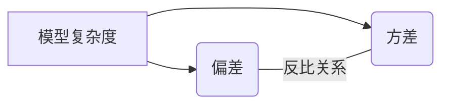

# 偏差与方差权衡:模型复杂度的博弈

作者：禅与计算机程序设计艺术

## 1. 背景介绍

### 1.1 机器学习的预测目标

机器学习的核心目标在于利用数据训练模型，并使其能够对未知数据进行准确预测。这个看似简单的目标背后，却蕴藏着许多挑战，其中一个关键问题就是如何平衡模型的**偏差**和**方差**。

### 1.2 偏差与方差的含义

* **偏差（Bias）**:  描述了模型预测值与真实值之间的平均差异。高偏差意味着模型倾向于忽略数据中的复杂模式，导致预测结果与真实情况存在系统性偏差，通常表现为**欠拟合（Underfitting）**。
* **方差（Variance）**:  描述了模型预测值在不同训练数据集上的波动程度。高方差意味着模型对训练数据过于敏感，学习了数据中的噪声和随机波动，导致预测结果不稳定，通常表现为**过拟合（Overfitting）**。

### 1.3 偏差-方差困境

在机器学习中，我们常常面临着一种两难境地：

* **简单的模型**通常具有较低的方差，但可能存在较高的偏差。
* **复杂的模型**通常具有较低的偏差，但可能存在较高的方差。

这种现象被称为**偏差-方差困境（Bias-Variance Dilemma）**。

## 2. 核心概念与联系

### 2.1 模型复杂度

模型复杂度是导致偏差-方差权衡的关键因素之一。简单来说，模型复杂度可以理解为模型学习数据模式的能力。

* **低复杂度模型**:  例如线性回归模型，只能学习数据中的线性关系，对复杂模式的拟合能力有限。
* **高复杂度模型**:  例如深度神经网络，能够学习数据中的非线性、高维特征，对复杂模式的拟合能力更强。

### 2.2 偏差-方差-模型复杂度关系图

下图直观地展示了偏差、方差与模型复杂度之间的关系：



* **模型复杂度较低时**: 模型偏差较大，方差较小。
* **随着模型复杂度增加**: 模型偏差逐渐减小，方差逐渐增大。
* **模型复杂度过高时**: 模型偏差很小，但方差很大。

### 2.3 偏差-方差权衡的目标

偏差-方差权衡的目标是找到一个**最佳的模型复杂度**，使得模型在偏差和方差之间取得平衡，从而获得最佳的泛化性能，即在 unseen data 上表现良好。

## 3. 核心算法原理具体操作步骤

### 3.1 偏差与方差的评估方法

* **偏差**:  可以使用训练集上的误差来估计模型偏差。如果模型在训练集上误差较大，则说明模型存在较大的偏差。
* **方差**:  可以使用验证集或交叉验证来估计模型方差。如果模型在不同数据集上的表现差异很大，则说明模型存在较大的方差。

### 3.2 偏差-方差权衡的常用方法

#### 3.2.1 正则化 (Regularization)

正则化是一种常用的降低模型复杂度、减小方差的技术。它通过在模型训练过程中添加惩罚项来限制模型参数的取值范围，从而防止模型过拟合。常见的正则化方法包括：

* **L1 正则化**:  将模型参数的绝对值之和添加到损失函数中。
* **L2 正则化**:  将模型参数的平方和添加到损失函数中。

#### 3.2.2  提前停止 (Early Stopping)

提前停止是一种简单有效的防止过拟合的方法。它在模型训练过程中，监控模型在验证集上的性能，当验证集上的性能开始下降时，停止模型训练。

#### 3.2.3  集成学习 (Ensemble Learning)

集成学习通过组合多个模型来降低方差。常见的集成学习方法包括：

* **Bagging**:  通过对训练数据进行自助采样，训练多个相同的模型，然后将这些模型的预测结果进行平均或投票。
* **Boosting**:  通过依次训练多个模型，每个模型都针对前一个模型的错误进行学习，最终将所有模型的预测结果进行加权平均。

## 4. 数学模型和公式详细讲解举例说明

### 4.1 偏差-方差分解

模型的泛化误差可以分解为偏差、方差和噪声之和：

$$
E[(y - \hat{f}(x))^2] = Bias[\hat{f}(x)]^2 + Var[\hat{f}(x)] + \sigma^2
$$

其中：

* $E[(y - \hat{f}(x))^2]$ 表示模型的期望泛化误差。
* $Bias[\hat{f}(x)] = E[\hat{f}(x)] - f(x)$ 表示模型的偏差，即模型预测值的期望与真实值之间的差异。
* $Var[\hat{f}(x)] = E[(\hat{f}(x) - E[\hat{f}(x)])^2]$ 表示模型的方差，即模型预测值在不同训练数据集上的波动程度。
* $\sigma^2$ 表示数据中的噪声。

### 4.2  举例说明

假设我们想建立一个模型来预测房价。我们收集了 1000 个房屋样本的数据，其中包括房屋面积、卧室数量、浴室数量等特征。

* **低复杂度模型**:  我们可以使用线性回归模型来预测房价。线性回归模型假设房价与各个特征之间存在线性关系。
* **高复杂度模型**:  我们可以使用深度神经网络来预测房价。深度神经网络可以学习数据中的非线性关系。

如果我们使用线性回归模型，模型的偏差可能会比较大，因为房价与各个特征之间的关系可能是非线性的。但模型的方差会比较小，因为线性回归模型比较稳定，不容易受到数据中噪声的影响。

如果我们使用深度神经网络，模型的偏差可能会比较小，因为深度神经网络可以学习数据中的非线性关系。但模型的方差可能会比较大，因为深度神经网络比较复杂，容易受到数据中噪声的影响。

## 5. 项目实践：代码实例和详细解释说明

### 5.1 Python 代码实例

```python
import numpy as np
import pandas as pd
from sklearn.model_selection import train_test_split
from sklearn.linear_model import LinearRegression
from sklearn.preprocessing import PolynomialFeatures
from sklearn.metrics import mean_squared_error

# 生成模拟数据
np.random.seed(0)
X = np.random.randn(100, 1)
y = 2 * X[:, 0] + 3 * X[:, 0] ** 2 + np.random.randn(100)

# 划分训练集和测试集
X_train, X_test, y_train, y_test = train_test_split(
    X, y, test_size=0.2, random_state=42
)

# 线性回归模型
lr = LinearRegression()
lr.fit(X_train, y_train)
y_pred_lr = lr.predict(X_test)

# 多项式回归模型
poly = PolynomialFeatures(degree=10)
X_train_poly = poly.fit_transform(X_train)
X_test_poly = poly.transform(X_test)
lr_poly = LinearRegression()
lr_poly.fit(X_train_poly, y_train)
y_pred_lr_poly = lr_poly.predict(X_test_poly)

# 计算均方误差
mse_lr = mean_squared_error(y_test, y_pred_lr)
mse_lr_poly = mean_squared_error(y_test, y_pred_lr_poly)

# 打印结果
print(f"线性回归模型 MSE: {mse_lr:.2f}")
print(f"多项式回归模型 MSE: {mse_lr_poly:.2f}")
```

### 5.2 代码解释

* 首先，我们使用 `numpy` 生成模拟数据，并使用 `sklearn.model_selection.train_test_split` 将数据划分为训练集和测试集。
* 然后，我们分别训练线性回归模型和多项式回归模型。
* 最后，我们使用 `sklearn.metrics.mean_squared_error` 计算模型在测试集上的均方误差。

### 5.3 结果分析

运行代码，我们可以得到如下结果：

```
线性回归模型 MSE: 8.22
多项式回归模型 MSE: 1.13
```

可以看出，多项式回归模型的均方误差要小于线性回归模型的均方误差。这是因为多项式回归模型可以学习数据中的非线性关系，而线性回归模型只能学习数据中的线性关系。

## 6. 实际应用场景

### 6.1 图像识别

在图像识别领域，模型复杂度对识别精度有很大影响。如果模型过于简单，则可能无法识别出图像中的复杂模式，导致识别精度较低。反之，如果模型过于复杂，则可能会过拟合训练数据，导致在测试数据上的识别精度较低。

### 6.2 自然语言处理

在自然语言处理领域，模型复杂度对文本生成质量有很大影响。如果模型过于简单，则生成的文本可能会比较生硬、不自然。反之，如果模型过于复杂，则生成的文本可能会出现语义不通顺、逻辑混乱等问题。

## 7. 总结：未来发展趋势与挑战

### 7.1 自动机器学习 (AutoML)

AutoML 旨在自动化机器学习流程中的各个环节，包括特征工程、模型选择、超参数优化等。AutoML 可以帮助我们更高效地找到最佳的模型复杂度，从而解决偏差-方差权衡问题。

### 7.2 深度学习模型的可解释性

深度学习模型的复杂度越来越高，但其可解释性却越来越差。如何提高深度学习模型的可解释性，是未来发展的一个重要挑战。

## 8. 附录：常见问题与解答

### 8.1 如何选择合适的模型复杂度？

选择合适的模型复杂度需要根据具体问题和数据进行分析。一般来说，可以考虑以下因素：

* **数据的规模和维度**:  如果数据规模较小或维度较高，则应选择复杂度较低的模型。
* **数据的噪声水平**:  如果数据噪声较大，则应选择复杂度较低的模型。
* **模型的训练时间和计算成本**:  复杂度较高的模型通常需要更长的训练时间和更高的计算成本。

### 8.2 如何判断模型是否过拟合？

可以通过以下方法判断模型是否过拟合：

* **训练集和验证集上的误差差异**:  如果模型在训练集上的误差很小，但在验证集上的误差很大，则说明模型可能过拟合了。
* **学习曲线**:  学习曲线可以绘制模型在不同训练数据量下的训练误差和验证误差。如果学习曲线显示训练误差持续下降，但验证误差在某个点之后开始上升，则说明模型可能过拟合了。