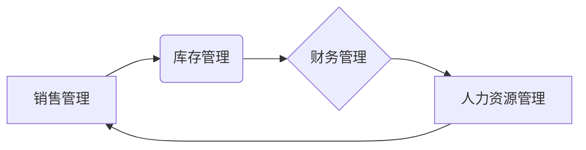

##  公司综合管理系统详细设计与具体代码实现

作者：禅与计算机程序设计艺术

## 1. 背景介绍

### 1.1 企业管理现状与挑战

随着信息技术的飞速发展和市场竞争的日益激烈，企业面临着越来越大的管理压力。传统的管理模式已经难以适应现代企业发展的需求，主要体现在以下几个方面：

* **信息孤岛现象严重:** 各个部门之间信息封闭，数据难以共享，导致决策效率低下。
* **业务流程繁琐:** 手动操作多，流程冗长，容易出错且难以追溯。
* **数据分析能力不足:**  缺乏有效的数据分析工具，无法及时发现问题、优化流程、提升效率。
* **管理成本高昂:**  人工成本、沟通成本、管理成本居高不下。

### 1.2 公司综合管理系统概述

为了应对上述挑战，越来越多的企业开始寻求信息化解决方案，公司综合管理系统应运而生。公司综合管理系统，也称为ERP (Enterprise Resource Planning)系统，是一种集信息技术与先进管理思想于一体的企业管理软件。它通过整合企业内部所有资源信息，实现资源优化配置，提高企业运营效率，增强企业核心竞争力。

### 1.3 系统设计目标

本系统旨在为企业提供一个全面、高效、易用的管理平台，实现以下目标：

* **打破信息孤岛:**  整合企业各部门数据，实现信息共享和协同办公。
* **优化业务流程:**  简化业务流程，实现流程自动化，提高工作效率。
* **提升数据分析能力:**  提供强大的数据分析工具，为企业决策提供数据支持。
* **降低管理成本:**  减少人工成本和管理成本，提高企业效益。

## 2. 核心概念与联系

### 2.1 模块划分

本系统采用模块化设计思想，将系统划分为以下几个核心模块：

* **人力资源管理模块:**  包括员工信息管理、招聘管理、培训管理、薪酬管理、绩效考核等功能。
* **财务管理模块:**  包括总账管理、应收应付管理、固定资产管理、成本管理、预算管理等功能。
* **销售管理模块:**  包括客户关系管理、销售订单管理、销售发货管理、销售收款管理等功能。
* **采购管理模块:**  包括供应商管理、采购订单管理、采购入库管理、采购付款管理等功能。
* **库存管理模块:**  包括仓库管理、物料管理、库存盘点等功能。
* **生产管理模块:**  包括生产计划管理、物料需求计划、生产调度管理、生产成本管理等功能。
* **系统管理模块:**  包括用户管理、角色管理、权限管理、系统日志等功能。

### 2.2 模块间联系

各模块之间相互协作，形成一个完整的业务闭环。例如，销售订单生成后，会自动传递到库存模块进行库存扣减，同时生成应收款信息到财务模块。

### 2.3 数据流图



## 3. 核心算法原理具体操作步骤

### 3.1 数据加密算法

本系统采用AES (Advanced Encryption Standard) 高级加密标准对敏感数据进行加密存储，确保数据安全。

**操作步骤:**

1. 生成一个随机的密钥。
2. 使用密钥对数据进行加密。
3. 将加密后的数据存储到数据库中。
4. 当需要读取数据时，使用密钥对数据进行解密。

### 3.2 工作流引擎

本系统采用 Camunda 工作流引擎实现业务流程自动化。

**操作步骤:**

1. 使用 BPMN (Business Process Model and Notation) 对业务流程进行建模。
2. 部署流程模型到 Camunda 引擎。
3. 启动流程实例，并传递相关数据。
4. Camunda 引擎根据流程定义自动执行任务，并更新流程状态。
5. 用户可以通过 Camunda 任务列表查看和处理待办任务。

## 4. 数学模型和公式详细讲解举例说明

### 4.1 财务报表分析

本系统提供财务报表分析功能，帮助企业分析经营状况。

**公式:**

* 净利润 = 营业收入 - 营业成本 - 税金及附加 - 销售费用 - 管理费用 - 财务费用 - 资产减值损失 + 公允价值变动收益 + 投资收益
* 毛利率 = 毛利 / 营业收入
* 净利率 = 净利润 / 营业收入

**举例说明:**

假设某企业2023年营业收入为1000万元，营业成本为600万元，税金及附加为100万元，销售费用为50万元，管理费用为50万元，财务费用为20万元，资产减值损失为10万元，公允价值变动收益为30万元，投资收益为20万元。

则该企业2023年的净利润为:

```
净利润 = 1000 - 600 - 100 - 50 - 50 - 20 - 10 + 30 + 20 = 220 万元
```

毛利率为:

```
毛利率 = (1000 - 600) / 1000 = 40%
```

净利率为:

```
净利率 = 220 / 1000 = 22%
```

### 4.2 库存周转率

**公式:**

* 库存周转率 =  销售成本 / 平均库存

**举例说明:**

假设某企业2023年销售成本为800万元，年初库存为100万元，年末库存为150万元。

则该企业2023年的平均库存为:

```
平均库存 = (100 + 150) / 2 = 125 万元
```

库存周转率为:

```
库存周转率 = 800 / 125 = 6.4 次
```

## 5. 项目实践：代码实例和详细解释说明

### 5.1 技术选型

本系统采用以下技术栈进行开发:

* 后端: Spring Boot
* 数据库: MySQL
* 前端: Vue.js
* 工作流引擎: Camunda
* 报表工具:  FineReport

### 5.2 代码实例

以下是一个简单的用户登录功能的代码示例:

**Controller:**

```java
@RestController
@RequestMapping("/api/auth")
public class AuthController {

    @Autowired
    private AuthenticationManager authenticationManager;

    @Autowired
    private JwtTokenUtil jwtTokenUtil;

    @Autowired
    private UserDetailsService userDetailsService;

