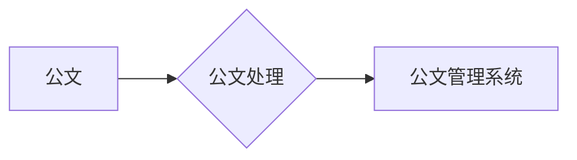

# 公文管理系统详细设计与具体代码实现

作者：禅与计算机程序设计艺术

## 1. 背景介绍

### 1.1 公文管理的意义

在信息化时代，公文作为企事业单位日常工作中重要的信息载体，其管理效率直接影响着组织的运转效率和信息化水平。传统的纸质公文管理方式存在着诸多弊端，如：

* **查找困难：**  纸质公文存储分散，查找耗时耗力。
* **易丢失损坏：**  纸质文件易受潮、虫蛀、火灾等因素影响，存在丢失和损坏的风险。
* **效率低下：**  公文流转环节繁琐，审批效率低下。
* **难以统计分析：**  纸质公文难以进行数据统计和分析，无法为决策提供有效依据。

### 1.2 公文管理系统概述

公文管理系统应运而生，旨在利用信息化技术手段，对公文进行全生命周期管理，实现公文的电子化、流程化、规范化和安全化。

### 1.3 本系统目标

本系统旨在设计和实现一套功能完善、性能稳定、安全可靠的公文管理系统，以满足现代企事业单位对公文管理的需求。

## 2. 核心概念与联系

### 2.1 公文

公文是指党政机关、企事业单位、社会团体等组织在公务活动中形成和使用的具有特定格式和规范体式的文书。

### 2.2 公文处理

公文处理是指对公文的起草、审核、签发、办理、传递、归档等一系列活动的总称。

### 2.3 公文管理系统

公文管理系统是指利用计算机技术对公文进行全生命周期管理的软件系统，包括公文的创建、编辑、审批、发布、归档、查询、统计等功能。

### 2.4 关系图



## 3. 核心算法原理具体操作步骤

### 3.1 公文流转流程

公文流转是公文处理的核心环节，本系统采用基于角色的工作流引擎实现公文流转的自动化。

1. **创建流程模型：**  管理员根据实际业务需求，配置公文流转的流程模型，包括流程节点、流转规则等。
2. **发起流程：**  用户选择相应的流程模型，填写公文信息，发起公文流程。
3. **节点审批：**  公文按照预设的流程流转到各个节点，节点审批人对公文进行审批操作。
4. **流程结束：**  公文审批通过后，流程结束，公文进入归档状态。

### 3.2  权限控制

为了保证公文的安全性，本系统采用基于角色的访问控制（RBAC）模型实现权限管理。

1. **定义角色：**  管理员根据用户职责定义不同的角色，如系统管理员、部门经理、普通用户等。
2. **分配权限：**  管理员为每个角色分配相应的操作权限，如创建公文、审批公文、查看公文等。
3. **用户认证：**  用户登录系统时，系统验证用户的身份和角色，并根据用户的角色授予相应的操作权限。

## 4. 数学模型和公式详细讲解举例说明

本系统中未使用复杂的数学模型和算法。

## 5. 项目实践：代码实例和详细解释说明

### 5.1 技术架构

本系统采用前后端分离的架构模式，前端使用Vue.js框架，后端使用Spring Boot框架。

```
├── frontend
│   ├── public
│   └── src
│       ├── api
│       ├── components
│       ├── router
│       ├── store
│       ├── utils
│       └── main.js
└── backend
    ├── src
    │   ├── main
    │   │   └── java
    │   │       └── com
    │   │           └── example
    │   │               └── documentmanagement
    │   │                   ├── DocumentManagementApplication.java
    │   │                   ├── config
    │   │                   ├── controller
    │   │                   ├── entity
    │   │                   ├── service
    │   │                   ├── repository
    │   │                   └── exception
    │   └── test
    │       └── java
    │           └── com
    │               └── example
    │                   └── documentmanagement
    └── pom.xml

```

### 5.2 代码实例

**前端代码：**

```javascript
// 发起公文流程
const submitDocument = async () => {
  try {
    const response = await axios.post('/api/documents', {
      // 公文信息
    });
    // 处理成功响应
  } catch (error) {
    // 处理错误响应
  }
};

// 审批公文
const approveDocument = async (documentId) => {
  try {
    const response = await axios.put(`/api/documents/${documentId}/approve`);
    // 处理成功响应
  } catch (error) {
    // 处理错误响应
  }
};
```

**后端代码：**

```java
// 创建公文
@PostMapping("/documents")
public Document createDocument(@RequestBody Document document) {
  // 保存公文信息
  return documentRepository.save(document);
}

// 审批公文
@PutMapping("/documents/{id}/approve")
public Document approveDocument(@PathVariable Long id) {
  // 更新公文审批状态
  Document document = documentRepository.findById(id).orElseThrow(() -> new ResourceNotFoundException("Document not found"));
  document.setStatus(DocumentStatus.APPROVED);
  return documentRepository.save(document);
}
```

## 6. 实际应用场景

### 6.1 政府机关

政府机关可以使用公文管理系统处理各类公文，如红头文件、通知公告、请示报告等，提高公文处理效率和规范化水平。

### 6.2 企事业单位

企事业单位可以使用公文管理系统处理内部公文，如会议纪要、工作总结、合同协议等，实现公文的安全存储和高效流转。

## 7. 工具和资源推荐

### 7.1 开发工具

* IntelliJ IDEA
* Visual Studio Code
* Eclipse

### 7.2 数据库

* MySQL
* Oracle
* PostgreSQL

### 7.3 前端框架

* Vue.js
* React
* Angular

### 7.4 后端框架

* Spring Boot
* Django
* Flask

## 8. 总结：未来发展趋势与挑战

### 8.1 发展趋势

* **云化部署：**  公文管理系统将越来越多的部署在云平台上，以降低运维成本和提高系统可靠性。
* **移动办公：**  移动办公已成为趋势，公文管理系统需要支持移动端审批和查阅功能，方便用户随时随地处理公文。
* **人工智能应用：**  人工智能技术可以应用于公文内容分析、自动分类、智能推荐等方面，进一步提高公文处理效率。

### 8.2 面临挑战

* **数据安全：**  公文数据属于敏感信息，需要采取严格的安全措施保障数据安全。
* **系统集成：**  公文管理系统需要与其他业务系统进行集成，以实现数据共享和业务协同。
* **用户体验：**  公文管理系统需要提供简洁易用的操作界面，提升用户体验。

## 9. 附录：常见问题与解答

### 9.1  如何保证公文数据的安全性？

**答：**  本系统采用多重安全措施保障公文数据安全，包括：

* **数据加密：**  对敏感数据进行加密存储，防止数据泄露。
* **访问控制：**  采用基于角色的访问控制模型，限制用户对数据的访问权限。
* **安全审计：**  记录用户对数据的操作日志，方便追溯和审计。

### 9.2  如何实现公文管理系统与其他系统的集成？

**答：**  本系统提供多种集成方式，包括：

* **API接口：**  提供RESTful API接口，方便其他系统调用公文管理系统功能。
* **数据同步：**  支持与其他系统进行数据同步，实现数据共享。
* **单点登录：**  支持单点登录功能，方便用户在不同系统之间切换。
