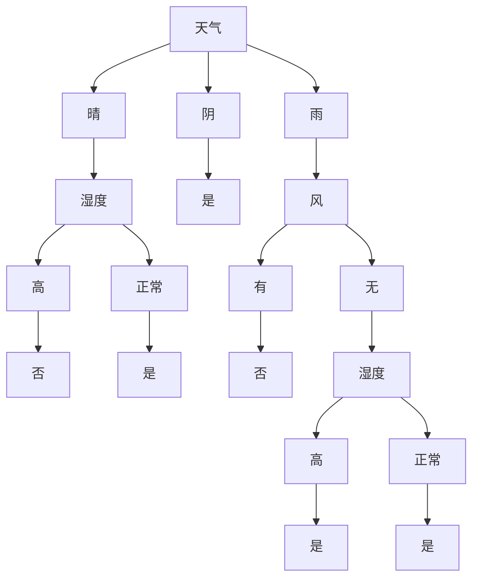

# 决策树与规则提取原理与代码实战案例讲解

作者：禅与计算机程序设计艺术

## 1. 背景介绍
### 1.1 决策树在机器学习与数据挖掘中的重要地位
### 1.2 规则提取在知识表示与抽取中的应用价值
### 1.3 本文的主要内容与贡献

## 2. 核心概念与联系
### 2.1 决策树
#### 2.1.1 定义与基本思想  
#### 2.1.2 决策树的表示方法
#### 2.1.3 决策树的分类与回归应用
### 2.2 规则提取
#### 2.2.1 规则的定义与表示
#### 2.2.2 规则提取的目的与意义
#### 2.2.3 规则提取与决策树之间的关系
### 2.3 决策树与规则提取的联系
#### 2.3.1 决策树可以用于规则提取
#### 2.3.2 规则可以用于构建决策树
#### 2.3.3 两者在机器学习与数据挖掘中的互补作用

## 3. 核心算法原理具体操作步骤
### 3.1 决策树算法
#### 3.1.1 ID3算法
##### 3.1.1.1 算法原理
##### 3.1.1.2 算法步骤
##### 3.1.1.3 示例讲解
#### 3.1.2 C4.5算法 
##### 3.1.2.1 相比ID3算法的改进
##### 3.1.2.2 算法原理
##### 3.1.2.3 算法步骤
##### 3.1.2.4 示例讲解
#### 3.1.3 CART算法
##### 3.1.3.1 分类与回归树
##### 3.1.3.2 算法原理 
##### 3.1.3.3 算法步骤
##### 3.1.3.4 示例讲解
### 3.2 规则提取算法
#### 3.2.1 基于频繁模式的规则提取
##### 3.2.1.1 Apriori算法原理
##### 3.2.1.2 Apriori算法步骤
##### 3.2.1.3 基于Apriori的规则生成
#### 3.2.2 基于决策树的规则提取  
##### 3.2.2.1 原理与思路
##### 3.2.2.2 提取算法步骤
##### 3.2.2.3 决策树剪枝对规则提取的影响
#### 3.2.3 逻辑推理型规则提取
##### 3.2.3.1 归结原理
##### 3.2.3.2 归结推理步骤
##### 3.2.3.3 基于归结的规则学习

## 4. 数学模型和公式详细讲解举例说明
### 4.1 决策树模型的数学表示
#### 4.1.1 分类决策树模型
$$
T: \mathcal{X} \rightarrow \mathcal{Y}, \quad \mathcal{X} \subseteq \mathbb{R}^n, \mathcal{Y} = \{c_1,c_2,...,c_k\}
$$
其中$\mathcal{X}$表示样本特征空间，$\mathcal{Y}$表示类别集合。
#### 4.1.2 回归决策树模型
$$
T: \mathcal{X} \rightarrow \mathbb{R}, \quad \mathcal{X} \subseteq \mathbb{R}^n
$$
其中$\mathcal{X}$表示样本特征空间，$\mathbb{R}$表示实数集合。

### 4.2 决策树学习的目标函数
决策树学习的目标是从训练集中学习一个最优决策树模型$T^*$：

$$
T^* = \arg\min_{T} \sum_{i=1}^N L(y_i, T(x_i)) + \alpha |T|
$$

其中$L$表示损失函数，$\alpha$为正则化系数，$|T|$表示决策树的复杂度。

对分类问题，常用的损失函数为0-1损失：

$$
L(y, T(x)) = 
\begin{cases}
0,  & y = T(x) \\
1, & y \neq T(x)
\end{cases}
$$

对回归问题，常用的是平方损失：

$$
L(y, T(x)) = (y - T(x))^2
$$

### 4.3 决策树划分准则
#### 4.3.1 信息增益
设训练集为$D$，类别数为$K$，第$k$类样本所占比例为$p_k$，则数据集$D$的信息熵定义为：

$$
H(D) = -\sum_{k=1}^K p_k \log p_k
$$

设特征$A$有$V$个可能取值$\{a_1,a_2,...,a_V\}$，将$D$按$A$划分为$V$个子集$D_1,D_2,...,D_V$，每个子集$D_v$的信息熵为$H(D_v)$，则特征$A$对数据集$D$的信息增益定义为：

$$
g(D,A) = H(D) - \sum_{v=1}^V \frac{|D_v|}{|D|} H(D_v)
$$

ID3算法选择信息增益最大的特征作为划分特征。

#### 4.3.2 信息增益比
信息增益对可取值数目较多的特征有偏好，为了减少这种偏好带来的影响，C4.5算法提出了信息增益比：

$$
g_R(D,A) = \frac{g(D,A)}{H_A(D)}
$$ 

其中，

$$
H_A(D) = -\sum_{v=1}^V \frac{|D_v|}{|D|} \log \frac{|D_v|}{|D|}
$$

表示数据集$D$关于特征$A$的值的熵。C4.5算法选择信息增益比最大的特征作为划分特征。

#### 4.3.3 基尼指数
CART分类树算法使用基尼指数作为特征选择准则。数据集$D$的基尼指数定义为：

$$
\mathrm{Gini}(D) = 1 - \sum_{k=1}^K p_k^2
$$

特征$A$对数据集$D$划分的基尼指数定义为各子集的基尼指数的加权平均：

$$
\mathrm{Gini\_index}(D,A) = \sum_{v=1}^V \frac{|D_v|}{|D|} \mathrm{Gini}(D_v)
$$

CART算法选择基尼指数最小的特征作为划分特征。

### 4.4 剪枝算法
#### 4.4.1 预剪枝
预剪枝在决策树生成过程中，对每个节点在划分前先进行估计，若对应的划分不能带来模型泛化性能的提升，则停止划分，将当前节点标记为叶节点。
#### 4.4.2 后剪枝
后剪枝先从训练集生成一棵完整的决策树，然后自底向上地对非叶节点进行考察，若将该节点对应的子树替换为叶节点能带来模型泛化性能的提升，则将该子树替换为叶节点。

### 4.5 规则评价指标
#### 4.5.1 支持度
规则$A \Rightarrow B$的支持度定义为数据集中同时包含$A$和$B$的样本数占总样本数的比例：

$$
\mathrm{support}(A \Rightarrow B) = P(A \cup B) = \frac{|A \cup B|}{|D|}
$$

支持度反映了规则在数据集中出现的频繁程度。
#### 4.5.2 置信度
规则$A \Rightarrow B$的置信度定义为数据集中包含$A$的样本中同时包含$B$的比例：

$$
\mathrm{confidence}(A \Rightarrow B) = P(B|A) = \frac{|A \cup B|}{|A|}
$$

置信度反映了规则的可信程度。

#### 4.5.3 提升度
规则$A \Rightarrow B$的提升度定义为规则的置信度与$B$的先验概率之比：

$$
\mathrm{lift}(A \Rightarrow B) = \frac{P(B|A)}{P(B)} = \frac{\mathrm{confidence}(A \Rightarrow B)}{P(B)}
$$

提升度反映了$A$对$B$的影响程度。$\mathrm{lift}(A \Rightarrow B)>1$表明$A$的出现会提高$B$出现的可能性。

### 4.6 举例说明
下面以一个简单的例子来说明决策树和规则提取的过程。假设有如下训练集：

| 天气   | 温度   | 湿度   | 风     | 是否运动 |
| ------ | ------ | ------ | ------ | -------- |
| 晴     | 高     | 高     | 无     | 否       |
| 晴     | 高     | 高     | 有     | 否       |
| 阴     | 高     | 高     | 无     | 是       |
| 雨     | 中     | 高     | 无     | 是       |  
| 雨     | 低     | 正常   | 无     | 是       |
| 雨     | 低     | 正常   | 有     | 否       |
| 阴     | 低     | 正常   | 有     | 是       |
| 晴     | 中     | 高     | 无     | 否       |
| 晴     | 低     | 正常   | 无     | 是       |
| 雨     | 中     | 正常   | 无     | 是       |
| 晴     | 中     | 正常   | 有     | 是       |
| 阴     | 中     | 高     | 有     | 是       |
| 阴     | 高     | 正常   | 无     | 是       |
| 雨     | 中     | 高     | 有     | 否       |

使用ID3算法，以信息增益为划分准则，生成的决策树如下：



从该决策树可以提取出如下规则：

1. 如果天气=晴 & 湿度=高，则 是否运动=否
2. 如果天气=晴 & 湿度=正常，则 是否运动=是
3. 如果天气=阴，则 是否运动=是
4. 如果天气=雨 & 风=有，则 是否运动=否
5. 如果天气=雨 & 风=无 & 湿度=高，则 是否运动=是
6. 如果天气=雨 & 风=无 & 湿度=正常，则 是否运动=是

可以计算这些规则的支持度、置信度和提升度。以规则"如果天气=晴 & 湿度=高，则 是否运动=否"为例：

- 支持度 = 2/14 = 0.143
- 置信度 = 2/2 = 1
- 提升度 = 1/(5/14) = 2.8

该规则的置信度为1，表明它是一条确定性很强的规则；提升度为2.8，表明在天气晴朗且湿度高的情况下，不运动的可能性是在整个数据集中不运动可能性的2.8倍。这些指标从不同角度评价了该规则的有效性和重要性。

## 5. 项目实践：代码实例和详细解释说明
下面给出使用Python实现决策树和规则提取的示例代码。

### 5.1 决策树构建
使用scikit-learn库中的DecisionTreeClassifier类可以方便地训练决策树分类器。以上述运动数据集为例：

```python
from sklearn.tree import DecisionTreeClassifier
from sklearn.preprocessing import OrdinalEncoder

# 特征
features = [['晴', '高', '高', '无'],
            ['晴', '高', '高', '有'],
            ['阴', '高', '高', '无'], 
            ['雨', '中', '高', '无'],
            ['雨', '低', '正常', '无'],
            ['雨', '低', '正常', '有'],
            ['阴', '低', '正常', '有'],
            ['晴', '中', '高', '无'], 
            ['晴', '低', '正常', '无'],
            ['雨', '中', '正常', '无'],
            ['晴', '中', '正常', '有'],
            ['阴', '中', '高', '有'],
            ['阴', '高', '正常', '无'], 
            ['雨', '中', '高', '有']]

# 标签
labels = ['否