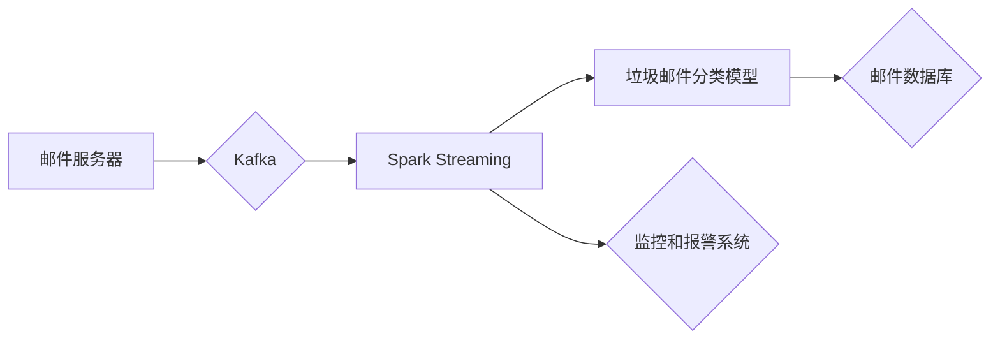

# 利用Spark Streaming构建实时反垃圾邮件系统

作者：禅与计算机程序设计艺术

## 1. 背景介绍

### 1.1 垃圾邮件的危害与挑战

互联网的快速发展极大地便利了人们的生活，但同时也滋生了大量的垃圾邮件。垃圾邮件不仅浪费用户时间和网络资源，还会传播虚假信息、病毒和恶意软件，对个人隐私和网络安全构成严重威胁。传统的反垃圾邮件技术，如基于规则的过滤和黑名单机制，在面对日益增长的垃圾邮件数量和不断变化的垃圾邮件形式时，显得力不从心。

### 1.2 实时反垃圾邮件系统的必要性

传统的反垃圾邮件系统通常采用批处理的方式，对邮件进行离线分析和过滤。然而，随着社交媒体和移动互联网的兴起，垃圾邮件的传播速度和隐蔽性不断提高，传统的反垃圾邮件系统已经难以满足实时性要求。实时反垃圾邮件系统能够对邮件流进行实时分析和处理，及时识别和拦截垃圾邮件，有效降低垃圾邮件对用户的干扰和危害。

### 1.3 Spark Streaming在实时反垃圾邮件系统中的优势

Spark Streaming是大数据领域常用的实时计算框架，具有高吞吐量、低延迟、可扩展性强等特点，非常适合构建实时反垃圾邮件系统。

## 2. 核心概念与联系

### 2.1 Spark Streaming

Spark Streaming是Spark Core之上的一个扩展模块，支持实时数据流的处理。它提供了一种类似于批处理的编程模型，可以将实时数据流转换为一系列微批次进行处理。

### 2.2 机器学习

机器学习是人工智能的一个分支，其目的是让计算机从数据中学习，并根据学习到的知识对未知数据进行预测或分类。在反垃圾邮件领域，机器学习可以用来构建垃圾邮件分类模型，对邮件进行自动识别和分类。

### 2.3 实时反垃圾邮件系统架构

一个典型的实时反垃圾邮件系统架构如下图所示：



* **邮件服务器:** 接收用户的邮件。
* **Kafka:** 分布式消息队列，用于缓存邮件数据。
* **Spark Streaming:** 实时处理邮件数据流。
* **垃圾邮件分类模型:** 对邮件进行分类，判断是否为垃圾邮件。
* **邮件数据库:** 存储邮件数据，包括邮件内容、发送者信息、接收者信息等。
* **监控和报警系统:** 监控系统的运行状态，并在出现异常时发出警报。

## 3. 核心算法原理具体操作步骤

### 3.1 数据预处理

* **数据清洗:** 去除邮件中的HTML标签、特殊字符等噪声数据。
* **分词:** 将邮件文本切分成词语序列。
* **特征提取:** 从邮件文本中提取特征，例如词频、TF-IDF等。

### 3.2 模型训练

* **选择合适的机器学习算法:** 常用的垃圾邮件分类算法包括朴素贝叶斯、支持向量机、逻辑回归等。
* **训练数据准备:** 将历史邮件数据划分为训练集和测试集。
* **模型训练:** 使用训练集数据对模型进行训练。
* **模型评估:** 使用测试集数据对模型进行评估，选择性能最佳的模型。

### 3.3 实时分类

* **加载模型:** 将训练好的模型加载到Spark Streaming程序中。
* **实时数据处理:** 使用Spark Streaming对实时邮件数据流进行处理，提取特征。
* **实时分类:** 使用加载的模型对邮件进行实时分类。
* **结果输出:** 将分类结果输出到邮件数据库或其他系统。

## 4. 数学模型和公式详细讲解举例说明

### 4.1 朴素贝叶斯算法

朴素贝叶斯算法是一种基于贝叶斯定理的概率分类方法。它假设每个特征之间相互独立，并根据训练数据计算每个特征在不同类别下的概率，然后使用贝叶斯定理计算邮件属于垃圾邮件的概率。

**贝叶斯定理:**

$$P(A|B) = \frac{P(B|A)P(A)}{P(B)}$$

其中:

* $P(A|B)$ 表示在事件B发生的条件下，事件A发生的概率。
* $P(B|A)$ 表示在事件A发生的条件下，事件B发生的概率。
* $P(A)$ 表示事件A发生的概率。
* $P(B)$ 表示事件B发生的概率。

**应用于垃圾邮件分类:**

* 事件A: 邮件是垃圾邮件。
* 事件B: 邮件中包含特定词语。

**计算邮件是垃圾邮件的概率:**

$$P(垃圾邮件|词语) = \frac{P(词语|垃圾邮件)P(垃圾邮件)}{P(词语)}$$

### 4.2 TF-IDF算法

TF-IDF（Term Frequency-Inverse Document Frequency）是一种用于信息检索和文本挖掘的常用加权技术。它用于评估一个词语对一个文档集或语料库中的其中一份文档的重要程度。

**TF:** 词频，指某个词语在当前文档中出现的频率。

$$TF(t,d) = \frac{词语t在文档d中出现的次数}{文档d中所有词语的总数}$$

**IDF:** 逆文档频率，指包含某个词语的文档数量的倒数的对数。

$$IDF(t) = log\frac{语料库中的文档总数}{包含词语t的文档数量 + 1}$$

**TF-IDF:** 将词频与逆文档频率相乘，得到词语在文档中的权重。

$$TF-IDF(t,d) = TF(t,d) * IDF(t)$$

## 5. 项目实践：代码实例和详细解释说明

### 5.1 依赖库

```python
from pyspark import SparkContext
from pyspark.streaming import StreamingContext
from pyspark.mllib.classification import NaiveBayesModel, NaiveBayes
from pyspark.mllib.feature import HashingTF, IDF
```

### 5.2 数据预处理

```python
def preprocess(text):
    # 去除HTML标签
    text = re.sub('<[^>]*>', '', text)
    # 去除特殊字符
    text = re.sub('[^a-zA-Z0-9\s]', '', text)
    # 转换为小写
    text = text.lower()
    # 分词
    words = text.split()
    return words
```

### 5.3 模型训练

```python
# 加载训练数据
data = sc.textFile("spam.txt").map(lambda line: line.split(","))

# 将数据转换为LabeledPoint格式
parsedData = data.map(lambda line: LabeledPoint(float(line[0]), line[1:]))

# 创建HashingTF对象
hashingTF = HashingTF()

# 计算TF-IDF
tf = hashingTF.transform(parsedData.map(lambda x: x.features))
idf = IDF().fit(tf)
tfidf = idf.transform(tf)

# 训练朴素贝叶斯模型
model = NaiveBayes.train(tfidf, parsedData.map(lambda x: x.label))

# 保存模型
model.save(sc, "spam_filter_model")
```

### 5.4 实时分类

```python
# 创建Spark Streaming上下文
ssc = StreamingContext(sc, 10)

# 创建DStream，接收邮件数据
lines = ssc.socketTextStream("localhost", 9999)

# 对邮件数据进行预处理
words = lines.map(preprocess)

# 计算TF-IDF
tf = hashingTF.transform(words)
tfidf = idf.transform(tf)

# 加载模型
model = NaiveBayesModel.load(sc, "spam_filter_model")

# 对邮件进行分类
predictions = model.predict(tfidf)

# 输出分类结果
predictions.pprint()

# 启动Spark Streaming程序
ssc.start()
ssc.awaitTermination()
```

## 6. 实际应用场景

### 6.1 电子邮件服务提供商

电子邮件服务提供商可以使用实时反垃圾邮件系统来保护其用户免受垃圾邮件的侵害，提高用户体验。

### 6.2 企业邮箱系统

企业邮箱系统可以使用实时反垃圾邮件系统来过滤掉垃圾邮件，提高员工的工作效率，保护企业信息安全。

### 6.3 社交媒体平台

社交媒体平台可以使用实时反垃圾邮件系统来识别和过滤垃圾评论、垃圾消息等，维护平台的健康发展。

## 7. 工具和资源推荐

### 7.1 Apache Spark

Apache Spark是一个开源的分布式计算系统，提供了Spark Streaming、Spark SQL、MLlib等组件，可以用于构建实时反垃圾邮件系统。

### 7.2 Kafka

Apache Kafka是一个分布式流处理平台，可以用于构建高吞吐量、低延迟的消息队列，用于缓存邮件数据。

### 7.3 Scikit-learn

Scikit-learn是一个开源的机器学习库，提供了丰富的机器学习算法和工具，可以用于构建垃圾邮件分类模型。

## 8. 总结：未来发展趋势与挑战

### 8.1 未来发展趋势

* **人工智能技术的不断发展:** 随着人工智能技术的不断发展，未来将会出现更加智能、精准的垃圾邮件识别技术。
* **云计算技术的应用:** 云计算技术的应用将会降低实时反垃圾邮件系统的部署和维护成本，提高系统的可扩展性和可靠性。
* **大数据技术的应用:** 大数据技术的应用将会为垃圾邮件识别提供更加丰富的数据支持，提高系统的识别精度。

### 8.2 面临的挑战

* **垃圾邮件形式不断变化:** 垃圾邮件发送者不断改变垃圾邮件的形式和内容，以逃避反垃圾邮件系统的检测。
* **数据安全和隐私保护:** 实时反垃圾邮件系统需要处理大量的邮件数据，如何保证数据的安全和隐私是一个重要的挑战。
* **系统性能和可扩展性:** 实时反垃圾邮件系统需要处理大量的邮件数据流，如何保证系统的性能和可扩展性是一个重要的挑战。

## 9. 附录：常见问题与解答

### 9.1 如何评估反垃圾邮件系统的性能？

常用的反垃圾邮件系统性能评估指标包括：

* **准确率:** 正确分类的邮件数量占总邮件数量的比例。
* **召回率:** 正确分类的垃圾邮件数量占所有垃圾邮件数量的比例。
* **F1值:** 准确率和召回率的调和平均数。

### 9.2 如何选择合适的机器学习算法？

选择合适的机器学习算法需要考虑以下因素：

* 数据集的大小和特征维度
* 算法的复杂度和训练时间
* 算法的分类精度和泛化能力


### 9.3 如何提高反垃圾邮件系统的识别精度？

提高反垃圾邮件系统的识别精度可以采取以下措施：

* 收集更多的训练数据
* 使用更复杂的机器学习算法
* 对邮件进行更细粒度的特征提取
* 定期更新垃圾邮件分类模型
