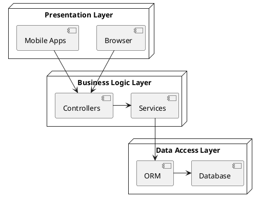
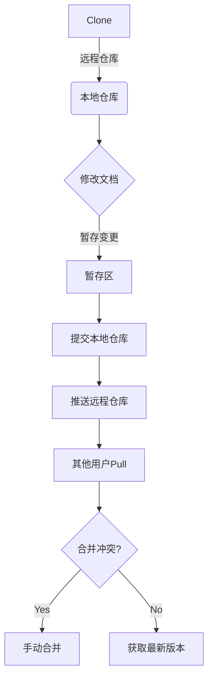
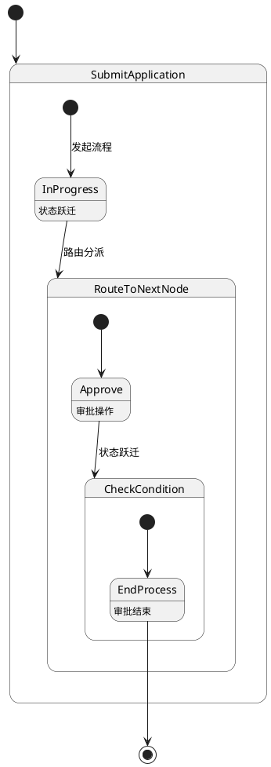

# 办公管理系统设计与实现

## 1. 背景介绍

### 1.1 办公管理系统的重要性

在当今快节奏的商业环境中,高效的办公管理对于企业的成功至关重要。随着组织规模的扩大和业务复杂性的增加,传统的手工办公方式已经无法满足现代企业的需求。因此,开发一个全面的办公管理系统(Office Automation System,OA)成为了提高工作效率、优化资源利用、降低运营成本的关键。

### 1.2 办公管理系统的功能

一个完善的OA系统通常包括以下核心功能:

- **文件管理**:协作编辑、版本控制、文件共享等
- **流程审批**:出差申请、采购审核、费用报销等
- **日程安排**:会议预订、任务分派、日历管理等 
- **知识库**:组织政策、操作手册、最佳实践分享等
- **通讯录**:员工信息查询、组织架构可视化等
- **数据分析**:工作量统计、绩效考核、决策支持等

### 1.3 系统设计目标

本文将重点介绍一个面向中小企业的OA系统的设计与实现,旨在实现以下目标:

- **易用性**:界面友好,操作简单,降低使用门槛
- **可扩展性**:模块化设计,功能可插拔,满足不同需求  
- **安全性**:数据加密,权限控制,确保信息安全
- **高性能**:优化架构,提升响应速度,支持大并发  
- **跨平台**:Web前端,移动端适配,无环境束缚

## 2. 核心概念与联系

### 2.1 系统架构概览

基于上述设计目标,我们采用了经典的三层架构模式,包括:

1. **表现层(Presentation Layer)**: 负责与用户交互的UI界面
2. **业务逻辑层(Business Logic Layer)**: 处理具体的业务需求和流程
3. **数据访问层(Data Access Layer)**: 对接后端数据库存储

这种分层架构有助于更好地组织代码、分离关注点、提高可维护性和复用性。每一层之间通过清晰定义的接口进行交互,降低了模块间的耦合度。

### 2.2 设计模式的应用

在OA系统的设计中,我们广泛应用了面向对象设计模式,使系统更加灵活、可扩展。以下是一些常见的模式:

- **工厂模式**:创建模块化的功能组件,如`FormFactory`生成不同的表单类型
- **单例模式**:确保某些关键对象(如全局配置管理器)在系统中只有一个实例
- **观察者模式**:实现发布-订阅机制,如文档变更通知、流程状态更新等
- **策略模式**:定义不同的算法族,如不同的文件存储策略(本地、云端等)
- **模板方法模式**:在抽象类中定义算法框架,延迟具体实现到子类
- **装饰器模式**:动态地给对象添加职责,如为文档添加水印、加密等功能

通过合理运用这些设计模式,系统不仅具有良好的扩展性和灵活性,而且代码的可读性和可维护性也得到了提高。

## 3. 核心算法原理具体操作步骤  

### 3.1 文档版本控制

文档版本控制是OA系统中一个非常重要的功能。我们采用了广泛使用的Git版本控制系统,允许多人协作编辑同一份文档。

文档版本控制的核心步骤如下:

1. **克隆(Clone)**: 用户首先从远程仓库克隆文档的本地副本
2. **修改(Modify)**: 用户在本地副本上进行编辑修改
3. **暂存(Stage)**: 将修改的文件添加到暂存区
4. **提交(Commit)**: 将暂存区的修改提交到本地仓库
5. **推送(Push)**: 将本地仓库的变更推送到远程仓库
6. **拉取(Pull)**: 其他用户从远程仓库拉取最新的文档版本
7. **合并(Merge)**: 如果有冲突,需要手动合并不同用户的修改

Git的分布式特性非常适合多人实时协作场景。通过引入暂存区的概念,用户可以很好地控制提交粒度。而合并算法也能有效地解决并发修改的冲突。

### 3.2 流程审批引擎

OA系统中的流程审批是一个相对复杂的过程,需要对审批流程进行建模和执行控制。我们采用了基于有限状态机(Finite State Machine)的审批引擎。

流程审批的核心步骤如下:

1. **发起流程**: 提交申请,生成流程实例,初始状态进入"申请中"
2. **路由分派**: 根据申请类型和当前状态,确定下一个审批节点及审批人  
3. **审批操作**: 审批人对申请进行审核,并执行通过/拒绝/取消等操作
4. **状态跃迁**: 根据审批操作,流程实例转移到下一个状态
5. **条件判断**: 基于分支条件(如审批结果、金额等),决定后续审批路径
6. **审批结束**: 当流程进入终止状态(如"已审批"、"已拒绝")时,审批结束

这种基于状态机的流程建模方式,使得审批流程的定义和执行变得清晰可控。同时通过扩展状态和转移规则,可以支持更加复杂的审批场景。

## 4. 数学模型和公式详细讲解举例说明

在OA系统中,我们引入了一些数学模型和公式,用于优化系统性能和支持数据分析等高级功能。

### 4.1 文件存储优化

为了提高文件存储和访问的效率,我们将文件存储到了分布式对象存储系统(如AWS S3),并采用了一致性哈希算法进行数据分片。

一致性哈希的核心思想是将节点和数据映射到同一个哈希环空间,每个数据对象被存储在其顺时针方向的第一个节点上。当有新节点加入或离开集群时,只需重定位环空间中的一小部分数据,从而最大限度地减少了数据迁移的代价。

设计数据对象和节点的映射函数如下:

$$
hash(key) = \left(\sum_{i=0}^{len(key)}key_i \times 33^i\right) \mod 2^{32}
$$

其中$key$为文件对象或节点的标识符,长度为$len(key)$。$hash(key)$的值将落在$[0, 2^{32})$的环形空间中。

为了进一步减少冲突,我们为每个节点计算多个哈希值,即虚拟节点(Virtual Node):

$$
VNode_{n,i} = hash((n.ip, n.port, i+n.replicaNum))
$$

其中$n.ip$和$n.port$为节点的网络地址,$n.replicaNum$为每个节点的虚拟节点数量,通常取值3-7。这样每个节点都拥有多个虚拟节点分布在环空间上,从而降低了数据倾斜的风险。

当需要定位某个数据对象$obj$的存储节点时,我们计算$hash(obj.key)$,并沿着顺时针方向寻找距离它最近的虚拟节点所对应的物理节点即可。

这种一致性哈希算法具有低时间复杂度$O(log_bN)$(其中$N$为节点总数,$b$为虚拟节点因子),而且数据分布较为均匀,非常适合分布式系统环境。

### 4.2 协同过滤算法

对于OA系统中的知识库模块,我们引入了基于用户的协同过滤算法(User-based Collaborative Filtering),为用户推荐感兴趣的文档和资源。

算法的基本思路是:给定一个用户$u$,计算其他所有用户$v$与$u$的相似度,然后根据$v$对文档$i$的评分,为$u$预测对$i$的兴趣程度。

用户相似度的计算公式如下:

$$
sim(u,v) = \frac{\sum_{i \in I_{u,v}}(r_{u,i} - \overline{r_u})(r_{v,i} - \overline{r_v})}
{\sqrt{\sum_{i \in I_{u,v}}(r_{u,i} - \overline{r_u})^2}\sqrt{\sum_{i \in I_{u,v}}(r_{v,i} - \overline{r_v})^2}}
$$

其中$I_{u,v}$为用户$u$和$v$共同评分过的文档集合,$r_{u,i}$为$u$对文档$i$的评分,$\overline{r_u}$为$u$的平均评分。该公式实际上计算了$u$和$v$的评分偏差向量之间的余弦相似度。

对于预测分数,我们采用加权平均的方式:

$$
p_{u,i} = \overline{r_u} + \frac{\sum_{v \in S_i^k(u)}sim(u,v)(r_{v,i} - \overline{r_v})}
{\sum_{v \in S_i^k(u)}sim(u,v)}
$$

其中$S_i^k(u)$表示与$u$最相似的$k$个用户,且都评分过$i$。$p_{u,i}$即为$u$对文档$i$的预测评分。

通过实现上述算法,系统能够推荐每个用户最感兴趣的文档,提高知识库的使用效率。而且相比于基于内容的推荐,协同过滤算法可以发现隐式的兴趣关联,从而提高推荐质量。

## 4. 项目实践:代码实例和详细解释说明

为了帮助读者更好地理解系统的实现,下面我们将介绍一些核心模块的关键代码。

### 4.1 文档版本控制

我们使用Node.js构建了一个轻量级的Git服务,支持基本的版本控制操作。以下是文档仓库的