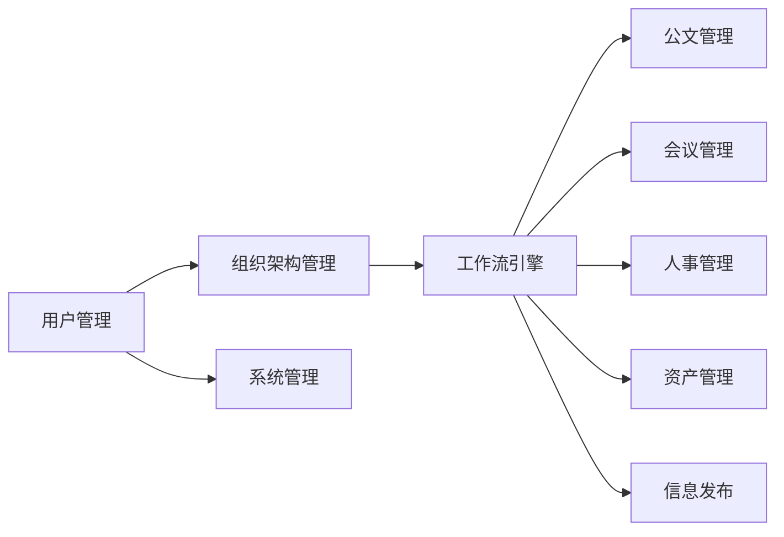

##  办公自动化系统详细设计与具体代码实现

作者：禅与计算机程序设计艺术

## 1. 背景介绍

### 1.1 办公自动化的概念与意义

办公自动化（Office Automation，OA）是指利用计算机、通信网络等现代化信息技术，代替或辅助人们完成各种办公业务和事务处理，从而提高办公效率、优化办公流程、降低办公成本的一种新型办公模式。 办公自动化系统是实现办公自动化的软件系统，它集成了各种办公应用软件，为用户提供统一的办公平台。

办公自动化的意义主要体现在以下几个方面：

* **提高工作效率**: 自动化处理重复性工作，节省时间和人力成本。
* **优化业务流程**:  规范化流程，提高工作效率，减少出错率。
* **提升数据准确性**:  减少人工干预，提高数据准确性和可靠性。
* **增强协同办公能力**:  实现信息共享，促进部门之间协同工作。
* **降低办公成本**:  减少纸张消耗和差旅费用等。

### 1.2  办公自动化系统的发展历程

办公自动化系统的发展大致经历了以下几个阶段：

* **第一阶段：单机版办公软件阶段 (20世纪80年代)** 
   -  主要以文字处理、电子表格、演示文稿等单机版办公软件为主。
   -  代表软件：WordPerfect、Lotus 1-2-3、Harvard Graphics 等。
* **第二阶段：网络办公阶段 (20世纪90年代)**
   -  随着网络技术的普及，办公自动化系统开始向网络化方向发展。
   -  代表软件：Lotus Notes、Microsoft Exchange 等。
* **第三阶段：协同办公阶段 (21世纪初)**
   -  更加注重团队协作和信息共享，出现了各种协同办公平台。
   -  代表软件：微软Office 365， Google Workspace 等。
* **第四阶段：智能办公阶段 (21世纪10年代至今)**
   -  人工智能、大数据、云计算等新技术的应用，使得办公自动化系统更加智能化、个性化。
   -  代表软件：钉钉、企业微信、飞书等。

### 1.3 本文研究内容概述

本文将以构建一个通用的办公自动化系统为目标，详细阐述系统的需求分析、系统设计、数据库设计、代码实现以及系统测试等方面的内容，并结合实际案例进行分析和说明。

## 2. 核心概念与联系

### 2.1 办公自动化系统的核心模块

一个典型的办公自动化系统通常包含以下核心模块：

* **用户管理模块**:  负责管理系统用户的基本信息、权限等。
* **组织架构管理模块**:  维护企业组织架构信息，如部门、职位等。
* **工作流引擎**:  定义和管理各种业务流程，实现流程自动化。
* **公文管理模块**:  实现公文的起草、审批、发布、归档等全生命周期管理。
* **会议管理模块**:  提供会议室预定、会议通知、会议纪要等功能。
* **人事管理模块**:  管理员工信息、考勤、薪资等。
* **资产管理模块**:  管理企业固定资产和低值易耗品。
* **信息发布模块**:  发布企业新闻、公告、通知等信息。
* **系统管理模块**:  提供系统配置、日志管理、权限管理等功能。

### 2.2 模块之间的联系

各个模块之间相互联系，共同构成完整的办公自动化系统。例如：

* 用户登录系统后，可以根据其角色和权限访问不同的模块。
* 在公文审批流程中，需要调用工作流引擎，并根据审批结果更新公文状态。
* 会议管理模块可以调用组织架构模块获取参会人员信息。
* 人事管理模块可以调用考勤数据生成工资报表。

### 2.3 核心概念之间的关系图



## 3. 核心算法原理具体操作步骤

### 3.1 工作流引擎

工作流引擎是办公自动化系统的核心模块之一，它负责定义和管理各种业务流程。本节将以一个简单的请假审批流程为例，介绍工作流引擎的实现原理。

#### 3.1.1 流程定义

首先，需要使用工作流引擎提供的工具定义请假审批流程。流程定义通常包括以下几个步骤：

1. **开始节点**:  表示流程的开始。
2. **用户任务节点**:  表示需要人工处理的任务，例如填写请假单、审批请假申请等。
3. **网关节点**:  根据条件判断流程走向，例如根据请假天数选择不同的审批人。
4. **结束节点**:  表示流程的结束。

#### 3.1.2 流程实例化

当用户提交请假申请时，工作流引擎会根据流程定义创建一个流程实例。流程实例包含了流程的当前状态、流程变量等信息。

#### 3.1.3 任务分配

工作流引擎会根据流程定义将任务分配给相应的审批人。审批人可以在待办任务列表中查看需要处理的任务。

#### 3.1.4 任务处理

审批人可以对任务进行审批操作，例如同意、拒绝等。审批结果会更新流程实例的状态和变量。

#### 3.1.5 流程结束

当流程实例执行到结束节点时，表示流程结束。

### 3.2 公文管理

公文管理模块负责实现公文的起草、审批、发布、归档等全生命周期管理。

#### 3.2.1 公文起草

用户可以使用系统提供的模板创建新的公文，并填写相关信息。

#### 3.2.2 公文审批

公文起草完成后，需要提交审批。系统会根据预设的审批流程将公文发送给相应的审批人。

#### 3.2.3 公文发布

公文审批通过后，可以发布到指定的渠道，例如公司内部网站、邮件等。

#### 3.2.4 公文归档

公文处理完成后，需要进行归档，以便日后查询和统计。

## 4. 数学模型和公式详细讲解举例说明

办公自动化系统中通常不需要复杂的数学模型和算法。

## 5. 项目实践：代码实例和详细解释说明

### 5.1 技术选型

* **开发语言**:  Java
* **开发框架**:  Spring Boot
* **数据库**:  MySQL
* **工作流引擎**:  Activiti
* **前端框架**:  Vue.js

### 5.2 代码实例

```java
// 用户实体类
@Entity
@Table(name = "sys_user")
public class SysUser {

    @Id
    @GeneratedValue(strategy = GenerationType.IDENTITY)
    private Long id;

    @Column(nullable = false, unique = true)
    private String username;

    @Column(nullable = false)
    private String password;

    // ...
}

// 用户服务接口
public interface SysUserService {

    SysUser findByUsername(String username);

    // ...
}

// 用户服务实现类
@Service
public class SysUserServiceImpl implements SysUserService {

    @Autowired
    private SysUserRepository userRepository;

    @Override
    public SysUser findByUsername(String username) {
        return userRepository.findByUsername(username);
    }

    // ...
}
```

## 6. 实际应用场景

### 6.1 企业办公

办公自动化系统可以应用于各种类型的企业，例如：

* **大型企业**:  可以实现集团化管控，提高办公效率。
* **中小型企业**:  可以降低办公成本，提升企业形象。
* **政府机关**:  可以提高行政效率，提升服务质量。

### 6.2 教育行业

办公自动化系统可以应用于学校、培训机构等教育机构，例如：

* **教务管理**:  实现课程安排、成绩管理、学籍管理等自动化。
* **办公管理**:  实现公文处理、会议管理、资产管理等自动化。
* **家校互动**:  实现家长与学校之间的信息沟通。

## 7. 工具和资源推荐

### 7.1 开源工作流引擎

* **Activiti**:  Apache 基金会下的开源工作流引擎，功能强大，文档齐全。
* **Flowable**:  Activiti 的分支版本，更加轻量级，易于学习和使用。
* **Camunda**:  基于 BPMN 标准的开源工作流引擎，提供商业版和社区版。

### 7.2 前端 UI 框架

* **Vue.js**:  渐进式 JavaScript 框架，易于上手，组件化开发。
* **React**:  Facebook 推出的 JavaScript 库，组件化开发，性能优异。
* **Angular**:  Google 推出的 JavaScript 框架，功能全面，适合大型项目开发。

## 8. 总结：未来发展趋势与挑战

### 8.1 未来发展趋势

* **更加智能化**:  人工智能技术的应用将使得办公自动化系统更加智能化，例如智能客服、智能助手等。
* **更加移动化**:  移动办公已经成为趋势，办公自动化系统需要适应移动办公的需求，提供更加便捷的移动办公体验。
* **更加集成化**:  办公自动化系统将与其他企业级应用系统更加紧密地集成，例如 ERP、CRM 等系统，形成企业信息化整体解决方案。

### 8.2 面临的挑战

* **数据安全**:  办公自动化系统存储了大量的企业敏感信息，如何保障数据安全是一个重要的挑战。
* **系统集成**:  不同企业使用的 IT 系统各不相同，如何实现办公自动化系统与其他系统的无缝集成是一个挑战。
* **用户体验**:  办公自动化系统的用户体验至关重要，如何设计出用户友好、易于使用的系统是一个挑战。

## 9. 附录：常见问题与解答

### 9.1  如何选择合适的办公自动化系统？

选择办公自动化系统需要考虑以下因素：

* **企业规模和需求**:  不同规模和需求的企业，对办公自动化系统的要求也不同。
* **系统功能**:  需要根据企业实际需求选择合适的系统功能。
* **系统成本**:  需要考虑系统的购置成本、实施成本、维护成本等。
* **系统供应商**:  需要选择信誉良好、技术实力强的系统供应商。

### 9.2  如何保障办公自动化系统的数据安全？

保障办公自动化系统的数据安全可以采取以下措施：

* **访问控制**:  对用户进行权限管理，控制用户对数据的访问权限。
* **数据加密**:  对敏感数据进行加密存储，防止数据泄露。
* **安全审计**:  记录用户的操作日志，以便及时发现和处理安全问题。
* **数据备份**:  定期对数据进行备份，防止数据丢失。
