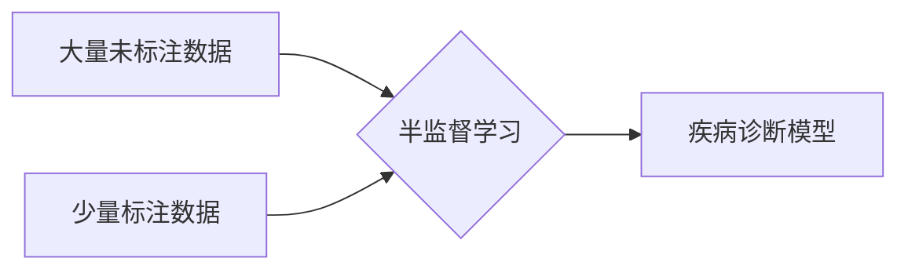

# 半监督健康与医疗：疾病诊断的新视角

作者：禅与计算机程序设计艺术

## 1. 背景介绍

### 1.1 医疗数据现状：数据爆炸与标注瓶颈

近年来，随着传感器技术、物联网和电子病历的普及，医疗数据呈现爆炸式增长。海量的医疗数据蕴藏着巨大的价值，有潜力推动疾病诊断、治疗和预防的革命性进步。然而，这些数据大多是非结构化的，例如医学影像、文本病历等，需要专业医师进行标注才能用于训练机器学习模型，这导致了医疗数据标注的严重瓶颈。

### 1.2 半监督学习：打破数据标注困境的利器

为了解决医疗数据标注的难题，半监督学习应运而生。与需要大量标注数据的监督学习不同，半监督学习可以利用少量标注数据和大量未标注数据进行学习，从而有效缓解数据标注的压力。

### 1.3 半监督学习在医疗领域的应用前景

半监督学习在医疗领域的应用前景广阔，例如：

* **疾病诊断：**利用少量标注病例和大量未标注病例训练模型，提高疾病诊断的准确率。
* **医学影像分析：**自动识别医学影像中的病灶区域，辅助医生进行诊断。
* **药物发现：**预测药物的疗效和毒副作用，加速新药研发进程。

## 2. 核心概念与联系

### 2.1 监督学习、无监督学习与半监督学习

* **监督学习：**利用已知输入和输出的训练数据，学习一个将输入映射到输出的函数。
* **无监督学习：**利用没有标签的训练数据，学习数据的内在结构和规律。
* **半监督学习：**介于监督学习和无监督学习之间，利用少量标注数据和大量未标注数据进行学习。

### 2.2 半监督学习的基本假设

半监督学习通常基于以下假设：

* **平滑性假设：**相似的样本具有相似的标签。
* **聚类假设：**属于同一聚类的样本具有相似的标签。
* **流形假设：**高维数据通常分布在低维流形上，相邻样本具有相似的标签。

### 2.3 半监督学习的常见方法

* **自训练（Self-training）：**利用已有的标注数据训练一个初始模型，然后用该模型对未标注数据进行预测，将置信度高的预测结果加入训练集，重新训练模型，迭代进行。
* **协同训练（Co-training）：**利用数据的不同视图训练多个分类器，每个分类器对未标注数据进行预测，并将置信度高的预测结果加入其他分类器的训练集，迭代进行。
* **图半监督学习（Graph-based Semi-supervised Learning）：**将数据表示为图，利用图的结构信息进行标签传播。

## 3. 核心算法原理具体操作步骤

### 3.1 自训练算法

#### 3.1.1 算法流程

1. 利用已标注数据训练一个初始模型 $f$。
2. 利用模型 $f$ 对未标注数据进行预测，得到预测标签 $\hat{y}$ 和置信度 $p$。
3. 选择置信度高于阈值 $\tau$ 的样本，将其预测标签加入训练集。
4. 利用更新后的训练集重新训练模型 $f$。
5. 重复步骤 2-4，直到模型性能不再提升。

#### 3.1.2 算法优缺点

* **优点：**简单易实现。
* **缺点：**容易受到噪声数据的影响，模型性能可能不稳定。

### 3.2 协同训练算法

#### 3.2.1 算法流程

1. 将特征空间划分为两个视图，分别训练两个分类器 $f_1$ 和 $f_2$。
2. 利用 $f_1$ 对未标注数据进行预测，选择置信度高的样本及其预测标签加入 $f_2$ 的训练集。
3. 利用 $f_2$ 对未标注数据进行预测，选择置信度高的样本及其预测标签加入 $f_1$ 的训练集。
4. 重复步骤 2-3，直到模型性能不再提升。

#### 3.2.2 算法优缺点

* **优点：**可以利用数据的不同视图提高模型的泛化能力。
* **缺点：**需要找到数据的有效视图，否则算法性能可能不佳。

### 3.3 图半监督学习算法

#### 3.3.1 算法流程

1. 将数据表示为图，其中节点表示样本，边表示样本之间的相似度。
2. 利用已标注数据初始化节点的标签。
3. 通过边的连接关系，将标签信息从已标注节点传播到未标注节点。
4. 重复步骤 3，直到所有节点都有标签。

#### 3.3.2 算法优缺点

* **优点：**可以利用数据的结构信息提高模型的泛化能力。
* **缺点：**图的构建和标签传播算法的选择对模型性能影响较大。

## 4. 数学模型和公式详细讲解举例说明

### 4.1 自训练算法的数学模型

自训练算法可以看作是一种期望最大化（EM）算法。

**E 步：**利用当前模型对未标注数据进行预测，得到预测标签。

**M 步：**利用已标注数据和预测标签更新模型参数。

### 4.2 协同训练算法的数学模型

协同训练算法可以看作是两个分类器之间的相互学习过程。

**目标函数：**最小化两个分类器的预测结果之间的差异。

### 4.3 图半监督学习算法的数学模型

图半监督学习算法通常基于标签传播算法，例如：

* **标签传播算法（Label Propagation Algorithm）：**
$$
f(x_i) = \sum_{j \in N(i)} w_{ij} f(x_j)
$$

其中，$f(x_i)$ 表示节点 $i$ 的标签，$N(i)$ 表示节点 $i$ 的邻居节点集合，$w_{ij}$ 表示节点 $i$ 和 $j$ 之间的边的权重。

## 5. 项目实践：代码实例和详细解释说明

### 5.1 基于 Python 和 scikit-learn 的半监督学习实例

```python
from sklearn.datasets import make_classification
from sklearn.model_selection import train_test_split
from sklearn.semi_supervised import LabelPropagation
from sklearn.metrics import accuracy_score

# 生成模拟数据
X, y = make_classification(n_samples=1000, n_features=2, n_informative=2, n_redundant=0, random_state=42)

# 将部分数据设为未标注
y[500:] = -1

# 划分训练集和测试集
X_train, X_test, y_train, y_test = train_test_split(X, y, test_size=0.2, random_state=42)

# 创建标签传播模型
model = LabelPropagation()

# 训练模型
model.fit(X_train, y_train)

# 预测测试集
y_pred = model.predict(X_test)

# 评估模型性能
accuracy = accuracy_score(y_test, y_pred)
print("Accuracy:", accuracy)
```

### 5.2 代码解释

* `make_classification` 函数用于生成模拟数据。
* `LabelPropagation` 类实现了标签传播算法。
* `fit` 方法用于训练模型。
* `predict` 方法用于预测测试集。
* `accuracy_score` 函数用于评估模型性能。

## 6. 实际应用场景

### 6.1 医学影像分析

* **肺癌诊断：**利用少量标注的 CT 影像和大量未标注的 CT 影像训练模型，自动识别肺结节，辅助医生进行诊断。
* **乳腺癌诊断：**利用少量标注的乳腺 X 光影像和大量未标注的乳腺 X 光影像训练模型，自动识别乳腺肿块，辅助医生进行诊断。

### 6.2 疾病预测

* **糖尿病预测：**利用少量已确诊糖尿病患者的电子病历和大量未确诊患者的电子病历训练模型，预测患者患糖尿病的风险。
* **心血管疾病预测：**利用少量已确诊心血管疾病患者的电子病历和大量未确诊患者的电子病历训练模型，预测患者患心血管疾病的风险。

## 7. 总结：未来发展趋势与挑战

### 7.1 未来发展趋势

* **深度半监督学习：**将深度学习与半监督学习相结合，利用深度模型强大的特征提取能力，进一步提高半监督学习的性能。
* **迁移学习与半监督学习：**利用迁移学习将知识从源领域迁移到目标领域，解决目标领域标注数据不足的问题。
* **强化学习与半监督学习：**利用强化学习与半监督学习相结合，在交互环境中进行学习，提高模型的泛化能力。

### 7.2 面临挑战

* **模型的可解释性：**半监督学习模型通常比较复杂，难以解释其预测结果。
* **数据的质量：**未标注数据的质量对半监督学习模型的性能影响较大。
* **模型的评估：**半监督学习模型的评估比较困难，因为没有足够的标注数据用于评估。

## 8. 附录：常见问题与解答

### 8.1 什么是半监督学习？

半监督学习是一种介于监督学习和无监督学习之间的机器学习方法，它利用少量标注数据和大量未标注数据进行学习。

### 8.2 半监督学习的应用场景有哪些？

半监督学习可以应用于各种领域，例如：

* 医学影像分析
* 疾病预测
* 自然语言处理
* 计算机视觉

### 8.3 半监督学习的优缺点是什么？

**优点：**

* 可以利用未标注数据提高模型的性能。
* 可以减少对标注数据的依赖。

**缺点：**

* 模型的性能可能不如监督学习模型。
* 模型的可解释性较差。


##  Mermaid流程图


