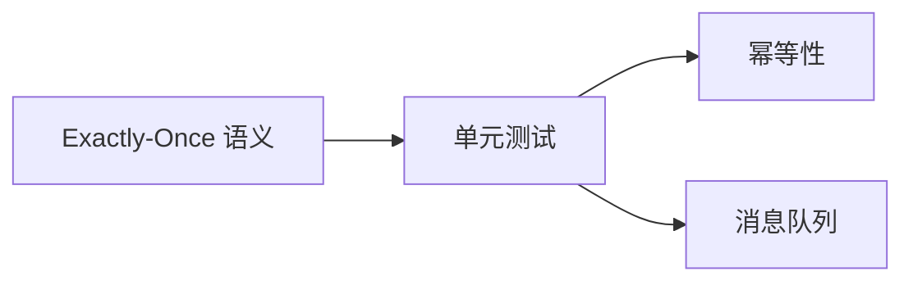

# 单元测试：验证单个组件的exactly-once语义

作者：禅与计算机程序设计艺术

## 1. 背景介绍

### 1.1. 分布式系统中的数据一致性挑战

在当今的软件开发领域，分布式系统已经成为构建高可用性、高可扩展性应用的标准架构。然而，分布式系统也引入了新的挑战，其中之一就是数据一致性问题。数据一致性指的是在分布式系统中，所有节点对数据的视图保持一致。

在分布式系统中，数据一致性面临着诸多挑战，例如：

* **网络分区：**网络故障可能导致系统被分割成多个独立的部分，每个部分都拥有数据的副本，但无法相互通信。
* **节点故障：**节点崩溃或不可用可能导致数据丢失或不一致。
* **并发操作：**多个客户端同时对同一数据进行读写操作，可能导致数据冲突和不一致。

为了解决这些挑战，开发人员需要采用各种技术来确保数据一致性，例如：

* **一致性协议：**Paxos、Raft 等一致性协议用于确保在分布式系统中所有节点对数据的修改达成一致。
* **分布式事务：**两阶段提交（2PC）、三阶段提交（3PC）等分布式事务机制用于确保跨多个节点的操作要么全部成功，要么全部失败。
* **消息队列：**消息队列可以用于实现异步通信和数据复制，从而提高系统可用性和容错性。

### 1.2. Exactly-Once 语义的重要性

在许多应用场景中，保证数据处理的 exactly-once 语义至关重要。Exactly-once 语义意味着每个消息或事件只会被处理一次，即使发生故障也不会导致重复处理。

例如，在以下场景中，exactly-once 语义非常重要：

* **金融交易：**重复处理交易会导致资金被错误地扣除或增加。
* **订单处理：**重复处理订单会导致商品被重复发货或客户被重复收费。
* **库存管理：**重复处理库存更新会导致库存数量不准确。

### 1.3. 单元测试在验证 Exactly-Once 语义中的作用

单元测试是软件开发过程中不可或缺的一部分，用于验证代码单元的功能正确性。在分布式系统中，单元测试对于验证单个组件的 exactly-once 语义尤为重要。

通过对单个组件进行单元测试，可以：

* **隔离问题：**单元测试可以隔离单个组件，并模拟各种故障场景，以便更轻松地识别和修复问题。
* **提高代码质量：**编写单元测试可以促使开发人员编写更模块化、更易于测试的代码。
* **增强信心：**通过单元测试验证单个组件的 exactly-once 语义，可以增强开发人员对整个系统的信心。

## 2. 核心概念与联系

### 2.1. Exactly-Once 语义

Exactly-once 语义指的是每个消息或事件只会被处理一次，即使发生故障也不会导致重复处理。

### 2.2. 单元测试

单元测试是软件开发过程中的一种测试方法，用于验证代码单元的功能正确性。代码单元是应用程序中最小的可测试部分，例如函数、过程或方法。

### 2.3. 幂等性

幂等性是指一个操作可以执行多次，但最终结果与执行一次相同。

### 2.4. 消息队列

消息队列是一种异步通信机制，用于在应用程序之间传递消息。

### 2.5. 关系图



## 3. 核心算法原理具体操作步骤

验证单个组件的 exactly-once 语义，通常需要以下步骤：

1. **识别关键组件：**确定需要验证 exactly-once 语义的关键组件，例如消息处理器、数据访问层等。
2. **设计测试用例：**设计测试用例来模拟各种故障场景，例如消息重复、节点崩溃等。
3. **实现测试代码：**使用单元测试框架编写测试代码，模拟测试用例中描述的场景。
4. **断言结果：**使用断言语句验证组件的行为是否符合预期，例如检查数据是否只被处理一次。

## 4. 数学模型和公式详细讲解举例说明

在验证 exactly-once 语义时，可以使用一些数学模型和公式来辅助分析和推理。

### 4.1. 概率模型

可以使用概率模型来分析消息重复传递的概率。假设消息传递的成功率为 $p$，则消息重复传递的概率为 $(1-p)^n$，其中 $n$ 是消息传递的次数。

例如，如果消息传递的成功率为 99%，则消息重复传递的概率为：

```
(1 - 0.99)^1 = 0.01
(1 - 0.99)^2 = 0.0001
(1 - 0.99)^3 = 0.000001
```

可以看出，随着消息传递次数的增加，消息重复传递的概率会指数级下降。

### 4.2. 状态机模型

可以使用状态机模型来描述组件的不同状态以及状态之间的转换。通过分析状态机模型，可以识别出可能导致重复处理的状态转换路径。

例如，一个简单的消息处理器可以有以下状态：

* **初始状态：**消息处理器尚未接收到任何消息。
* **处理中状态：**消息处理器正在处理消息。
* **完成状态：**消息处理器已成功处理消息。

状态机模型可以帮助识别出可能导致重复处理的状态转换路径，例如：

* 从“处理中状态”转换回“初始状态”，然后再次接收到相同的消息。
* 从“完成状态”转换回“处理中状态”，然后再次处理相同的消息。

## 5. 项目实践：代码实例和详细解释说明

### 5.1. 示例场景

假设我们正在开发一个订单处理系统，需要保证每个订单只会被处理一次。订单处理系统使用消息队列来接收订单消息，并使用一个订单处理器组件来处理订单。

### 5.2. 代码实现

```python
import unittest
from unittest.mock import MagicMock

class OrderProcessor:
    def __init__(self, order_repository):
        self.order_repository = order_repository

    def process_order(self, order_id):
        # 检查订单是否已处理
        if self.order_repository.is_order_processed(order_id):
            return

        # 处理订单
        # ...

        # 标记订单为已处理
        self.order_repository.mark_order_as_processed(order_id)

class OrderProcessorTest(unittest.TestCase):
    def test_process_order_exactly_once(self):
        # 模拟订单仓库
        order_repository = MagicMock()
        order_repository.is_order_processed.return_value = False

        # 创建订单处理器
        order_processor = OrderProcessor(order_repository)

        # 处理订单
        order_id = 123
        order_processor.process_order(order_id)

        # 验证订单只被处理一次
        order_repository.is_order_processed.assert_called_once_with(order_id)
        order_repository.mark_order_as_processed.assert_called_once_with(order_id)
```

### 5.3. 代码解释

* `OrderProcessor` 类表示订单处理器组件，它依赖于一个订单仓库来存储订单状态。
* `process_order()` 方法用于处理订单，它首先检查订单是否已处理，如果已处理则直接返回；否则，处理订单并将其标记为已处理。
* `OrderProcessorTest` 类是单元测试类，它使用 `unittest.mock` 模块来模拟订单仓库。
* `test_process_order_exactly_once()` 方法测试订单只被处理一次。它首先模拟一个订单仓库，并将其传递给订单处理器。然后，调用 `process_order()` 方法处理订单。最后，使用断言语句验证订单只被处理一次。

## 6. 实际应用场景

验证单个组件的 exactly-once 语义在以下实际应用场景中非常重要：

* **金融交易系统：**确保每笔交易只被处理一次，防止资金被错误地扣除或增加。
* **电商平台：**确保每个订单只被处理一次，防止商品被重复发货或客户被重复收费。
* **数据仓库：**确保每个数据记录只被处理一次，防止数据重复或不一致。

## 7. 工具和资源推荐

以下是一些用于验证 exactly-once 语义的工具和资源：

* **单元测试框架：**JUnit、unittest、pytest 等单元测试框架可以帮助开发人员编写和运行单元测试。
* **Mock 框架：**Mockito、EasyMock 等 Mock 框架可以帮助开发人员模拟依赖项，以便更轻松地测试单个组件。
* **消息队列：**Kafka、RabbitMQ 等消息队列提供了保证 exactly-once 语义的功能。

## 8. 总结：未来发展趋势与挑战

随着分布式系统和微服务架构的普及，验证 exactly-once 语义变得越来越重要。未来，以下趋势和挑战将影响 exactly-once 语义的验证：

* **无服务器计算：**无服务器计算平台的兴起带来了新的挑战，因为开发人员需要验证无状态函数的 exactly-once 语义。
* **事件驱动架构：**事件驱动架构的普及使得验证跨多个服务的 exactly-once 语义变得更加复杂。
* **人工智能和机器学习：**人工智能和机器学习应用的兴起对 exactly-once 语义提出了更高的要求，因为这些应用通常需要处理大量的数据。

为了应对这些趋势和挑战，开发人员需要采用新的工具和技术来验证 exactly-once 语义，例如：

* **混沌工程：**混沌工程可以用于模拟各种故障场景，并验证系统在这些场景下的行为。
* **分布式跟踪：**分布式跟踪可以帮助开发人员跟踪消息或事件在分布式系统中的流动，以便更轻松地识别和解决问题。
* **形式化验证：**形式化验证可以使用数学方法来证明系统的正确性，包括 exactly-once 语义。

## 9. 附录：常见问题与解答

### 9.1. 如何测试消息处理器的幂等性？

要测试消息处理器的幂等性，可以发送相同的消息两次，并验证处理结果是否相同。

### 9.2. 如何模拟消息重复传递？

可以使用消息队列的延迟消息功能来模拟消息重复传递。

### 9.3. 如何在单元测试中模拟网络分区？

可以使用 Mock 框架来模拟网络分区，例如将网络连接断开或延迟。
