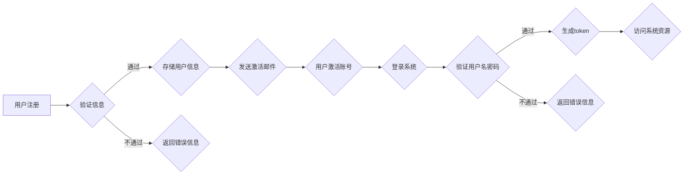

# 同学录校友录系统详细设计与具体代码实现

作者：禅与计算机程序设计艺术

## 1. 背景介绍

### 1.1.  同学录/校友录系统概述

同学录/校友录系统是记录学生时代珍贵回忆、维系同窗情谊的重要平台。随着互联网技术的飞速发展，传统的纸质同学录逐渐被电子化的同学录/校友录系统所取代。这些系统不仅可以存储和展示用户的基本信息、照片、联系方式等，还可以提供班级活动、论坛交流、资源共享等功能，极大地丰富了用户的使用体验。

### 1.2.  系统设计目标

本系统旨在设计和实现一个功能完善、易于使用、安全可靠的同学录/校友录系统，满足用户以下需求：

* **信息管理:** 用户可以方便地创建和管理个人资料，包括基本信息、联系方式、照片、个人简介等。
* **班级管理:** 系统支持创建和管理班级，用户可以加入自己所在的班级，查看班级成员信息、发布班级公告、组织班级活动等。
* **动态分享:** 用户可以在系统中发布图文动态，分享自己的生活、学习、工作等方面的信息，与其他用户进行互动交流。
* **私信聊天:** 用户之间可以发送私信，进行一对一的实时聊天。
* **搜索功能:** 用户可以通过姓名、学校、班级等关键字快速查找其他用户。
* **数据安全:** 系统采用严格的安全措施，保障用户数据的安全性和隐私性。

### 1.3.  目标用户

本系统的目标用户群体主要包括：

* **在校学生:** 可以使用系统记录自己的校园生活，与同学保持联系。
* **毕业校友:** 可以通过系统寻找失散多年的同学，重温青春岁月。
* **老师:** 可以通过系统发布班级通知、组织班级活动，与学生进行互动交流。

## 2. 核心概念与联系

### 2.1.  用户

用户是系统的核心元素，包括学生、校友和老师。每个用户都有唯一的ID、用户名、密码、姓名、性别、出生日期、联系方式、个人简介、头像等属性。

### 2.2.  班级

班级是用户进行分组管理的基本单位。每个班级都有唯一的ID、班级名称、入学年份、毕业年份、班主任等属性。用户可以加入多个班级。

### 2.3.  动态

动态是用户发布的图文信息，可以包含文字、图片、视频等内容。每个动态都有唯一的ID、发布时间、发布用户、内容、点赞数、评论数等属性。

### 2.4.  评论

评论是对动态的回复。每个评论都有唯一的ID、评论时间、评论用户、评论内容、回复评论ID等属性。

### 2.5.  私信

私信是用户之间进行一对一聊天的消息记录。每条私信都有唯一的ID、发送时间、发送用户、接收用户、消息内容等属性。

### 2.6.  关系图

```mermaid
erDiagram
    用户 ||--o{ 班级 : 加入
    用户 ||--|{ 动态 : 发布
    动态 ||--|{ 评论 : 评论
    用户 ||--|{ 私信 : 发送/接收
```

## 3. 核心算法原理具体操作步骤

### 3.1.  用户注册

1. 用户填写注册信息，包括用户名、密码、邮箱等。
2. 系统验证用户名和邮箱是否已被注册。
3. 如果验证通过，则将用户信息存储到数据库中，并发送激活邮件到用户邮箱。
4. 用户点击激活链接后，激活账号。

### 3.2.  用户登录

1. 用户输入用户名和密码。
2. 系统验证用户名和密码是否匹配。
3. 如果验证通过，则生成token，并将token返回给用户。
4. 用户后续请求接口时，需要携带token进行身份验证。

### 3.3.  动态发布

1. 用户选择发布动态，填写动态内容，并选择是否上传图片或视频。
2. 系统将动态内容和图片/视频存储到服务器，并生成动态记录存储到数据库中。
3. 其他用户刷新动态列表时，可以看到最新的动态。

### 3.4.  动态评论

1. 用户点击动态的评论按钮，进入评论页面。
2. 用户输入评论内容，点击发送按钮。
3. 系统将评论内容存储到数据库中，并将评论显示在动态下方。

### 3.5.  私信发送

1. 用户选择与好友进行私信聊天。
2. 用户输入聊天内容，点击发送按钮。
3. 系统将聊天内容实时发送给好友，并将聊天记录存储到数据库中。

## 4. 数学模型和公式详细讲解举例说明

本系统不涉及复杂的数学模型和算法，主要采用数据库技术进行数据的存储和查询。

## 5. 项目实践：代码实例和详细解释说明

### 5.1.  技术选型

* 后端框架：Spring Boot
* 数据库：MySQL
* 缓存：Redis
* 消息队列：RabbitMQ
* 前端框架：Vue.js

### 5.2.  代码示例

#### 5.2.1.  用户实体类

```java
@Entity
@Table(name = "user")
public class User {

    @Id
    @GeneratedValue(strategy = GenerationType.IDENTITY)
    private Long id;

    @Column(nullable = false, unique = true)
    private String username;

    @Column(nullable = false)
    private String password;

    @Column(nullable = false)
    private String email;

    // ... other fields

}
```

#### 5.2.2.  用户服务接口

```java
public interface UserService {

    User createUser(User user);

    User getUserByUsername(String username);

    // ... other methods

}
```

#### 5.2.3.  用户服务实现类

```java
@Service
public class UserServiceImpl implements UserService {

    @Autowired
    private UserRepository userRepository;

    @Override
    public User createUser(User user) {
        // ... validation logic

        return userRepository.save(user);
    }

    @Override
    public User getUserByUsername(String username) {
        return userRepository.findByUsername(username);
    }

    // ... other methods

}
```

## 6. 实际应用场景

### 6.1.  学校校友会

学校可以使用同学录/校友录系统建立校友数据库，方便校友之间联系，组织校友活动，促进校友合作。

### 6.2.  班级群

老师可以使用同学录/校友录系统创建班级群，发布班级通知，组织班级活动，与学生进行互动交流。

### 6.3.  个人社交

个人可以使用同学录/校友录系统记录自己的校园生活，与同学、朋友保持联系，分享自己的生活点滴。

## 7. 总结：未来发展趋势与挑战

### 7.1.  发展趋势

* **个性化推荐:**  根据用户的兴趣爱好和行为习惯，推荐相关用户、动态、活动等信息。
* **人工智能应用:**  利用人工智能技术，实现人脸识别、语音识别、语义分析等功能，提升用户体验。
* **移动化发展:**  开发移动端应用，方便用户随时随地使用系统。

### 7.2.  挑战

* **数据安全和隐私保护:**  如何保障用户数据的安全性和隐私性是系统设计和开发过程中需要重点考虑的问题。
* **用户活跃度:**  如何提高用户活跃度，增加用户粘性是系统运营过程中需要不断探索和尝试的课题。
* **技术更新迭代:**  互联网技术发展日新月异，系统需要不断更新迭代，才能适应新的技术发展趋势。

## 8. 附录：常见问题与解答

### 8.1.  如何注册账号？

用户可以通过访问系统首页，点击“注册”按钮，填写注册信息进行账号注册。

### 8.2.  忘记密码怎么办？

用户可以通过点击登录页面上的“忘记密码”链接，输入注册邮箱，系统会发送重置密码邮件到用户邮箱，用户可以根据邮件提示重置密码。

### 8.3.  如何联系管理员？

用户可以通过系统首页的“联系我们”页面，获取管理员的联系方式。


## 9. 代码结构

```
├── src
│   ├── main
│   │   ├── java
│   │   │   └── com
│   │   │       └── example
│   │   │           └── demo
│   │   │               ├── DemoApplication.java
│   │   │               ├── config
│   │   │               │   └── SecurityConfig.java
│   │   │               ├── controller
│   │   │               │   ├── UserController.java
│   │   │               │   └── PostController.java
│   │   │               ├── service
│   │   │               │   ├── UserServiceImpl.java
│   │   │               │   └── PostServiceImpl.java
│   │   │               ├── repository
│   │   │               │   ├── UserRepository.java
│   │   │               │   └── PostRepository.java
│   │   │               ├── model
│   │   │               │   ├── User.java
│   │   │               │   └── Post.java
│   │   │               └── exception
│   │   │                   └── GlobalExceptionHandler.java
│   │   └── resources
│   │       ├── application.properties
│   │       └── static
│   │           └── index.html
│   └── test
│       └── java
│           └── com
│               └── example
│                   └── demo
│                       └── DemoApplicationTests.java
└── pom.xml

```

## 10.  Mermaid流程图


