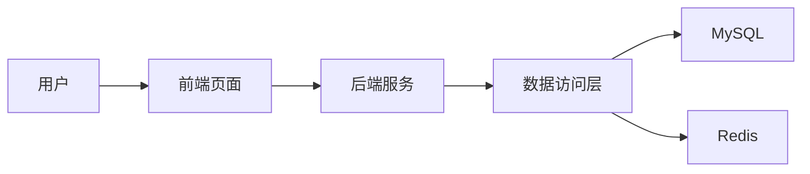

# 同学录管理系统详细设计与具体代码实现

作者：禅与计算机程序设计艺术

## 1. 背景介绍

### 1.1 项目背景

在人们的学习和工作生涯中，同学关系网络发挥着重要作用。同学录管理系统旨在帮助用户有效管理和维系这一关系网。本项目从实际需求出发，运用软件工程方法和编程技术，设计并实现一个功能完善、易用性强的同学录管理系统。

### 1.2 项目意义

- 方便用户记录和管理同学信息，如联系方式、工作动态等
- 提供同学信息检索和群发消息等实用功能，加强同学间联系
- 积累软件开发经验，提升系统分析、架构设计和编程实现能力

### 1.3 前景展望

同学录管理系统有望成为同学间信息交流的有力工具，并可灵活扩展适用于校友、职场人脉等社交场景。未来还可结合大数据、人工智能等前沿技术，挖掘关系网络价值，为用户提供个性化服务。

## 2. 核心概念与联系

### 2.1 用户 User

- 定义：系统的使用者，拥有自己的账号和密码
- 属性：用户ID、用户名、密码、头像、个性签名等
- 行为：登录/注销、编辑个人资料、添加/查询/修改同学信息等

### 2.2 同学 Classmate  

- 定义：用户的同学，由用户添加和管理
- 属性：同学ID、姓名、性别、生日、联系方式、毕业院校、所学专业、工作单位等
- 行为：被添加、被修改、被查询、被删除

### 2.3 关系 Relationship

- 定义：用户与同学间的映射关系
- 属性：用户ID、同学ID、备注、所属分组等
- 行为：建立关系、解除关系、修改备注/分组

## 3. 核心算法原理与操作步骤

### 3.1 用户注册与登录

- 用户注册：校验注册信息合法性，将用户数据持久化存储
- 用户登录：校验用户名密码，通过后以Session保持登录状态

### 3.2 同学信息管理

#### 3.2.1 添加同学 

1. 用户输入同学信息并提交
2. 后台校验数据合法性 
3. 将新同学数据存入数据库
4. 建立用户与该同学的关系映射

#### 3.2.2 修改/删除同学

1. 用户在同学列表中选择目标同学
2. 修改同学信息或点击删除
3. 后台更新数据库中相应记录

### 3.3 同学检索

1. 用户输入检索关键词
2. 后台在同学信息表中模糊匹配
3. 返回匹配的同学信息列表

## 4. 数学模型与公式

### 4.1 用户相似度计算

利用用户画像数据（如学校、专业、所在行业等），计算用户间相似度，公式如下：

$$
Similarity(A,B) = \frac{A \cdot B}{||A|| \times ||B||} = \frac{\sum_{i=1}^{n}A_i \times B_i}{\sqrt{\sum_{i=1}^{n}(A_i)^2} \times \sqrt{\sum_{i=1}^{n}(B_i)^2}}
$$

其中$A$和$B$为两个用户的特征向量，$A_i$和$B_i$为各维度特征值。

### 4.2 关系网络图

可应用图论算法分析同学关系网络，如计算节点的度中心性：

$$
C_D(v_i) = d_i = \sum_{j}^{n}a_{ij} \quad (i \neq j)
$$

其中$v_i$为节点，$d_i$为该节点的度，$a_{ij}$为节点间边的数量。度中心性体现节点的"重要性"。

## 5. 项目实践

### 5.1 技术选型

- 前端：Vue.js
- 后端：Spring Boot
- 数据库：MySQL
- 缓存：Redis

### 5.2 系统架构



### 5.3 核心代码模块

#### 5.3.1 用户实体类
```java
@Data
public class User {
    private Long id;
    private String username;
    private String password;
    private String avatar;
    private String bio;
    // getter/setter
}
```

#### 5.3.2 用户注册
```java
@PostMapping("/register")
public String register(@RequestBody User user) {
    if (userService.isValid(user)) {
        userService.save(user);
        return "注册成功";
    } else {
        return "注册信息无效";
    }
}
```

#### 5.3.3 添加同学
```java
@PostMapping("/classmates")
public String addClassmate(@RequestBody Classmate classmate) {    
    classmateService.save(classmate);
    // 建立用户同学关系
    Relationship r = new Relationship();
    r.setUserId(getCurrentUser().getId());
    r.setClassmateId(classmate.getId());
    relationshipService.save(r);
    
    return "添加成功";
}
```

## 6. 实际应用场景

### 6.1 校园场景

- 录入并管理同班同学、社团成员的信息
- 毕业后可方便查询、群发毕业聚会通知

### 6.2 职场场景

- 录入并管理历届校友信息
- 可发布招聘、职业交流信息
- 分析校友的行业分布，助力校企合作

## 7. 工具和资源推荐

- IntelliJ IDEA：功能强大的Java IDE
- Vue DevTools：用于调试Vue.js应用
- Postman：API开发测试工具
- Power Designer：数据库设计工具
- 《Clean Code》：优秀的代码设计理念

## 8. 总结

### 8.1 项目成果

本项目基于软件工程思想，采用主流技术栈实现了同学录管理系统。该系统具备用户管理、同学信息管理、好友群发等核心功能，初步建立了同学关系网络平台。

### 8.2 未来展望

未来该项目还可继续拓展、优化：

- 引入机器学习算法，智能推荐添加好友
- 挖掘用户行为数据，优化产品功能与体验
- 开放API，支持第三方应用接入

同时也需注意用户隐私保护、社交网络安全等问题。相信经过不断打磨，同学录管理系统必将为用户的社交生活带来实实在在的便利。

## 9. 附录

### 9.1 常见问题解答

#### Q1：注册时显示用户名已存在怎么办？
尝试更换其他用户名，或联系管理员反馈问题。

#### Q2：如何修改我的个性签名？
在"我的资料"页面可编辑个性签名等信息。

### 9.2 术语表
- DAO: 数据访问对象，用于访问数据库
- DTO: 数据传输对象，打包多个实体类用于前后端交互  
- Service: 业务逻辑层组件，协调控制各模块
- Redis: 高性能键值对数据库，常用作缓存