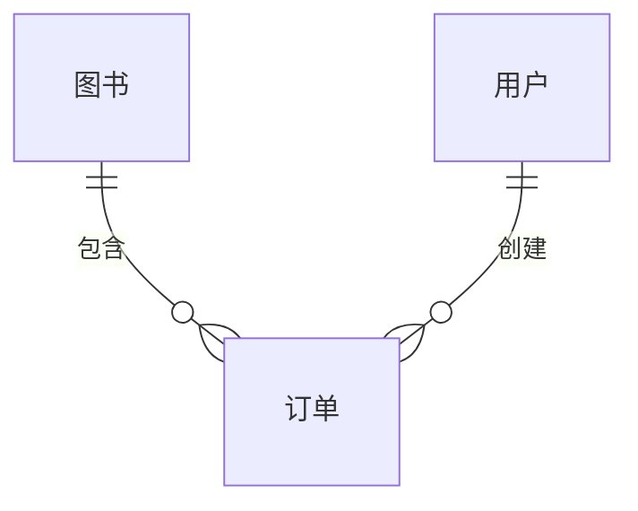

## 1. 背景介绍

### 1.1 图书销售管理系统概述

随着信息技术的快速发展和互联网的普及，传统的图书销售模式已经无法满足人们日益增长的需求。为了提高图书销售效率、降低运营成本、提升用户体验，越来越多的书店和出版社开始采用图书销售管理系统。

图书销售管理系统是一个集成了进销存、财务管理、会员管理、数据分析等功能的综合性系统。它可以帮助企业实现图书信息的电子化管理、销售流程的自动化处理、财务数据的实时监控、会员信息的精准营销等目标。

### 1.2 系统开发背景

本项目旨在开发一款功能完善、性能稳定、易于使用、安全可靠的图书销售管理系统，以满足某大型连锁书店的实际业务需求。该书店拥有数十家门店，每年销售图书数百万册，现有系统难以满足其日益增长的业务量和管理需求。

### 1.3 系统目标

*   **提高效率**: 实现图书入库、销售、退货等流程的自动化处理，减少人工操作，提高工作效率。
*   **降低成本**: 通过系统优化库存管理，减少库存积压，降低运营成本。
*   **提升体验**: 为顾客提供便捷的购书体验，例如在线查询、预订、支付等功能。
*   **数据驱动**: 收集和分析销售数据，为经营决策提供数据支持。

## 2. 核心概念与联系

### 2.1 系统架构

本系统采用 B/S 架构，主要分为以下几个模块：

*   **前台模块**: 为顾客提供图书查询、浏览、购买、支付等功能。
*   **后台管理模块**: 为管理员提供系统设置、图书管理、订单管理、会员管理、数据统计等功能。
*   **数据库**: 存储系统的所有数据，包括图书信息、用户信息、订单信息等。

### 2.2 核心实体

*   **图书**: 包括图书编号、名称、作者、出版社、出版日期、价格、库存数量等信息。
*   **用户**: 包括用户ID、用户名、密码、姓名、联系方式、地址等信息。
*   **订单**: 包括订单号、下单时间、用户ID、图书列表、总金额、订单状态等信息。

### 2.3 实体关系图



## 3. 核心算法原理具体操作步骤

### 3.1 图书推荐算法

本系统采用基于用户协同过滤的图书推荐算法，具体操作步骤如下：

1.  收集用户的历史购买记录。
2.  根据用户的购买记录，计算用户之间的相似度。
3.  找到与目标用户相似的用户群体。
4.  将相似用户群体购买过的图书推荐给目标用户。

### 3.2 库存管理算法

本系统采用先进先出（FIFO）的库存管理算法，具体操作步骤如下：

1.  当新图书入库时，将新图书添加到库存队列的末尾。
2.  当用户购买图书时，从库存队列的头部取出相应数量的图书。
3.  如果库存队列中没有足够的图书，则提示用户缺货。

## 4. 数学模型和公式详细讲解举例说明

### 4.1 用户相似度计算

本系统采用余弦相似度计算用户之间的相似度，公式如下：

$$
similarity(u,v) = \frac{\vec{u} \cdot \vec{v}}{||\vec{u}|| \times ||\vec{v}||}
$$

其中，$\vec{u}$ 和 $\vec{v}$ 分别表示用户 $u$ 和用户 $v$ 的购书向量，向量的每个元素表示用户对该图书的评分或购买数量。

**举例说明**:

假设用户 A 购买了图书 1、图书 2 和图书 3，用户 B 购买了图书 2、图书 3 和图书 4，则用户 A 和用户 B 的购书向量分别为：

```
用户 A: [1, 1, 1, 0]
用户 B: [0, 1, 1, 1]
```

根据余弦相似度公式，可以计算出用户 A 和用户 B 的相似度为：

```
similarity(A,B) = (1*0 + 1*1 + 1*1 + 0*1) / (sqrt(1^2 + 1^2 + 1^2 + 0^2) * sqrt(0^2 + 1^2 + 1^2 + 1^2)) = 0.71
```

### 4.2 库存周转率计算

库存周转率是衡量企业库存管理效率的重要指标，计算公式如下：

$$
Inventory Turnover = \frac{Cost of Goods Sold}{Average Inventory}
$$

其中，$Cost of Goods Sold$ 表示销售成本，$Average Inventory$ 表示平均库存。

**举例说明**:

假设某书店在一年内销售图书的成本为 100 万元，平均库存为 20 万元，则该书店的库存周转率为：

```
Inventory Turnover = 100 / 20 = 5
```

## 5. 项目实践：代码实例和详细解释说明

### 5.1 技术选型

*   **后端**: Spring Boot
*   **数据库**: MySQL
*   **前端**: Vue.js

### 5.2 代码实例

**用户登录接口**:

```java
@RestController
@RequestMapping("/api/user")
public class UserController {

    @Autowired
    private UserService userService;

    @PostMapping("/login")
    public Result<User> login(@RequestBody UserLoginRequest request) {
        User user = userService.findByUsername(request.getUsername());
        if (user == null) {
            return Result.fail("用户名不存在");
        }
        if (!user.getPassword().equals(request.getPassword())) {
            return Result.fail("密码错误");
        }
        return Result.success(user);
    }
}
```

**图书查询接口**:

```java
@RestController
@RequestMapping("/api/book")
public class BookController {

    @Autowired
    private BookService bookService;

    @GetMapping("/list")
    public Result<List<Book>> list(@RequestParam(required = false) String keyword) {
        List<Book> books = bookService.findByKeyword(keyword);
        return Result.success(books);
    }
}
```

## 6. 实际应用场景

本系统适用于各种规模的书店、出版社、图书馆等机构，可以帮助其提高图书销售效率、降低运营成本、提升用户体验。

## 7. 工具和资源推荐

*   **Spring Boot**: https://spring.io/projects/spring-boot
*   **MySQL**: https://www.mysql.com/
*   **Vue.js**: https://vuejs.org/

## 8. 总结：未来发展趋势与挑战

### 8.1 未来发展趋势

*   **智能化**: 利用人工智能技术，实现图书推荐、库存管理、客服等环节的智能化。
*   **个性化**: 根据用户的阅读习惯和兴趣爱好，提供个性化的图书推荐和服务。
*   **移动化**: 开发移动端应用，方便用户随时随地购书。

### 8.2 面临挑战

*   **数据安全**: 如何保障用户数据安全。
*   **系统性能**: 如何应对高并发访问。
*   **用户体验**: 如何持续提升用户体验。

## 9. 附录：常见问题与解答

### 9.1 问：如何注册账号？

答：点击首页的“注册”按钮，填写相关信息即可注册账号。

### 9.2 问：如何修改密码？

答：登录后，点击“个人中心”，进入“修改密码”页面，输入原密码和新密码即可修改密码。
