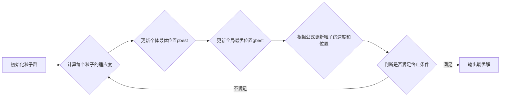

# 图解粒子群算法:直观理解算法流程

作者：禅与计算机程序设计艺术

## 1. 背景介绍

### 1.1 优化问题的本质与挑战

在科学研究、工程实践以及日常生活中，我们常常面临着各种各样的优化问题。从寻找函数的最优解，到设计最佳的交通路线，再到制定最合理的投资策略，优化问题无处不在。其本质在于，我们需要从众多可行的方案中找到最优或近似最优的方案，以达到特定的目标。

然而，现实世界中的优化问题往往十分复杂，面临着诸多挑战：

* **高维空间**:  许多优化问题的解空间是高维的，这意味着需要搜索的空间非常庞大，传统的穷举搜索方法效率低下，甚至不可行。
* **非线性**:  很多优化问题是非线性的，目标函数和约束条件可能是非线性函数，这使得传统的基于梯度的优化算法难以奏效。
* **多峰值**:  一些优化问题存在多个局部最优解，传统的优化算法容易陷入局部最优，而难以找到全局最优解。

### 1.2 粒子群算法的诞生与发展

为了应对这些挑战，人们发展了各种各样的优化算法，其中就包括粒子群算法 (Particle Swarm Optimization, PSO)。PSO 算法灵感来源于对鸟群或鱼群觅食行为的模拟。试想一下，一群鸟在寻找食物时，每一只鸟都根据自身的经验和周围同伴的信息来调整自己的飞行方向和速度，最终整个鸟群都能够找到食物最丰富的地方。

PSO 算法将待优化问题的解空间比作鸟群觅食的区域，将每一个可行解比作一只鸟 (即粒子)，通过模拟鸟群的飞行行为来搜索最优解。PSO 算法具有以下优点：

* **简单易懂**:  PSO 算法的原理简单易懂，易于实现。
* **参数较少**:  PSO 算法的参数较少，易于调整。
* **全局搜索能力强**:  PSO 算法具有较强的全局搜索能力，能够有效地跳出局部最优。
* **收敛速度快**:  PSO 算法在很多情况下都能够快速收敛到最优解。

## 2. 核心概念与联系

### 2.1 粒子、速度和位置

在 PSO 算法中，每个粒子都代表着待优化问题的一个可行解，具有以下属性：

* **位置**:  粒子的位置代表着解空间中的一个点，用一个向量表示。
* **速度**:  粒子的速度代表着粒子在解空间中的运动方向和速度，也用一个向量表示。
* **适应度**:  粒子的适应度代表着粒子所代表的解的优劣程度，通常用目标函数的值来衡量。

### 2.2 个体最优和全局最优

* **个体最优位置 (pbest)**:  每个粒子在搜索过程中都会记录自己找到的最佳位置，即个体最优位置。
* **全局最优位置 (gbest)**:  整个粒子群在搜索过程中找到的最佳位置，即全局最优位置。

### 2.3 核心公式与流程图

粒子群算法的核心在于粒子的速度和位置更新公式：

**速度更新公式**:

$$ v_i(t+1) = w \cdot v_i(t) + c_1 \cdot r_1 \cdot (pbest_i - x_i(t)) + c_2 \cdot r_2 \cdot (gbest - x_i(t)) $$

**位置更新公式**:

$$ x_i(t+1) = x_i(t) + v_i(t+1) $$

其中：

* $v_i(t)$ 表示第 $i$ 个粒子在 $t$ 时刻的速度。
* $x_i(t)$ 表示第 $i$ 个粒子在 $t$ 时刻的位置。
* $w$ 表示惯性权重，用于控制粒子速度的历史影响。
* $c_1$ 和 $c_2$ 分别表示个体学习因子和社会学习因子，用于控制粒子向个体最优位置和全局最优位置学习的程度。
* $r_1$ 和 $r_2$ 是两个均匀分布在 $[0,1]$ 之间的随机数。

**流程图**:



## 3. 核心算法原理具体操作步骤

### 3.1 初始化粒子群

在算法开始之前，首先需要对粒子群进行初始化，包括：

* **设置粒子群规模**:  即粒子的数量。
* **随机初始化粒子的位置和速度**:  粒子的初始位置和速度通常在解空间内随机生成。
* **设置算法参数**:  包括惯性权重 $w$、学习因子 $c_1$ 和 $c_2$ 等。

### 3.2 计算每个粒子的适应度

初始化粒子群后，需要计算每个粒子的适应度，即目标函数的值。适应度值越高，表示该粒子所代表的解越好。

### 3.3 更新个体最优位置 pbest

对于每个粒子，将其当前的适应度值与其历史最佳适应度值进行比较，如果当前的适应度值更优，则更新该粒子的个体最优位置为当前位置。

### 3.4 更新全局最优位置 gbest

比较所有粒子的个体最优位置，找到适应度值最高的粒子，将其个体最优位置作为全局最优位置。

### 3.5 根据公式更新粒子的速度和位置

根据速度更新公式和位置更新公式，更新每个粒子的速度和位置。

### 3.6 判断是否满足终止条件

判断算法是否满足终止条件，例如：

* **达到最大迭代次数**:  如果算法已经迭代了预设的最大次数，则停止迭代。
* **找到满足精度要求的解**:  如果全局最优位置的适应度值已经满足预设的精度要求，则停止迭代。

### 3.7 输出最优解

如果满足终止条件，则输出全局最优位置作为问题的最优解。

## 4. 数学模型和公式详细讲解举例说明

### 4.1 速度更新公式

$$ v_i(t+1) = w \cdot v_i(t) + c_1 \cdot r_1 \cdot (pbest_i - x_i(t)) + c_2 \cdot r_2 \cdot (gbest - x_i(t)) $$

该公式表示粒子 $i$ 在 $t+1$ 时刻的速度 $v_i(t+1)$ 由三部分组成：

* **惯性部分**:  $w \cdot v_i(t)$，表示粒子当前速度的惯性，惯性权重 $w$ 越大，表示粒子越倾向于保持当前的运动状态。
* **个体认知部分**:  $c_1 \cdot r_1 \cdot (pbest_i - x_i(t))$，表示粒子根据自身的经验进行学习，$pbest_i$ 表示粒子 $i$ 的个体最优位置，$(pbest_i - x_i(t))$ 表示粒子当前位置与个体最优位置的距离，$c_1$ 表示个体学习因子，$r_1$ 是一个随机数，用于增加算法的随机性。
* **社会认知部分**:  $c_2 \cdot r_2 \cdot (gbest - x_i(t))$，表示粒子根据全局最优经验进行学习，$gbest$ 表示全局最优位置，$(gbest - x_i(t))$ 表示粒子当前位置与全局最优位置的距离，$c_2$ 表示社会学习因子，$r_2$ 是一个随机数，用于增加算法的随机性。

### 4.2 位置更新公式

$$ x_i(t+1) = x_i(t) + v_i(t+1) $$

该公式表示粒子 $i$ 在 $t+1$ 时刻的位置 $x_i(t+1)$ 等于其在 $t$ 时刻的位置 $x_i(t)$ 加上其在 $t+1$ 时刻的速度 $v_i(t+1)$。

### 4.3 举例说明

假设我们要解决一个二维空间中的函数优化问题，目标函数为：

$$ f(x,y) = (x-2)^2 + (y-3)^2 $$

我们使用粒子群算法来搜索该函数的最小值，参数设置如下：

* 粒子群规模：10
* 惯性权重：0.8
* 个体学习因子：2
* 社会学习因子：2

算法流程如下：

1. 随机初始化 10 个粒子的位置和速度。
2. 计算每个粒子的适应度值，即目标函数的值。
3. 更新每个粒子的个体最优位置。
4. 更新全局最优位置。
5. 根据速度更新公式和位置更新公式，更新每个粒子的速度和位置。
6. 重复步骤 2 到 5，直到满足终止条件。

## 5. 项目实践：代码实例和详细解释说明

### 5.1 Python 代码实现

```python
import random

# 定义目标函数
def objective_function(x):
    return (x[0] - 2) ** 2 + (x[1] - 3) ** 2

# 定义粒子类
class Particle:
    def __init__(self, bounds):
        self.position = [random.uniform(bounds[i][0], bounds[i][1]) for i in range(len(bounds))]
        self.velocity = [random.uniform(-1, 1) for _ in range(len(bounds))]
        self.best_position = self.position
        self.best_fitness = objective_function(self.position)

# 定义粒子群算法
def particle_swarm_optimization(objective_function, bounds, num_particles, iterations, w, c1, c2):
    # 初始化粒子群
    swarm = [Particle(bounds) for _ in range(num_particles)]

    # 找到初始的全局最优位置
    global_best_position = swarm[0].position
    global_best_fitness = swarm[0].best_fitness
    for particle in swarm:
        if particle.best_fitness < global_best_fitness:
            global_best_position = particle.best_position
            global_best_fitness = particle.best_fitness

    # 开始迭代
    for _ in range(iterations):
        # 更新每个粒子的速度和位置
        for particle in swarm:
            # 更新速度
            for i in range(len(bounds)):
                r1 = random.random()
                r2 = random.random()
                particle.velocity[i] = (
                    w * particle.velocity[i]
                    + c1 * r1 * (particle.best_position[i] - particle.position[i])
                    + c2 * r2 * (global_best_position[i] - particle.position[i])
                )

            # 更新位置
            for i in range(len(bounds)):
                particle.position[i] += particle.velocity[i]

            # 检查边界
            for i in range(len(bounds)):
                if particle.position[i] < bounds[i][0]:
                    particle.position[i] = bounds[i][0]
                elif particle.position[i] > bounds[i][1]:
                    particle.position[i] = bounds[i][1]

            # 更新个体最优位置和全局最优位置
            fitness = objective_function(particle.position)
            if fitness < particle.best_fitness:
                particle.best_position = particle.position
                particle.best_fitness = fitness
                if fitness < global_best_fitness:
                    global_best_position = particle.position
                    global_best_fitness = fitness

    # 返回全局最优位置和适应度值
    return global_best_position, global_best_fitness

# 设置参数
bounds = [(-5, 5), (-5, 5)]  # 搜索空间边界
num_particles = 20  # 粒子数量
iterations = 100  # 迭代次数
w = 0.8  # 惯性权重
c1 = 2  # 个体学习因子
c2 = 2  # 社会学习因子

# 运行粒子群算法
best_position, best_fitness = particle_swarm_optimization(
    objective_function, bounds, num_particles, iterations, w, c1, c2
)

# 打印结果
print("最优位置:", best_position)
print("最优适应度值:", best_fitness)
```

### 5.2 代码解释

* **`objective_function(x)`**:  定义目标函数，这里以二维函数为例。
* **`Particle` 类**:  定义粒子类，包含位置、速度、个体最优位置和适应度值等属性。
* **`particle_swarm_optimization()` 函数**:  定义粒子群算法，接收目标函数、搜索空间边界、粒子数量、迭代次数、惯性权重、个体学习因子和社会学习因子等参数。
* **初始化粒子群**:  创建指定数量的粒子，并随机初始化其位置和速度。
* **找到初始的全局最优位置**:  遍历所有粒子，找到适应度值最高的粒子，将其位置作为初始的全局最优位置。
* **开始迭代**:  进行指定次数的迭代，每次迭代都更新所有粒子的速度和位置。
* **更新速度**:  根据速度更新公式更新每个粒子的速度。
* **更新位置**:  根据位置更新公式更新每个粒子的位置。
* **检查边界**:  确保每个粒子的位置都在搜索空间边界内。
* **更新个体最优位置和全局最优位置**:  计算每个粒子的适应度值，如果优于历史最佳适应度值，则更新个体最优位置；如果优于全局最优适应度值，则更新全局最优位置。
* **返回全局最优位置和适应度值**:  迭代结束后，返回全局最优位置和适应度值。

## 6. 实际应用场景

粒子群算法作为一种高效的全局优化算法，在各个领域都有着广泛的应用，例如：

* **函数优化**:  求解各种复杂函数的最小值或最大值，例如工程设计、机器学习等领域。
* **神经网络训练**:  优化神经网络的权重和偏置，提高网络的预测精度。
* **路径规划**:  寻找机器人、无人机等移动体的最优路径，例如物流配送、无人驾驶等领域。
* **图像处理**:  进行图像分割、目标识别等任务。
* **金融领域**:  进行投资组合优化、风险管理等。

## 7. 总结：未来发展趋势与挑战

### 7.1 未来发展趋势

* **多目标优化**:  将粒子群算法应用于多目标优化问题，例如同时优化产品的性能、成本和可靠性等多个目标。
* **约束优化**:  将粒子群算法应用于约束优化问题，例如在满足一定约束条件的情况下找到最优解。
* **动态优化**:  将粒子群算法应用于动态优化问题，例如目标函数或约束条件随时间变化的优化问题。
* **与其他算法的结合**:  将粒子群算法与其他优化算法结合，例如遗传算法、模拟退火算法等，以提高算法的性能。

### 7.2 面临的挑战

* **参数设置**:  粒子群算法的性能对参数设置比较敏感，如何找到最佳的参数设置是一个挑战。
* **早熟收敛**:  粒子群算法容易陷入局部最优解，如何避免早熟收敛是一个挑战。
* **高维问题**:  对于高维优化问题，粒子群算法的效率可能会下降，如何提高算法在高维问题上的效率是一个挑战。

## 8. 附录：常见问题与解答

### 8.1 如何选择粒子群算法的参数？

粒子群算法的参数设置对算法的性能有很大影响，一般来说：

* **惯性权重 $w$**:  控制粒子速度的历史影响，通常取值在 0.5 到 1 之间。
* **个体学习因子 $c_1$**:  控制粒子向个体最优位置学习的程度，通常取值在 1 到 2 之间。
* **社会学习因子 $c_2$**:  控制粒子向全局最优位置学习的程度，通常取值在 1 到 2 之间。

参数的选择可以根据具体的问题进行调整，也可以使用一些参数自适应策略来自动调整参数。

### 8.2 如何避免粒子群算法的早熟收敛？

为了避免粒子群算法的早熟收敛，可以采用以下策略：

* **增加种群多样性**:  可以使用多种群策略，将粒子群分成多个子群，每个子群独立进化，最后合并结果，以增加种群的多样性。
* **引入变异操作**:  在每次迭代过程中，对一部分粒子的位置或速度进行随机变异，以跳出局部最优解。
* **使用自适应参数**:  使用自适应参数策略来自动调整算法的参数，以适应不同的优化问题。

### 8.3 粒子群算法与遗传算法有什么区别？

粒子群算法和遗传算法都是基于群体智能的优化算法，但它们之间也有一些区别：

* **编码方式**:  遗传算法通常使用二进制编码来表示解，而粒子群算法使用实数编码来表示解。
* **进化机制**:  遗传算法使用选择、交叉和变异等操作来模拟生物进化过程，而粒子群算法使用粒子的速度和位置