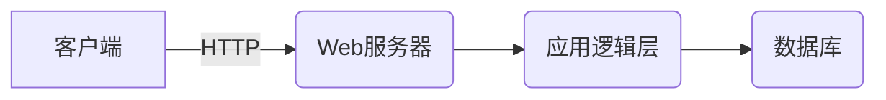

# 在线投票系统详细设计与具体代码实现

## 1.背景介绍

### 1.1 在线投票系统的重要性

在线投票系统是一种基于互联网的远程电子投票方式,可以让选民无需亲临投票站,只需通过网络终端(如电脑、手机等)便可参与投票。该系统具有高效、便捷、节省成本等优点,在各类选举活动中发挥着重要作用。

随着信息技术的快速发展,在线投票系统逐渐取代传统的纸质投票方式,成为现代民主选举的重要工具。它不仅提高了投票效率,还可以确保投票过程的公正性和透明度,有利于维护选举的公信力。

### 1.2 在线投票系统的应用场景

在线投票系统可广泛应用于各类选举活动,包括但不限于:

- 国家/地区性选举
- 企业内部的职务选举
- 社区事务的民主决策
- 学校学生会的干部选举
- 社交媒体上的调查投票等

### 1.3 在线投票系统的挑战

尽管在线投票系统具有诸多优势,但其设计和实现也面临着一些重大挑战:

- 系统安全性
- 投票匿名性
- 防止重复投票
- 确保公平公正
- 提高用户体验

## 2.核心概念与联系

### 2.1 投票活动

投票活动是在线投票系统的核心概念,包括以下几个关键要素:

- 候选人/候选项
- 选民
- 投票规则(如最多可投几票等)
- 开始时间和结束时间

### 2.2 身份认证

为确保投票公正,需要对选民进行身份认证,常见的认证方式有:

- 用户名和密码登录
- 双因素认证(验证码等)
- 基于区块链的去中心化身份认证

### 2.3 投票加密

为保护选民的投票匿名性,需要对投票数据进行加密,主要包括:

- 非对称加密(如RSA)
- 对称加密(如AES)
- 同态加密
- 盲化签名

### 2.4 投票记录

投票系统需妥善保存每一张投票的加密记录,作为选举结果的依据。投票记录的存储方式可以是:

- 传统数据库
- 区块链账本
- 分布式存储系统

### 2.5 系统架构

在线投票系统通常采用客户端-服务器或浏览器-服务器架构,具体包括:

- 客户端(浏览器)
- Web服务器
- 应用服务器
- 数据库服务器
- 消息队列等

## 3.核心算法原理具体操作步骤  

### 3.1 投票流程

在线投票系统的核心算法体现在整个投票流程中,一般包括以下步骤:

1. **选民身份认证**

    选民通过用户名/密码、双因素认证等方式登录投票系统,确认其投票资格。

2. **获取候选人/候选项列表**

    系统为选民呈现本次投票活动的所有候选人/候选项。

3. **选民投票**

    选民根据投票规则,勾选或填写自己的选择,生成加密的投票数据。

4. **投票数据上链或存储**

    选民的加密投票数据被提交到系统的存储介质(区块链、数据库等)。

5. **投票结束**

    当达到投票截止时间,系统停止接受新的投票。

6. **计票**

    系统对所有加密投票数据进行解密,统计出每个候选人/候选项的得票数。

7. **公布结果**

    系统以适当方式(如网站公示、发送邮件等)公布计票结果。

### 3.2 防止重复投票

为确保每个选民只能投一次票,系统需要采取一些策略防止重复投票,如:

- 基于选民身份的投票记录检查
- 为每个选民分配一次性的投票令牌
- 利用区块链的不可篡改特性

### 3.3 投票匿名性

为保护选民的投票匿名性,可采取如下加密措施:

- 使用同态加密技术对明文投票数据加密
- 采用盲化签名技术,使系统无法关联投票数据与选民身份
- 利用混淆网络(如Tor)隐藏选民的网络轨迹

### 3.4 分布式计票

为提高计票效率和公信力,可采用分布式计票算法:

- 利用多方安全计算(MPC)协议
- 基于区块链的去中心化计票机制
- 采用可验证的混淆网络技术

## 4.数学模型和公式详细讲解举例说明

在线投票系统中,数学模型和密码学原理扮演着重要角色,下面分别介绍几种常用的数学模型。

### 4.1 同态加密

同态加密允许在密文上直接进行某些运算,而无需先解密。这在投票系统中很有用,可以在不解密的情况下对加密投票进行统计。

定义一个加密函数$E$和解密函数$D$,如果对任意明文$m_1$和$m_2$,有:

$$
D(E(m_1) \oplus E(m_2)) = m_1 \odot m_2
$$

其中$\oplus$代表某种运算(如加法或乘法)在密文上的同态运算,$\odot$代表明文上的对应运算,那么我们就称$E$为同态加密。

一个常见的同态加密系统是Paillier加密,它在密文上具有同态加法性质:

$$
D(E(m_1) \cdot E(m_2) \bmod n^2) = m_1 + m_2 \bmod n
$$

通过这一性质,我们可以在不解密的情况下,对加密投票数据进行累加统计。

### 4.2 盲化签名

盲化签名可以让签名者对信息内容保持盲目,这在投票系统中用于保护选民投票匿名性。具体过程如下:

1. 选民生成一个盲化因子$r$,并用它对明文投票数据$m$进行盲化:$m' = m \cdot r^e \bmod n$
2. 选民将$m'$发送给系统,系统使用私钥$d$对$m'$签名:$s' = (m')^d \bmod n$
3. 选民使用$r$对$s'$进行去盲化:$s = s' \cdot r^{-1} \bmod n$

最终,选民得到了对$m$的签名$s$,而系统由于无法确定$r$的值,因此无法关联明文$m$与签名$s$,从而实现了投票匿名性。

### 4.3 混淆网络

混淆网络可以隐藏通信双方的网络轨迹,在投票系统中可以用于隐藏选民的网络轨迹,防止选票被追踪。一个著名的混淆网络是Tor,它的工作原理如下:

1. 客户端(选民)随机选择若干个中继节点组成环路CircuitCircuit
2. 客户端将加密过的投票数据分成若干单元Cell,按环路路径依次通过每个节点进行加密
3. 最后一个节点将Cell解密后,发送到目的地(投票服务器)
4. 返回数据也按相同路径反向传输

由于中继节点只知道前一站和下一站,无法确定通信的源和目的地,因此实现了选民网络轨迹的隐藏。

### 4.4 多方安全计算(MPC)

多方安全计算允许多个参与方在不泄露各自私有数据的情况下,共同计算一个函数。这在投票系统中可用于分布式计票,提高结果公信力。

假设有$n$个参与方,每个参与方$i$拥有私有输入$x_i$,所有参与方想要计算公共函数$f(x_1, x_2, \cdots, x_n)$的值,而无需向其他方透露$x_i$。MPC协议可以让所有参与方最终都得到正确的计算结果$y=f(x_1, x_2, \cdots, x_n)$,且不会泄露任何一方的私有输入$x_i$。

常见的MPC协议包括Shamir秘密分享、Yao的millionaires问题等,原理较为复杂,这里不再赘述。

## 4.项目实践:代码实例和详细解释说明

为了更好地理解在线投票系统的实现细节,我们给出了一个使用Python编写的简单投票系统Demo。

### 4.1 系统架构

我们的Demo采用了典型的客户端-服务器架构:



其中:

- 客户端: 基于浏览器的前端界面
- Web服务器: 使用Flask框架
- 应用逻辑层: 处理用户请求,进行业务逻辑运算
- 数据库: 使用SQLite存储投票活动和投票记录

### 4.2 关键模块

投票系统的核心模块包括:

- `models.py`: 定义数据模型(投票活动、候选项、投票记录等)
- `auth.py`: 实现用户认证和会话管理
- `voting.py`: 处理投票相关的业务逻辑
- `utils.py`: 一些工具函数(如生成随机字符串等)

### 4.3 用户认证

我们使用Flask内置的会话机制实现用户认证。用户登录时,将其用户ID存入会话;退出登录时,清除会话数据。

```python
# auth.py
from flask import Blueprint, session, redirect, url_for

bp = Blueprint('auth', __name__)

@bp.route('/login', methods=['GET', 'POST'])
def login():
    # 处理登录请求
    user_id = validate_user(request.form)
    if user_id:
        session['user_id'] = user_id
        return redirect(url_for('voting.index'))
    else:
        return render_template('login.html', error='Invalid credentials')

@bp.route('/logout')
def logout():
    session.pop('user_id', None)
    return redirect(url_for('auth.login'))
```

### 4.4 创建投票活动

管理员可以在后台创建新的投票活动,包括设置活动名称、候选项、投票规则等。

```python
# voting.py
from flask import Blueprint, request, render_template
from .models import Poll, Choice

bp = Blueprint('voting', __name__)

@bp.route('/create', methods=['GET', 'POST'])
def create_poll():
    if request.method == 'POST':
        # 从表单数据创建新的投票活动
        poll = Poll(
            name=request.form['name'],
            description=request.form['description'],
            start_time=request.form['start_time'],
            end_time=request.form['end_time'],
            max_votes=request.form['max_votes']
        )
        db.session.add(poll)
        db.session.flush()
        
        # 添加候选项
        for choice_text in request.form.getlist('choices'):
            choice = Choice(poll_id=poll.id, text=choice_text)
            db.session.add(choice)
            
        db.session.commit()
        return redirect(url_for('voting.index'))
    
    return render_template('create_poll.html')
```

### 4.5 投票加密

由于本Demo只是一个简单实现,我们暂时忽略了对投票数据的加密。在实际系统中,应该对投票数据进行加密处理,以保护选民的投票匿名性。

### 4.6 提交投票

选民登录系统后,可以查看当前进行中的投票活动列表,并参与投票。

```python
# voting.py
@bp.route('/vote/<int:poll_id>', methods=['GET', 'POST'])
def vote(poll_id):
    poll = Poll.query.get_or_404(poll_id)
    if request.method == 'POST':
        # 处理投票请求
        votes = request.form.getlist('choices')
        if len(votes) > poll.max_votes:
            error = f'You can only vote for up to {poll.max_votes} choices.'
        else:
            user_id = session.get('user_id')
            # 保存投票记录
            for choice_id in votes:
                vote = Vote(poll_id=poll_id, choice_id=choice_id, user_id=user_id)
                db.session.add(vote)
            db.session.commit()
            return redirect(url_for('voting.results', poll_id=poll_id))
    
    choices = Choice.query.filter_by(poll_id=poll_id).all()
    return render_template('vote.html', poll=poll, choices=choices, error=error)
```

### 4.7 计票和结果公布

投票截止后,系统会统计每个候选项的得票数,并公布结果。

```python
# voting.py
@bp.route('/results/<int:poll_id>')