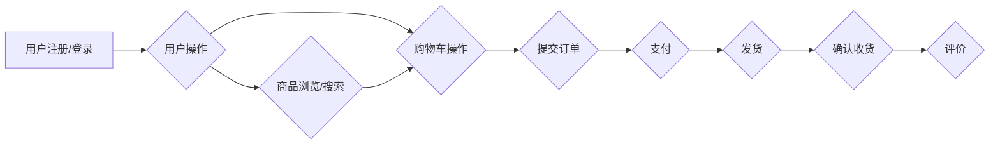

## 在线药店管理系统详细设计与具体代码实现

作者：禅与计算机程序设计艺术

## 1. 背景介绍

### 1.1 在线药店行业的兴起与发展

近年来，随着互联网技术的快速发展和人们生活节奏的加快，在线医疗健康服务模式逐渐兴起，并迅速渗透到医药电商领域。在线药店作为一种新型的医药流通模式，凭借其便捷、高效、低成本等优势，受到了越来越多消费者的青睐，市场规模不断扩大。

### 1.2 传统药店面临的挑战

传统药店在运营过程中面临着诸多挑战，例如：

* **地理位置限制：**传统药店的经营范围受限于其地理位置，难以覆盖更广泛的客户群体。
* **信息不对称：**消费者难以获取全面、透明的药品信息，容易受到虚假宣传和价格欺诈的影响。
* **库存管理困难：**传统药店需要投入大量人力物力进行库存管理，容易出现药品过期、积压等问题。
* **服务体验欠佳：**传统药店的服务模式较为单一，难以满足消费者个性化、多元化的需求。

### 1.3 在线药店的优势与价值

在线药店作为一种新兴的医药零售模式，具有以下优势：

* **突破时间和空间限制：**消费者可以随时随地在线浏览和购买药品，不受时间和地域限制。
* **提高信息透明度：**在线药店可以提供详细的药品信息，包括价格、功效、用法用量、注意事项等，方便消费者进行比较和选择。
* **降低运营成本：**在线药店可以节省店面租金、人工成本等费用，从而降低药品价格，提高市场竞争力。
* **提升服务体验：**在线药店可以提供在线咨询、送药上门、用药提醒等增值服务，提升消费者的购药体验。

## 2. 核心概念与联系

### 2.1 系统用户角色

在线药店管理系统涉及的用户角色主要包括：

* **管理员：**负责系统的整体运营和管理，包括用户管理、商品管理、订单管理、数据统计等。
* **药剂师：**负责审核用户的处方，提供用药指导和咨询服务。
* **用户：**注册会员，可以在线浏览商品、下单购买、查看订单状态等。

### 2.2 系统功能模块

在线药店管理系统主要包括以下功能模块：

* **用户管理模块：**实现用户注册、登录、个人信息管理、密码修改等功能。
* **商品管理模块：**实现药品信息的录入、编辑、上下架、分类管理等功能。
* **订单管理模块：**实现订单生成、支付、配送、确认收货、评价等功能。
* **库存管理模块：**实现药品入库、出库、库存预警等功能。
* **数据统计模块：**实现销售数据、用户数据、商品数据的统计分析，为运营决策提供数据支持。

### 2.3 系统架构设计

在线药店管理系统采用 B/S 架构，主要包括以下层次：

* **表示层：**负责与用户进行交互，展示系统功能和数据。
* **业务逻辑层：**负责处理业务逻辑，实现系统功能。
* **数据访问层：**负责与数据库进行交互，实现数据的增删改查。

### 2.4 系统流程图



## 3. 核心算法原理具体操作步骤

### 3.1 用户注册与登录

* 用户注册时，需要填写用户名、密码、手机号码等信息，系统会对用户信息进行验证，确保信息的真实性和有效性。
* 用户登录时，系统会验证用户名和密码是否匹配，如果匹配则允许用户登录系统。

### 3.2 商品浏览与搜索

* 用户可以通过商品分类、关键词搜索等方式浏览商品信息。
* 系统会根据用户的搜索条件，从数据库中检索匹配的商品信息，并按照一定的排序规则展示给用户。

### 3.3 购物车操作

* 用户可以将感兴趣的商品添加到购物车中。
* 用户可以在购物车中修改商品数量、删除商品等。

### 3.4 提交订单

* 用户确认购物车中的商品信息后，可以提交订单。
* 系统会生成订单号，并记录订单相关的商品信息、用户信息、配送地址等。

### 3.5 支付

* 用户可以选择在线支付、货到付款等方式进行支付。
* 系统会调用第三方支付接口，完成支付操作。

### 3.6 发货

* 商家确认收到货款后，会安排发货。
* 系统会更新订单状态为“已发货”，并记录物流信息。

### 3.7 确认收货

* 用户收到商品后，可以在系统中确认收货。
* 系统会更新订单状态为“已完成”。

### 3.8 评价

* 用户可以对已完成的订单进行评价，评价内容包括商品质量、服务态度、物流速度等。

## 4. 数学模型和公式详细讲解举例说明

在线药店管理系统中，可以使用一些数学模型和算法来优化系统性能和用户体验，例如：

### 4.1 协同过滤算法

协同过滤算法可以根据用户的历史购买记录和评分，向用户推荐可能感兴趣的商品。

**公式：**

```
similarity(u, v) = (u • v) / (||u|| * ||v||)
```

其中：

* u 和 v 分别表示两个用户的评分向量。
* • 表示向量的点积运算。
* ||u|| 和 ||v|| 分别表示向量 u 和 v 的模。

**举例说明：**

假设用户 A 购买过感冒药和退烧药，用户 B 购买过感冒药和止咳糖浆，则可以计算用户 A 和用户 B 之间的相似度，如果相似度较高，则可以向用户 A 推荐止咳糖浆。

### 4.2 库存预警模型

库存预警模型可以根据历史销售数据和库存情况，预测未来一段时间的药品需求量，并及时提醒商家进行补货。

**公式：**

```
predicted_demand = α * previous_demand + (1 - α) * current_demand
```

其中：

* predicted_demand 表示预测的药品需求量。
* previous_demand 表示上一期的药品需求量。
* current_demand 表示当前的药品需求量。
* α 表示平滑系数，取值范围为 0 到 1 之间。

**举例说明：**

假设某药品的上一期需求量为 100 盒，当前的库存量为 50 盒，平滑系数为 0.8，则可以预测下一期的药品需求量为：

```
predicted_demand = 0.8 * 100 + (1 - 0.8) * 50 = 90 盒
```

如果预测的药品需求量低于设定的预警值，则系统会向商家发送预警信息，提醒商家及时补货。

## 5. 项目实践：代码实例和详细解释说明

### 5.1 技术选型

* **后端框架：**Spring Boot
* **数据库：**MySQL
* **缓存：**Redis
* **消息队列：**RabbitMQ

### 5.2 代码示例

**用户注册接口：**

```java
@RestController
@RequestMapping("/api/user")
public class UserController {

    @Autowired
    private UserService userService;

    @PostMapping("/register")
    public Result register(@RequestBody User user) {
        // 校验用户信息
        // ...

        // 保存用户信息
        userService.save(user);

        return Result.success("注册成功");
    }
}
```

**商品列表接口：**

```java
@RestController
@RequestMapping("/api/product")
public class ProductController {

    @Autowired
    private ProductService productService;

    @GetMapping("/list")
    public Result list(@RequestParam(defaultValue = "1") Integer pageNum,
                       @RequestParam(defaultValue = "10") Integer pageSize,
                       @RequestParam(required = false) String keyword) {
        // 查询商品列表
        Page<Product> productPage = productService.findPage(pageNum, pageSize, keyword);

        return Result.success(productPage);
    }
}
```

## 6. 实际应用场景

在线药店管理系统可以应用于以下场景：

* **医药电商平台：**为用户提供在线购药服务。
* **连锁药店：**实现线上线下融合，提升运营效率。
* **医药批发企业：**建立在线销售渠道，拓展销售网络。
* **医院药房：**为患者提供在线预约、取药等服务。

## 7. 总结：未来发展趋势与挑战

### 7.1 未来发展趋势

* **智能化：**利用人工智能技术，实现智能问诊、智能推荐、智能客服等功能。
* **个性化：**根据用户的健康状况、用药习惯等，提供个性化的医药健康服务。
* **生态化：**与医疗机构、保险公司等合作，构建医药健康生态圈。

### 7.2 面临的挑战

* **政策法规：**医药电商行业受到严格的政策法规监管，需要不断适应政策变化。
* **数据安全：**用户的健康数据属于敏感信息，需要加强数据安全保护。
* **用户信任：**在线购药需要建立用户信任，提高用户粘性。

## 8. 附录：常见问题与解答

### 8.1 问：如何保证药品质量？

答：在线药店需要与正规的药品供应商合作，并建立严格的药品质量控制体系。

### 8.2 问：如何保护用户隐私？

答：在线药店需要遵守相关的法律法规，并采取技术手段保护用户的个人信息和健康数据。

### 8.3 问：如何提高用户体验？

答：在线药店可以通过优化网站设计、提供便捷的支付方式、提供优质的售后服务等方式，提升用户体验。
