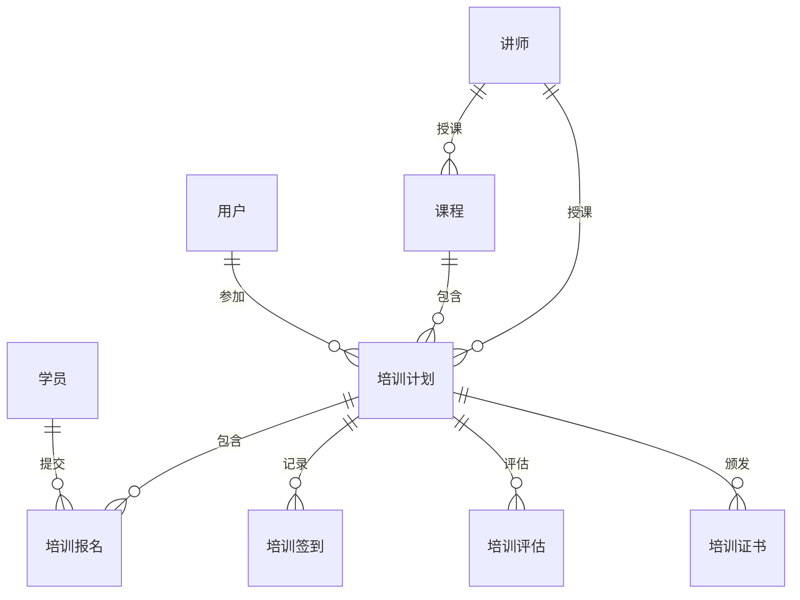

# 培训管理系统详细设计与具体代码实现

作者：禅与计算机程序设计艺术

## 1. 背景介绍

### 1.1 培训管理系统概述

在当今知识经济时代，企业对人才的需求日益增长，培训作为提高员工素质、增强企业竞争力的重要手段，其重要性不言而喻。传统的培训管理模式存在着诸多弊端，如信息化程度低、效率低下、成本高昂等，难以满足现代企业的需求。随着信息技术的快速发展，基于计算机网络的培训管理系统应运而生，为企业提供了一种高效、便捷、低成本的培训管理解决方案。

### 1.2 系统目标

本系统旨在开发一套功能完善、操作便捷、安全可靠的培训管理系统，实现对培训过程的全面信息化管理，提高培训效率，降低培训成本，最终提升企业的人力资源管理水平。

### 1.3  系统功能模块

本系统主要包括以下功能模块：

* **用户管理模块：** 实现对系统用户的添加、删除、修改、查询等操作，并根据用户角色分配不同的权限。
* **课程管理模块：** 实现对培训课程信息的添加、删除、修改、查询等操作，包括课程名称、课程类型、课程时长、授课老师、课程简介等信息。
* **培训计划管理模块：** 实现对培训计划的制定、发布、调整、查询等操作，包括培训计划名称、培训目标、培训对象、培训时间、培训地点、培训内容、培训讲师等信息。
* **培训报名管理模块：** 实现学员在线报名参加培训，并提供报名审核、取消报名等功能。
* **培训签到管理模块：** 实现对学员参加培训的签到记录，并提供签到统计、导出等功能。
* **培训评估管理模块：** 实现对培训效果的评估，包括在线考试、问卷调查等方式，并提供评估结果统计、分析等功能。
* **培训证书管理模块：** 实现对培训合格学员的证书颁发，并提供证书查询、打印等功能。
* **系统管理模块：** 实现对系统参数的设置，包括系统日志管理、权限管理、数据备份等功能。

## 2. 核心概念与联系

### 2.1 用户

* **管理员：** 拥有系统最高权限，可以对系统所有功能进行操作。
* **培训管理员：** 负责培训计划的制定、发布、调整等操作，以及对培训课程、培训评估等进行管理。
* **讲师：** 负责培训课程的授课。
* **学员：** 参加培训的人员。

### 2.2 课程

* **课程类型：** 对课程进行分类，例如：新员工入职培训、技能提升培训、管理培训等。
* **课程时长：** 课程的总学时数。
* **授课老师：** 负责教授该课程的讲师。

### 2.3 培训计划

* **培训目标：** 明确培训的目的和预期达到的效果。
* **培训对象：** 明确参加培训的人员范围。
* **培训时间：** 明确培训的起止时间。
* **培训地点：** 明确培训的具体地点。
* **培训内容：** 明确培训的具体内容和安排。
* **培训讲师：** 明确负责本次培训的讲师。

### 2.4 关系图



## 3. 核心算法原理具体操作步骤

### 3.1 用户登录认证

本系统采用基于角色的访问控制（RBAC）模型进行用户权限管理。

1. 用户输入用户名和密码进行登录。
2. 系统验证用户名和密码是否正确。
3. 如果用户名和密码正确，则根据用户的角色分配不同的权限。

### 3.2 培训计划制定

1. 培训管理员选择要制定的培训计划类型。
2. 系统根据选择的培训计划类型，自动生成默认的培训计划模板。
3. 培训管理员根据实际情况，对培训计划模板进行修改和完善。
4. 培训管理员发布培训计划。

### 3.3 在线考试

本系统采用随机组卷的方式进行在线考试。

1. 系统从题库中随机抽取一定数量的题目组成试卷。
2. 学员在线作答。
3. 系统自动批改试卷并给出成绩。

## 4. 数学模型和公式详细讲解举例说明

本系统中未使用复杂的数学模型和公式。

## 5. 项目实践：代码实例和详细解释说明

### 5.1 技术架构

本系统采用前后端分离的架构，前端使用 Vue.js 框架，后端使用 Spring Boot 框架。

### 5.2 数据库设计

| 表名 | 字段名 | 数据类型 | 说明 |
|---|---|---|---|
| user | id | int | 用户ID，主键 |
| user | username | varchar(255) | 用户名 |
| user | password | varchar(255) | 密码 |
| user | role | int | 角色，1：管理员，2：培训管理员，3：讲师，4：学员 |
| course | id | int | 课程ID，主键 |
| course | name | varchar(255) | 课程名称 |
| course | type | int | 课程类型 |
| course | duration | int | 课程时长 |
| course | teacher_id | int | 授课老师ID |
| plan | id | int | 培训计划ID，主键 |
| plan | name | varchar(255) | 培训计划名称 |
| plan | target | varchar(255) | 培训目标 |
| plan | object | varchar(255) | 培训对象 |
| plan | start_time | datetime | 培训开始时间 |
| plan | end_time | datetime | 培训结束时间 |
| plan | address | varchar(255) | 培训地点 |
| plan | content | text | 培训内容 |
| plan | teacher_id | int | 培训讲师ID |

### 5.3 代码示例

**用户登录接口：**

```java
@RestController
@RequestMapping("/api/user")
public class UserController {

    @Autowired
    private UserService userService;

    @PostMapping("/login")
    public Result login(@RequestBody UserLoginRequest request) {
        User user = userService.findByUsername(request.getUsername());
        if (user == null || !user.getPassword().equals(request.getPassword())) {
            return Result.error("用户名或密码错误");
        }
        return Result.success(user);
    }
}
```

**培训计划列表接口：**

```java
@RestController
@RequestMapping("/api/plan")
public class PlanController {

    @Autowired
    private PlanService planService;

    @GetMapping("/list")
    public Result list() {
        List<Plan> plans = planService.findAll();
        return Result.success(plans);
    }
}
```

## 6. 实际应用场景

本系统适用于各类企事业单位、政府机关、学校等组织机构，用于对员工、学员进行培训管理。

## 7. 工具和资源推荐

### 7.1 开发工具

* IntelliJ IDEA
* MySQL Workbench
* Postman

### 7.2 学习资源

* Vue.js 官方文档：https://vuejs.org/
* Spring Boot 官方文档：https://spring.io/projects/spring-boot

## 8. 总结：未来发展趋势与挑战

### 8.1 未来发展趋势

* **个性化学习：** 随着人工智能技术的发展，培训管理系统将更加注重个性化学习，根据学员的学习情况和特点，推荐合适的学习内容和学习路径。
* **移动学习：** 随着移动互联网的普及，培训管理系统将更加注重移动学习，方便学员随时随地进行学习。
* **数据分析：** 培训管理系统将更加注重数据分析，通过对培训数据的分析，为培训决策提供数据支持。

### 8.2 面临的挑战

* **信息安全：** 随着培训管理系统存储的数据越来越重要，信息安全问题日益突出。
* **用户体验：** 如何提升用户体验，让用户更加便捷、高效地使用系统，是培训管理系统需要不断探索的问题。

## 9. 附录：常见问题与解答

### 9.1 问：如何添加新用户？

答：登录系统后，点击“用户管理”菜单，进入用户管理页面，点击“添加用户”按钮，填写用户信息后保存即可。

### 9.2 问：如何修改密码？

答：登录系统后，点击右上角的用户名，选择“修改密码”，输入旧密码和新密码后保存即可。
